# `iOS` alapú szoftverfejlesztés - Labor `08`

## A labor témája

* [Az `Adaptive Layout` bemutatása](#adaptive-layout-bemutatasa)
    * [iNames](#inames)
* [Önálló feladat](#onallo)
    * [Több névnap egy napon - `UISplitViewController`](#split-vc)
    * [Nevek jelentése - `UIPopoverPresentationController`](#popover-vc)
* [Szorgalmi feladat](#szorgalmi)

A labor célja az `Adaptive Layout` használatatának a gyakorlása egy névnapos alkalmazás kezdeti képernyőin keresztül.

# Az `Adaptive Layout` bemutatása <a id="adaptive-layout-bemutatasa"></a>

## iNames <a id="inames"></a>
> Hozzunk létre egy `Single View App`ot **iNames** névvel a `labor_08` könyvtárba!

<!--  -->
> A `Devices` beállítást (`Target` beállítások, `Deployment Info` szekció) hagyjuk `Universal`on! 

<!--  -->
> A `res/` mappában található `Flower` és `TransparentWoman` *képeket* húzzuk be az `Assets.xcassets` katalógusba.

<!--  -->
> Váltsunk át a `Main.storyboard`ra!

A `Storyboard` alján megfigyelhetjük, hogy (alapértelmezett módon) a jeleneteinket *compact width*, *regular height* (**wC hR**) méretosztályban látjuk, ami megfelel a *portrait* módban lévő `iPhone`-oknak.
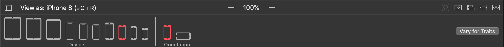

Ha rákattintunk egy `iPad`re, például az `iPad Pro 9.7"`-re, akkor a jeleneteink mérete is azonnal megváltozik. Tovább finomíthatjuk a megjelenítést az *Orientation* és az *Adaptation* beállításával. Figyeljük meg, hogy ilyenkor a méretosztály is megváltozhat!

Amennyiben szeretnénk például olyan kényszereket hozzáadni a nézeteinkhez, amik csak abban a méretosztályban léteznek, kattintsunk rá a `Vary for Traits` gombra és "rögzítsük le", hogy mely méret osztályra vagy osztályokra szeretnénk rárakni a speciális kényszereinket.
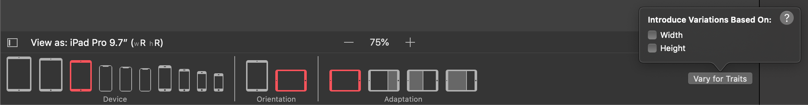

Amint kiválasztunk valamit, a felhasználói felület azonnal megváltozik, az alsó sáv háttere kék színű lesz. Ezzel jelzi az `Xcode`, hogy jelenleg `Size Class`-ek alapján variáljuk a kényszereinket, illetve az egész felhasználói felületünket. Ha végeztünk a testreszabással, akkor a `Done Varying` gombra kattintva visszatérhetünk  normál módba.


Emlékeztetőnek két kép a [`Apple` dokumentációjából](https://developer.apple.com/design/human-interface-guidelines/ios/visual-design/adaptivity-and-layout/) a gyorsabb megértéshez, illetve a `Size Class`-ek átlátáshoz.

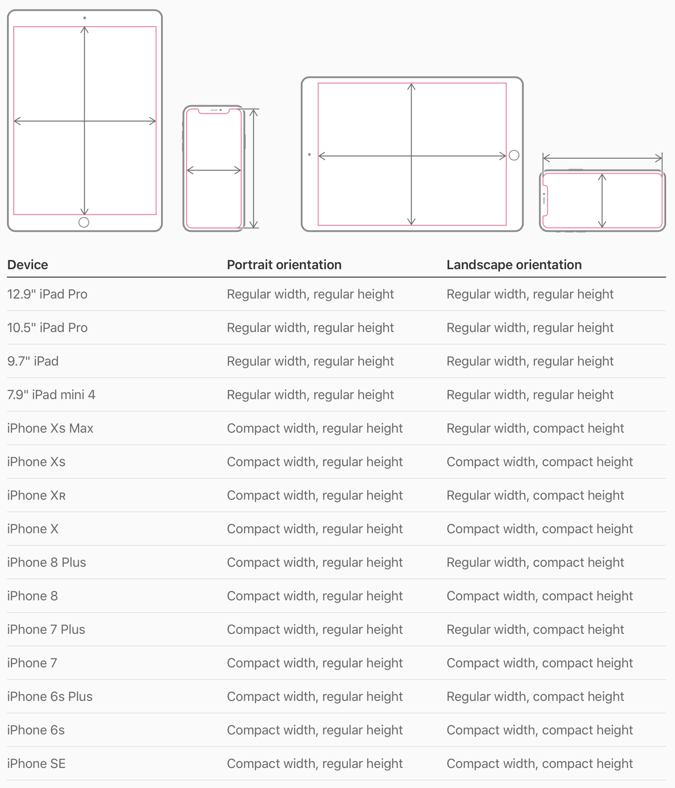 

<!--  -->
> Válasszuk ki az iPhone XS modellt.

> A `View` *háttérnek* állítsuk be a zöld egy árnyalatát (*RGB:* **204, 255, 204**)!

> Adjunk hozzá a `View`-hoz egy sötétzöld (*RGB:* **51, 153, 0**) `View`-t és alkalmazzuk a következő `AutoLayout` kényszereket:
> - A sötétzöld `View` két széle és a teteje legyen rögzítve **0** távolságra a **szülő nézettől**. (Superview) (`Constrain to margins` legyen kikapcsolva!)
> - A magassága legyen **200** egység.

<!--  -->
> Rakjunk be egy `Image View`-t és alkalmazzuk a következő kényszereket:
> - Az `Image View` és a **szülő nézet** két széle, valamint az alja között legyen **0** a távolság. (`Constrain to margins` legyen kikapcsolva!)
> - Az `Image View` és a felette lévő `View` között legyen **0** a távolság!

<!--  -->
> Az `Image View`-n állítsuk be a **`TransparentWoman`** nevű képet, *Content Mode*-nak pedig az **Aspect Fit**et!

Ezek után a következő nézetet kell látnunk.

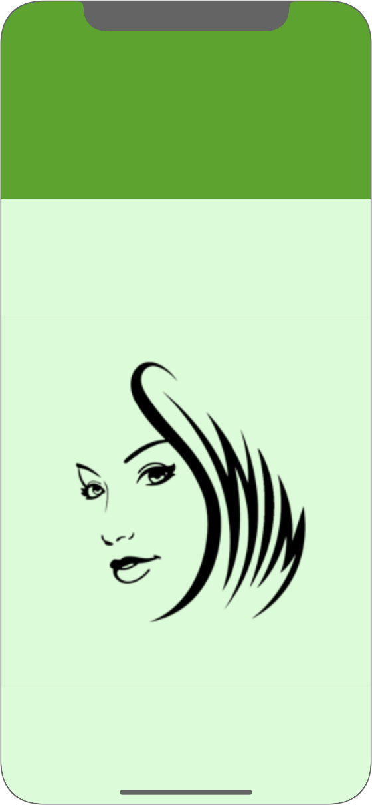

<!--  -->
> Nézzük meg az alkalmazásunkat más `Size Class`-ekben is! (`iPhone` *landscape*, `iPad` *portrait*)

A következő a probléma: `iPhone`-on *landscape* esetben túl nagy a felső sáv, míg `iPad`en *portrait* módban túl kicsi.

> Töröljük a `Document Outline`-ból a sötétzöld `View` magasság kényszerét és állítsuk be, hogy a magassága mindig a szülő nézet magasságának **0.4**-szerese legyen!
Ezt a `Document Outline`-ban tegyük meg, úgy, hogy a `Ctrl`-t lenyomva ráhúzzuk a vonalat a gyerek `View`-ról a szülő `View`-ra és az `Equal Heights`-ot választjuk. Majd a kényszer beállításánál a *Multiplier*t **0.4**-re állítjuk. (Mindig igyekezzünk relatív kényszereket készíteni abszolútak helyett!)

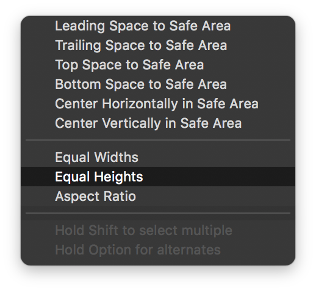 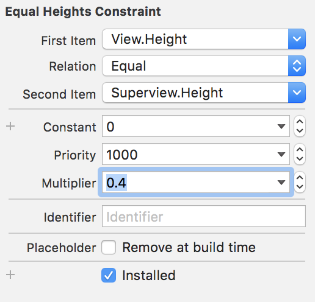

Ha piros vonalakat kapnánk, akkor az azt jelenti, hogy a kényszer rossz változókkal jött létre (mégpedig azzal, hogy a gyerek legyen **2.5**-szer (`4/10` helyett `10/4`) akkora, mint a szülője, ami az `Image View` szülőhöz történt rögzítése miatt nem teljesülhet).

> Ebben az esetben cseréljük fel a kényszerben szereplő elemek sorrendjét!

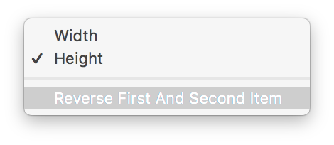

> Nézzük meg az alkalmazásunkat ismét más `Size Class`-ekben! (`iPhone` *landscape*, `iPad` *portrait*)

Az `iPhone` kijelzőn *landscape* módban az `Image View` indokolatlanul sok helyet foglal a kép méretéhez viszonyítva.

> Válasszuk ki a lenti sávból az egyik, *landscape* módban levő `iPhone`-t majd kattintsunk a `Vary for Traits` gombra és ott jelöljük ki a **Height**-ot. Ezzel az *any width compact height* (**hC**) méretosztályt fogjuk tesztreszabni. (Ami lefedi az összes, *landscape* módban lévő `iPhone` méretosztályát.)

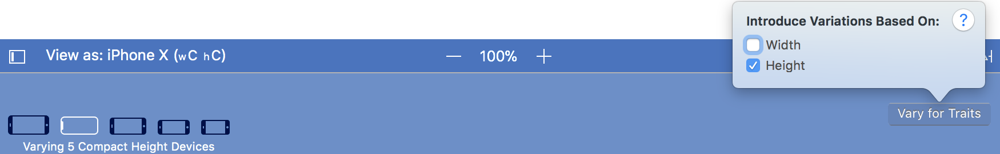

> Jelöljük ki a sötétzöld `View`-t és töröljük ki a `Size inspector`ban a `View` magasságát és jobb oldalát (*Align Trailing*) rögzítő kényszert a `Backspace`-szel!

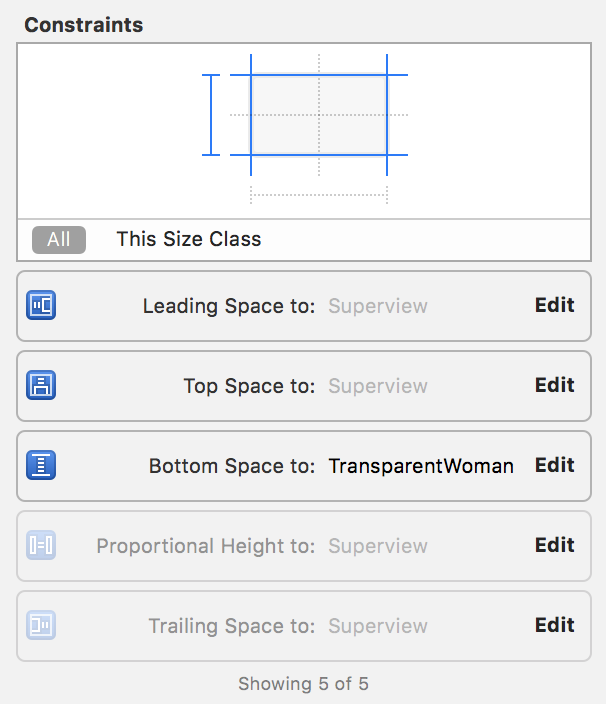

Ha rákattintunk kétszer egy elhalványított kényszerre, láthatjuk, hogy nincs installálva a jelenlegi méretosztályban.

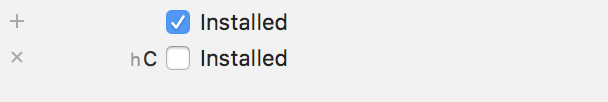

> Módosítsuk a sötétzöld `View`-t az egérrel, az alját húzzuk le a szülő aljára, a szélességét pedig csökkentsük le. 
>
- Az alját rögzítsük a **szülő nézet** aljához.
- A *szélessége* pedig legyen a szülő nézet **0.7**-szerese.

Ha egy frissen hozzáadott kényszerre kattintunk a tulajdonságainál látjuk, hogy csak erre a méretosztályra van installálva.

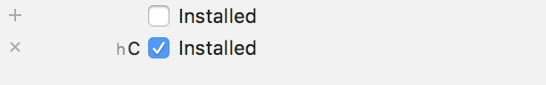

> Az `Image View`-n töröljük a bal oldalát és tetejét rögzítő kényszereket! Ezt követően:
> - Adjuk hozzá a szülő nézet tetejétől mért **0** távolság kényszert.
> - A bal oldalát pedig rögzítsük **0** távolságra a mellette lévő sötétzöld`View`-tól!

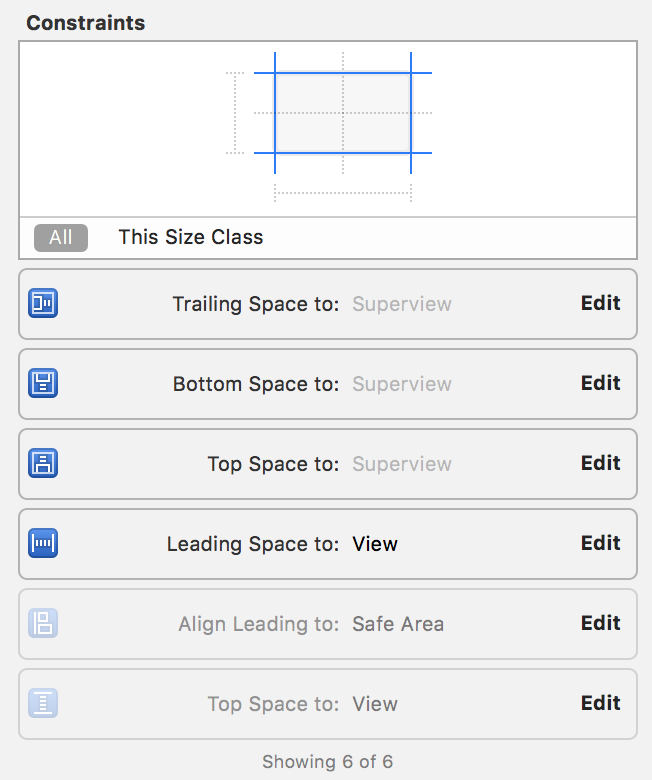

Ezek után a következőt kell látnunk.
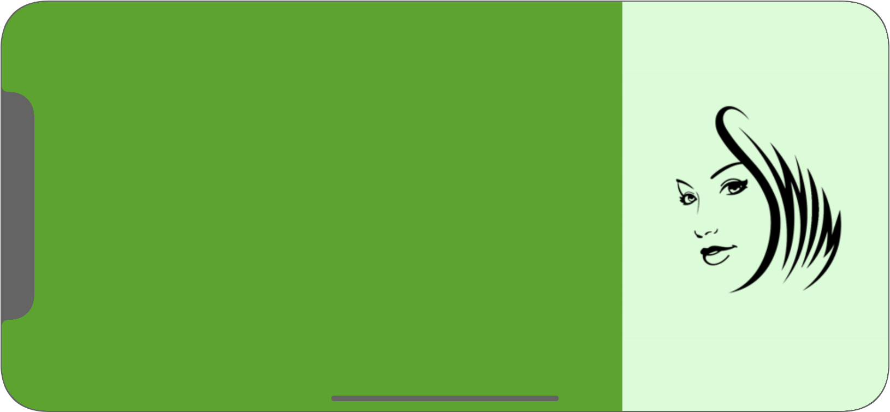

> Ha végeztünk, akkor kattintsunk a `Done Varying` gombra (ezzel visszaváltva az általános *any width any height* méretosztályba) és ellenőrizzük az elkészült felületünket más különböző méretosztályokon, illetve orientációkon!

<!--  -->
> Adjunk hozzá egy `Label`t a sötétzöld `View`-hoz!
> - Kényszerekkel rendezzük középre,
> - Állítsunk be **fehér** színű **45**-ös méretű **Helvetica Neue Thin** betűtípust.
> - A szöveget pedig írjuk át a következőre: "**Teodózia napja van.**"!

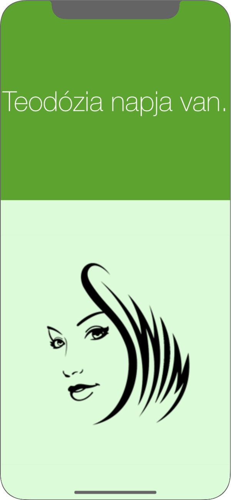

Láthatjuk, hogy a kisebb méretű, *portait* orientációjú `iPhone`-oknál ez túl nagy betűtípus, míg `iPad`ek esetében túl kicsi.

> Kattintsunk a betűtípus melletti plusz ikonra és adjunk hozzá az `iPad` (**wR hR**) és a kompakt szélességű `iPhone`-ok (**wC**) esetében két hasonló stílusú, de eltérő méretű fontot (**80** és **35**).

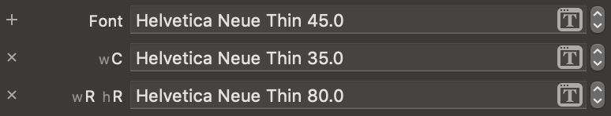

Az `iPad` kijelzőn még mindig túl sok hely van, tegyünk be egy képet szöveg fölé!

<!--  -->
> Váltsunk át *regular width regular height* (**wR hR**) méretosztályba és tegyünk be egy `Image View`-t a szöveg fölé.

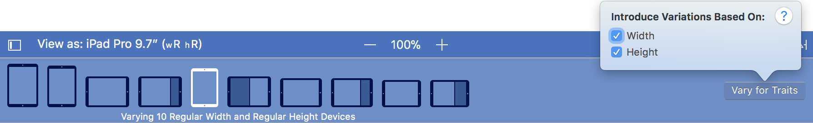

> - Állítsuk be képnek a **Flower**t.
> - A *Content Mode* legyen **Aspect Fit**.
> - A képet kényszer segítségével rendezzük középre (*Horizontally in container*).
> - A *méretét* rögzítsük **90x90**-esre.
> - A kép és a szöveg közötti távolság pedig legyen **0**.

> Kattintsunk a `Done Varying` gombra!

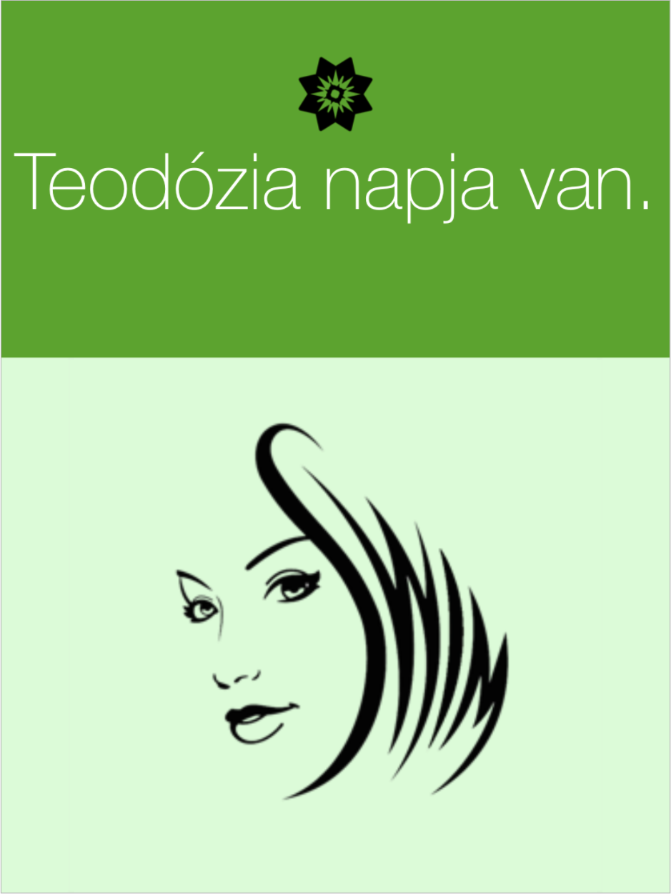

<!--  -->
> Ellenőrizzük le, hogy az `iPad`en valóban megjelenik majd a kép, de a többi eszközön nem!

Az `iPhone`-ok *landscape* orientációjában célszerűbb lenne egy magasabb képet használni.

> Váltsunk át a `Assets.xcassets` mappába és a `TransparentWoman` kép tulajdonságainál állítsuk be, hogy külön képet akarunk megadni a *Any x Compact* méretosztályhoz! (*Height Class*-nál)

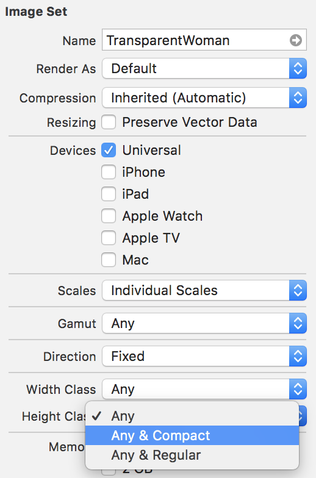

> A létrejövő *Compact Height* méreosztályhoz tartozó `2x` és `3x` helyekre húzzuk be a `GirlWithHat` képet és ellenőrizzük szimulátorban az eredményt!

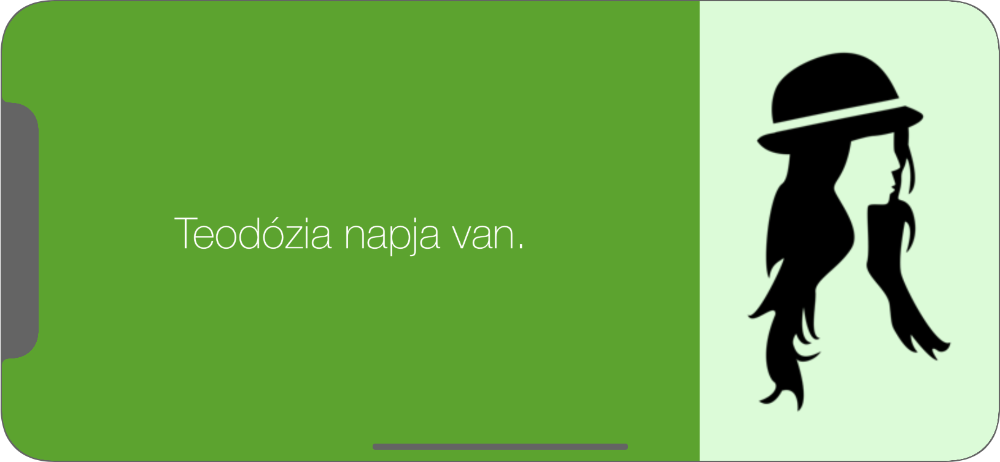

# Önálló feladat <a id="onallo"></a>

## Több névnap egy napon - `UISplitViewController` <a id="split-vc"></a>
> Adjuk hozzá a projekthez a `Names.plist` fájlt. (Hozzáadáskor figyeljünk arra, hogy a *Copy items if needed* be legyen pipálva!)

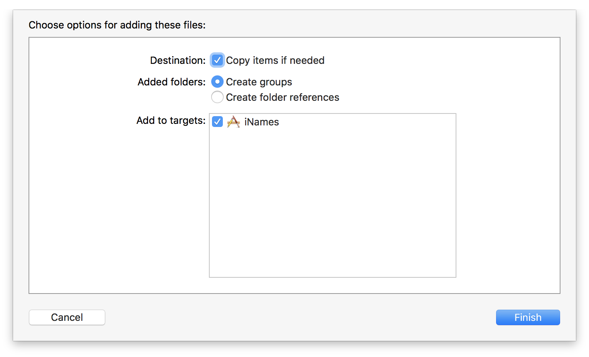

> Vegyünk fel egy `NameHandler` singleton osztályt egy új fájlban, ami az adott nap névnapjait fogja visszaadni!

```swift
import Foundation

class NameHandler {

  let names: [AnyObject]?

  static let shared = NameHandler()

  private init() {
    let path = Bundle.main.path(forResource: "Names", ofType: "plist")
    names = NSArray(contentsOfFile: path!)! as [AnyObject]
  }

}
```

> Térjünk vissza a `Main.storyboard`hoz és ágyazzuk be a nézetvezérlőt egy `Navigation Controller`be!

<!--  -->
> Tegyünk be egy `Split View Controller`t a `Storyboard`ba, a létrejött `Detail View Controller`t töröljük ki, és a `Split View Controller` *detail view controller* `Segue`-hez pedig állítsuk be az az imént létrehozott `Navigation Controller`t!

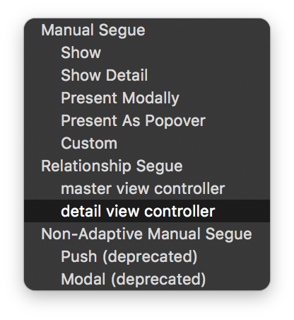

> A `Master View Controller` cellájából hozzunk létre a nemrég létrehozott `Navigation Controller`re mutató *Show Detail* **Selection** típusú `Segue`-t, aminek az *Identifier*ét nevezzünk el **ShowDetailSegue**-nek.

<!--  -->
> Végül pedig állítsuk be kezdő `View Controller`nek a `Split View Controller`t!

Ha mindent jól csináltunk, akkor a következő elrendezést kell kapnunk.
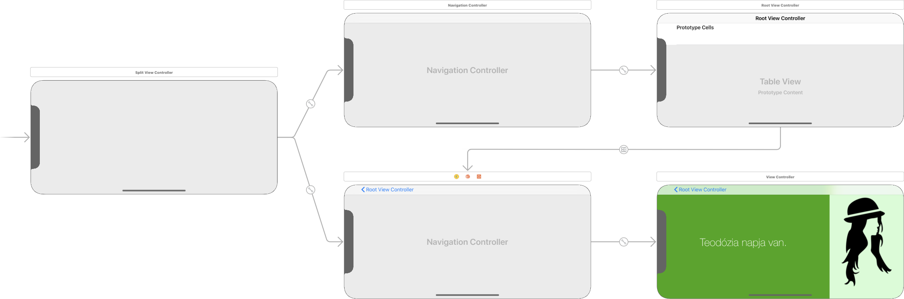

> Az `AppDelegate.swift`-ben egészítsük ki az `application(_:didFinishLaunchingWithOptions:)`metódust!

```swift
func application(_ application: UIApplication, didFinishLaunchingWithOptions launchOptions: [UIApplication.LaunchOptionsKey: Any]?) -> Bool {

  let splitViewController = window?.rootViewController as! UISplitViewController
  let navigationController = splitViewController.viewControllers.last as! UINavigationController

  navigationController.topViewController?.navigationItem.leftBarButtonItem = splitViewController.displayModeButtonItem
  splitViewController.delegate = self

  return true
}
```

Létrehozhattunk volna egy `UISplitViewController` leszármazottat is, mivel azonban a leszármazás során nem írtunk volna semmit felül, ezért választottuk ezt az egyszerűbb módját a gyökér nézetvezérlő megtalálásának és a minimális konfiguráció elvégzésének.

> Valósítsuk meg a `UISplitViewController` delegate `splitViewController(_:collapseSecondary:onto:)` metódusát! (Ezzel lényegében megmondjuk, hogy ne a *detail* nézettel induljon az alkalmazás. Aki szeretné nyugodtan próbálja ki, hogy mi történik, ha enélkül futtatja az alkalmazást.)

```swift
extension AppDelegate: UISplitViewControllerDelegate {

  func splitViewController(_ splitViewController: UISplitViewController, collapseSecondary secondaryViewController: UIViewController, onto primaryViewController: UIViewController) -> Bool {
    return true
  }

}
```

> Próbáljuk ki az alkalmazást különböző méretosztályokkal és orientációkkal!

<!--  -->
> Töröljük ki a `ViewController.swift` fájlt (*Move to Trash*)!

<!--  -->
> Hozzunk létre egy új `UIViewController` leszármazottat `NameViewController` néven és létrejött fájlban cseréljük le az implementációt a következő kódra.

```swift
import UIKit

class NameViewController: UIViewController {

  @IBOutlet weak var titleLabel: UILabel!
  var nameToDisplay: [NSString: NSString]?

  override func viewDidLoad() {
    super.viewDidLoad()

    if nameToDisplay == nil {
      nameToDisplay = NameHandler.shared.names!.first as? [NSString: NSString]
    }

    let name = nameToDisplay!["name"]
    titleLabel.text = "\(name!) napja van."
  }
  
}
```

> A `Main.storyboard`ban állítsuk be a zöld hátterű jelenetünk identitásának, ezt követően pedig kössük be a *titleLabel* `Outlet`et!

<!--  -->
> Adjunk hozzá egy új `UITableViewController`ből leszármaztatott osztályt `NamesViewController` névvel. Állítsuk be a `Storyboard` `MasterViewController` identitásának az újonnan létrehozott osztályt, a *cella azonosítója* pedig **NameCell** legyen!

<!--  -->
> Cseréljük le az implementációt!

```swift
import UIKit

class NamesViewController: UITableViewController {
  
  var names = [AnyObject]()

  // MARK: View Lifecycle

  override func viewDidLoad() {
    super.viewDidLoad()
    
    names = NameHandler.shared.names!
    title = "Mai névnapok"
  }

  // MARK: TableView Data Source

  override func numberOfSections(in tableView: UITableView) -> Int {
    return 1
  }

  override func tableView(_ tableView: UITableView, numberOfRowsInSection section: Int) -> Int {
    return names.count
  }
  
  override func tableView(_ tableView: UITableView, cellForRowAt indexPath: IndexPath) -> UITableViewCell {
    let cell = tableView.dequeueReusableCell(withIdentifier: "NameCell", for: indexPath)
    let name = names[indexPath.row] as! [NSString: NSString]
    
    cell.textLabel?.text = name["name"] as String?
    cell.imageView?.contentMode = .scaleAspectFill
    cell.imageView?.image = UIImage(named: "Flower")
    cell.imageView?.tintColor = .black
    
    return cell
  }

  // MARK: Navigation

  override func prepare(for segue: UIStoryboardSegue, sender: Any?) {
    if segue.identifier == "ShowDetailSegue" {
      if let indexPath = tableView.indexPathForSelectedRow {
        let object = names[indexPath.row] as! [NSString: NSString]
        
        let nameViewController = (segue.destination as! UINavigationController).topViewController as! NameViewController
        nameViewController.nameToDisplay = object
        nameViewController.navigationItem.leftBarButtonItem = splitViewController?.displayModeButtonItem
        nameViewController.navigationItem.leftItemsSupplementBackButton = true
      }
    }
  }
  
}
```

<!--  -->
> Próbáljuk ki az alkalmazást több különböző szimulátorral: `iPhone X`, `iPhone 8 Plus` és bármilyen `iPad`. Figyeljük meg, hogyan alkalmazkodik a `Split View Controller` a különböző környezetekhez.

Az alapbeállítás szerint `iPad`en eltűnik a `Master View Controller` *portait* módban. Ezen a legegyszerűbben úgy javíthatunk, ha beállítjuk, hogy mi az előnyben részesített megjelenése a `Split View Controller`nek.

> Az `AppDelegate.swift`-ben egészítsük ki az eddigieket az alábbi sorral.

```swift
splitViewController.preferredDisplayMode = .allVisible
```

Sokat javíthatunk egy alkalmazás kinézetén, ha a gombokat nem az alapértelmezett kéken jelenítjük meg. Ugyanakkor ezek rendszerszintű gombok, amelyek folytonos átszínezgetése kissé körülményes volna. Be lehet azonban állítani a `Main.storyboard`on egy *Global Tint* színt, amit az egyes vezérlők alapértelmezett színként felvesznek. 

> Tegyük ezt meg a `Main.storyboard` fájl tulajdonságainál (`File inspector`). Állítsunk be valamilyen sötétebb piros színt pl.: *RGB:* **214, 51, 51**!

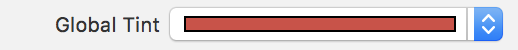

## Nevek jelentése - `UIPopoverPresentationController` <a id="popover-vc"></a>

> Hozunk létre egy új `UIViewController` leszármazottat `NameFactsViewController` néven és az implementációt cseréljük le!

```swift
import UIKit

class NameFactsViewController: UIViewController {
  
  @IBOutlet weak var nicksLabel: UILabel!
  @IBOutlet weak var originLabel: UILabel!
  @IBOutlet weak var meaningLabel: UILabel!
  
  var nameToDisplay: [NSString: NSString]?
  
  override func viewDidLoad() {
    super.viewDidLoad()
    
    nicksLabel.text = "\(nameToDisplay!["nicks"]!)"
    originLabel.text = "Eredete: \(nameToDisplay!["origin"]!)"
    meaningLabel.text = "Jelentése: \(nameToDisplay!["meaning"]!)"
  }
  
}
```

> Helyezzünk be egy új nézetvezérlőt, majd állítsuk össze a következő képernyőt!

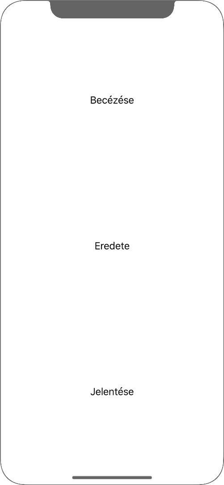

> Ehhez rakjunk be **3** `Label`t, majd használjuk a `Stack` gombot!

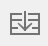

> A `Stack View`-n állítsuk be, hogy:
> - A szülőnézet széleitől a távolsága **0** legyen! (`Constrain to margins` legyen bepipálva!)
> - A `Stack View` a tartamat középre rendezze (*Aligment*: **Center**), és egyforma méretüek legyenek az elemek (*Distriution*: **Fill Equally**).

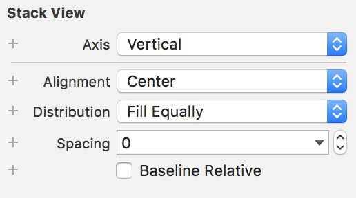

> Állítsuk be, hogy ez a `NameFactsViewController` és kössük be az `Outlet`eit!

<!--  -->
> Végül adjunk neki *azonosítót* a `Storyboard`ban **FactsViewController** néven az `Identity inspectorban`!

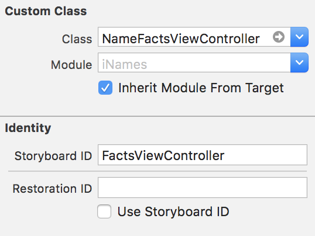

A *Storyboard ID* segítségével tudjuk majd példányosítani kódból az adott `View Controller`t.

> A `NameViewController`ben adjunk hozzá egy új `Bar Button Item`et kódból a `viewDidLoad()`-ban!

```swift
let detailsButton = UIBarButtonItem(title: "Tények", style: .plain, target: self, action: #selector(NameViewController.displayFacts(sender:)))
navigationItem.rightBarButtonItem = detailsButton
```

> Majd valósítsuk meg a `displayFacts(sender:)` függvényt!

```swift
@objc func displayFacts(sender: UIBarButtonItem) {
  let storyboard = UIStoryboard(name: "Main", bundle: nil)
  
  let contentViewController = storyboard.instantiateViewController(withIdentifier: "FactsViewController") as! NameFactsViewController
  contentViewController.nameToDisplay = nameToDisplay
  contentViewController.modalPresentationStyle = .popover
  
  let detailPopover = contentViewController.popoverPresentationController!
  detailPopover.barButtonItem = sender
  detailPopover.permittedArrowDirections = .any
  
  present(contentViewController, animated: true, completion: nil)
}
```

> Futtassuk az alkalmazást `iPad` és `iPhone` szimulátorokon is! 

`iPhone` kijelzőn sajnos nem tudjuk bezárni a modálisan megjelenített nézetvezérlőt. Ha olyan működést szeretnénk, mint `iPad`en, akkor meg kell valósítani a `UIPopoverPresentationControllerDelegate` protocolt. (Természetesen ezt máshogyan is megoldhatnánk, például kirakhatnánk `iPhone`-ok esetében egy gombot, amivel vissza lehet térni az előző képernyőre.)

> Tegyük is meg ezt a `NameViewController`ben, majd állítsuk be a `PopoverPresentationController` létrehozásánál!

```swift
extension NameViewController: UIPopoverPresentationControllerDelegate {
  
}
```

```swift
...
detailPopover.permittedArrowDirections = .any
detailPopover.delegate = self
...
```

> Végül írjuk meg a callbacket az *extension*ben!

```swift
func adaptivePresentationStyle(for controller: UIPresentationController, traitCollection: UITraitCollection) -> UIModalPresentationStyle {
  return .none
}
```

> Teszteljük az alkalmazást ismét `iPhone`-on!

# Szorgalmi feladat <a id="szorgalmi"></a>

A `Split View Controller` behelyezésével bizonyos képernyőméreteken pl. `iPhone 8 Plus` *landscape*, vagy `iPad`en elromlott a labor első felében nehéz munkával elkészített layout. 

> Javítsuk ki a hibákat új adaptív kényszerek hozzáadásával vagy a meglévő kényszerek módosításával, hogy minden képernyőn jól nézzen ki az alkalmazás!

<!--  -->
> Nem minden szöveg fér el a `Popover Controller`ben, módosítsuk a `NameFactsViewController`t, hogy ez ne legyen probléma!

Ha kritikusabb szemmel megnézzük a felületünket, akkor láthatjuk, hogy az `iPad`en lévő zöld alapon fekete kép nem a legszebb. Mennyivel jobb lenne, ha fehér lenne. iOS-en ezt a problémát egyszerűen meg tudjuk oldani, akár a kép változtatása nélkül is!

> Ehhez az `Assets.xcassets` katalógusban válasszuk ki a *Flower* képet, majd az `Attributes inspector`ban a *Render As* tulajdonságát állítsuk át **Template Image**-re.

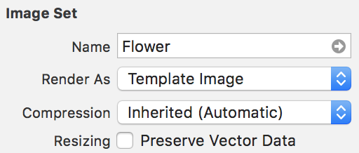

> Ezután (elméletben) már csak annyi dolgunk van, hogy a `Main.storyboard`ban az `Flower Image View` *Tint* colorját átállítjuk fehérre.

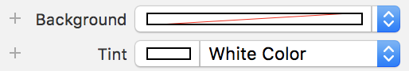

Sajnos egy `Storyboard` bug miatt ez nem vezet mindig a kívánt eredményhez. Ha tehát ez a megközelítés nem működne, akkor kódból kell megoldani ugyanezt.

> Ehhez állítsuk vissza a *Tint* colort **Default**ra, majd kössünk be egy `Outlet`et az `Image View`-ra `flowerImageView` néven!

```swift
@IBOutlet weak var flowerImageView: UIImageView!
```

> Majd a `viewDidLoad()`-ba rakjuk be ezt a plusz sort!

```swift
flowerImageView.tintColor = .white
```

> Csodáljuk meg az eredményt! 🌺 🌸

## A laborsegédletet összeállította
* Varga Domonkos - varga.domonkos@autsoft.hu
* Krassay Péter - peter.krassay@autsoft.hu
* Kántor Tibor - tibor.kantor@autsoft.hu
