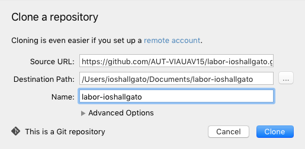

# `iOS` alapú szoftverfejlesztés - `GitHub Classroom` tutorial

## A tutorial tartalma
* [`GitHub` teendők](#github-teendok)
    * [Account regisztráció](#github-account-regisztralacio)
    * [`Classroom` meghívó elfogadása](#classroom-meghivo-elfogadasa)
    * [`Organization` meghívó elfogadása](#organization-meghivo-elfogadasa)
* [Repository letöltése és frissítése](#repository-letoltese-es-frissitese)
    * [Terminal](#repo-terminal)
    * [Source Tree](#repo-source-tree)
* [Dolgozás a labor során](#dolgozas-a-labor-soran)
    * [Teendők **labor gépet** használóknak](#labor-gep)
    * [Teendők **saját gépet** használóknak](#sajat-gep)
* [Teljes labor példa](#teljes-labor-pelda)
    * [Terminál](#teljes-labor-pelda-terminal)
    * [SourceTree](#teljes-labor-pelda-source-tree)
* [Források, további információk](#forrasok)

A tutorial során látható `ioshallgato` helyére mindenki helyettesítse be a saját `GitHub` vagy éppen a gépes felhasználónevét.

## `GitHub` teendők <a id="github-teendok"></a>

Az alábbi bekezdésekben leírt teendők a tárgy `GitHub Classroom`jába való jelentkezés folyamatának lépésein megy végig. Ezeket egyetlen egyszer kell csak megcsinálni.

### Account regisztáció <a id="github-account-regisztralacio"></a>
Legelső lépésként, ha nem lenne még `GitHub` accountunk, akkor csináljunk egyet. Ezt pillanatok alatt megtehetjük [itt](https://github.com/join).

### `Classroom` meghívó elfogadása <a id="classroom-meghivo-elfogadasa"></a>
A regisztrációt követően nyissuk meg a levélben kapott *titkos* linket! (`https://classroom.github.com/assignment-invitations/xxxxxxxxxxxxxxxxxxxxxxxxxxxxxxxx`)

Ekkor egy ehhez hasonló üzenetet kell kapnunk. Ez tájékoztat minket arról, hogy a saját privát repository-nk létrejött és elkezdhetünk dolgozni vele.


A legalsó linkre kattintva eljutunk a létrejött repository-nkhoz.


A félév során a laborok végén ide kell `commit`olni, az itt lévő munka és a jelenlét együtt jelenti majd a teljesített laboralkalmat.

### `Organization` meghívó elfogadása <a id="organization-meghivo-elfogadasa"></a>
Utolsó lépésként, manuális jóváhagyás után kapni fogunk egy meghívót az `AUT`-os `Organization`be a `GitHub` regisztrációkor megadott email címünkre. Kattintsunk az ebben található hatalmas Join gombra és menjünk végig a szükséges lépéseken.


## Repository letöltése és frissítése <a id="repository-letoltese-es-frissitese"></a>

Most megnézzük, hogy a `GitHub`on elkészült repository-nkat hogyan tudjuk letölteni (klónozni) a gépünk fájlrendszerére, illetve szinkronizálni egy sablon repository-hoz. Erre rengeteg lehetőségünk van, itt kettőt mutatunk meg: egy parancssorosat és egy grafikusat.

### Terminal <a id="repo-terminal"></a>
Az alább található `5` sor kód a következőket csinálja.

#### Repository letöltése
* Elnavigál az `ioshallgato` `Documents` mappájába.
* Letölti `ioshallgato` repository-ját. (A letöltésnél be fogja kérni a `GitHub` felhasználónevünket és jelszavunkat.)

```bash
cd /Users/ioshallgato/Documents/
git clone https://github.com/AUT-VIAUAV15/labor-ioshallgato.git
```

#### Repository frissítése
* Belép a letöltött mappába. (`labor-ioshallgato`)
* Letölti a jelenlegi lokális repository-ba a legfrissebb sablonváltozatot és `merge`-eli. (A letöltésnél be fogja kérni a `GitHub` felhasználónevünket és jelszavunkat.)
* Frissíti `ioshallgato` repository-ját a `GitHub`on is. (Itt is kérheti a felhasználónév jelszót.)

```bash
cd /Users/ioshallgato/Documents/labor-ioshallgato
git pull https://github.com/AUT-VIAUAV15/labor-sablon.git master
git push
```

### Source Tree <a id="repo-source-tree"></a>
A laborgépeken megtalálható előre telepítve, saját gépre pedig [innen](https://www.sourcetreeapp.com/download) lehet letölteni.

#### Repository letöltése
Kattintsunk a `File` --> `New / Clone` (`Cmd+N`)-ra, majd itt a `Clone from URL`-re. Az előjövő ablaknál töltsük ki a mezőket és végül kattintsunk a `Clone` gombra!

* _Source URL_: __https://github.com/AUT-VIAUAV15/labor-ioshallgato.git__
* _Destination Path_: __/Users/ioshallgato/Documents/labor-ioshallgato__
* _Name_: __labor-ioshallgato__



#### Repository frissítése
Ezt követően a megnyíló ablakban kattintsunk a `Pull` gombra (`Cmd+Shift+L`), töltsük ki a mezőket és kattintsunk az `OK` gombra.

* _Pull from repository_: __Custom__, __`https://github.com/AUT-VIAUAV15/labor-sablon.git`__
* _Remote branch to pull_: __master__


Végül kattintsunk a `Push` gombra (`Cmd+Shift+P`), majd az `OK`-ra.


## Dolgozás a labor során <a id="dolgozas-a-labor-soran"></a>
A labor során arra kell figyelni, hogy a sablon repository-ban előre létrehozott megfelelő mappába dolgozzunk.

### Teendők **labor gépet** használóknak <a id="labor-gep"></a>
* `Managed software update` esetleges végigvárása
* 
* sablon repository frissítése
* labor feladatok megoldása
* `commit` és `push`

### Teendők **saját gépet** használóknak <a id="sajat-gep"></a>
* sablon repository frissítése
* labor feladatok megoldása
* `commit` és `push`

## Teljes labor példa <a id="teljes-labor-pelda"></a>
Nézzük végig a teljes munkafolyamatot a második laboron keresztül bemutatva!

`ioshallgato`-nak már létezik a repository-ja, de abban még nincsen `labor_02` nevű mappa. Idő közben a sablon repository frissül a `labor_02` mappával.

A labor kezdetén `ioshallgato` végigcsinálja a [repository frissítését](#repository-letoltese-es-frissitese) vagy terminálból vagy `Source Tree`-ből.


A frissítés eredményét meg lehet tekinteni a `GitHub`on is.


Ezt követően a labor során `ioshallgato` a `labor_02` mappába hozza létre a projektet és ezen belül dolgozik.

Labor végén leadáshoz az elkészült munkát `commit`olni majd `push`-olni kell a `GitHubos` privát repository-ba. Ismét kétféleképpen mutatjuk.

### Terminál <a id="teljes-labor-pelda-terminal"></a>
Navigáljuk a repository-hoz a fájlrendszeren belül.
`cd ~/Documents/labor-ioshallgato/labor_02/`

Adjuk ki a `git status` parancsot. Erre nem lenne feltétlenül szükség, csak azért tesszük, hogy jobban lássuk mit tesznek az egyes parancsok. Az eredményen láthatjuk, hogy a fájlrendszeren olyan fájlok vannak amik még nincsenek benne a git repository-ban.


Adjunk hozzá mindent a `git add .` paranccsal! Ha most újra kiadjuk a `git status` parancsot láthatjuk, hogy a git már ismeri a `playground` fájlunkat.


A következő lépés, hogy a githez hozzáadott fájlokat `commit`oljuk. Nagyon fontos, hogy ez a labor leadásához kevés, mert a `commit` csak lokális!
`git commit -m "Finished Lab 2."`

Ahhoz, hogy a `GitHub` szerverén is megjelenjen a `commit`unk `push`-olni kell.
`git push`

Az eredményt ellenőrizzük a `GitHub`on.


### Source Tree <a id="teljes-labor-pelda-source-tree"></a>
Természetesen ugyanezt megtehetjük a grafikus felületen is. Kattintsunk a `File Status`ra a bal oldali sávon. Itt láthatjuk a git repository jelenlegi állapotát. (első `git status` az előbbi fejezetben.)


Kattintsunk az `Unstaged Files` jelölőnégyzetre a kérdőjeles fájlok felett. (Ez megfelel a `git add .`-nak.)


Láthatjuk, hogy a kérdőjelek zöld pipává változtak, ezzel jelezve, hogy hozzáadtuk a git repository-nkhoz a fájlokat. (második `git status`)

Kattintsunk bele a lenti `Commit message` sávba!


Írjunk be egy `commit` üzenetet és pipáljuk be a `Push changes to origin/master` jelölőnégyzetet is alul. Ezzel a `commit` és a `push` lépését tudjuk összevonni. Ha úgy látjuk, hogy minden rendben, kattintsunk a `Commit` gombra a jobb alsó sarokban.


Az eredményt ellenőrizzük a `GitHub`on.


## Források, további információk <a id="forrasok"></a>
Saját géppel rendelkezőknek nem muszáj `https`-t használni, egy sokkal kényelmesebb módja az `ssh`. Ennek beállítása nagyon szépen dokumentálva van a `GitHub`on.

* [Merging an upstream repository into your fork](https://help.github.com/articles/merging-an-upstream-repository-into-your-fork/)
* [Resolving a merge conflict from the command line](https://help.github.com/articles/resolving-a-merge-conflict-from-the-command-line/)
* [Which remote URL should I use?](https://help.github.com/articles/which-remote-url-should-i-use/#cloning-with-ssh-urls)
* [Generating a new SSH key and adding it to the ssh-agent](https://help.github.com/articles/generating-a-new-ssh-key-and-adding-it-to-the-ssh-agent/)


