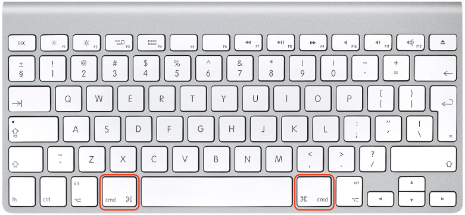

# `iOS` alapú szoftverfejlesztés - Labor `01`

## A labor témája
- [Bemutatkozás](#bemutatkozas)
- [`macOS` felhasználói alapismeretek](#mac_knowings)
    - [Billentyűzet](#billentyuzet)
    - [Egér](#eger)
    - [Unix gyökerek](#unix-gyokerek)
    - [Fájlkezelés](#fajlkezeles)
* [`Swift` alapismeretek](#swift-alapismeretek)
    * [Osztályok definiálása és példányosítása](#osztalyok-def-es-peld)
    * [`Optional`ök és a `failable initializer`](#optionals-and-failable-init)
    * [Generikus tárolók, metódusok és osztályhierarchiák](#gen)
    * [Öröklés és Castolás](#orokles-es-castolas)
    * [Protokollok](#protokollok)
    * [A `Swift` erősen típusos (`strongly typed`) nyelv](#strongly-typed)
* [Önálló feladatok](#onallo)
* [Szorgalmi feladatok](#szorgalmi)

### Cheat sheets
- [https://github.com/iwasrobbed/Swift-CheatSheet](https://github.com/iwasrobbed/Swift-CheatSheet)
- [https://www.raywenderlich.com/73967/swift-cheat-sheet-and-quick-reference](https://www.raywenderlich.com/73967/swift-cheat-sheet-and-quick-reference)

### *Style guide*
* Egy lehetséges *style guide* és kódolólási konvenció szabályzat (nem szentírás!): [The Official raywenderlich.com Swift Style Guide](https://github.com/raywenderlich/swift-style-guide)
* Folyamatban van egy hivatalos style guide és formatter kidolgozása is, egyelőre még tervezés alatt: [SE-0250](https://github.com/apple/swift-evolution/blob/master/proposals/0250-swift-style-guide-and-formatter.md)

## Bemutatkozás <a id="bemutatkozas"></a>
* A laborok `60%`-án kötelező a részvétel. (Idén ez `7` labort jelent.) Minden labor végén fel kell tölteni a `GitHub`ra az elkészült laborfeladatot, aki ezt nem teszi meg, annak érvénytelen a laborja. A laborfeladatok végén találhatóak szorgalmi feladatok, amik elvégzésével plusz pontot szerezhető, ami beleszámít az év végi jegybe (+1 pont laboronként).
* Rendszeresen látogassátok a [tárgy honlapját](https://www.aut.bme.hu/Course/ios), ide kerül fel minden információ. (Van RSS feed is.)
* A tárgyból a legkönnyebben házi feladat beadásával lehet megszerezni a félév végi jegyet. A beadott házikat a laborvezetők fogják értékelni. A házi feladat beadás rendjéről a tárgy honlapján fogunk a későbbiekben információkat közzétenni.
* A laborokkal kapcsolatban mindenkitől örömmel fogadunk hibajelentéseket vagy bármilyen egyéb, _építő jellegű_ kritikát.

## `macOS` felhasználói alapismeretek <a id="mac_knowings"></a>

### Billentyűzet <a id="billentyuzet"></a>
A Macekhez külön Apple billentyűzetek léteznek, melyeken némiképp különbözőek a funkcióbillentyűk, és található rajtuk néhány extra gomb. Ezeken túl azonban a billentyűkiosztás megegyezik a standard PC-s billentyűzetekkel. A laborokban PC-s billentyűzetek vannak rákötve a Mac-ekre, melyeken elérhető minden szükséges gomb, azonban van néhány eltérés a Windows-os használathoz képest.

A legfontosabb különbség, hogy Mac-en `Command` (`⌘`) gomb van Windows gomb helyett. Ez a **PC-s billentyűzeten alapesetben pont a Windows gombra** képződik le. A `Control` (`⌃`), `Alt` és `Alt Gr` (Right Alt), Mac-en is ugyanúgy használatos. Mac-en az `Alt`ot `Option`nek (`⌥`) hívjuk.

---

Az eredeti Mac-es billentyűzetkiosztást használva nem csak a funkcióbillentyűk, hanem a különböző szimbólumok (mint például `{, }, [, ], ...`) billentyűkombinációi nem azonosak a Windows használata során megszokottakkal, azonban a gördülékeny órai munka érdekében **a laborgépeket úgy konfiguráltuk, hogy a kiosztás megegyezzen a Windows-on megszokottal, egyetlen fő különbséggel:** *Mac-en, a Windows rendszerben megszokott billentyűparancsok nem a `Control`, hanem a `Command` billentyűvel válthatók ki, tehát `⌃+C` helyett `⌘+C`-t használunk!* 

---



| A legfontosabb általános billentyűkombinációk                 | |
| --- | --- |
| `⌘+C`         | Copy                                          |
| `⌘+V`         | Paste                                         |
| `⌘+X`         | Cut                                           |
| `⌘+Z`         | Undo                                          |
| `⌘+⇧+Z`       | Redo                                          |
| `⌘+F`         | Keresés szövegben                             |
| `⌘+G`         | Következő találat kereséskor                  |
| `⌘+W`         | Ablak bezárása                                |
| `⌘+Q`         | Kilépés az alkalmazásból                      |
| `⌘+Space`     | *Spotlight* (gyorskereső, alkalmazásindítás)  |
| `⌘+→`         | Ugrás a sor végére (`End` helyett)            |
| `⌘+←`         | Ugrás a sor elejére (`Home` helyett)          |
| `⌘+↹`         | Futó alkalmazások közötti váltás              |

---

*A legtöbb Mac-es alkalmazásnál az alkalmazás ablakainak vagy ablakának bezárása után is tovább fut a program. A teljes kilépéshez a `⌘+Q`-t használhatjuk.*

---

### Egér <a id="eger"></a>
Korábban a Mac-es egerek egygombosak voltak, a `⌃+klikkel` lehetett az alternatív funkciókat elérni (ma is használható: `⌃+balklikk`). Kétgombos egereknél a jobb gomb funkciója megegyezik a `⌃+balklikkel`.

### Unix gyökerek <a id="unix-gyokerek"></a>
A `macOS` (korábban `OS X`, `Mac OS`) egy Unix (BSD) alapú operációs rendszer. A Unix-os alapokat teljesen elfedi a GUI és az Apple saját alkalmazásai.

Minden felhasználónak (esetünkben a `student` nevű usernek) van egy home könyvtára (`/Users/student`). Az itt található `Developer` mappába fogjuk a labor során a projekteket és egyéb fájljainkat tárolni.

<p align="center"> 
<span align="center" style="color:red; font-size:16pt"> A labor gépeken egy automatizált rendszer minden bejelentkezéskor törli a felhasználóhoz tartozó könyvtárakat, ezért a labor alatt ne indítsuk újra a gépet és ne jelentkezzünk ki, csak a megoldás bemutatása után!</span>
</p>

Az *Activity Monitor* alkalmazást elindítva láthatjuk a futó alkalmazások process-eit. Itt van lehetőség egy esetleg lefagyott alkalmazás kilövésére is. Alkalmazások bezárásához használhatjuk még a `⌘+⌥+Esc` billentyűkombinációra megnyíló ablakot is.

### Fájlkezelés <a id="fajlkezeles"></a>
Alap fájlkezelő: *Finder*, hasonlóan működik mint Windows intéző.

| Néhány hasznos *Finder* billentyűkombináció                                     | |
| ------------- | ----------------------------------------------------------------- |
| `⌘+Le`        | Belépés egy könyvtárba                                            |
| `⌘+Fel`       | Kilépés egy könyvtárból                                           |
| `⌘+Backspace` | Fájl törlése (Kukába helyezése)                                   |
| `Enter`       | Fájl átnevezése                                                   |
| `Space`       | *QuickLook*                                                       |
| `⌘+⇧+G`       | Navigálás egy könyvtárhoz (Go to Folder)                          |

Külső USB eszköz csatlakoztatás után a `/Volumes/` mappába mountolódik automatikusan. A *Finder*ben és bárhol a standard fájlkezelő dialógusoknál a bal szélső gyorsmenüből a `Devices` részben érhetők el, de a `Desktop`on is megjelenik hozzájuk egy-egy ikon. Az USB-s eszközöket a kihúzás előtt unmountolni kell. (*Finder*ben a bal szélső menüben, az USB eszköz előtti kis "eject" ikon, vagy pedig jobb klikk után "Unmount". További lehetőség még az asztalon az USB-s eszközt a `Trash`-be húzni.)

## `Swift` alapismeretek <a id="swift-alapismeretek"></a>
> Hozzunk létre egy új `Labor1.playground` fájlt a `student\Developer\labor_01` mappán belül!

A `playground` egy interaktív fejlesztőkörnyezet, melyben minden sor/kifejezés értéke automatikusan kiértékelődik és megjelenik a jobb szélső panelen. Bár úgy tűnhet mintha egy interpretált nyelvvel dolgoznánk, valójában minden módosítás után újrafordul a teljes `playground`. A stabil futás és gyorsabb teljesítmény érdekében most kapcsoljuk ki az automatikus fordítást, mert ekkor félregépelés vagy hiányos implementáció esetén is elkezdhet fordulni, ami hibát fog eredményezni, valamint lassíthatja az `Xcode`-ot.

A következőkben kipróbáljuk a `Swift` legfontosabb funkcióit.

### Osztályok definiálása és példányosítása <a id="osztalyok-def-es-peld"></a>

> Hozzunk létre egy új, **GameCharacter** nevű osztályt, mely egy *játékos* adatait zárja egységbe.

```swift
class GameCharacter {
  var name: String
  var level: Int
}
```

Hibát kapunk, mert az osztálynak nincs minden property-je inicializálva. A `Swift` fordító kötelezően előírja, hogy az osztály példányosításakor minden property inicializálva legyen. (`struct`ok esetén nem kapnánk hibát a [*memberwise initializer*](https://docs.swift.org/swift-book/LanguageGuide/Initialization.html) miatt.)

> Hozzunk létre egy új inicializálót az osztályban, mely bekéri a karakter nevét és szintjét.

```swift
init(name: String, level: Int) {
  self.name = name
  self.level = level
}
```

Fontos kiemelni, hogy a `self` általában elhagyható, azonban itt most mind az inicializáló paramétereinek, mind az osztály property-jeinek ugyanaz a neve, ezért muszáj kiírni, ha a property-kre szeretnénk hivatkozni!

> Hozzunk létre egy új hőst a `GameCharacter` osztály példányosításával, az osztály scope-ján kívül.

```swift
let hero1 = GameCharacter(name: "Force Chainer", level: 1)
```

> Figyeljük meg a következőket.

* inicializálók és függvények hívásánál alapesetben minden paraméter nevét ki kell írni
* mivel `hero1`-et `let`tel definiáltuk, ez egy _konstans_ és nem változtatható az értéke (azonban a hivatkozott objektumnak ettől még módosíthatjuk a property-jeit)
* `⌥+Click`kel vizsgáljuk meg `hero1` típusát, láthatjuk, hogy a `type inference`-nek köszönhetően egy `GameCharacter` típusú változót kaptunk

A `Swift` **statikusan típusos nyelv:** minden változónak van típusa és a definiálásuk után ez a típus nem is változhat. A változók típusát azonban a legtöbb esetben nem kötelező explicit megadni, mert a fordító kitalálja a változó/konstans kezdeti értékéből. Ezt a mechanizmust hívjuk **`type inference`**-nek.

### Opcionális értékek (`Optional`ök) és a `failable initializer` <a id="optionals-and-failable-init"></a>
> Módosítsuk az inicializálót oly módon, hogy ha a megadott szint nem esik értelmes határok közé, akkor ne jöjjön létre az objektum (vagyis térjünk vissza `nil`el). Ezt a mechanizmus (vagyis, hogy `init?`-el definiálunk egy inicializálót) `failable initializer`nek nevezik.

```swift
init?(name: String, level: Int) {
  if level < 0 || level >= 100 {
      return nil
  }

  self.name = name
  self.level = level
}
```

> Nézzük meg, hogy mi történik, ha rossz értéket adunk meg a példányosításkor!

```swift
let hero1 = GameCharacter(name: "Force Chainer", level: -2)
```

- `⌥+Click`el megnézve `hero1` típusa már nem `GameCharacter`, hanem `GameCharacter?` vagyis egy `GameCharacter` **Optional**
- `nil`t kapunk vissza értékül

> Állítsuk vissza `hero1`-nél az inicializálónál használt "szintet" egy érvényes értékre!

```swift
let hero1 = GameCharacter(name: "Force Chainer", level: 0)
```

> Hozzunk létre még egy hőst és próbáljuk meg módosítani egy property-jét!

```swift
let hero2 = GameCharacter(name: "Wrap Binder", level: 3)
hero2.level = 30 // HIBA
```

A hiba oka, hogy opcionális típusokon közvetlenül nem hívhatjuk meg a becsomagolt objektum műveleteit, csak ha előtte "kicsomagoljuk" őket!

Ezt többféleképpen is megtehetjük.

#### `Force unwrap`
Mindig ellenőrizzük le az `Optional` tartalmát a `!`: `force unwrap` operátor használata előtt!

```swift
if hero2 != nil {
  hero2!.level = 30
}
```

Ha `nil` értékű `Optional`t próbálunk kicsomagolni, az alkalmazás el fog szállni!

#### `Optional chaining`
`?`: `Optional chaining`, ha `hero2` `nil`, akkor nem hajtódik végre a művelet.

```swift
hero2?.level = 30
```

#### `Optional Binding`
##### `if let`

```swift
if let unwrappedHero = hero2 {
  unwrappedHero.level = 30
}
```

##### `guard let`

```swift
guard let unwrappedHero = hero2 else { return }
unwrappedHero.level = 30
```

### Generikus tárolók, metódusok és osztályhierarchiák <a id="gen"></a>
> Hozzunk létre egy `Team` nevű osztályt, mely egy _csapatnyi játékost_ gyűjt össze!

```swift
class Team {
  private var members = [GameCharacter]()

  func add(_ member: GameCharacter) {
    members.append(member)
  }
}
```

* A csapatba tartozó karaktereket a `members` property tárolja, melynek típusa `[GameCharacter]` vagyis egy tömb, mely `GameCharacter` példányokat tartalmaz. Ennek a property-nek kezdeti értéket adunk: egy üres tömböt.
* Az `add(_ member:)` metódus felvesz egy új karaktert a csapatba.
* Ha egy osztály minden változójának adunk egy kezdeti értéket és emellett egyetlen `init` függvényt sem írunk, a `Swift` _default initializer_ t hoz létre.

*A `private` láthatóság `Swift 4`-től kezdve azt jelenti, hogy csak az adott __scope-on belül__ (enclosing declaration) és annak **ugyanabban a fájlban található extensionjeiben** érhető el az így megjelölt elem. (`Swift 2`-ben még az adott __forrásfájlban__, `Swift 3`-ban pedig csak az adott scope-on belül volt érhető. A `Swift 2`-es jelentésre `Swift 3`-ban megjelent az új, `fileprivate` kulcsszó.*)

> Private access restricts the use of an entity to the enclosing declaration, and to extensions of that declaration that are in the same file. Use private access to hide the implementation details of a specific piece of functionality when those details are used only within a single declaration. ([Access Control](https://developer.apple.com/library/content/documentation/Swift/Conceptual/Swift_Programming_Language/AccessControl.html))
<!--  -->

> Csináljunk egy csapatot és adjuk hozzá a hőseinket! 
*Figyeljük meg, hogy itt is `optional force unwrap`-et használunk, mivel az `add` metódus nem `optional` paramétert vár.*

```swift
let heroes = Team()
heroes.add(hero1!)
heroes.add(hero2!)
```

> Készítsünk egy metódust a *Team* osztályban, mely végigiterál a csapaton és kiírja a nevüket!

```swift
func printMembers() {
  for member in members {
    print(member.name)
  }
}
```

```swift
heroes.printMembers()
```

A `Swift` funkcionális programozási elemeit kihasználva a fenti függvényt így is írhattuk volna:

```swift
func printMembers() {
  members.forEach { print($0.name) }
}
```

> Hozzunk létre a `Team`-ben egy új metódus, mely megmondja, hogy egy adott karakter tagja-e a csapatnak!

```swift
func has(member: GameCharacter) -> Bool {
  return members.contains { $0 == member }
}
```

Fordítási hibát fogunk kapni. A probléma az, hogy a `contains(where:)` függvény működéséhez szükség van arra, hogy a tömb elemeiről el lehessen dönteni, hogy (érték szerint) azonosak-e vagy sem. A `GameCharacter` osztályunk azonban jelenleg erre még nem képes. Azonosság eldöntésére `Swift`ben az `==` (*equal to*) operátort használják a `Swift Standard Library` függvényei (többek között a `contains(where:)` is). Az `==` operátort egy megfelelő szintaktikájú globális függvény megvalósításával lehet definiálni, ezt írja elő az `Equatable` protokoll: `func ==(lhs: GameCharacter, rhs: GameCharacter) -> Bool`

A `===` operátor az azonosság (*identity*) operátor, mely akkor tér vissza igaz értékkel, ha az összehasonlított két érték ténylegesen ugyanaz az objektum.

Esetünkben lényegében referencia szerinti azonosságot szeretnénk vizsgálni (vagyis két játékos akkor azonos, ha tényleges ugyanarról az objektumról beszélünk). Ilyen esetekben az egyik legegyszerűbb megoldás, ha leszármaztatjuk az osztályt `NSObject`ből, mely alapból tartalmazza ezt a viselkedést.

```swift
class GameCharacter: NSObject {...}
```

Továbbá az inicializálóban a saját property-k beállítása után hívjuk meg az ősosztály (`NSObject`) konstruktorát is ([two-phase initialization](https://docs.swift.org/swift-book/LanguageGuide/Initialization.html#ID216)).

```swift
init?(name: String, level: Int) {
  if level < 0 || level >= 100 {
    return nil
  }

  self.name = name
  self.level = level

  super.init()
}
```

Az `NSObject` a `Foundation` framework alaposztálya. `Objective-C`-ben minden osztálynak ebből kell származnia (legalább közvetett módon). `Swift`ben ez már nem kötelező, de később látni fogjuk, hogy sok `API`-nál elvárás, hogy valamilyen `NSObject` leszármazott osztályú objektummal dolgozzon, ezért viszonylag ritkán fogunk olyan osztályokat látni, melyeknek nem kell szerepelniük az `NSObject` öröklési hierarchiájában.

> Most már kipróbálhatjuk, hogy az `has(member:)` metódust!

```swift
if heroes.has(member: hero1!) {
  print("\(hero1!.name) a csapatban van!")
}
```

> Vegyünk fel egy új property-t a `GameCharacter`hez a karakterek életerejének tárolására és inicializáljuk `100`-ra!

```swift
var healthPoint = 100
```

> Ezen felül készítsünk egy **`computed property`**-t, mely gyorsan megadja, hogy a karakter még az élők sorát gazdagítja-e!

```swift
var isDead: Bool {
  get {
    return healthPoint <= 0
  }
}
```

Érdemes megjegyezni, hogy ha csak gettert írunk egy `computed property`-hez, akkor még a `get` is elhagyható.

```swift
var isDead: Bool {
  return healthPoint <= 0
}
```

> Definiáljunk egy `computed property`-t, mely visszatér a karakter "támadóerejével". Ezt számítsuk a karakter szintje alapján!

```swift
var power: Int {
  return level * 10
}
```

### Öröklés és Castolás <a id="orokles-es-castolas"></a>
> Hozzunk létre egy `Hero` nevű osztályt, mely `GameCharacter`ből származik. `Hero` egy olyan *karakter*, akinél __lehet__ egy fegyver (de nem minden esetben van). A fegyvert egy `enum`mal jelképezzük!

```swift
class Hero: GameCharacter {
  enum WeaponType {
    case laserCannon
    case spoon
  }

  var weapon: WeaponType?
}
```

Nyilván azok a hősök, melyeknél fegyver van, nagyobb támadóerővel rendelkeznek.
> Definiáljuk felül a `GameCharacter` ősosztály `power` property-jét!

```swift
override var power: Int {
  var extraPower = 0
  if let unwrappedWeapon = weapon {
    switch unwrappedWeapon {
    case .laserCannon:
      extraPower = 100
    case .spoon:
      extraPower = 1
    }
  }
  return super.power + extraPower
}
```

`Swift`ben a metódusok és a property-k (legyen akár `stored` akár `computed` property) egyaránt felüldefiniáhatók a leszármazott osztályokban (kivéve ha `final`ként vannak megjelölve). Felüldefiniáláskor azonban az `override` kulcsszó kiírása kötelező.

### Protokollok <a id="protokollok"></a>
> Írjunk egy protokollt (más nyelvekben interfész), mely tartalmazza a "harcoláshoz" szükséges metódus és property sablonokat. Lényegében azt szeretnénk elérni, hogy minden olyan osztály, mely megvalósítja ezt a protokollt, részt vehessen egy csatában. Valamint készítsünk elő egy metódust, amivel a karakternek ki tudjuk írni az aktuális életét.

```swift
protocol Fightable {
    var isDead: Bool { get }
    var power: Int { get }
    var name: String { get }

    func takeDamage(from enemy: Fightable)
    func printHealth()
}
```

> Valósítsuk meg a `Fightable` protokollt `GameCharacter` osztállyal egy `extension`ben!

```swift
extension GameCharacter: Fightable {}
```

Hibát kapunk, mert még nem definiáltuk a protokollban felsorolt összes metódust vagy property-t. Ténylegesen csak a `takeDamage(from:)` és a `printHealth()` metódus hiányzik.

> Implementáljuk a `takeDamage(from:)` metódust!

```swift
extension GameCharacter: Fightable {
  func takeDamage(from enemy: Fightable) {
    print("\(name) took \(enemy.power) damages from \(enemy.name)")
    healthPoint -= enemy.power
  }
}
```

> Implementáljuk a `printHealth()` metódust!

```swift
extension GameCharacter: Fightable {
  
  ...

  func printHealth() {
      print("\(name): \(healthPoint) ❤️ \n")
  }
}
```

### A `Swift` erősen típusos (`strongly typed`) nyelv <a id="strongly-typed"></a>
> Módosítsuk a `takeDamage(from:)` metódust oly módon, hogy kisorsolunk egy véletlen `%` értéket (`10%` és `100%` között) és ezzel megszorozzuk a támadó erejét.

```swift
func takeDamage(from enemy: Fightable) {
  print("\(name) took \(enemy.power) damages from \(enemy.name)")

  let attackRating = Double.random(in: 0...10) / 10
  healthPoint -= Int(Double(enemy.power) * attackRating)
}
```

`Swift`ben alapesetben csak azonos típusú objektumokon lehet műveleteket végezni, ezt hívjuk **erős típusosság**nak. Minden olyan esetben, mikor eltérő típusú objektumokat próbálunk kombinálni vagy rajtuk valamilyen operátort használni, explicit konvertálással (pl. `Double(someVar)`) azonos típusra kell hoznunk őket. 
Mindez még az eltérő bitszámú vagy nemnegatív/előjeles egész számokra is igaz, tehát pl. `UInt32` és `Int` típusok között is konvertálni kell!

## Önálló feladatok <a id="onallo"></a>

> Írjunk egy `Arena` nevű osztályt, amivel egy küzdelmet tudunk szimulálni. Az osztály inicializálásakor paraméterként adjuk át a játékosokat, akik később megmérkőznek egymással.

```swift
class Arena {
    var players: [Fightable]

    init(with players: [Fightable]) {
        self.players = players
    }
}
```

> Írjunk egy `startBrawl()` metódust Az `Arena` osztályban, amivel egy *battle royal* stílusú kört le tudunk játszani, tehát addig tartson, amíg már csak egy ember nem él.

```swift
    func startBrawl() {
        while players.count > 1 {            
            // Keverjük össze a tömb elemeit, hogy összecsapásonként más legyen az első és utolsó elem.
            players.shuffle()
            if let firstPlayer = players.first, let secondPlayer = players.last {
                // Az egyik játékos kapjon ütést a másiktól és írjuk ki az életét utána.
                firstPlayer.takeDamage(from: secondPlayer)
                firstPlayer.printHealth()

                // Ha az ütést kapott karakter meghalt, akkor töröljük a listából.
                if firstPlayer.isDead {
                   print("☠️ \(firstPlayer.name) died. ☠️")
                   players.removeFirst()
                }
            }
        }

        // Ha már csak a győztes szerepel a játékosok között, akkor írjuk ki a nevét.
        if players.count == 1, let winner = players.first {
            print("👑 The winner is \(winner.name)! 👑")
        }
    }
```

Hozzunk létre néhány játékost és arénát, majd indítsunk egy játékot.

## Szorgalmi feladatok <a id="szorgalmi"></a>

> Hogy lássuk a harc lefolyását lépésenként, tegyünk be egy késleltetést a megfelelő helyre a `sleep(:)` metódus segítségével.

> Írjunk egy `Monster` nevű osztályt, mely megvalósítja a `Fightable` protokollt! A `Monster`rel szemben támasztott elvárásaink a következőek:

> * Rendelkezzen egy `name` property-vel.
> * Rendelkezzen egy egész szám típusú `headCount` property-vel, mely a szörny, még meglévő fejeinek számát reprezentálja.
> * Támadóereje (`power`) mindig az aktuális fejeinek száma szorozva `20`-al.
> * Ha támadás éri, akkor 50% eséllyel elveszt egy fejet.
> * Életpontok kiírása helyett, a fejének számát írjuk ki.
> * Akkor hal meg a szörny ha már egy feje sem marad.

---

*Véletlen számok generálásához használjuk az `T.random(in: Range<T>)` függvényt, mely a [megadott intervallumban](https://developer.apple.com/documentation/swift/range) fog visszaadni véletlen `T` típusú számokat.*

---

> Játsszunk le néhány ütkezetet különböző `Monster` és `Hero` példányok között!


## A laborsegédletet összeállította
* Kántor Tibor
* Varga Domonkos - varga.domonkos@autsoft.hu
* Kelényi Imre
