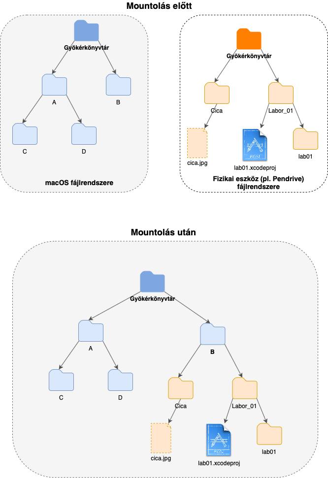
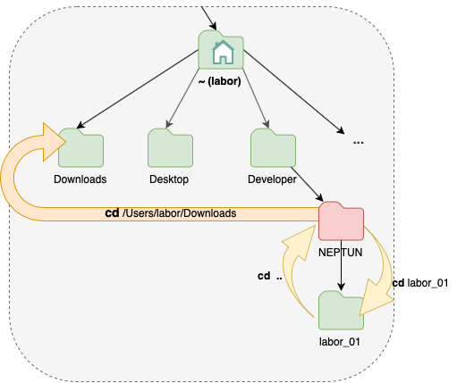

# `iOS` alapú szoftverfejlesztés - Labor `01`

## A labor témája

- [Bemutatkozás](#bemutatkozas)
- [`macOS` felhasználói alapismeretek](#mac_knowings)
    - [Billentyűzet](#billentyuzet)
    - [Egér](#eger)
    - [Unix gyökerek](#unix-gyokerek)
    - [Fájlkezelés](#fajlkezeles)
- [Terminal alapismeretek](#terminal_alapismeretek)
    - [Unix fájlrendszer](#unix-filesystem)
    - [Mountolás](#mountolas)
    - [Navigálás a fájlrendszerben](#fajlrendszer_navigalas)
    - [Fájlrendszer manipulálása](#filesystem_manipulation)
- [Git alapismeretek](#git_tutorial)
    - [Verzió](#git_version)
    - [Verziókezelés](#git_version_control)
    - [Elosztott rendszer](#git_distributed_system)
    - [Git felépítése](#git_parts)
- [Git alapműveletei](#git_commands) 
    - [További segédletek](#git_readings)
- [Swift kód fordítása és futtatása Terminalbol](#swift_compile_terminal)
    - [Hello world](#hello_world)
    - [Fordítás menete, futtatás](#compiling_running)
- [Önálló feladatok](#onallo)
    - [Git gyakorlás](#git_self_test)
    - [1. Feladat](#1st_task)
    - [2. Feladat](#2nd_task)    
- [Szorgalmi feladatok](#szorgalmi)
    - [Celsius ↔ Fahrenheit](#celsius_task)
- [Labor feltöltése GitHub-ra](#git_upload)

## Bemutatkozás <a id="bemutatkozas"></a>
* A laborok `60%`-án kötelező a részvétel. (Idén ez `8` labort jelent.) Minden labor végén fel kell tölteni a `GitHub`ra az elkészült laborfeladatot, aki ezt nem teszi meg, annak érvénytelen a laborja. A laborfeladatok végén találhatóak szorgalmi feladatok, amik elvégzésével plusz pontot szerezhető, ami beleszámít az év végi jegybe (+1 pont laboronként).
* Rendszeresen látogassátok a [tárgy honlapját](https://www.aut.bme.hu/Course/ios), ide kerül fel minden információ. (Van RSS feed is.)
* A tárgyból a legkönnyebben házi feladat beadásával lehet megszerezni a félév végi jegyet. A beadott házikat a laborvezetők fogják értékelni. A házi feladat beadás rendjéről a tárgy honlapján fogunk a későbbiekben információkat közzétenni.
* A laborokkal kapcsolatban mindenkitől örömmel fogadunk hibajelentéseket vagy bármilyen egyéb, _építő jellegű_ kritikát.

## `macOS` felhasználói alapismeretek <a id="mac_knowings"></a>

### Billentyűzet <a id="billentyuzet"></a>
A Macekhez külön Apple billentyűzetek léteznek, melyeken némiképp különbözőek a funkcióbillentyűk, és található rajtuk néhány extra gomb. Ezeken túl azonban a billentyűkiosztás megegyezik a standard PC-s billentyűzetekkel. A laborokban PC-s billentyűzetek vannak rákötve a Mac-ekre, melyeken elérhető minden szükséges gomb, azonban van néhány eltérés a Windows-os használathoz képest.

A legfontosabb különbség, hogy Mac-en `Command` (`⌘`) gomb van Windows gomb helyett. Ez a **PC-s billentyűzeten alapesetben pont a Windows gombra** képződik le. A `Control` (`⌃`), `Alt` és `Alt Gr` (Right Alt), Mac-en is ugyanúgy használatos. Mac-en az `Alt`ot `Option`nek (`⌥`) hívjuk.

---

Az eredeti Mac-es billentyűzetkiosztást használva nem csak a funkcióbillentyűk, hanem a különböző szimbólumok (mint például `{, }, [, ], ...`) billentyűkombinációi nem azonosak a Windows használata során megszokottakkal, azonban a gördülékeny órai munka érdekében **a laborgépeket úgy konfiguráltuk, hogy a kiosztás megegyezzen a Windows-on megszokottal, egyetlen fő különbséggel:** *Mac-en, a Windows rendszerben megszokott billentyűparancsok nem a `Control`, hanem a `Command` billentyűvel válthatók ki, tehát `⌃+C` helyett `⌘+C`-t használunk!* 

---


| A legfontosabb általános billentyűkombinációk                 | |
| --- | --- |
| `⌘+C`         | Copy                                          |
| `⌘+V`         | Paste                                         |
| `⌘+X`         | Cut                                           |
| `⌘+Z`         | Undo                                          |
| `⌘+⇧+Z`       | Redo                                          |
| `⌘+F`         | Keresés szövegben                             |
| `⌘+G`         | Következő találat kereséskor                  |
| `⌘+W`         | Ablak bezárása                                |
| `⌘+Q`         | Kilépés az alkalmazásból                      |
| `⌘+Space`     | *Spotlight* (gyorskereső, alkalmazásindítás)  |
| `⌘+→`         | Ugrás a sor végére (`End` helyett)            |
| `⌘+←`         | Ugrás a sor elejére (`Home` helyett)          |
| `⌘+↹`         | Futó alkalmazások közötti váltás              |

---

*A legtöbb Mac-es alkalmazásnál az alkalmazás ablakainak vagy ablakának bezárása után is tovább fut a program. A teljes kilépéshez a `⌘+Q`-t használhatjuk.*

---

### Egér <a id="eger"></a>
Korábban a Mac-es egerek egygombosak voltak, a `⌃+klikkel` lehetett az alternatív funkciókat elérni (ma is használható: `⌃+balklikk`). Kétgombos egereknél a jobb gomb funkciója megegyezik a `⌃+balklikkel`.

### Unix gyökerek <a id="unix-gyokerek"></a>
A `macOS` (korábban `OS X`, `Mac OS`) egy Unix (BSD) alapú operációs rendszer. A Unix-os alapokat teljesen elfedi a GUI és az Apple saját alkalmazásai.

Minden felhasználónak (esetünkben a `labor` nevű usernek) van egy home könyvtára (`/Users/labor`). Az itt található `Developer` mappába fogjuk a labor során a projekteket és egyéb fájljainkat tárolni.

<p align="center"> 
<span align="center" style="color:red; font-size:16pt"> A labor gépeken egy automatizált rendszer minden bejelentkezéskor törli a felhasználóhoz tartozó könyvtárakat, ezért a labor alatt ne indítsuk újra a gépet és ne jelentkezzünk ki, csak a megoldás bemutatása után!</span>
</p>

Az *Activity Monitor* alkalmazást elindítva láthatjuk a futó alkalmazások process-eit. Itt van lehetőség egy esetleg lefagyott alkalmazás kilövésére is. Alkalmazások bezárásához használhatjuk még a `⌘+⌥+Esc` billentyűkombinációra megnyíló ablakot is.

### Fájlkezelés <a id="fajlkezeles"></a>
Alap fájlkezelő: *Finder*, hasonlóan működik mint Windows intéző.

| Néhány hasznos *Finder* billentyűkombináció                                     | |
| ------------- | ----------------------------------------------------------------- |
| `⌘+Le`        | Belépés egy könyvtárba                                            |
| `⌘+Fel`       | Kilépés egy könyvtárból                                           |
| `⌘+Backspace` | Fájl törlése (Kukába helyezése)                                   |
| `Enter`       | Fájl átnevezése                                                   |
| `Space`       | *QuickLook*                                                       |
| `⌘+⇧+G`       | Navigálás egy könyvtárhoz (Go to Folder)                          |

Külső USB eszköz csatlakoztatás után a `/Volumes/` mappába mountolódik automatikusan. A *Finder*ben és bárhol a standard fájlkezelő dialógusoknál a bal szélső gyorsmenüből a `Devices` részben érhetők el, de a `Desktop`on is megjelenik hozzájuk egy-egy ikon. Az USB-s eszközöket a kihúzás előtt unmountolni kell. (*Finder*ben a bal szélső menüben, az USB eszköz előtti kis "eject" ikon, vagy pedig jobb klikk után "Unmount". További lehetőség még az asztalon az USB-s eszközt a `Trash`-be húzni.)

## Terminal alapismeretek <a id="terminal_alapismeretek"></a>
A Terminal a macOS parancssoros felülete, mely lehetőséget nyújt az operációs rendszer alacsony szintű kezelésére, valamint számos olyan feladat elvégzésére alkalmas, melyhez egyébként külön alkalmazás lenne szükséges. Legtöbb, a fejlesztést nagymértékben segítő, vagy éppen alapvető eszközök is CLI alapúak, így lényeges, hogy a legfontosabb parancsokkal tisztában legyünk, valamint készség szinten tudjuk is alkalmazni azokat.

> A laborok során nem a beépített `Terminal` alkalmazást fogjuk használni, hanem az **`iTerm`**et pár speciális beállítással. A laborok feladatai kivétel nélkül a sima `Terminal` alkalmazással is teljesíthetők, az `iTerm` funkcionalitásai additív jellegűek. Aki a saját gépen szeretne beállítani egy hasonló terminál környezetet, annak jó kiindulás lehet ez a leírás: [KrauseFx/what-terminal-is-felix-using · GitHub](https://github.com/KrauseFx/what-terminal-is-felix-using/blob/master/README.md)

### Unix fájlrendszer <a id="unix-filesystem"></a>
A macOS (és általában a Unix alapú OS-ek) fájlrendszere hierarchikus felépítésű, fa struktúrát alkot: van a **gyökérkönyvtár** (*root directory*), melyből elérhetjük az összes Mac-hez csatlakoztatott fizikai eszközön (pl. beépített SSD, Pendrive) tárolt mappát és fájlt. Azt a pontot, ahol a felhasználó éppen aktuálisan tartózkodik a fájlrendszerben **munkakönyvtárnak** nevezzük. 

### Mountolás <a id="mountolas"></a>
 A [Fájlkezelés](#fajlkezeles) bekezdésben említett mountoulás során tulajdonképpen a külső eszköz fájlrendszerét képző fát illesztjük bele (csatoljuk fel) a OS fájlrendszerébe, míg unmountolás során az előbb leírtaknak a fordítottja történik. A fa köztes csomópontjai csak könyvtárak, míg a levelei fájlok és könyvtárak is lehetnek egyaránt.



### Navigálás a fájlrendszerben <a id="fajlrendszer_navigalas"></a>

Az előbbi bekezdésben megismerhettük a fájlrendszer általános szerkezeti struktúráját, melyben a   `Finder` segítségével egyszerűen tudunk navigálni, azonban a `Terminal` használatával sem kell lemondanunk a fájlkezelésről. A következőkben megismerünk néhány alapvető parancsot, melyet a laborok, valamint a házi feladat készítése során gyakran fogunk használni.

#### `pwd` (print working directory)
Ahogy a neve is mutatja az aktuális munkakönyvtárat (melyik mappában állunk jelenleg a fában) tudjuk kiíratni.
```console
$ pwd
/Users/labor
```

#### `ls` (list segments)
Kilistázza az aktuális mappa tartalmát (gyerekcsomópontjait: fájlokat, további mappákat).
```console
$ ls
Desktop		Documents	Library		Music		Public
Developer	Downloads	Movies		Pictures
```
A parancsnak megadhatunk további kapcsolókat is, mint például:

* Rejtett fájlok listázása: `-a`
* Fájlok további részleteinek listázása: `-l`

#### `cd` (change directory)
A parancs segítségével tudunk munkakönyvtárat váltani. A parancs után megadhatunk a jelenlegi munkakönyvtárunkhoz képest relatív útvonalat:
```console
$ pwd
/Users/labor

$ cd Developer/
$ pwd
/Users/labor/Developer

$ cd NEPTUN/labor_01/
$ pwd
/Users/labor/Developer/NEPTUN/labor_01/
```

Amennyiben a jelenlegi könyvtárunk szülőjét szeretnénk elérni, akkor a következő parancsra lesz szükségünk:
```console
$ cd ..
```

---

*A parancsokat és azok paramétereit a legtöbb esetben **nem szükséges teljes egészében begépelni**: például a `cd` használatakor az útvonal megadásánál kezdjük el pötyögni a célpont első néhány karakterét majd nyomjuk le a `Tab`ot, hogy a Terminal kiegészítse az útvonal többi részét. **Általánosan igaz, hogy a `Tab` segítségével ajánlásokat, kiegészítéseket kaphatunk a Terminal használatakor**, nagyban megkönnyítve ezzel munkánkat.*

---

Lehetőségünk van a gyökérkönyvtártól induló abszolút útvonalat is megadni:
```console
$ cd /Users/labor/Downloads/

$ pwd
/Users/labor/Downloads/
```
Természetesen ilyenkor nem számít, hogy mi volt a jelenlegi munkakönyvtárunk.



A home könyvtárat az alábbi paranccsal tudjuk elérni:
```console
$ cd ~
```

A jelenlegi munkakönyvtárunkra hivatkozni a `.` szimbólummal tudunk. Ezt például használhatjuk a munkakönyvtár Finderben való megnyitására:
```console
$ open .
```

### Fájlrendszer manipulálása <a id="filesystem_manipulation"></a>
A fájlrendszer böngészése mellett lehetőségünk van a manipulálására: például új fájlokat, mappákat létrehozni, törölni. A következő szakaszban megnézzük, hogy pontosan hogyan is kell ezeket az egyszerűbb műveleteket végrehajtani.

#### `mkdir` (make directory)
Új mappát a jelenlegi munkakönyvtárunkba a `mkdir #könyvtárnév#` paranccsal tudunk készíteni. Például:
```console
$ mkdir my_own_dir
$ ls
my_own_dir
```

#### `touch`
A `touch #fájlnév#` használatakor két eset lehetséges:
1. ha paraméterként kapott **fájl már létezik**, akkor **frissíti az utolsó módosítás dátumát** az aktuális pillanatra,
2. **amennyiben nem létezik a fájl**, abban az esetben **létrehoz egy üres fájlt a megadott névvel és kiterjesztéssel**.


---
*A gyakorlatban legtöbbször új fájl készítésére használjuk.*

---

Példa az alkalmazására:
```console
$ touch newfile.swift
```

#### `rm` (remove) és `rmdir` (remove dir)
Az `rmdir #könyvtárnév#` parancs kiadásával **üres könyvtárakat** törölhetünk. Az `rm #fájlnév/könyvtárnév#` parancs segítségével (ahogy a paraméterein is látszik) fájlokat és könyvtárakat is törölhetünk. 

---

Figyelem! Az `rm` parancs eredménye destruktív és vissza nem fordítható. (Nincs köztes `Trash`!)

---

Példák a használatára:

1. Üres könyvtár eltávolítása
    ```console
    $ rmdir my_own_dir
    ```
2. Fájl eltávolítása
    ```console
    $ rm newfile.swift
    ```
3. Könyvtár eltávolítása a tartalmazott fájlokkal és alkönyvtárakkal együtt (**teljes részfa eltávolítása**)
    ```console
    $ rm -rf my_own_dir
    ```
---
A kapcsolók jelentés a következő:
* `-r`: rekurzív módon, tehát az adott könyvtár minden alkönyvtárat és fájljait is,
* `-f`: (force) minden fájlt, írásvédettséget figyelmen kívül hagyva. Ilyenkor a felhasználótól sem kér semmilyen megerősítést.

A kapcsolókat nem szükséges külön-külön megadni (tehát `-r -f`), gyakori, hogy összevonjuk őket (`-rf`).

---
## Git alapismeretek <a id="git_tutorial"></a>
A `git` egy nyílt forráskódú **elosztott verziókezelő rendszer**, amely segítségével **az aktuális munkakönyvtár állapotát nyomon tudjuk követni**. 

### Verzió <a id="git_version"></a>
A **verzió**t, mint fogalmat a következőképp kell elképzelni: az adott könyvtárban lévő fájlokról, valamint a benne lévő további könyvtárakról készítünk egy pillanatképet. Amennyiben tovább dolgozunk a könyvtárban, annak tartalmáról tetszőlegesen készíthetünk újabb snapshotokat. Egy-egy ilyen **elmentett állapot megfelel** a szóban forgó könyvtár és azok fájljainak egy **verziójának**. 

### Verziókezelés <a id="git_version_control"></a>
A `git` segítségével nyomon követhetjük a munkakönyvtár állapotainak előzményét: megtekinthetjük, hogy az egyes verziók során mely fájlokban és könyvtárakban milyen változások történtek, továbbá lehetővé teszi, hogy könnyedén visszaálljunk valamelyik korábbi verzióra. 

<p align="center"> 

</p>

### Elosztott rendszer <a id="git_distributed_system"></a>

Egy verziókezelés alatt álló munkakönyvtárat (a továbbiakban: `(git) repository`) lehetőségünk van másokkal is megosztani, ekkor egyszerre több ember is végezhet rajta módosításokat. Ebben az esetben egy távoli szerveren (pl. [GitHub](https://github.com)) található az úgynevezett `remote repository`, melyről a fejlesztésbe újonnan bekapcsolódó felhasználók készítenek egy lokális másolatot (`local repository`). Ilyenkor a repository-ban található fájlokon felül a repository teljes előzménye is mentésre kerül. A felhasználók a saját `local repository`-jukat, a `remote repository` segítségével tarthatják szinkronban. 

### Git felépítése <a id="git_parts"></a>

Egy git projekt 3 fő komponensből áll:

* *munkakönyvtár*,
* *repository*,
* *staging area*.
 
#### **Munakönyvtár**
A munkakönyvtár azokat a fájlokat tartalmazza, amelyek módosításait nyomon szeretnénk követni. Ez lehet valamilyen projekt könyvtár (pl. Xcode projekt), de bármely a [Unix Fájlrendszer](#unix-filesystem) szakaszban ismertetett struktúra amin munkát (módosításokat) végzünk.

#### **Repository**
A projekt fájljainak nyomonkövetésére használt tároló, mely tartalmazza az összes `commit`ot. Egy `commit` tulajdonképpen a [Verzió](#git_version) bekezdésben bemutatott snapshotnak felel meg.
 
#### **Staging area**
Itt készítjük össze egy commit tartalmát, azaz hogy mely változtatásokat szeretnénk egy snapshotba "csomagolni". Ezeket a változásokat automatikusan detektálja a staging area. A módosítások hozzáadását a staging areahoz `stage`-elésnek, eltávolítását `unstage`-elésnek nevezzük. Ha korábban már stage-elt, de nem commitolt fájlon módosítást hajtunk végre, akkor az új módosítás tartalmával a fájl újra `modified (vagy unstage-ed)` állapotba kerül. A stage-elt fájlokat ezután commitolhatjuk, így a változások bekerülnek egy snapshotba és ezzel együtt a lokális repository git előzményébe is. Ezután egy `push` művelettel tudjuk elérni, hogy ez megjelenjen a `remote repository`-ban is.

<p align="center"> 

</p>
[(Kép forrása)](https://www.git-tower.com/learn/media/pages/git/ebook/en/command-line/remote-repositories/introduction/-1045933932-1566804922/basic-remote-workflow.png)

## Git alapműveletei <a id="git_commands"></a>
A következő alapvető parancsokat használhatjuk a `git` működtetéséhez valamelyik Terminal (`iTerm` vagy `Terminal`) alkalmazás segítségével. Elérhető több alkalmazás is amellyel parancsírás helyett vizuálisan navigálhatunk, pl.: `GitKraken` vagy `SourceTree`. A laborok során a parancssoros kezelést fogjuk használni, mivel csak az egyszerűbb `git` műveletekre lesz szükségünk.
 
#### Konfiguráció
```console
$ git config --global user.name <name>
$ git config --global user.email <email_address>
```
> A fenti parancsokkal beállíthatjuk számítógépünkhoz `git` felhasználónkat.

```console
$ git init
```
> Létrehoz egy új *repository*-t.


#### Státusz
```
git status
```
> Ellenőrizhetjük a `git` jelenlegi állapotát: láthatjuk, hogy mely fájlok módosultak, melyek vannak *staging area*-n, stb.


#### Fájlok hozzáadása a staging area-hoz
```console
$ git add .
```
> Minden módosított fájlt hozzáad a *commit*hoz. A pont helyett többféle módon is befejezhető a parancs. Erről hivatalos dokumentációkban könnyen lehet információt találni.


#### Commit
```console
$ git commit -m "Add comment of changes"
```
> A *staging area*-ban lévő változások bekerülnek a lokális repo-ba. Fontos, hogy figyeljünk a helyes komment írására, mivel zavaró lehet a csoportos munka esetén az eltérő kommentelési konvenció. Javasolt például a következő, ahol mentálisan odaképzeljük a commit message elejére, hogy *This commit will...*: *Implement changes of TestViewController*.

#### Push
```console
$ git push
```
>  Lokális változásaink felkerülnek a *remote repository*-ba. Ezután mindenki hozzáfér a módosításokhoz.


#### Fetch
```console
$ git fetch
```
>  A remote-ban történt változásokat letölthetjük lokális reponkba. **DE nem alkalmazzuk ezeket még a saját munkakönyvtárunknak, csak a változások tényét és mibenlétét töltjük le!**


#### Pull
```console
$ git pull
```
> A lokális munkakönyvtárba betölti az összes távoli módosítást. Ezután egy `merge commit` jön létre, amely tartalmazza az összes új módosítást.

<p align="center"> 

</p>
[(Kép forrása)](http://blog.podrezo.com/wp-content/uploads/2014/09/git-operations.png)

#### Változások ellenőrzése
```console
$ git status
$ git diff <file>
```
> Fontos, hogy  `pull` után mindig ellenőrizzük a státuszt, mert `conflict` keletkezhet a fájlok között ha olyat módosítottál lokálisan, amit más is módosított. Az összeütközött fájlokat a `git status` pirossal jelzi és az eltérést `git diff`-fel ellenőrizhetjük. A konfliktust fel kell oldani azzal, hogy kitöröljük a fájlből a nem oda illő részeket. A hibák feloldása után a lehúzott részeket commitolnunk kell (`merge commit`). 


#### Clone
```console
$ git clone
```
> Egy teljes, távoli *repo*-t tölthetünk le. Ezzel tudjuk a `GitHub`-on lévő repository-jainkat lokális repoként hozzáadni a könyvtárainkhoz. 

### További segédletek <a id="git_readings"></a>
Fontos, hogy minél alaposabban ismerjük a `git `működését, mivel ez elengedhetetlen minden munkahelyi környezetben.
Az alábbi linkeken további segédletek találhatóak:

* [https://nvie.com/posts/a-successful-git-branching-model](https://nvie.com/posts/a-successful-git-branching-model/)
* [https://tutorialzine.com/2016/06/learn-git-in-30-minutes](https://tutorialzine.com/2016/06/learn-git-in-30-minutes)
* [https://www.atlassian.com/git/](https://www.atlassian.com/git/)
* [https://www.katacoda.com/courses/git](https://www.katacoda.com/courses/git)
* [https://learngitbranching.js.org](https://learngitbranching.js.org)

## Swift kód fordítása és futtatása Terminalbol <a id="swift_compile_terminal"></a>
A következő laborok során `Swift` kód fordítására az `Xcode` fejlesztőkörnyeztet fogjuk használni, a lefordított binárisokat `Playgroundban` vagy az `iOS Simulatoron` futtatjuk majd, azonban a mai labor alkalmával a *Terminal* segítségével fogjuk ezt végrehajtani. A `Swift` nyelv nyílt forráskódú, bármilyen operációs rendszerre lehet telepíteni, az iOS alkalmazások fejlesztéséhez szükséges függőségek azonban csak macOS-re érhetők el. 

#### Akutális Swift verzió ellenőrzése
A gépen telepített aktuális Swift verzióját az alábbi módon tudjuk ellenőrizni:
```console
$ swift --version
```

### Hello world <a id="hello_world"></a>
**Készítsük el első programunkat, amely egy hello world lesz!** 

Nyissuk meg az `iTerm` alkalmazást, majd navigáljunk a Developer könyvtárba.
```console
$ cd Developer
```
Készítsünk egy új könyvtárat `lab01` néven és navigáljunk bele.
```console
$ mkdir lab01
$ cd lab01
```
Következő lépésben hozzuk létre a `hello.swift` fájlt, majd nyissuk meg:
```console
$ touch hello.swift
$ open hello.swift
```

A fájlba hozzunk létre egy függvényt, `helloWorld` néven. Swiftben a konzolra a `print()`meghívásával tudunk írni, ezek alapján a függvénytörzs a következőképp alakul:
```swift
// hello.swift

func helloWorld() {
    print("Hello World")
}
```
Mentsük el a fájlt:  ⌘+S,

Hozzunk létre egy újabb fájlt, ami a programunkat fogja reprezentálni, ebben fogjuk meghívni az előbb deklarált függvényt.
```console
$ touch main.swift
$ open main.swift
```

Először készítünk egy függvényt, ami az alkalmazás indulásakor fog lefutni ez lesz a `start()`, a törzsében meghívjuk a `helloWorld()` függvényt. Végezetül a fájl utolsó sorában, az osztályon kívül meghívjuk a `start`ot.

```swift
// main.swift

func start() {
    helloWorld()
}
start()
```

Végezetül mentsük el a fájlt: ⌘+S,

### Fordítás menete, futtatás <a id="compiling_running"></a>
A program futtatásához elsőnek le kell fordítani a Swift fordító használatával a két fájlt.
```console
$ swiftc hello.swift main.swift -o lab01_hello_world
```
A parancs lefordítja a `hello.swift` és a `main.swift` fájlokat is egyaránt, összelinkeli és a fordítás eredménye a `lab_01_hello_world` futtatható állomány lesz

Utolsó lépésként futtassuk a fordítás kimenetét:
```console
$ ./lab01_hello_world
Hello World
```
## Önálló feladatok <a id="onallo"></a>

### Git gyakorlás <a id="git_self_test"></a>
Próbáljuk ki a git alapműveleteit.
- [init, status, add, commit](https://www.katacoda.com/courses/git/1)

### **1. Feladat** <a id="1st_task"></a>
Készítsünk Terminal alkalmazást, amely a következő ábrát rajzolja ki:
```
 0 

 0  1 

 0  1  2 

 0  1  2  3 

 0  1  2  3  4 

 0  1  2  3  4  5 

 0  1  2  3  4  5  6 

 0  1  2  3  4  5  6  7 

 0  1  2  3  4  5  6  7  8 

 0  1  2  3  4  5  6  7  8  9 

 0  1  2  3  4  5  6  7  8  9  10 

 0  1  2  3  4  5  6  7  8  9  10  11 

 0  1  2  3  4  5  6  7  8  9  10  11  12 

 0  1  2  3  4  5  6  7  8  9  10  11  12  13 

 0  1  2  3  4  5  6  7  8  9  10  11  12  13  14 

 0  1  2  3  4  5  6  7  8  9  10  11  12  13  14  15 

 0  1  2  3  4  5  6  7  8  9  10  11  12  13  14  15  16 

 0  1  2  3  4  5  6  7  8  9  10  11  12  13  14  15  16  17 

 0  1  2  3  4  5  6  7  8  9  10  11  12  13  14  15  16  17  18 

 0  1  2  3  4  5  6  7  8  9  10  11  12  13  14  15  16  17  18  19 

 0  1  2  3  4  5  6  7  8  9  10  11  12  13  14  15  16  17  18  19  20 
```
A megoldás során ciklusokat és a `print()` függvényt használjuk.

> Tipp: A `print()` függvénynek megadható, hogy milyen karakter legyen a sor végén. Ez alapból a sortörtés (`\n`), de ez megváltoztatható, és megadható neki paraméterként is a következőképp: `print(#kiírandó szöveg#, terminator: #termináló karakter#)`

A fájl neve legyen: `feladat_01.swift`, a kirajzolást végző függvény neve pedig: `draw()` Hívjuk meg az előbbi feladat során létrehozott, `main.swift` fájl `start()` függvényében:
```swift
// main.swift
func start(){
    helloWorld()
    draw()
}

start()

```
**Ne felejtsük el újra lefordítani az újonnan létrehozott fájlt, valamint az előzőekben készített fájlokat is!**

### **2. Feladat:** Emojifier <a id="2nd_task"></a>
Készítsünk Terminal alkalmazást, amely beolvas a felhasználótól egy angol szót és ha a szó megegyezik az alábbiak közül bármelyikkel, kicseréli azt a megfelelő emojira, különben pedig visszaadja magát az inputot:

* apple: 🍎
* dog: 🐶
* eye: 👀
* pizza: 🍕
* bear: 🐻

Az emojivá alakítást végző függvény kerüljön a `feladat_02.swift` fájlba, a függvény fejléce a következőképp nézzen ki:
```swift
// feladat_02.swift

func emojify(from: String) -> String
```
Kelleni fog még egy függvény, ami a felhasználótól beolvassa a transzformálandó szót és végrehajtja rajta az átalakítást:
```swift
// feladat_02.swift
//...
func convertInput() {
    print("Give me the word: ")
   if let inputWord = readLine() {
       //TODO: szó átalakítása és kiírása a kimenetre
   } else {
       print("Input error! ❌")
   } 
}
```

Az első feladathoz hasonlóan hívjuk meg a main.swift fájl `start()` függvényében a `convertInput()` metódust.

```swift
// main.swift
func start(){
    helloWorld()
    draw()
    convertInput()
}

start()

```

**Ne felejtsük el újra lefordítani az újonnan létrehozott fájlt, valamint az előzőekben készített fájlokat is!**

## Szorgalmi feladatok <a id="szorgalmi"></a>

### **Celsius ↔ Fahrenheit** <a id="celsius_task"></a>
Készítsünk egy folyamatosan futó, interaktív Terminal alkalmazást, amely bemenetén vár egy Celsiusban megadott értéket, átkonvertálja, majd az eredményt kiírja a kimenetre.
A konverziós logikát, valamint a ciklikus beolvasás megvalósítását a `feladat_03.swift` fájlba implementáljuk, az alábbiak szerint:

```swift
// feladat_03.swift
func startConversion() {
    // TODO: Ciklikus olvasás + konverzió
}

func convert(celsius: Double) -> Double {
    // TODO: Konvertálási logika implementálása
}
```

A `main.swift` fájl tartalma a következőképp alakul:

```swift
// main.swift
func start(){
    helloWorld()
    draw()
    convertInput()
    startConversion()
}

start()
```

A feladat megoldása során figyeljünk, hogy hibás bemenet esetén ne álljon le a program futása. Ilyen esetben az előző feladattal megegyező módon kezeljük a hibás esetet. 

**Ne felejtsük el újra lefordítani az újonnan létrehozott fájlt, valamint az előzőekben készített fájlokat is!**

## Labor feltöltése GitHub-ra <a id="git_upload"></a>
A labor elvégzése csak akkor lehet sikeres, ha a kész feladatot feltöltöttük `GitHub`ra. Az alábbi leírás ebben fog segíteni.

### Előkészítés
Nyissuk meg az `iTerm` alkalmazást és navigáljunk el (`cd`) a `/Users/labor/Developer/` mappánkba. *(A mappa drag-and-drop-olása az alkalmazásba automatikusan beírja a könyvtár elérési útvonalát.)*

### Repository klónozása
Nyissuk meg a `GitHub`ot a `Safari`val majd tegyük vágólapra a repository URL-jét. A megfelelő könyvtárban álló `iTerm`-be írjuk be az alábbi parancsot írásjelek nélkül az előbb vágólapra helyezett URL-el:
```console
$ git clone <repository_url>
```
> Ezután láthatjuk, hogy a mappánkban megjelentek a *repository*-ban lévő tartalmak. 

### Fájlok hozzáadása
Nyissuk meg a *repository*-t tartalmazó mappát a `Finder`ben és az órán elkészített feladat fájljait másoljuk be ide a `lab01` mappából.

### Labor feltöltése
Ha minden fájlt bemásoltunk a megfelelő helyre, akkor váltsunk vissza az `iTerm`re, majd írjuk be az alábbi parancsokat:
```console
$ git add .
```
> Ezzel tudjuk *stage*-elni a fájlainkat, azaz beállíthatjuk a fájlok elérési útvonalát a következő commitnak.

```console
$ git commit -m "Upload files of labor 1"
```
> Így tudjuk a változtatásokat a *lokális git repository*-nkba feltölteni.

```console
$ git push
```
> A parancs lefutása után felkerülnek a *remote repository*-ba is a lokális változtatások. Ellenőrizzük le, hogy a `GitHub`on látjuk-e a repository-nkban a `labor_01` mappán belül a létrehozott `Swift` fájlokat!

Fontos az előbbi lépések és a `git` kezelésnek alapos ismerete, mert mind a laborok, mind a házi feladat leadása ezen keresztül történik. Nem megfelelő tudás esetén kötelezően ajánlott a fentebb leírt [Git alapismeretek](#git_tutorial) és [ajánlott linkek](#git_readings) tanulmányozása, vagy segítség kérése a laborvezetőktől.

## A laborsegédletet összeállította

* Zoller Péter - zoller.peter@autsoft.hu
* Varga Domonkos - varga.domonkos@autsoft.hu
* Krassay Péter - peter.krassay@autsoft.hu
