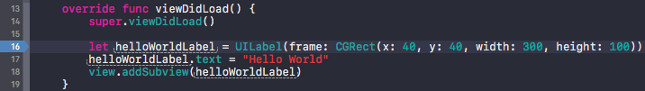
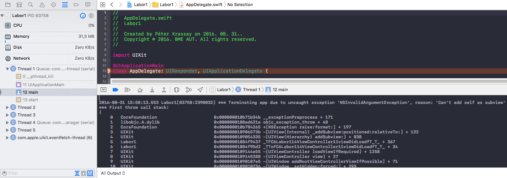
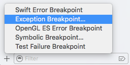
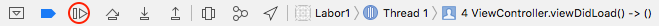
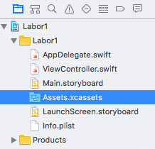
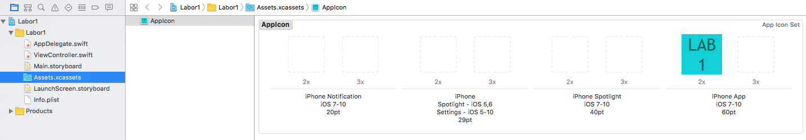

# `iOS` alapú szoftverfejlesztés - Labor `01`

## A laborsegédletet összeállította

* Kelényi Imre - imre.kelenyi@aut.bme.hu
* Kántor Tibor - tibor.kantor@autsoft.hu
* Krassay Péter - peter.krassay@autsoft.hu

## A labor témája

- [Bemutatkozás](#bemutatkozas)
- [`macOS` felhasználói alapismeretek](#macOS)
    - [Billentyűzet](#billentyuzet)
    - [Egér](#eger)
    - [Unix gyökerek](#unix-gyokerek)
    - [Fájlkezelés](#fajlkezeles)
- [*Xcode*, `iOS` fejlesztőkörnyezet bemutatása, *HelloWorld*](#xcode)
    - [Projektek](#projektek)
    - [Toolbar](#toolbar)
    - [Navigator](#navigator)
    - [Projekt felépítése](#projekt-felepitese)
    - [Projekt fordítása, futtatása](#projekt-forditasa-futtatasa)
    - [Írás a konzolra](#iras-a-konzolra)
    - [Írás a képernyőre](#iras-a-kepernyore)
    - [Debugolás alapok](#debugolas-alapok)
    - [Szöveg testreszabás](#szoveg-testreszabas)
    - [Projektbeállítások áttekintése](#projektekbeallitasok-attekintese)
    - [Alkalmazás ikon beállítása](#alkalmazas-ikon-beallitasa)
    - [Kezdőképek (*Launch images)*](#kezdokepek)
    - [`iPad` támogatás](#ipad)
    - [Hasznos Xcode billentyűkombinációk](#hasznos-xcode-bill)
- [Extra feladatok](#extra-feladatok)

## Bemutatkozás <a id="bemutatkozas"></a>
* A laborok `60%`-án kötelező a részvétel. (Idén ez `8` labort jelent.) A laborvezetők minden óra elején körbeadnak egy jelenléti ívet. Ezen túl minden labor végén fel kell tölteni a tanszéki portálra a kész laborfeladatot, egyetlen ZIP fájl formájában (aki ezt nem teszi meg, annak érvénytelen a laborja!). A laborvezetőknek lehetősége van a kimagasló/nagyon jó megoldásokért vagy órai munkáért plusszpontokat osztani a laborok után, ami beszámít a ZH-ba, az év végi jegybe vagy a házi feladat értékelésnél (+1 pont laboronként)
* Rendszeresen látogassátok a [tárgy honlapját](https://www.aut.bme.hu/Course/ios), ide kerül fel minden információ. Van RSS feed is.
* A tárgyból a legkönnyebben házi feladat beadásával lehet megszerezni a félév végi jegyet. A beadott házikat a laborvezetők fogják értékelni. A házi feladat beadás rendjéről a tárgy honlapján fogunk a későbbiekben információkat közzétenni.
* Sok laboranyag új és ebből következőleg tartalmazhat hibákat. Ezek miatt előre is elnézést kérünk mindenkitől és örömmel fogadunk hibajelentéseket vagy bármilyen egyéb kritikát.

## `macOS` felhasználói alapismeretek <a id="macOS"></a>

### Billentyűzet <a id="billentyuzet"></a>
Mac-ekhez külön Apple billentyűzetek léteznek, melyeken némiképp különbözőek a funkcióbillentyűk és található rajtuk néhány extra gomb. Ezeken túl azonban a billentyűkiosztás megegyezik a standard PC-s billentyűzetekkel. A laborokban PC-s billentyűzetek vannak rákötve a Mac-ekre, melyeken elérhető minden szükséges gomb, azonban van néhány eltérés a Windowsos használathoz képest.

A legfontosabb különbség, hogy Mac-en `Command` (`cmd` &#8984;) gomb van Windows gomb helyett. Ez a PC-s billentyűzeten alapesetben pont a Windows gombra képződik le. A `Control`, `Alt` és `Alt Gr` (Right Alt), Mac-en is ugyanúgy használatos. Mac-en az `Alt` alternatív neve `Option`.

---

*Mac-en a billentyűparancsok jelentős része nem a `Control`, hanem a `Command` billentyűvel válthatók ki, tehát `Ctrl+C` helyett `Cmd+C`-t használunk!*

---


| A legfontosabb általános billentyűkombinációk                  ||
| --- | --- |
| `Cmd+C`         | Copy                                          |
| `Cmd+V`         | Paste                                         |
| `Cmd+X`         | Cut                                           |
| `Cmd+Z`         | Undo                                          |
| `Cmd+Shift+Z`   | Redo                                          |
| `Cmd+F`         | Keresés szövegben                             |
| `Cmd+G`         | Következő találat kereséskor                  |
| `Cmd+W`         | Ablak bezárása                                |
| `Cmd+Q`         | Kilépés az alkalmazásból                      |
| `Cmd+Space`     | *Spotlight* (gyorskereső, alkalmazásindtás)   |
| `Cmd+Jobb`      | Ugrás a sor végére (`End` helyett)           |
| `Cmd+Bal`       | Ugrás a sor elejére (`Home` helyett)         |
| `Cmd+Tab`       | Futó alkalmazások közötti váltás              |

---

*A legtöbb Mac-es alkalmazásnál az alkalmazás ablakainak vagy ablakának bezárása után is tovább fut a program. A teljes kilépéshez a `Cmd+Q`-t használhatjuk.*

---

### Egér <a id="eger"></a>
Korábban a Mac-es egerek egygombosak voltak, a `Ctrl+klikkel` lehetett az alternatív funkciókat elérni (ma is használható: `Ctrl+balklikk`). Kétgombos egereknél a jobb gomb funkciója megegyezik a `Ctrl+balklikkel`.

### Unix gyökerek <a id="unix-gyokerek"></a>
A `macOS` (korábban `OS X`, `Mac OS`) egy Unix (BSD) alapú operációs rendszer. A Unix-os alapokat teljesen elfedi a GUI és az Apple saját alkalmazásai.

Minden felhasználónak (esetünkben a `labor` nevű user-nek) van egy home könyvtára (`/Users/labor`), itt fogjuk a labor során a projekteket és egyéb fájljainkat tárolni.

> A laborok végén kérjük töröljétek a létrehozott fájlokat! A `macOS` alapból a lomtárba töröl (alul a dokkon, jobb oldalt a kuka), ezt a jobb klikkel előhozható menüből lehet törölni.

Az *Activity Monitor* alkalmazást elindítva láthatjuk a futó alkalmazások process-eit. Itt van lehetőség egy esetleg lefagyott alkalmazás kilövésére is. Alkalmazások bezárásához használhatjuk még a `Cmd+Option+Esc` billentyűkombinációra megnyíló ablakot is.

### Fájlkezelés <a id="fajlkezeles"></a>
Alap fájlkezelő: *Finder*, hasonlóan működik mint Windows intéző.

| Néhány hasznos *Finder* billentyűkombináció                                        ||
| --- | --- |
| `Cmd+Le`        | Belépés egy könyvtárba                                            |
| `Cmd+Fel`       | Kilépés egy könyvtárból                                           |
| `Cmd+Backspace` | Fájl törlése                                                      |
| `Enter`         | Fájl átnevezése                                                   |
| `Space`         | *QuickLook* (gyors előnézet, könyvtár méretének kiszámítása, ...  |
| `Cmd+Shift+G`   | Navigálás egy könyvtárhoz (Go to Folder)                          |

A törlés a *Trash*-be történik, amit jobb klikk után kiüríthetünk.

Külső USB eszköz csatlakoztatás után a `/Volumes/` mappába mountolódik automatikusan. A *Finder*ben és bárhol a standard fájlkezelő dialógusoknál a bal szélső gyorsmenüből a `Devices` részben érhetők el, de a `Desktop`on is megjelenik hozzájuk egy-egy ikon. Az USB-s eszközöket a kihúzás előtt unmountolni kell. (*Finder*ben a bal szélső menüben, az USB eszköz előtti kis "eject" ikon, vagy pedig jobb klikk után "Unmount". További lehetőség még az asztalon az USB-s eszközt a `Trash`-be húzni.)

## *Xcode*, `iOS` fejlesztőkörnyezet bemutatása, *HelloWorld* <a id="xcode"></a>
*Xcode*, "all in one" `iOS`, `macOS`, `watchOS`, `tvOS` fejlesztőkörnyezet, tartalmazza az a platform SDK-kat és minden egyéb eszközt ami ahhoz szükséges, hogy alkalmazásokat fejlesszünk. Saját gépre egyszerűen az `macOS` *App Store*-ból lehet ingyenesen letölteni mint egy standard Mac-es alkalmazást.

A továbbiakban megismerkedünk az *Xcode* legfontosabb funkcióval és bemutatásra kerül az `iOS`-es alkalmazások projektjeinek felépítése.

### Projektek <a id="projektek"></a>
Az alkalmazások és egyéb komponensek forráskódját és egyéb fájljaikat projektek fogják össze. Új projekt létrehozásakor (`Cmd+Shift+N`) kiválaszthatjuk a projekt sémáját. A megadott template-ek csak az automatikusan legenerált kezdeti fájlokat határozzák meg, további megkötéseket nem jelentenek a projektre.

> Hozzunk létre egy új projektet (`Cmd+Shift+N`) és válasszuk a Single Application template-et!


<!-- -->
> * A *Product Name* legyen **`Labor1`**.
> * Az *Organization Name* tetszőlegesen választható, a példában **`BME AUT`** lesz.
> * A *Company Identifier* az alkalmazás egyedi azonosítójának része lesz, itt konvenció szerint "fordított DNS jelölést" szokás használni, vagyis pl. `hu.cégnév`. A példánkban **`hu.bme.aut`** lesz.
> * A *Language* **`Swift`** legyen.
> * A *Devices* opcióból válasszuk az **`iPhone`**-t. (Labor végén megnézzük, hogy hogyan lehet az `iPad`et is beállítani utólag.)
> * A többi opciót hagyjuk az alapbeállításokon.


Az *Xcode* automatikusan létre tud hozni egy lokális `git` repository-t a projekthez.


*A `git` egy elosztott verziókezelő rendszer, amely kiválóan alkalmas projektek forráskódjának verzióinak menedzselésére és a csapatmunka támogatására. Aki nem ismerné a `git`et, annak házi feladat.*

* [https://try.github.io](https://try.github.io)
* [https://www.atlassian.com/git/](https://www.atlassian.com/git/)

A laborgépeken célszerű a projekteket a `/Users/labor/Developer` mappában tárolni.

### Toolbar <a id="toolbar"></a>
A képernyő tetején található sáv.


### Navigator <a id="navigator"></a>
Bal szélső panel. Több tabból áll, a projekt fájljait az 1. tabon, a `Project Navigator`ban láthatjuk (`Cmd+1`).


Az itt látható mappákat *Group*oknak nevezik és nem tükrözik, hogy a fájlrendszerben hol is helyezkednek el a fájlok. Tetszőlegesen csoportosíthatjuk a fájlokat új *Group*okba, vagy átnevezhetjük a már meglévő *Group*okat, a fájlrendszerben nem változik a fájlok helye.

---

*A `Project Navigator`ban lévő mappák (groupok) segítségével logikailag csoportosíthatjuk a projekt fájljait.*

---

> Hasonlítsuk össze a `Project Navigator`ban és a fájlrendszerben lévő fájlokat és a könyvtárszerkezetet (*Finder* segítségével).

### Projekt felépítése <a id="projekt-felepitese"></a>

---

*Az `iOS`-re írt alkalmazások alapvetően az `MVC` (Model View Controller) architektúrára épülnek.*

---

Az `iOS` alkalmazások felépítésével részletesebben a következő hetekben fogunk foglalkozni. Most csak nagyon röviden végignézzük, hogy a generált fájlok közül melyik micsoda.

| Fájlnév | Leírás |
| --- | --- |
| `AppDelegate.swift`         | Az alkalmazáshoz tartozó `Application Delegate` osztály, melyben lekezelhetjük az alkalmazás életciklus fontosabb eseményeit (pl. elindult a program). Egyszerűbb alkalmazásoknál ez lehet a fő/gyökér osztály, ahol az alkalmazáslogikát megírjuk. |
| `ViewController.swift`      | Az alkalmazás egy `View controller`e, mely tartalmazza az alkalmazás egy "képernyőjéhez" tartozó logikát/kódokat. |
| `Main.storyboard`           | Az alkalmazás felhasználói felületét, "nézeteit" és azok kapcsolatát leíró XML fájl. |
| `Assets.xcassets`            | A projektben használt képi erőforrásokat (képfájlokat) tartalmazó "asset katalógus". Valójában egy könyvtár. |
| `LaunchScreen.storyboard`   | Az alkalmazás indításakor, töltés közben megjelenő *Launch Screen* (~"Splash Screen", de csak addig látszódik, míg töltődik az alkalmazás). |
| `Info.plist`                | Metaadatokat tartalmaz az alkalmazásról az OS felé (pl. indítófájl, alkalmazás ikon neve, stb.) |

A `Products` group egy speciális mappa, mely az alkalmazás fordításakor/tesztelésekor előállított binárisokat tartalmazza (ezeket már a fordító/linker állítja elő a projekthez definiált `Target`ekhez. Pl. a **Labor1.app** az elkészítendő alkalmazás bundle-re hivatkozik (lényegében ez tartalmaz mindent, ami az alkalmazás futtatásához kell).

> Ellenőrizhetjük, hogy a fájlrendszerben nincsen ott a **Labor1.app**

| Gyakori fájlkiterjesztések ||
| --- | --- |
| `.swift`                | `Swift` forráskód |
| `.h`                    | Objective-C forráskód (header fájl) |
| `.m`                    | Objective-C forráskód (implementáció) |
| `.storyboard, .xib`     | Felhasználói felületet leíró (XML) fájlok, *Xcode*-ban grafikusan szerkeszthetők |
| `.framework`            | Framework (~DLL + headerök) |
| `.plist`                | Property list: hierarchikus adatstruktúra (listák, dictionary-k és alaptípusok tetszőleges elrendezésben), a lemezre mentve, Xcode-ban grafikusan szerkeszthető (valójában általában egy XML, bár van bináris változata is) |

### Projekt fordítása, futtatása <a id="projekt-forditasa-futtatasa"></a>
> Fordítsuk le és futtassuk az alkalmazást (`Cmd+R`) és gyönyörködjünk a megjelenő fehér ablakban! Ismerkedjünk meg az *iOS Simulator* alapfunkcióival!

<!-- -->
> Próbáljuk ki az *iOS Simulator* alapfunkcióit (`Multitasking Bar` behozása (`2x` `Cmd+Shift+H`), futó alkalmazás leállítása, alkalmazás törlése, minden alkalmazás törlése *Reset Content and Settings* paranccsal)!

A fordítási folyamat eredménye egy **Labor1.app** nevű bundle. A bundle nem más mint egy könyvtár, fix belső szerkezettel. Ezen belül található az alkalmazás futtatható indítófájlja és az egyéb erőforrások (képek, adatfájlok, stb.). Szimulátorra való fordítás esetén a **Labor1.app** megtalálható a Mac fájlrendszerében.

---

*Sajnos Xcode 6-tól elég nehéz megtalálni a szimulátor és azon belül az alkalmazások könyvtárát. A `~/Library/Developer/CoreSimulator/Devices/UID/data/Container/Data/Application/` körül lehet keresgélni, de a `UID` egy hosszú, kvázi-véletlen azonosító, ami ráadásul fordítások között is változhat...*
*Több 3rd party megoldás született már a mappa könnyebb megtalálásához, pl. [SimPholders](http://simpholders.com)*

---

### Írás a konzolra <a id="iras-a-konzolra"></a>
A konzolra való log üzenetek megjelenítéséhez a `print(_:separator:terminator:)` függvényt használhatjuk. A konzol ablak alapból rejtve van, kapcsoljuk be a *Toolbar*on.


A képernyő jobb alsó sarkában megjelenő sávban is gondoskodjunk arról, hogy a *Console* nézet be legyen kapcsolva.


> Írjuk ki a konzolra az ominózus "Hello World" szöveget (szúrjuk be a kódot az `AppDelegate.swift` fájlba az `application(_:didFinishLaunchingWithOptions:)` metódus végére, a `return true` elé)!

```swift
print("Hello World")
```

A `Swift` szintaktikailag közel áll a C-hez és Java-hoz, azonban azoknál jóval tömörebb. A zárójelek a legtöbb esetben elhagyhatók, hasonlóan a mondatvégi pontosvesszőkhöz. Egy `for` ciklus pl. így néz ki.

```swift
for i in 1...5 {
    print("Hello World \(i)")
}
```

### Írás a képernyőre <a id="iras-a-kepernyore"></a>
Váltsunk át a `Main.storyboard` fájlra. Itt az alkalmazás jeleneteit (*scene*-eit, *View Controller*eit) láthatjuk. Kezdéskor egyetlen jelenet található a `storyboard`ban, amely teljesen üres. A későbbiekben részletesen fogunk foglalkozni a felhasználói felület felépítésével, most azonban elégedjünk meg annyival, hogy itt tudjuk definiálni, hogy milyen nézetekből épüljön fel a felhasználói felület és ezekhez milyen beállítások tartozzanak.

> Módosítsuk a `ViewController.swift` fájlban a `viewDidLoad` metódust, hogy az létrehozzon egy új `UILabel`t és kiírja a **Hello World**-öt a képernyőre.

```swift
override func viewDidLoad() {
    super.viewDidLoad()
    // Do any additional setup after loading the view, typically from a nib.
}
```

```swift
override func viewDidLoad() {
    super.viewDidLoad()

    let helloWorldLabel = UILabel(frame: CGRect(x: 10, y: 20, width: 300, height: 100))
    helloWorldLabel.text = "Hello World"
    view.addSubview(helloWorldLabel)
}
```

Röviden beszéljük meg a következő fogalmakat (fontos, ezekről mind lesz szó még későbbi laborokon, most csak ismerkedünk velük).

* a `viewDidLoad` metódus akkor hívódik meg, mikor megjelenik a (valójában a rendszer betölti a jelenethez (view controller) tartozó nézetet)
* `helloWorldLabel` egy konstans lokális változó, (a `let` kulcsszó vezeti be a konstans változókat), melynek értékül adunk egy új `UILabel` példányt
* `UILabel`nek a példányosításakor át kell adnunk neki egy `CGRect`et, mely megmondja hol és mekkorában helyezkedik el a képernyőn
* `view` valójában `self.view`-ra hivatkozik és az aktuális view controller gyökérnézetét jelöli, de `Swift`ben lehetőség van a `self` (`this` pointer) elhagyására

> Nézzük meg a `UILabel` osztály rövid leírását (`Option+klikk` a kódban `UILabel`re), majd a [teljes leírást](https://developer.apple.com/library/ios/documentation/UIKit/Reference/UILabel_Class/) az Apple Developer Library-ban!

### Debugolás alapok <a id="debugolas-alapok"></a>
Debug breakpointok a kódsorok elé klikkelve hozhatók létre, illetve itt kapcsolhatók ki/be.


> Próbáljuk ki az alap debug funkciókat! (breakpoint létrehozása, `Cmd+7`: `Breakpoint Navigator`)

<!-- -->
> Vezessünk be egy hibát a kódba, adjuk hozzá a `UILabel`t saját magához (nyilván ez helytelen művelet).

```swift
//view.addSubview(helloWorldLabel)
helloWorldLabel.addSubview(helloWorldLabel)
```

> Indítsuk el az alkalmazást és figyeljük meg milyen, amikor egy `Exception` keletkezik.

Először a konzolt keressük meg és ezen belül görgessünk oda, ahol az exception leírása olvasható (ez mindig a stack trace előtt található, a konzol log vége felé).

`2016-08-31 15:58:13.553 Labor1[83758:2390032] *** Terminating app due to uncaught exception 'NSInvalidArgumentException', reason: 'Can't add self as subview'`

A leírás itt elég jó, de azért próbáljuk megnézni pontosan melyik kódsor is dobta hibát. Nyissuk meg a `Debug Navigator`t, ha nem lenne nyitva (`Cmd+6`). A probléma, hogy az `AppDelegate` van megjelölve mint az utolsó lefutó kódot tartalmazó osztály. Ez azért van, mert alapesetben, kivételek keletkezése után, ha azt a kivételt nem kapja el semmilyen köztes kód, végül itt, az `AppDelegate` egy (általunk nem látható) kódrészlete lövi ki a szálat.


Szerencsére van lehetőség rá, hogy az exception keletkezéséhez legközelebbi kódrészletnél álljon meg a futás, ehhez Egy `Exception Breakpoint`ot kell létrehozni (ezt minden projektben egyetlen egyszer kell csak megtenni).

`Breakpoint Navigator` (`Cmd+7`).

Bal alsó sarokban a + gomb.


Próbáljuk ki a projektet és most már láthatjuk, hogy hol is keletkezett a hiba. Azonban érdemes azt is látni, hogy ilyenkor még nem jelenik meg a konzolon az exception leírása. Ahhoz, hogy azt megkapjuk "tovább kell engedni" a debuggert a `Continue Program Execution` gomb néhányszori megnyomásával (itt gyakran nem elég egyszer megnyomni).


### Szöveg testreszabás <a id="szoveg-testreszabas"></a>
A következő kódrészlettel kicsit csinosíthatunk a megjelenítésen.

```swift
helloWorldLabel.textAlignment = NSTextAlignment.center
helloWorldLabel.textColor = UIColor.blue
helloWorldLabel.backgroundColor = UIColor(red: 0.9, green: 0.9, blue: 1.0, alpha: 1.0)
helloWorldLabel.font = UIFont.systemFont(ofSize: 32)
```

### Projektbeállítások áttekintése <a id="projektekbeallitasok-attekintese"></a>
A projekt szintű beállításokat a `Project Navigator`ban, a projekt nevére/fejlécére klikkelve hozhatjuk elő.


A jobb oldalt megjelenő listában láthatjuk, hogy a **Labor1** projekt és az ahhoz tartozó **Labor1** targettel dolgozunk. Több beállítást redundáns módon mind a *Project* mind a *Target* szinten megadhatunk. A *Target* alapból örökli az összes *Project* szintű beállítást, de ha bármit átállítunk *Target* szinten, akkor az fog érvénybe lépni, és felüldefiniálja a *Project* szintű beállításokat.

---

*Egy projekthez több* Target *is tartozhat. A különféle* Target*ekhez különböző fordítási és projektbeállításokat rendelhetünk, így például készíthetünk egy külön* Target*et az alkalmazás ingyenes (Free) változatához és a fizetőshöz (Paid).*

---

A bonyolultabb beállításokat későbbi laborokon részletezzük.

### Alkalmazás ikon beállítása <a id="alkalmazas-ikon-beallitasa"></a>
> Töltsünk le [egy](res/Icon-120.png) `120x120` pixeles PNG fájlt az internetről és mentsük el a projekt mappájába `Icon-120.png` néven.

<!-- -->
> Válasszuk ki a projekt fájlai közül az `Assets.xcassets` nevű asset katalógust.


<!-- -->
> A megjelenő listából válasszuk ki az `AppIcon` elemet, majd húzzuk rá a letöltött PNG fájlt az `iPhone App iOS 7-10 60pt` `2x` rublikára.



---

*Az asset katalógusok az alkalmazás képfájljainak csoportosítására szolgálnak. Egy `iOS` alkalmazásban egy képfájlból (ikonból) gyakran több különféle felbontású verzió is kell, ezeket az összetartozó képeket tudjuk hatékonyan együtt kezelni az asset katalógusok segítségével. 
Pl. az `AppIcon` azonosítóhoz hozzárendelhetjük a menüben *(Springboard) *megjelenő `120x120` pixeles változatot, illetve a keresésnél *(Spotlight) *megjelenő kisebb változatokat is.
Ha nem adunk meg az egyik típushoz ikont, akkor a rendszer megpróbálja azt a megadott ikonból legenerálni (átméretezéssel), de ez a legtöbb esetben nem fog hibátlan eredménnyel járni.*

---

---

*Érdemes megjegyezni, hogy `iPhone`-on és `iPad`en eltérő méretű az alkalmazások ikonja.*

---

> A szimulátorban ellenőrizzük, hogy megjelenik-e az új alkalmazás ikon!

### Kezdőképek (*Launch images*) <a id="kezdokepek"></a>
Miközben betöltődik egy `iOS` alkalmazás, egy ún. *Launch Screen* látható. Ezt kétféleképpen lehet megadni.

* Statikus képként az `Assets` katalógusban (hasonlóan az alkalmazás ikonhoz)
* Egy felületleíró `storyboard` fájllal, ami tetszőleges felhasználó felület elemeket tartalmazhat. Ez leginkább dinamikus/interaktív indítóképernyő megadására szolgál.

Fontos, hogy a *Launch Screen* csak addig látszódik, amíg betölt az alkalmazás, ez nem egy "Splash Screen"! Az Apple Design Guidelines tiltja, hogy a töltési folyamatnál hosszabb ideig mutassuk a indítóképernyőt!

Az *Xcode* által generált projekt sémában alapból a `LaunchScreen.storyboard` van beállítva indítóképernyőnek. 

> Nyissuk meg és módosítsuk háttérszínét, pl. zöldre.

### `iPad` támogatás <a id="ipad"></a>
> Először indítsuk el a jelenlegi `iPhone` alkalmazást egy `iPad` szimulátorral és nézzük meg hogy néz ki.

<!-- -->
> Állítsuk át az alkalmazás típust `Universal`ra és így is próbáljuk ki.

<!-- -->
> Ne felejtsük el óra végén feltölteni a kész alkalmazást az AUT portálra! Válasszuk ki Finder-ben a teljes projekt könyvtárat, jobb klikk, majd `Compress`, és az így kapott ZIP-et töltsük fel.

### Hasznos Xcode billentyűkombinációk <a id="hasznos-xcode-bill"></a>

| Hasznos Xcode billentyűkombinációk ||
| --- | --- |
| `Ctrl+Space`/`Esc`      | Kód kiegészítés ("intellisense", autocomplete) |
| `Ctrl+Cmd+Fel`          | Vátlás header/implementáció között |
| `Ctrl+Cmd+Bal/Jobb`     | Váltás vissza/előre a legutóbb szerkesztett fájlok között |
| `Cmd+Shift+O`           | Gyorskeresés/uggrás fájlnévre vagy szimbólumra |
| `Cmd+Shift+F`           | Keresés sztringre a teljes projektban |
| `Cmd+klikk`             | A megklikkelt osztály/azonosító definíciójára/deklarációjára való uggrás. |
| `Option+klikk`          | A megklikkelt osztály rövidített dokumentációjának megjelenítése. |
| `Cmd+B`                 | Fordítás |
| `Cmd+R`                 | Fordítás majd futtatás (debug) |
| `Cmd+.`                 | Debug session leállítása |
| `Ctrl+I`                | Aktuális sor vagy a kijelölt kódrészlet újratördelése (`Re-indent`) |
| `Cmd+T`                 | Új Tab |
| `Cmd+W`                 | Tab bezárása. Ha csak egy tab aktív, akkor az egész projektet bezárja! |
| `Ctrl+6`                | Jumb bar megnyitása: az aktuális forrásfájl metódusainak gyors áttekintéséhez vagy eléréséhez |
| `Cmd+/`                 | Komment ki-/bekapcoslása az aktuális soron vagy kijelölt kódon |

> Kicsit gyakoroljuk a kódban különféle billentyűkombinációkat (`Cmd+Ctrl+Fel`, `Cmd+Ctr+Bal/Jobb`, `Cmd+B`, stb.)

## Extra feladatok (idő függvényében) <a id="extra-feladatok"></a>
> Vizsgáljuk meg az *Interface Builder*t és helyezzünk el pár nézetet a `Main.storyboard`on. Ez az alternatívája annak, hogy kódból hozzuk létre a nézeteket. 
> Nézzük meg a `storyboard`ot XML formátumban is!

<!-- -->
> Nyissunk egy új `.playground` fájlt és nézzük meg a Playgroundok alapszolgáltatásait, pl. *Value History* a `sin` függvényhez.

```swift
for i in 0..<100 {
    sin(Double(i) / 10)
}
```
