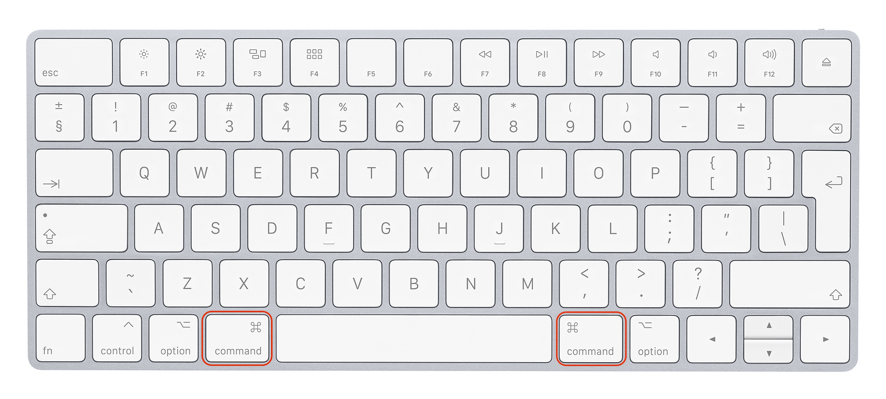

# `iOS` alapú szoftverfejlesztés - Labor `01`

## A labor témája

- [Bemutatkozás](#bemutatkozas)
- [`macOS` felhasználói alapismeretek](#macOS)
    - [Billentyűzet](#billentyuzet)
    - [Egér](#eger)
    - [Unix gyökerek](#unix-gyokerek)
    - [Fájlkezelés](#fajlkezeles)
- [*Xcode*, `iOS` fejlesztőkörnyezet bemutatása, *HelloWorld*](#xcode)
    - [Projektek](#projektek)
    - [Toolbar](#toolbar)
    - [Navigator](#navigator)
    - [Projekt felépítése](#projekt-felepitese)
    - [Projekt fordítása, futtatása](#projekt-forditasa-futtatasa)
    - [Írás a konzolra](#iras-a-konzolra)
    - [Írás a képernyőre](#iras-a-kepernyore)
    - [Szöveg testreszabás](#szoveg-testreszabas)
    - [Projektbeállítások áttekintése](#projektekbeallitasok-attekintese)
    - [Kezdőképek (*Launch images)*](#kezdokepek)
    - [Hasznos Xcode billentyűkombinációk](#hasznos-xcode-bill)
- [Git alapismeretek](#git_tutorial)
    - [Git felépítése](#git_parts)
    - [Git alapműveletei](#git_commands)
    - [Gyakorlás](#git_playground)
    - [További segédletek](#git_readings)
- [Labor feltöltése GitHub-ra](#git_upload)
- [Önálló feladatok](#extra-feladatok)
    - [`iPad` támogatás](#ipad)


## Bemutatkozás <a id="bemutatkozas"></a>
* A laborok `60%`-án kötelező a részvétel. (Idén ez `8` labort jelent.) A laborvezetők minden óra elején körbeadnak egy jelenléti ívet. Ezen felül minden labor végén fel kell tölteni a `GitHub`-ra az elkészült laborfeladatot, aki ezt nem teszi meg, annak érvénytelen a laborja. A laborfeladatok végén találhatóak szorgalmi feladatok, amik elvégzésével plusz pontot szerezhetünk, ami beleszámít az év végi jegybe (+1 pont laboronként).
* Rendszeresen látogassátok a [tárgy honlapját](https://www.aut.bme.hu/Course/ios), ide kerül fel minden információ. (Van RSS feed is.)
* A tárgyból a legkönnyebben házi feladat beadásával lehet megszerezni a félév végi jegyet. A beadott házikat a laborvezetők fogják értékelni. A házi feladat beadás rendjéről a tárgy honlapján fogunk a későbbiekben információkat közzétenni.
* A laborokkal kapcsolatban mindenkitől örömmel fogadunk hibajelentéseket vagy bármilyen egyéb, _építő jellegű_ kritikát.

## `macOS` felhasználói alapismeretek <a id="macOS"></a>

### Billentyűzet <a id="billentyuzet"></a>
Mac-ekhez külön Apple billentyűzetek léteznek, melyeken némiképp különbözőek a funkcióbillentyűk, és található rajtuk néhány extra gomb. Ezeken túl azonban a billentyűkiosztás megegyezik a standard PC-s billentyűzetekkel. A laborokban PC-s billentyűzetek vannak rákötve a Mac-ekre, melyeken elérhető minden szükséges gomb, azonban van néhány eltérés a Windowsos használathoz képest.

A legfontosabb különbség, hogy Mac-en `Command` (`⌘`) gomb van Windows gomb helyett. Ez a PC-s billentyűzeten alapesetben pont a Windows gombra képződik le. A `Control` (`⌃`), `Alt` és `Alt Gr` (Right Alt), Mac-en is ugyanúgy használatos. Mac-en az `Alt`-ot `Option`-nek (`⌥`) hívjuk.

---

*Mac-en a billentyűparancsok jelentős része nem a `Control`, hanem a `Command` billentyűvel válthatók ki, tehát `⌃+C` helyett `⌘+C`-t használunk!*

---



| A legfontosabb általános billentyűkombinációk                 | |
| --- | --- |
| `⌘+C`         | Copy                                          |
| `⌘+V`         | Paste                                         |
| `⌘+X`         | Cut                                           |
| `⌘+Z`         | Undo                                          |
| `⌘+⇧+Z`       | Redo                                          |
| `⌘+F`         | Keresés szövegben                             |
| `⌘+G`         | Következő találat kereséskor                  |
| `⌘+W`         | Ablak bezárása                                |
| `⌘+Q`         | Kilépés az alkalmazásból                      |
| `⌘+Space`     | *Spotlight* (gyorskereső, alkalmazásindtás)   |
| `⌘+→`         | Ugrás a sor végére (`End` helyett)            |
| `⌘+←`         | Ugrás a sor elejére (`Home` helyett)          |
| `⌘+↹`         | Futó alkalmazások közötti váltás              |

---

*A legtöbb Mac-es alkalmazásnál az alkalmazás ablakainak vagy ablakának bezárása után is tovább fut a program. A teljes kilépéshez a `⌘+Q`-t használhatjuk.*

---

### Egér <a id="eger"></a>
Korábban a Mac-es egerek egygombosak voltak, a `⌃+klikkel` lehetett az alternatív funkciókat elérni (ma is használható: `⌃+balklikk`). Kétgombos egereknél a jobb gomb funkciója megegyezik a `⌃+balklikkel`.

### Unix gyökerek <a id="unix-gyokerek"></a>
A `macOS` (korábban `OS X`, `Mac OS`) egy Unix (BSD) alapú operációs rendszer. A Unix-os alapokat teljesen elfedi a GUI és az Apple saját alkalmazásai.

Minden felhasználónak (esetünkben a `labor` nevű user-nek) van egy home könyvtára (`/Users/labor`), itt fogjuk a labor során a projekteket és egyéb fájljainkat tárolni.

> A laborok végén kérjük töröljétek a létrehozott fájlokat! A `macOS` alapból a lomtárba töröl (alul a dokkon, jobb oldalt a kuka), ezt a jobb klikkel előhozható menüből lehet kiüríteni.

Az *Activity Monitor* alkalmazást elindítva láthatjuk a futó alkalmazások process-eit. Itt van lehetőség egy esetleg lefagyott alkalmazás kilövésére is. Alkalmazások bezárásához használhatjuk még a `⌘+⌥+Esc` billentyűkombinációra megnyíló ablakot is.

### Fájlkezelés <a id="fajlkezeles"></a>
Alap fájlkezelő: *Finder*, hasonlóan működik mint Windows intéző.

| Néhány hasznos *Finder* billentyűkombináció                                     | |
| --- | --- |
| `⌘+Le`        | Belépés egy könyvtárba                                            |
| `⌘+Fel`       | Kilépés egy könyvtárból                                           |
| `⌘+Backspace` | Fájl törlése                                                      |
| `Enter`       | Fájl átnevezése                                                   |
| `Space`       | *QuickLook*                                                       |
| `⌘+⇧+G`       | Navigálás egy könyvtárhoz (Go to Folder)                          |

Külső USB eszköz csatlakoztatás után a `/Volumes/` mappába mountolódik automatikusan. A *Finder*ben és bárhol a standard fájlkezelő dialógusoknál a bal szélső gyorsmenüből a `Devices` részben érhetők el, de a `Desktop`on is megjelenik hozzájuk egy-egy ikon. Az USB-s eszközöket a kihúzás előtt unmountolni kell. (*Finder*ben a bal szélső menüben, az USB eszköz előtti kis "eject" ikon, vagy pedig jobb klikk után "Unmount". További lehetőség még az asztalon az USB-s eszközt a `Trash`-be húzni.)

## *Xcode*, `iOS` fejlesztőkörnyezet bemutatása, *HelloWorld* <a id="xcode"></a>
*Xcode*, "all in one" `iOS`, `macOS`, `watchOS`, `tvOS` fejlesztőkörnyezet, tartalmazza a platform SDK-kat és minden egyéb eszközt ami ahhoz szükséges, hogy alkalmazásokat fejlesszünk. Saját gépre egyszerűen a `macOS` *App Store*-ból lehet ingyenesen letölteni, mint egy standard alkalmazást.

A továbbiakban megismerkedünk az *Xcode* legfontosabb funkcióival és bemutatásra kerül az `iOS`-es alkalmazások projektjeinek felépítése.

### Projektek <a id="projektek"></a>
Az alkalmazások, komponensek forráskódját és egyéb fájljaikat projektek fogják össze. Új projekt létrehozásakor (`⌘+⇧+N`) kiválaszthatjuk a projekt sémáját. A megadott template-ek csak az automatikusan legenerált kezdeti fájlokat határozzák meg, további megkötéseket nem jelentenek a projektre.

> Hozzunk létre egy új projektet (`⌘+⇧+N`) és válasszuk a `Single View App` template-et!


<!-- -->
> * A *Product Name* legyen **`Labor1`**.
> * A *Team* legyen **`None`**.
> * Az *Organization Name* tetszőlegesen választható, a példában **`BME AUT`** lesz.
> * Az *Organization Identifier* az alkalmazás egyedi azonosítójának része lesz, itt konvenció szerint "fordított DNS jelölést" szokás használni, vagyis pl. `hu.cégnév`. A példánkban **`hu.bme.aut`** lesz.
> * A *Language* **`Swift`** legyen.
> * A checkbox-ok ne legyenek kipipálva.


Az *Xcode* automatikusan létre tud hozni egy lokális `git` repository-t a projekthez. Ezt a funkciót most ne kapcsoljuk be.


---

*A `git` egy elosztott verziókezelő rendszer, aminek működéséről a labor végén részletesebben írunk.*

---

A laborgépeken célszerű a projekteket a `/Users/labor/Developer` mappában tárolni.

### Toolbar <a id="toolbar"></a>
A képernyő tetején található sáv.


### Navigator <a id="navigator"></a>
Bal szélső panel. Több tabból áll, a projekt fájljait az `1.` tabon, a `Project Navigator`ban láthatjuk (`⌘+1`).


Az itt látható mappákat *Group*oknak nevezik és *Xcode 9*-től **tükrözik**, hogy a fájlrendszerben hol is helyezkednek el a fájlok. (Régebben ennek megoldására csak *3rd party* eszközök álltak rendelkezésünkre.) Tetszőlegesen csoportosíthatjuk a fájlokat új *Group*okba, vagy átnevezhetjük a már meglévő *Group*okat, az *Xcode* le fogja követni ezeket a változtatásokat a fájlrendszerben.

---

*A `Project Navigator`ban lévő mappák (*Groupok*) segítségével logikailag csoportosíthatjuk a projekt fájljait.*

---

> Ellenőrizzük a `Project Navigator`ban és a fájlrendszerben lévő fájlokat és a könyvtárszerkezetet (*Finder* segítségével).

### Projekt felépítése <a id="projekt-felepitese"></a>

---

*Az `iOS`-re írt alkalmazások alapvetően az `MVC` (Model View Controller) architektúrára épülnek.*

---

Az `iOS` alkalmazások felépítésével részletesebben a következő hetekben fogunk foglalkozni. Most csak nagyon röviden végignézzük, hogy a generált fájlok közül melyik micsoda.

| Fájlnév | Leírás |
| --- | --- |
| `AppDelegate.swift`         | Az alkalmazáshoz tartozó `UIApplicationDelegate` protocol (interfész) implementációja, melyben lekezelhetjük az alkalmazás életciklus fontosabb eseményeit (pl. elindult a program). Egyszerűbb alkalmazásoknál ez lehet a fő/gyökér osztály, ahol az alkalmazáslogikát megírjuk. |
| `ViewController.swift`      | Az alkalmazás egy `View controller`e, mely tartalmazza az alkalmazás egy "képernyőjéhez" tartozó logikát/kódokat. |
| `Main.storyboard`           | Az alkalmazás felhasználói felületét, "nézeteit" és azok kapcsolatát leíró XML fájl. |
| `Assets.xcassets`            | A projektben használt képi erőforrásokat (képfájlokat) tartalmazó "asset katalógus". Valójában egy könyvtár. |
| `LaunchScreen.storyboard`   | Az alkalmazás indításakor, töltés közben megjelenő *Launch Screen* (~"Splash Screen", de csak addig látszódik, míg töltődik az alkalmazás). |
| `Info.plist`                | Metaadatokat tartalmaz az alkalmazásról az OS felé (pl. indítófájl, alkalmazás ikon neve, stb.) |

A `Products` *Group* egy speciális mappa, mely az alkalmazás fordításakor/tesztelésekor előállított binárisokat tartalmazza (ezeket már a fordító/linker állítja elő a projekthez definiált `Target`ekhez. Pl. a **Labor1.app** az elkészítendő alkalmazás `bundle`-re hivatkozik (lényegében ez tartalmaz mindent, ami az alkalmazás futtatásához kell).

> Ellenőrizhetjük, hogy a fájlrendszerben nincsen ott a **Labor1.app**

| Gyakori fájlkiterjesztések | |
| --- | --- |
| `.swift`                | `Swift` forráskód |
| `.h`                    | Objective-C forráskód (header fájl) |
| `.m`                    | Objective-C forráskód (implementáció) |
| `.storyboard, .xib`     | Felhasználói felületet leíró (XML) fájlok, *Xcode*-ban grafikusan szerkeszthetők |
| `.framework`            | Framework (~DLL + headerök + bármilyen egyéb erőforrások) |
| `.plist`                | Property list: hierarchikus adatstruktúra (listák, dictionary-k és alaptípusok tetszőleges elrendezésben), a lemezre mentve, *Xcode*-ban grafikusan szerkeszthető (valójában egy XML, bár van bináris változata is) |

### Projekt fordítása, futtatása <a id="projekt-forditasa-futtatasa"></a>
> Fordítsuk le és futtassuk az alkalmazást (`⌘+R`) és gyönyörködjünk a megjelenő fehér ablakban! Ismerkedjünk meg az *iOS Simulator* alapfunkcióival!

<!-- -->
> Próbáljuk ki az *iOS Simulator* alapfunkcióit (`Multitasking Bar` behozása (`2x` `⌘+⇧+H`, iPhone X szimulátorban kijelző aljától felfele swipe), futó alkalmazás leállítása, alkalmazás törlése, minden alkalmazás törlése *Reset Content and Settings* paranccsal)!

A fordítási folyamat eredménye egy **Labor1.app** nevű bundle. A bundle nem más mint egy könyvtár, fix belső szerkezettel. Ezen belül található az alkalmazás futtatható indítófájlja és az egyéb erőforrások (képek, adatfájlok, stb.). Szimulátorra való fordítás esetén a **Labor1.app** megtalálható a Mac fájlrendszerében.

---

*Sajnos Xcode 6-tól elég nehéz megtalálni a szimulátor és azon belül az alkalmazások könyvtárát. A `~/Library/Developer/CoreSimulator/Devices/UID/data/Container/Data/Application/` körül lehet keresgélni, de a `UID` egy hosszú, kvázi-véletlen azonosító, ami ráadásul fordítások között is változhat...*
*Több 3rd party megoldás született már a mappa könnyebb megtalálásához, pl. [SimPholders](http://simpholders.com)*

---

### Írás a konzolra <a id="iras-a-konzolra"></a>
A konzolra való log üzenetek megjelenítéséhez a `print(_:separator:terminator:)` függvényt használhatjuk. A konzol ablak alapból rejtve van, kapcsoljuk be a *Toolbar*on.


A képernyő jobb alsó sarkában megjelenő sávban is gondoskodjunk arról, hogy a *Console* nézet be legyen kapcsolva.


> Írjuk ki a konzolra az ominózus "Hello World" szöveget (szúrjuk be a kódot az `AppDelegate.swift` fájlba az `application(_:didFinishLaunchingWithOptions:)` metódus végére, a `return true` elé)!

```swift
print("Hello World!")
```

A `Swift` szintaktikailag közel áll a `C`-hez és `Java`-hoz, azonban azoknál jóval tömörebb. A zárójelek a legtöbb esetben elhagyhatók, hasonlóan a mondatvégi pontosvesszőkhöz. Egy `for` ciklus pl. így néz ki.

```swift
for i in 1...5 {
  print("Hello \(i)!")
}
```

### Írás a képernyőre <a id="iras-a-kepernyore"></a>
Alapvetően kétféleképpen lehet a UI-t elkészíteni az iOS fejlesztés során: kódból vagy *Storyboardon* vizuális szerkesztő segítségével.
Váltsunk át a `Main.storyboard` fájlra és vizsgáljuk meg azt. Itt az alkalmazás jeleneteit (*scene*-eit, *View Controller*eit) láthatjuk. Kezdéskor egyetlen jelenet található a `storyboard`ban, amely teljesen üres. A későbbiekben részletesen fogunk foglalkozni a felhasználói felület felépítésével, most azonban elégedjünk meg annyival, hogy itt tudjuk definiálni, hogy milyen nézetekből épüljön fel a felhasználói felülete és ezekhez milyen beállítások tartozzanak.


> Nyissuk meg és módosítsuk a `ViewController.swift` fájlban a `viewDidLoad` metódust, hogy az létrehozzon egy új `UILabel`t és kiírja a **Hello World**öt a képernyőre.

```swift
override func viewDidLoad() {
    super.viewDidLoad()
    // Do any additional setup after loading the view, typically from a nib.
}
```

```swift
override func viewDidLoad() {
    super.viewDidLoad()

    let helloWorldLabel = UILabel(frame: CGRect(x: 10, y: 20, width: 300, height: 100))
    helloWorldLabel.text = "Hello World"
    view.addSubview(helloWorldLabel)
}
```

Röviden beszéljük meg a következő fogalmakat (fontos, ezekről mind lesz szó még későbbi laborokon, most csak ismerkedünk velük).

* A `viewDidLoad` metódus akkor hívódik meg, mikor a rendszer betölti a memóriába jelenethez (*View Controller*hez) tartozó nézetet. Jelen esetben felfoghatjuk úgy, hogy akkor hívódik meg, mielőtt megjelenne a jelenetünk.
* A `helloWorldLabel` egy (lokális) konstans, (a `let` kulcsszó vezeti be a konstansokat), melynek értékül adunk egy új `UILabel` példányt.
* `UILabel`nek a példányosításakor át kell adnunk egy `CGRect`et, mely megmondja hol és mekkorában helyezkedik el a képernyőn.
* A `view` valójában `self.view`-ra hivatkozik és az aktuális *View Controller* gyökérnézetét jelöli, de `Swift`ben lehetőség van a `self` (~`this` pointer) elhagyására.

> Nézzük meg a `UILabel` osztály rövid leírását (`⌥+klikk` a kódban `UILabel`re), majd a [teljes leírást](https://developer.apple.com/library/ios/documentation/UIKit/Reference/UILabel_Class/) az Apple Developer Library-ban!

### Szöveg testreszabás <a id="szoveg-testreszabas"></a>
A következő kódrészlettel kicsit csinosíthatunk a megjelenítésen.

```swift
helloWorldLabel.textAlignment = .center
helloWorldLabel.textColor = .blue
helloWorldLabel.backgroundColor = UIColor(red: 0.9, green: 0.9, blue: 1.0, alpha: 1.0)
helloWorldLabel.font = .preferredFont(forTextStyle: .title1)
```

### Projektbeállítások áttekintése <a id="projektekbeallitasok-attekintese"></a>
A projekt szintű beállításokat a `Project Navigator`ban, a projekt nevére/fejlécére klikkelve hozhatjuk elő.


A jobb oldalt megjelenő listában láthatjuk, hogy a **Labor1** `Project` és az ahhoz tartozó **Labor1** `Target`tel dolgozunk. Több beállítást redundáns módon mind a *Project* mind a *Target* szinten megadhatunk. A *Target* alapból örökli az összes *Project* szintű beállítást, de ha bármit átállítunk *Target* szinten, akkor az fog érvénybe lépni, és felüldefiniálja a *Project* szintű beállításokat.

---

*Egy projekthez több* Target *is tartozhat. A különféle* Target*ekhez különböző fordítási és projektbeállításokat rendelhetünk, így például készíthetünk egy külön* Target*et az alkalmazás ingyenes (Free) változatához és a fizetőshöz (Paid).*

---

A bonyolultabb beállításokat későbbi laborokon részletezzük.

### Kezdőképek (*Launch images*) <a id="kezdokepek"></a>
Miközben betöltődik egy `iOS` alkalmazás, egy ún. *Launch Screen* látható. Ezt kétféleképpen lehet megadni.

* Statikus képként az `Assets` katalógusban (hasonlóan az alkalmazás ikonhoz)
* Egy felületleíró `storyboard` fájllal, ami tetszőleges felhasználó felület elemeket tartalmazhat. Ez leginkább dinamikus/interaktív indítóképernyő megadására szolgál, ami egy újabb és ajánlottabb megoldás.

Fontos, hogy a *Launch Screen* csak addig látszódik, amíg betölt az alkalmazás, ez nem egy "Splash Screen"! Az [Apple Design Guidelines](https://developer.apple.com/design/human-interface-guidelines/) tiltja, hogy a töltési folyamatnál hosszabb ideig mutassuk a indítóképernyőt!

Az *Xcode* által generált projekt sémában alapból a `LaunchScreen.storyboard` van beállítva indítóképernyőnek. 

> Nyissuk meg és módosítsuk háttérszínét, pl. zöldre.

### Hasznos *Xcode* billentyűkombinációk <a id="hasznos-xcode-bill"></a>

| Hasznos *Xcode* billentyűkombinációk | |
| --- | --- |
| `⌃+Space`/`Esc`    | Kód kiegészítés ("intellisense", autocomplete). |
| `⌃+⌘+Fel`          | Vátlás header/implementáció között. |
| `⌃+⌘+Bal/Jobb`     | Váltás vissza/előre a legutóbb szerkesztett fájlok között. |
| `⌘+⇧+O`            | Gyorskeresés/uggrás fájlnévre vagy szimbólumra. |
| `⌘+⇧+F`            | Keresés sztringre a teljes projektban. |
| `⌃+⌘+klikk`        | A megklikkelt osztály/azonosító definíciójára/deklarációjára való ugrás. |
| `⌥+klikk`          | A megklikkelt osztály rövidített dokumentációjának megjelenítése. |
| `⌘+B`              | Fordítás. |
| `⌘+R`              | Fordítás majd futtatás (debug). |
| `⌘+.`              | Debug session leállítása. |
| `⌃+I`              | Aktuális sor vagy a kijelölt kódrészlet újratördelése (`Re-indent`). |
| `⌘+T`              | Új Tab. |
| `⌘+⇧+J`          | Aktuális fájl megjelenítése az oldalsó navigációs menüben. |
| `⌘+W`              | Tab bezárása. Ha csak egy tab aktív, akkor az egész projektet bezárja! |
| `⌃+6`              | Jumb bar megnyitása: az aktuális forrásfájl metódusainak gyors áttekintéséhez vagy eléréséhez. |
| `⌘+/`              | Komment ki-/bekapcoslása az aktuális soron vagy kijelölt kódon .|

> Kicsit gyakoroljuk a kódban különféle billentyűkombinációkat (`⌃+⌘+↑`, `^+⌘+←/→`, `⌘+B`, stb.)

## Git alapismeretek <a id="git_tutorial"></a>
A `git` egy elosztott verziókezelő rendszer, amely kiválóan alkalmas projektek forráskódjának verzióinak menedzselésére és a csapatmunka támogatására. Segítségével könnyebben megoszthatjuk egymás között a projekthez kapcsolódó fájlokat és nyomonkövethetjük annak változásait, történetét. Ezenkívül alkalmas még a forráskód felügyeletére és további eszközök (pl.: *Continuous Integration*) alkalmazására is.

### Git felépítése <a id="git_parts"></a>


Az elosztott verziókezelő rendszerben minden fejlesztőnek van egy saját lokális *repository*-ja, ami a teljes előzményt is tartalmazza. Ezen kívül van egy "központinak kinevezett" repository ami segítségével szinkronba tudjuk tartani a felhasználók között az adatokat.

--- 


A `lokális repository`-nk három részből áll:
 
 #### Working directory
 Itt helyezkednek el a jelenlegi, könyvtárakban lévő fájlaink.
 
 #### Staging area
 Ide kerülnek azok a fájlok, amiket a következő commitunkba beleteszünk. 
 
 #### Local repo
 Lokálisan "mentődnek" a fájlok, egy snapshotba belekerül az összes változás és az azokat leíró metaadatok. Ezeket már nem módosíthatjuk, mentett verzióját biztosítják a projektünknek.
 
 `Remote repository` -ba pedig azok az adatok kerülnek, melyeket a lokális repository-nkból felküldtünk (push-oltunk). A többi fejlesztő is látja az egységes *Remote Repository*-t, így biztosítva van, hogy mindenkinek elérhető legyen az összes módosítás.
 
 ### Git alapműveletei <a id="git_commands"></a>
 A következő parancsokat használhatjuk a `git` működtetéséhez `iTerm` vagy `Terminal` alkalmazás segítségével. Elérhető több alkalmazás is amellyel parancsírás helyett vizuálisan navigálhatunk, pl.: `SourceTree`. A laborok során a parancssoros kezelést fogjuk használni, mivel csak az egyszerűbb `git` műveletekre lesz szükségünk.
 
  #### Konfiguráció
```
git config --global user.name <name>
git config --global user.email <email_address>
```
> A fenti parancsokkal beállíthatjuk számítógépünkhoz `git` felhasználónkat.

```
git init
```
> Létrehoz egy új *repository*-t.


#### Státusz
```
git status
```
> Ellenőrizhetjük a `git` jelenlegi állapotát: láthatjuk, hogy mely fájlok módosultak, melyek vannak *staging area*-n, stb.


#### Fájlok hozzáadása a staging area-hoz
```
git add .
```
> Minden módosított fájlt hozzáad a *commit*hoz. A pont helyett többféle módon is befejezhető a parancs. Erről hivatalos dokumentációkban könnyen lehet információt találni.


#### Commit
```
git commit -m "comment_of_changes"
```
> A *staging area*-ban lévő változások bekerülnek a lokális repo-ba. Fontos, hogy figyeljünk a helyes komment írására, mivel zavaró lehet a csoportos munka esetén az eltéró kommentelési konvenció. Javasolt például a következő, ahol így fogalmazunk, mintha leírnánk mit tesz a változtatás: *Implements changes of TestViewController*


#### Push
```
git push
```
>  Lokális változásaink felkerülnek a *remote repository*ba. Ezután mindenki hozzáférne a módosításokhoz.


#### Fetch
```
git fetch
```
>  A remote-ban történt változásokat letölthetjük lokális reponkba.


#### Pull
```
git pull
```
> A lokális munkakönyvtárba betölti az összes távoli módosítást. Ezután egy `merge commit` jön létre, amely tartalmazza az összes új módosítást.


#### Változások ellenőrzése
```
git status
git diff <file>
```
> Fontos, hogy  `pull` után mindig ellenőrizzük a státuszt, mert `conflict` keletkezhet a fájlok között ha olyat módosítottál lokálisan, amit más is módosított. Az összeütközött fájlokat a `git status` pirossal jelzi és az eltérést `git diff`-fel ellenőrizhetjük. A konfliktust fel kell oldani azzal, hogy kitöröljük a fájlből a nem oda illő részeket. A hibák feloldása után a lehúzott részeket commitolnunk kell (`merge commit`). 


#### Clone
```
git clone
```
> Egy teljes, távoli *repo*-t tölthetünk le. Ezzel tudjuk a `GitHub`-on lévő repository-jainkat lokális repo-ként hozzáadni a könyvtárainkhoz. 


### Gyakorlás <a id="git_playground"></a>
A következő oldalakon gyakoroljuk be a fent leírt parancsok használatát.

#### init, status, add, commit
> [https://www.katacoda.com/courses/git/1](https://www.katacoda.com/courses/git/1)

#### add, clone, push, fetch, merge, show, log
> [https://www.katacoda.com/courses/git/3](https://www.katacoda.com/courses/git/3)

#### merge, checkout, merge conflict
> [https://www.katacoda.com/courses/git/5](https://www.katacoda.com/courses/git/5)


### További segédletek <a id="git_readings"></a>
Fontos, hogy minél alaposabban ismerjük a `git `működését, mivel ez elengedhetetlen minden munkahelyi környezetben.
Az alábbi linkeken további segédletek találhatóak:

* [https://tutorialzine.com/2016/06/learn-git-in-30-minutes](https://tutorialzine.com/2016/06/learn-git-in-30-minutes)
* [https://www.atlassian.com/git/](https://www.atlassian.com/git/)
* [https://www.katacoda.com/courses/git](https://www.katacoda.com/courses/git)
* [https://learngitbranching.js.org](https://learngitbranching.js.org)
* [https://nvie.com/posts/a-successful-git-branching-model](https://nvie.com/posts/a-successful-git-branching-model/)


## Labor feltöltése GitHub-ra <a id="git_upload"></a>
A labor elvégzése csak akkor lehet sikeres, ha a kész feladatot feltöltöttük `GitHub`-ra. Az alábbi leírás ebben fog segíteni.

### Előkészítés
Navigáljunk el a *Developer* könyvtárba. (Ha nem létezne, akkor hozzunk létre egy ilyen nevű mappát.) Nyissuk meg az `iTerm` alkalmazást és navigáljunk el *(cd)* az előbb létrehozott mappánkba. *(A mappa drag-and-drop-olása az alkalmazásba automatikusan beírja a könyvtár elérésiútvonalát.)*

### Repository klónozása
Nyissuk meg a `GitHub`-ot a `Safari`-val majd tegyük vágólapra a repository URL-jét. A megfelelő könyvtárban álló `iTerm`-be írjuk be az alábbi parancsot írásjelek nélkül az előbb vágólapra helyezett URL-el:
```
git clone "repository_url"
```
> Ezután láthatjuk, hogy a mappánkban megjelentek a *repository*-ban lévő tartalmak. 

### Fájlok hozzáadása
Nyissuk meg a *repository*-t tartalmazó mappát a `Finder`-ben és a hozzunk létre benne egy `Labor1` mappát a megfelelő helyen. Az órán elkészített feladat mappáját másoljuk be ide.

### Labor feltöltése
Ha minden fájlt bemásoltunk a megfelelő helyre, akkor nyissuk meg újra az `iTerm`-et az előbbi helyen, majd írjuk be az alábbi parancsokat:
```
git add .
```
> Ezzel tudjuk *stage*-elni a fájlainkat, azaz beállíthatjuk a fájlok elérési útvonalát a következő commitnak.

```
git commit -m "Labor1"
```
> Így tudjuk a változtatásokat a *lokális git repository*-nkba feltölteni.

```
git push
```
> A parancs lefutása után felkerülnek a *remote repository*-ba is a lokális változtatások. Ellenőrizzük le, hogy a `GitHub`-on látjuk-e a repository-nkban a `Labor1` mappát és benne a fájlokat.

Fontos az előbbi lépések és a `git` kezelésnek alapos ismerete, mert mind a laborok, mind a házifeladat leadása ezen keresztül történik. Nem megfelelő tudás esetén kötelezően ajánlott a fentebb leírt [Git alapismeretek](#git_tutorial) és [ajánlott linkek](#git_readings) tanulmányozása, vagy segítség kérése a laborvezetőktől.  

## Önálló feladatok (idő függvényében) <a id="extra-feladatok"></a>
### `iPad` támogatás <a id="ipad"></a>
A labor elején létrehozott projekt alapértelmezetten `Universal` alkalmazásként jött létre. 

> Indítsuk el az alkalmazást egy `iPad` szimulátorral és nézzük meg hogy néz ki.

> Állítsuk át a *Devices* beállítást `iPhone`-ra és így is indítsuk el az alkalmazást `iPad` szimulátorral! Mit tapasztalunk? 


## A laborsegédletet összeállította

* Varga Domonkos - varga.domonkos@autsoft.hu
* Dávid Márk-Tamás - david.tamas@autsoft.hu
* Krassay Péter - peter.krassay@autsoft.hu
* Kántor Tibor - tibor.kantor@autsoft.hu
* Kelényi Imre - imre.kelenyi@aut.bme.hu
