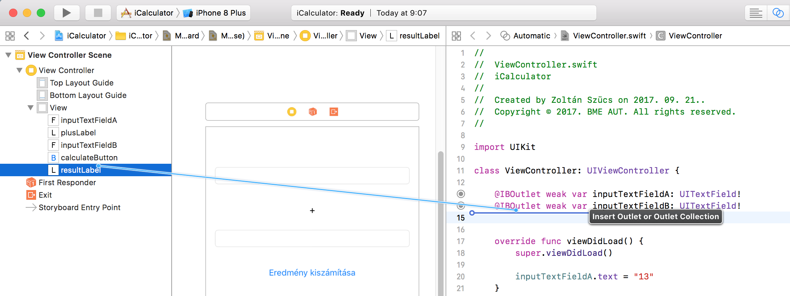
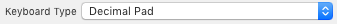
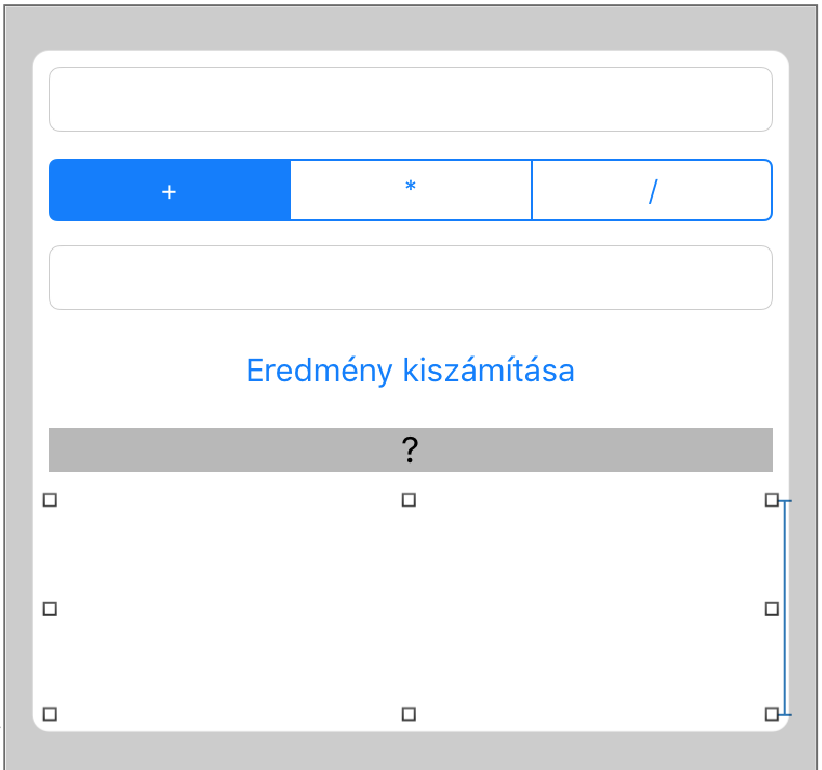

# `iOS` alapú szoftverfejlesztés - Labor `03`

## A laborsegédletet összeállította
* Kelényi Imre - imre.kelenyi@aut.bme.hu
* Kántor Tibor - tibor.kantor@autsoft.hu
* Krassay Péter - peter.krassay@autsoft.hu

## A labor témája
* [iCalculator](#icalculator)
* [Stack View](#stack-view)
    * [Alap nézetek használata](#alap-nezetek-hasznalata)
    * [`Outlet`ek és akció metódusok](#outletek-es-akcio-metodusok)
* [Önálló feladatok](#onallo)
    * [Több számológép művelet támogatása](#tobb-szamologep-muvelet)
    * [Korábbi számítások (*`History` nézet*)](#korabbi-szamitasok)
    * [Extra: alkalmazás ikon](#extra)

A labor során egy egyszerű számológép alkalmazást készítünk el, melyen keresztül megismerkedünk az `iOS`-es felhasználói felület készítésének alapjaival.

# iCalculator <a id="icalculator"></a>
> Hozzunk lére egy új `Single View` applicationt, `iCalculator` névvel `iPhone`-ra!

---

*Egy `storyboard` összefoglalja az alkalmazás felhasználói felületének több "jelenetét". Minden jelenethez tartozik egy nézet hierarchia és egy `View Controller` (`UIViewController`), ami az adott nézet hierarchiát menedzseli (fogadja a nézetek eseményeit és konfigurálja a nézeteket).*

*Lényegében a `View Controller`hez tartozó egyedi osztály forráskódjában tudjuk "hozzátenni a logikát" az `Interface Builder`ben megtervezett nézet hierarchiához.*

*Egy alkalmazásban több `storyboard` is lehet, a projekt beállítások között lehet megadni melyik legyen az, melyet megjelenít a program indításkor.*

---


> Első lépésként válasszuk ki a `Main.storyboard`ot, majd a `File Inspector`ban kapcsoljuk ki a `Use Trait Variations` beállítást!


---

*Egy `Trait` leír egy környezeti tulajdonságot, mint például, hogy támogatott-e a `force touch` vagy sem. A `Trait Collection` egy `Dictionary`, ami az alkalmazás aktuális környezeti tulajdonságait `Trait`ek és a hozzájuk tartozó értékek formájában tárolja.*

*A `Layout Traits`ben találhatjuk meg többek között a `Size Classes` `Trait`et, ami lehetővé teszi, hogy különféle képernyőméretekre (készülék kategóriákra) és tájolásokra (álló/fekvő) egyetlen nagy közös UI tervet készítsünk (egy `storyboard`ot).*

*Ez a `Trait Variations` felel meg *Xcode 8*-ban az `Adaptive Layout`nak, amivel később fogunk megismerkedni. Ha kikapcsoljuk, akkor a `storyboard` azt feltételezi, hogy a felületet csak egyetlen "eszköz típusra" definiáljuk (pl. `iPhone`-ra).*

---


<a id="alap-nezetek-hasznalata"></a>
> Hozzunk létre `Main.storyboard`ban, a `ViewController`en belül lévő `View`-ban **2 db** `UITextField`et, **2 db** `UILabel`t és **1 db** `UIButton`t.


---


*A nézetek elrendezéséhez most még abszolút koordinátákat használunk, ami miatt elforgatott, vagy eltérő méretű kijelzőn a felület "rosszul" fog megjelenni (nem középen lesz amit középre rakunk).  Ezt a problémát oldja meg az `Auto Layout`, melyről később fogunk tanulni.*

---

Lehetőség van rá, hogy értelmes neveket adjunk az egyes felületelemeknek. Az átnevezéshez válasszunk ki egy elemet a bal szélső listából, majd az `Enter` megnyomása után átnevezhetjük. 


> Rendezzük középre a két `UILabel` *`Alignment`* property-jét!


<!--  -->
> Teszteljük a felületet a szimulátorral!

<!-- -->
> Hozzunk létre egy `IBOutlet`et `ViewController`ben az egyik `Text Field`hez! 

```swift
@IBOutlet weak var inputTextFieldA: UITextField!
```

---

<a id="outletek-es-akcio-metodusok"></a>
**Mi az `outlet`?**
*Property, amin keresztül hivatkozhatunk egy, a grafikus szerkesztőben létrehozott, felületi elemre.*

**Miért van itt `weak` property?**
*Mert az `outlet`ekhez tartozó nézeteket a szülő nézeteik vagy a gyökérnézet esetén a `View Controller` birtokolja. Ha egy nézet kidobja a gyerekeit, akkor azt várjuk, hogy azok törlődjenek, és ha `strong` referencia lenne rájuk az `outlet`ek miatt, akkor ez nem történne meg.*

---

> Kössük be a `Text Field`et az `outlet`re, a `storyboard`ból a `Connections Inspector`t használva!


> Módosítsuk kódból, a `viewDidLoad` metódusból a `Text Field` értékét!

```swift
override func viewDidLoad() {
  super.viewDidLoad()
  
  inputTextFieldA.text = "13"
}
```

<!-- Mutogassuk meg, hogy milyen szépen mutatja a kódban és a UI editorban, hogy melyik outlethez melyik UI elem tartozik. Mind a sorok elején lévő kis jellel, mint a Connection inspectorban. -->
> Váltsunk `Assistant Editor` nézetbe (`Cmd+Alt+Enter`), majd hozzunk létre `outletek`et az egyes nézetekhez `Jobbklikk-Drag&Drop`-al (kivéve a `+` jeles `UILabel`hez)!


```swift
@IBOutlet weak var inputTextFieldA: UITextField!
@IBOutlet weak var inputTextFieldB: UITextField!
@IBOutlet weak var resultLabel: UILabel!
```

<!-- Meséljünk a generált eseményekről és az elkapásukra szolgáló akció metódusokról. -->
> Adjunk hozzá egy akciót is a gomb (`calculateButton`) `Touch Up Inside` akciójához (`calculateButtonTouchUpInside`) és valósítsuk meg a gomb lenyomásakor meghívódó metódust!

```swift
@IBAction func calculateButtonTouchUpInside(_ sender: AnyObject) {
  let numberFormatter = NumberFormatter()

  if
    let textA = inputTextFieldA.text,
    let textB = inputTextFieldB.text,
    let a = numberFormatter.number(from: textA)?.doubleValue,
    let b = numberFormatter.number(from: textB)?.doubleValue {

    resultLabel.text = "\(a + b)"
  }
}
```

---

*A többsoros `if` valójában négy `optional binding` egymás után végrehajtva. `textA`, `textB`, `a` és `b` is mind új változók, melyek csak az `if`-hez tartozó blokkon belül láthatók. Az ilyen, vesszővel elválasztott, több tagú `if`-eknél az egyes feltételek sorban értékelődnek ki és ha valamelyik feltétel nem sikerül, a többit már nem ellenőrzi a fordító ("`short-circuit` kiértékelés”).*

---

> Próbáljuk ki a félkész számológépet!

<!-- -->
> Állítsuk át a `storyboard`ban, a `Text Field`ek `Keyboard` attribútumát `Decimal Pad`ra. Ezzel elérjük, hogy egy csak számokat tartalmazó billentyűzet jelenjen meg!


<!--  -->
> Ezek után adjuk az `onCalculateButtonTouchUpInside` akció metódusunkhoz a következő két utasítás, melyek hatására el fog tűnni a billentyűzet a képernyőről (amennyiben éppen aktív/látható)!

```swift
inputTextFieldA.resignFirstResponder()
inputTextFieldB.resignFirstResponder()
```

---

*A `first responder` az az objektum (esetünkben nézet), mely éppen "fókuszban van" és először fogadja a felhasználótól érkező billentyű eseményeket. Ha egy `Text Field` nézet lesz a `first responder`, akkor automatikusan megjelenik a billentyűzet. Ha "lemondunk" a `first responder` státuszról a `resignFirstResponder()` metódus meghívásával, akkor eltűnik a billentyűzet is.
Ha nem tudjuk pontosan hogy épp ki a `first responder`, akkor elegánsabb megoldás a `view.endEditing(true)` hívás, mely végiglépked a nézet gyereknézetein és mindegyiknél lemond a `first reponder` státuszról.*

---

> Írjuk át a kódot, hogy egyszerre mondjuk le az összes `Text Field` `first reponder` státuszáról!

```swift
view.endEditing(true)
```

A probléma most már csak az, hogy a feljövő virtuális billentyűzetet csak úgy tudjuk eltüntetni, ha megnyomjuk az számológép gombját. Az elegáns megoldás `Number Pad` billentyűzet eltüntetésére, hogy a gyökér nézet hátterét bárhol megérintve eltűnjön a billentyűzet.

Ahhoz, hogy a gyökér nézet megérintését le tudjuk kezelni, le kell cserélnünk az osztályát `UIView`-ról, `UIControl`ra (hiszen csak `UIControl` és belőle származó osztályok tudnak eseményeket generálni). 
> A `storyboard` szerkesztőben kiválasztva a gyökér nézetet, a `Identity Inspector`ban választhatjuk ki hozzá a konkrét osztályt, itt váltsunk `UIControl`ra!


<!--  -->
> Ezek után a `Connections inspector`ban a `Touch Up Inside` eseményhez rendeljünk hozzá egy `onBackgroundTouchUpInside` nevű metódust!

```swift
@IBAction func onBackgroundTouchUpInside(_ sender: AnyObject) {
  view.endEditing(true)
}
```

---

*He szeretnénk, hogy eltűnjön a már beírt szöveg a `Text Field` kiválasztásakor, akkor kapcsoljuk be a `Clear when editing begins` opciót az `Attributes Inspector`ban. Itt adhatjuk meg azt is, hogy a törlés (`Clear`) gomb mikor jelenjen meg.*


---

## Stack View <a id="stack-view"></a>

Ha most kipróbáljuk az alkalmazást egy, a grafikus tervezőfelülettel nem megegyező méretű szimulátoron, azt fogjuk tapasztalni, hogy a nézetek nem középre rendezve jelennek meg. Ennek oka, hogy jelenleg abszolút koordinátákkal adtuk meg a nézetek méretét és elhelyezkedését, ami nem változik ha eltérő méretű kijelzőt használunk.

A legegyszerűbb megoldás az elemek dinamikus elrendezéséhez az `iOS 9`-ben debütáló `Stack View`. 

> Válasszuk ki az összes nézetet, majd nyomjuk meg a `Stack` gombot a szerkesztő nézet jobb alsó sarkában!


Először valami hasonló, nem túl jól kinéző felületet fogunk látni.


> Ahhoz, hogy a nézetek egyenletesen helyezkedjenek el, válasszuk ki a `Stack View`-t és állítsuk be a *`Distribution`* paraméterét **`Equal Spacing`**re az `Attributes Inspector`ban!


> Továbbra is a `Stack View` beállításai között állítsuk az *`Alignment`* paramétert **`Fill`**re! Ezzel azt érjük el, hogy a `Stack View`-ban lévő nézetek kitőltik a rendelkezésre álló szélességet.


Utolsó lépésként még be kell állítanunk, hogy maga a `Stack View` dinamikusan legyen elrendezve a képernyőn. Ehhez az `Auto Layout`ot fogjuk használni, amiről a következő laboron még bőven lesz szó.
> Most egyelőre csak válasszuk ki a `Stack View`-t és a `Pin` opciót, majd csatoljuk hozzá a szülő nézetéhez és magasságát állítsuk fixen `300`-ra!


Vegyük észre, hogy a `Document Outline`-ban a "jelenetünk" neve mellett továbbra is ott van egy piros nyíl. Ez `Auto Layout` hibát jelent. Később erről részletesen beszélünk.


A hibát most egész egyszerűen oldjuk meg úgy, hogy a `Stack View` `height` constraintjét `Equal` helyett állítsuk `Greater Than or Equal`ra.
 

---

*Valójában azért van itt hiba, mert a `Stack View` nem tudja eldönteni, hogy a benne lévő nézetek közül melyik magasságát növelheti, illetve csökkentheti a másik rovására. Ezt később a `Content Hugging` illetve a `Content Compression Resistance` prioritások állításával fogjuk tudni szabályozni.*

---

# Önálló feladatok <a id="onallo"></a>

## Több számológép művelet támogatása <a id="tobb-szamologep-muvelet"></a>
> Töröljük ki a `+` jelet megjelenítő `UILabel`t és a helyére húzzunk be egy `Segmented Control`t (`UISegmentedControl`)!


<!--  -->
> Módosítsuk a `Segmented Control`t, hogy **`3`** szegmensből álljon (`Attributes Inspector`ban a *`Segments`* attribútum), majd írjuk át ezek szövegét (dupla klikk a szerkesztőben) a szorzás, osztás és összeadás müveletknek megfelelő jelekre!


<!--  -->
> Az `Assistant Editor` nézetre váltva, kössük be a `Segmented Control` `Value Changed` eseményét egy új `operationSelectorValueChanged:` nevű akció metódusra a `ViewController` osztályban!

```swift
@IBAction func operationSelectorValueChanged(_ sender: AnyObject)
```

> Vegyünk fel egy új enumerációt a `ViewController` osztályon belül, mely az éppen kiválasztott számológép műveletet jelöli!

```swift
enum OperationType {
  case add
  case multiply
  case divide
}
```

> Továbbá vegyünk fel egy privát tagváltozót az osztály implementációs blokkjába!

```swift
var operationType = OperationType.add
```

Érdemes a `Segmented Control` kezdeti értékét is megadni (bár esetünkben ez pont helyesen `0`-ra van inicializálva, de nem árt rászokni, hogy mindig inicializáljunk). 
> Ehhez fel kell vennünk egy `Outlet`et a `Segmented Control`hoz (pl. `operationSelector`), majd a `View Controller` `viewDidLoad` metódusában az `Outlet` `selectedSegmentIndex` property-jét `0`-ra állítani.

```swift
operationSelector.selectedSegmentIndex = 0
```

> Majd implementáljuk az `onOperationSelectorValueChanged` metódust!

```swift
@IBAction func operationSelectorValueChanged(_ sender: AnyObject) {
  switch operationSelector.selectedSegmentIndex {
  case 0:
    operationType = .add
  case 1:
    operationType = .multiply
  case 2:
    operationType = .divide
  default:
    operationType = .add
  }
}
```

Ezek után már csak annyi dolgunk van, hogy a kiszámítást elindító gomb megnyomásakor meghívódó akció metódusban `operationType` tartalmának megfelelő műveletet végezzünk (itt is érdemes egy állapotgépet használni).

## Korábbi számítások (*`History` nézet*) <a id="korabbi-szamitasok"></a>

> Adjunk hozzá egy `Text View`-t a `Stack View` aljához, majd hozzunk létre hozzá egy `IBOutlet`et a `View Controller` interfészében (pl. `historyView` névvel)!


<!--  -->
> A már korábban látott módon állítsuk be a `Text View` minimum magasságát `100`-ra!

---

*A `Text View` legfőbb különbségei `UILabel`hez képest, hogy szerkeszthető és a kilogó szöveg görgethető.*

---

> Állítsuk a `Text View`-t csak olvasható üzemmódba (`historyView.isEditable = false`)!

<!--  -->
> Módosítsuk az eredményeket kiszámító kódot oly módon, hogy az aktuális számításról bekerüljön egy sor a `Text View`-ba, pl. `13.00 + 13.00 = 26.00`!


Tippek:

* Állítsunk össze egy `String`et az új bejegyzéshez
* Állítsuk be a `Text View` `text` property-jének értékét oly módon, hogy az új bejegyzéshez hozzáillesztjük a `Text View` `text` property-jének korábbi értékét (`textView.text = újSzöveg + textView.text`).
* Egy `enum` származhat `String`ből és így rendelhetünk hozzá szöveges értéket.

## Extra: alkalmazás ikon <a id="extra"></a>
> Töltsük le, majd állítsuk be [az ikont](res/Icon-120.png)!
