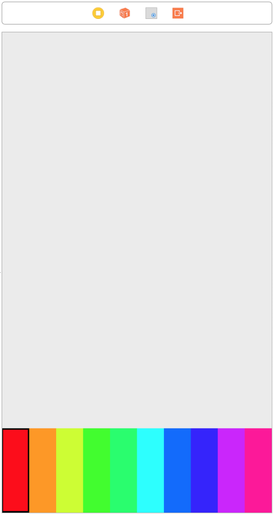

# `iOS` alapú szoftverfejlesztés - Labor `04`

## A laborsegédletet összeállította
* Kelényi Imre - imre.kelenyi@aut.bme.hu
* Kántor Tibor - tibor.kantor@autsoft.hu
* Krassay Péter - peter.krassay@autsoft.hu

## A labor témája
* [iPaint](#ipaint)
    * [Egyedi nézet osztály és rajzolás](#egyedi-nezet-osztaly-es-rajzolas)
    * [Egyedi nézet osztályok használata Interface Builderben](#egyedi-nezet-osztalyok-hasznalata-IB-ben)
    * [Interface Builder támogatás egyedi osztályokhoz](#IB-tamogatas-egyedi-osztalyhoz)
    * [Gesztusfelismerés és rajzolás](#gesztusfelismeres-es-rajzolas)
    * [Színválasztó nézet](#szinvalaszto-nezet)
    * [Legutóbb rajzolt kör átméretezése](#legutobb-rajzolt-kor-atmeretezese)
* [Önálló feladatok](#onallo-feladatok)
    * [Ecsetméret állítása](#ecsetmeret-allitasa)
    * [Swipe to delete](#swipe-to-delete)

A labor célja egyszerű "rajzprogram" megírása.

# iPaint <a id="ipaint"></a>

## Egyedi nézet osztály és rajzolás <a id="egyedi-nezet-osztaly-es-rajzolas"></a>
> Hozzunk lére egy új `Single View` applicationt, `iPaint` névvel `iPhone`-ra!

<!--  -->
> Hozzunk létre egy új, `UIView`-ból leszármazó osztályt `EllipseView` névvel (a fájl létrehozásakor hasznáhatjuk a `Cocoa Touch template`-et!

<!--  -->
> Definiáljuk felül a `draw:` metódust és rajzoljunk ki egy kék ellipszist, mely majdnem kitölti a nézet területét (`4` pontnyi "peremet" hagyva neki)!

```swift
override func draw(_ rect: CGRect) {
  let context = UIGraphicsGetCurrentContext()

  let ellipseRect = CGRect(x: 4, y: 4, width: bounds.width - 8, height: bounds.height - 8)
  context?.setFillColor(UIColor.blue.cgColor)
  context?.fillEllipse(in: ellipseRect)
}
```

---

*A rajzoláskor a `Core Graphics` framework műveleteit használjuk. A rajzolás mindig egy grafikus kontextus segítségével történik (`CGContext`). Mivel a `Core Graphics` `C` ben lett megírva, az `API` hívások függvényeken keresztül történnek (nem objektum orientáltan), ezt azonban a `Swift 3` elfedi előlünk, kényelmes interfészt biztosítva.*

---

> Próbáljuk ki az új ellipszis osztályunkat! A `ViewController` osztály `viewDidLoad` metódusában hozzunk létre egy új ellipszist és adjuk hozzá a gyökérnézetéhez!

```swift
override func viewDidLoad() {
  super.viewDidLoad()

  let ellipse = EllipseView()
  ellipse.frame = CGRect(x: 100, y: 100, width: 60, height: 60)
  ellipse.isOpaque = false
  view.addSubview(ellipse)
}
```

---

*Ha kódból hozunk étre nézeteket a következő három lépésre figyeljünk.*
1. *a nézet példányosítása*
2. *a nézet pozíciójának és méretének megadása (`frame`, esetleg `bounds` + `center` beállításával) a leendő szülőnézetének koordinátarendszerében*
3. *a nézet hozzáadása egy szülőnézethez (itt kerül be a nézet hierarchiába)*

*Ha bármelyik lépést kihagyjuk, a nézet nem fog megjelenni!*

---

---

*Az `opaque` property azt szabályozza, hogy a nézet "alatti" területet is ki kell-e rajzolnia a rendszernek. `opaque = true` esetén a nézetnek teljesen ki kell töltenie a keretét, mert ellenkező esetben a "lyukaknál" nem fognak látszódni az alatta levő egyéb nézetek vagy a szülőnézete.*

---

> Kicsit tuningoljuk fel `EllipseView` rajzoló kódját és adjunk hozzá egy körvonalat!

```swift
let strokeColor = UIColor(red: 0.5, green: 0.5, blue: 1.0, alpha: 1.0)
context?.setStrokeColor(strokeColor.cgColor)
context?.setLineWidth(8.0)
context?.strokeEllipse(in: ellipseRect)
```

## Egyedi nézet osztályok használata Interface Builderben <a id="egyedi-nezet-osztalyok-hasznalata-IB-ben"></a>

> Nyissuk meg a `Main.storyboard`ot és a `File Inspectorban` kapcsoljuk ki a `Use Trait Variations` opciót!

---

Ezen a laboron is csak abszolút koordinátákkal és méretekkel dolgozunk, vagyis csak azon a kijelzőméreten fog helyesen megjelenni a felhasználói felület, amire megszerkesztettük. Éppen ezért érdemes a teszteléshez `iPhone 7` szimulátort használni (ennek a méretére szerkesztjük a felületet a `storyboard`ban).

---

> Adjunk hozzá egy üres `View`-t a gyökérnézethez. Ez lesz a "rajzlapunk", ehhez a nézethez fogjuk majd hozzáadni a rajzolás használt gyereknézeteket. Érdemes a rajzlap nézet háttérszínét is megváltoztatni valami világos színre, hogy jobban elüssön a hátterétől.


> Most próbáljuk ki, hogy hogyan tudunk felvenni egy példányt az egyedi `EllipseView` nézet osztályunkból! Ehhez ismét csak egy sima `View`-t kell először felvennünk a rajzlap nézet gyerekeként.


> Majd ezek után át kell állítanunk a felvett nézet osztályát `EllipseView`-ra. Ehhez válasszuk ki a nézetet, majd az `Identity Inspector`ban írjuk át a *`Class`* attribútumot!


> Az `Attributes Inspector`ban állítsuk a *`Background`* attribútumot **`Clear Color`**ra és kapcsoljuk ki az *`Opaque`*-ot!


---

Egyedi nézetosztályok használatánál mindig a nézet egyik ősosztályának megfelelő elemet kell behúznunk az `Interface Builder`be. Ez legáltalánosabb esetben a `View` (`UIView`), de ha például egy `UITextField`ből leszármazott egyedi osztály egy példányát akarjuk létrehozni, akkor már egy `Text Field` elemet érdemes választani és ennek átállítani a *`Class`* beállítását az egyedi osztályra.

---

## Interface Builder támogatás egyedi osztályokhoz <a id="IB-tamogatas-egyedi-osztalyhoz"></a>
`Xcode 6` óta lehetőség van az `Interface Builder`rel is kirajzoltatni az egyedi osztályokat. Ehhez mindössze annyit kell tennünk, hogy az osztály forráskódjába, közvetlenül az osztály deklarációja elé felvesszük az `@IBDesignable` attribútumot.

```swift
@IBDesignable
class EllipseView: UIView {
```

Ha megnézzük a `storyboard`ot, meg fog jelenni a nézetünk.

> Vegyünk fel egy új property-t az `EllipseView`-hoz, ami a kitöltés színét adja meg és írjuk át a rajzoló kódot, hogy ez alapján színezzen!

```swift
@IBDesignable
class EllipseView: UIView {

  var color: UIColor = UIColor.blue

    override func draw(_ rect: CGRect) {
      let context = UIGraphicsGetCurrentContext()

      let ellipseRect = CGRect(x: 4, y: 4, width: bounds.width - 8, height: bounds.height - 8)
      context?.setFillColor(color.cgColor)      
      ...
    }
}
```

> Ha szeretnénk, hogy körvonal színe is menjen a kiválasztott kitöltőszínhez, `stroke color`nak állítsuk be a kiválasztott színt egy kisebb `alpha` komponenssel!

```swift
let strokeColor = color.withAlphaComponent(0.4)
```

> A színválasztás azonban így még csak kódból elérhető. Szerencsére ezen is segíthetünk, prefixáljuk a `color` property-t `@IBInspectable` attribútummal!

```swift
@IBInspectable var color: UIColor = UIColor.blue
```

Az `@IBInspectable`-ként megjelölt property-k az `Interface Builder`ben megjelennek az `Attributes Inspector`ban, mint az adott osztály szerkeszthető beállításai.


---

*A `type inference` valamiért nem mindig működik jól az `@IBInspectable` property-knél, ezért ezeknél mindig explicit adjuk meg a property típusát!*

---

## Gesztusfelismerés és rajzolás <a id="gesztusfelismeres-es-rajzolas"></a>
> Töröljük ki a `storyboard`ba felvett nézetet és a `viewDidLoad`ban a példa `EllipseView`-t létrehozó kódot.

<!--  -->
> Vegyünk fel egy `canvas` nevű `outlet`et a "rajzlapunkhoz"!

```swift
@IBOutlet weak var canvas: UIView!
```

> A `storyboard`ban adjunk hozzá egy `Tap Gesture Recognizer` gesztusfelismerőt a `canvas`-hez. Ehhez a drag and drop használatával húzzunk rá egy `Tap Gesture Recognizer` elemet, mely a művelet elvégzése után megjelenik a `View Controller` szerkesztő nézet felső részén található sávban, illetve a `Document Outline`-ban.

 

> Az akció metódusok bekötésénél megismert módon, `Ctrl klikk drag and drop` húzzuk be a gesztusfelismerő akciómetódusát a kódba. A megjelenő popuban váltsunk `Action`re, adjuk neki a `handleCanvasTap` nevet és módosítsuk a metódus egyetlen paraméterének `UITapGestureRecognizer`re!


> A metódusban hozzunk létre egy új `EllipseView`-t a "koppintás" pozíciójában és adjuk hozzá a `canvas` nézethez!

```swift
@IBAction func handleCanvasTap(_ sender: UITapGestureRecognizer) {
  let tapPoint = sender.location(in: canvas)

  let ellipse = EllipseView()
  ellipse.bounds = CGRect(x: 0, y: 0, width: 60, height: 60)
  ellipse.center = tapPoint
  ellipse.isOpaque = false
  canvas.addSubview(ellipse)
}
```

Ezzel neki is állhatunk felhőket rajzolni!

## Színválasztó nézet <a id="szinvalaszto-nezet"></a>
Egy színálasztó nézetet fogunk írni, ami végül valahogy így fog festeni.


> Hozzunk létre egy új osztályt `ColorPicker` néven, ősosztályul válasszuk `UIView`-t (érdemes használni a `Cocoa Touch Class` template-et).

<!--  -->
> Definiáljuk az osztályt rögtön `@IBDesignable`-nek. Vegyünk fel egy új property-t (`colorCount`), mely eltárolja, hogy hány színből választhat majd a felhasználó. A property-t tegyük `Interface Builder`ből szerkeszthetővé az `@IBInspectable` attribútummal. `CGFloat` típust használunk, mert ez később jelentősen leegyszerűsíti a számműveleteket (kevesebbet kell majd `cast`olni).

```swift
@IBDesignable
class ColorPicker: UIView {

  @IBInspectable var colorCount: CGFloat = 10

}
```

> Vegyünk fel még két property-t! Az egyik a kiválasztott szín sorszámát (a választható színekből hányadik van épp kiválasztva), a másik pedig magát a színt fogja tartalmazni.

```swift
private var selectedColorIndex = 0
var selectedColor = UIColor(hue: 0, saturation: 1.0, brightness: 1.0, alpha: 1.0)
```

> Vegyünk fel egy *computed property*-t, ami a nézet aktuális méretének függvényében megadja, hogy egy színhez "milyen széles" téglalap tartozik!

```swift
var colorWidth: CGFloat {
  return bounds.width / colorCount
}
```

> Definiáljuk felül az ősosztályból örökölt `draw:` metódust!

```swift
override func draw(_ rect: CGRect) {
  let context = UIGraphicsGetCurrentContext()

  for i in stride(from: 0.0, to: colorCount, by: 1.0) {
    let color = UIColor(hue: i * (1.0 / colorCount), saturation: 1.0, brightness: 1.0, alpha: 1.0)
    context?.setFillColor(color.cgColor)

    context?.fill(CGRect(x: i * colorWidth, y: 0, width: colorWidth, height: bounds.height))

    if Int(i) == selectedColorIndex {
      context?.setStrokeColor(UIColor.black.cgColor)
      context?.setLineWidth(2.0)

      context?.stroke(CGRect(x: i * colorWidth, y: 1, width: colorWidth - 1, height: bounds.height - 2))
    }
  }
}
```

> Próbáljuk ki a nézetet! Váltsunk a `storyboard`ra és a rajzfelület alá helyezzünk el egy új `UIView`-t (a `canvas` nézet magasságát előtte csökkentsük le, hogy alatta elférjen az új nézet)! Az új nézet osztályát az `Identity Inspector`ban állítsuk át `ColorPicker`re!



Ha most kipróbáljuk, a `ColorPicker` még nem fogja kezelni az érintéseket. Ehhez hozzá fogunk adni egy gesztusfelismerőt a `ColorPicker` inicializálójában.

> Definiáljuk felül a `ColorPicker` `UIView`-ból örökölt két fontos inicializálóját az `init(frame:)` és `init(coder:)`-t! Mindkettőből egy közös inicialializáló kódot fogunk hívni, amit egy `commonInit` nevű metódusban fogunk definiálni.


```swift
override init(frame: CGRect) {
  super.init(frame: frame)

  commonInit()
}

required init?(coder aDecoder: NSCoder) {
  super.init(coder: aDecoder)

  commonInit()
}
```

---

*Ha `storyboard`ból vagy `XIB`-ből töltődik be egy nézet, akkor az `init(coder)` hívódik meg.*
*Ha kódból hozzuk létre a nézetet, akkor az `init(frame:)`-et használjuk.*
*Ha egyedi nézetet készítünk, akkor célszerű mindkettőt feldefiniálni. Az `NSCoder` paraméterű inicializáló `required`, vagyis kötelező minden leszármazott osztályban felüldefiniálni (pont azért, hogy `IB`-ben használva az osztályt, helyes működést kapjunk).*

---

> `commonInit`ben hozzunk létre a kódból egy `Tap Gesture Recognizer`t és rendeljük hozzá a `handleTap` akció metódust!

```swift
func commonInit() {
  let tapRecognizer = UITapGestureRecognizer(target: self, action: #selector(ColorPicker.handleTap(gestureRecognizer:)))
  addGestureRecognizer(tapRecognizer)
}
```

---

*Mikor kódból hozzárendelünk egy akció metódust egy elemhez (pl. itt a gesztusfelismerőhöz a `handleTap` nevű metódust), a **`target-action`** mintát használjuk. Ez `Objective-C`-ből ered, ahol a metódusok nevére egy speciális típussal, az úgynevezett **`selector`**ral hivatkozhatunk.*

*`Swift`-ben a `Selector` struktúra reprezentálja ezt és a `#selector` kulcsszóval hivatkozhatunk egy metódusra, vagy egy property `getter` illetve `setter`-ére. A hivatkozott metódusoknak, illetve a property-nek létezniük kell az `Objectice-C` runtime-ban. Mivel a **selector** fordítási időben készül ezért a fordító ellenőrizni is tudja, hogy valóban létezik-e az adott metódus a megfelelő szignatárával, amire hivatkozni akarunk.*

*A kettőspont a metódus nevének végén `handleTap:` arra utal, hogy a metódusnak egy paramétere van. Kettőspont nélkül (pl. `handleTap`) egy olyan metódusra hivatkoznánk aminek nincsenek paraméterei.*

---

> Valósítsuk meg a `handleTap` metódust, mely az érintéspont függvényében beállítja a kiválasztott színt és újrarajzoltatja a nézetet!

```swift
func handleTap(gestureRecognizer: UITapGestureRecognizer) {
  let tapPoint = gestureRecognizer.location(in: self)
  selectedColorIndex = Int(tapPoint.x / colorWidth)
  selectedColor = UIColor(hue: CGFloat(selectedColorIndex) * (1.0 / colorCount), saturation: 1.0, brightness: 1.0, alpha: 1.0)

  setNeedsDisplay()
}
```

Ha kipróbáljuk az alkalmazást, színválasztón már váltakozni fog a kiválasztott szín.

> Váltsunk át a `storyboard`ra és vegyünk fel egy `outlet`et a színválasztóhoz `colorPicker` névvel!

```swift
@IBOutlet weak var colorPicker: ColorPicker!
```

> Állítsuk be a kiválasztott színt az ellipszis nézeteket létrehozó akció metódus kódjában!

```swift
ellipse.color = colorPicker.selectedColor
```

## Legutóbb rajzolt kör átméretezése <a id="legutobb-rajzolt-kor-atmeretezese"></a>
> A `ViewController`be vegyünk fel egy új property-t, melyben eltároljuk a legutóbb létrehozott nézetet!

```swift
var currentEllipse: EllipseView?
```

> Az rajzoló nézetek létrehozásakor állítsuk be a property értékét!

```swift
currentEllipse = ellipse
```

> Nyissuk meg a `storyboard`ot és az `Object Library`-ből húzzunk be egy `Pinch Gesture Recognizer` gesztusfelismerőt a `canvas`-hez (ügyeljünk rá, hogy nehogy a gyökér nézethez adjuk hozzá)!

A `Connections Inspector`ban ellenőrizni tudjuk, hogy a megfelelő nézethez adtuk-e hozzá.


> Kössünk be egy akciómetódust a gesztusfelismerőre, `handleCanvasPinch` névvel! (Figyeljünk arra, hogy a `sender` típusa `UIPinchGestureRecognizer` legyen!)

A pinch gesztust a szimulátorban az `Option `&#8997; billentyű nyomva tartásával tudjuk szimulálni (kapunk egy virtuális ujjpárt).

Láthatjuk, hogy nagyításkor egy "maszatos" átskálázott képet kapunk. Ez azért van, mert nem rajzolódik ki újra a nézet, csak a cache-elt tartalmat (textúrát) nagyítja fel a rendszer. Ezen segíthetünk a `contentMode` property `.Redraw` értékre állításával, ami azt idézi elő, hogy a nézet minden méretváltozáskor újra ki fogja rajzoltatni a tartalmát. 
> Gondoskodjunk róla, hogy az `EllipseView` példányosításakor beállítsuk!

```swift
ellipse.contentMode = .redraw
```

# Önálló feladatok <a id="onallo-feladatok"></a>

## Ecsetméret állítása <a id="ecsetmeret-allitasa"></a>
> Adjunk hozzá egy csúszkát (`UISlider`) a `canvas` alá, amivel a kirajzolt körök kezdeti méretét tudja állítani a felhasználó!


* A `UISlider` attribútumai között beállíthatjuk a minimális, maximális és kezdeti értékét (pl. `10-100` és `10`-el indul)
* Vegyünk fel egy `outlet` property-t a `UISlider`hez (pl. `radiusSlider`)
* A UISlider értékét a `value` propery-jével tudjuk kiolvasni. Ez alapján módosítsuk az `EllipseView`-k létrehozásánál a méretüket (`bounds` property).

## Swipe to delete <a id="swipe-to-delete"></a>
> Adjunk hozzá egy `Swipe Gesture Recognizer` gesztusfelismerőt a `canvas`-hez és a gesztus bekövetkeztekor töröljük a `canvas` tartalmát, az összes alnézet eltávolításával!

*  A `Swipe Gesture Recognizer`nél meg kell adnunk, hogy milyen irányú `swipe` ot detektáljon (pl. balról-jobbra). Ennek megfelelően, ha tetszőleges irányú `swipe`-ot észlelni szeretnénk, akkor `4` külön gesztusfelismerőt kellene létrehozni.

* Nézetek eltávolításához a `removeFromSuperView` metódust kell meghívni az eltávolítandó gyerek nézeteken. Ehhez végig kell iterálni `canvas` `subviews` property-jén (ami a gyerek nézeteket tartalmazó tömb).

```swift
for view in canvas.subviews {
  view.removeFromSuperview()
}
```

Érdekesség, hogy a fenti `for` ciklust egyszerűbben is meg lehet adni a `Swift`be épített `forEach` funkcionális programozási elemet segítségül hívva.

```swift
canvas.subviews.forEach {$0.removeFromSuperview()}
```
