# `iOS` alapú szoftverfejlesztés - Labor `05`

## A laborsegédletet összeállította
* Kelényi Imre - imre.kelenyi@aut.bme.hu
* Kántor Tibor - tibor.kantor@autsoft.hu
* Krassay Péter - peter.krassay@autsoft.hu

## A labor témája
* [PictureGuess](#pictureguess)
    * [Játékválasztó nézet](#jatekvalaszto-nezet)
    * [Picture Manager](#picture-manager)
    * [Játék nézet](#jatek-nezet)
    * [Eredmény nézet](#eredmeny-nezet)
    * [Nehézség választó](#nehezseg-valaszto)
* [Önálló feladat](#onallo-feladat)
    * [Játékstatisztika](#jatekstatisztika)

A labor során egy több nézetes, *képkitaláló játékot* készítünk el. A játék véletlenül sorsol képeket és feliratokat a projektbe bedrótozott adatokból. A képekből egy véletlenül kivágott ("crop") részlet kerül megjelenítésre. A felhasználó feladata a képhez a helyes cím kiválasztása.

# PictureGuess <a id="pictureguess"></a>

## Játékválasztó nézet <a id="jatekvalaszto-nezet"></a>
> Hozzunk létre egy új `Single View` applicationt, `PictureGuess` névvel, `iPhone`-ra és töröljük ki a létrejött `ViewController.swift` fájlt.

<!--  -->
> A `Main.storyboard` tulajdonságainál (`File Inspector`) kapcsoljuk ki a `Use Trait Variations` beállítást.

<!--  -->
> Adjunk a `storyboard`hoz, egy `Navigation Controller`t és állítsuk be kezdő `View Controller`nek az `Attributes Inspector`ban (`Is Initial View Controller`)!

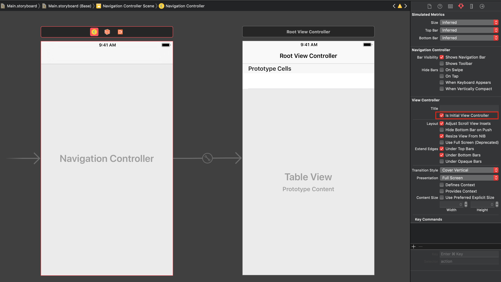

A `Navigation Controller`hez az `Xcode` alapból létrehoz egy hozzácsatolt `Table View Controller`t.
> Ezt töröljük ki és helyette adjunk a `storyboard`hoz egy sima `View Controller`t, majd kössük be a `Navigation Controller` *root view controller* `Segue`-ére. 

<!--  -->
> Ennek tartalomnézetéhez adjunk hozzá egy `Label`t, egy `Segmented Control`t és egy `Button`t!
>
* Az új `View Controller`hez tartozó `Navigation Item`ben nevezzük át a `Title`-t **Játékválasztó**nak!
* A `Label` értéke **Nehézség** legyen!
* A `Segmented Control`nak három értéke legyen: **könnyű**, **normál** és **nehéz**. 
* A `Button` felirata **Mutass egy képet!** legyen!

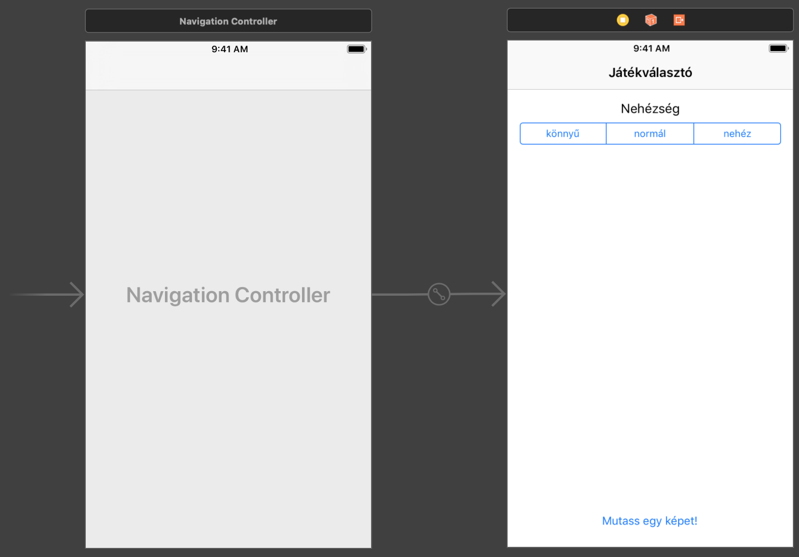

> Hozzunk létre egy új osztályt `GameSelectorViewController` névvel, `UIViewController`ből leszármaztatva! állítsuk be a `storyboard`on belül a játékválasztó `view controller` osztályát `GameSelectorViewController`re! Ehhez jelöljük ki a teljes nézetvezérlőt, majd `Identity inspector`ban adjuk meg az osztály nevét!

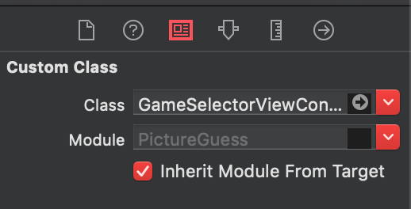

> Hozzunk létre egy `Outlet`et `difficultySegmentedControl` néven a `Segmented Control`hoz!

## Picture Manager <a id="picture-manager"></a>
> A `Project Navigator`ban válasszuk ki az `Assets.xcassets` katalógust és importáljuk ide be a képeket a `res/` mappából. Ezt például a `Jobb klikk`+`Import` vagy _drag&drop_ segítségével tehetjük meg.

Az importált képeket hagyhatjuk `Universal 1x`-en.

---

_Saját alkalmazás fejlesztésekor mindenképpen érdemes az összes "x"-es képet megadni, ugyanis enélkül a rendszernek futási időben kell átskáláznia a képeket, ami nem csak performancia veszteséggel de néha meglepő eredménnyel is jár._

Összefoglaló kép emlékeztetőnek az `iPhone` kijelzők méretéről.

 ](img/04_iphone_screen_sizes.png)

---

Az `Assets.xcassets` katalógusba nem csak képeket lehet importálni, hanem adatot is. `.plist` fájlokat nem, vagy csak nagyon ritkán szoktunk katalógusban tárolni, most azonban megnézzük, hogy hogyan csinálhatunk ilyet.

> Importáljuk be a `res/Pictures.plist` fájlt az `Assets.xcassets` katalógusba!

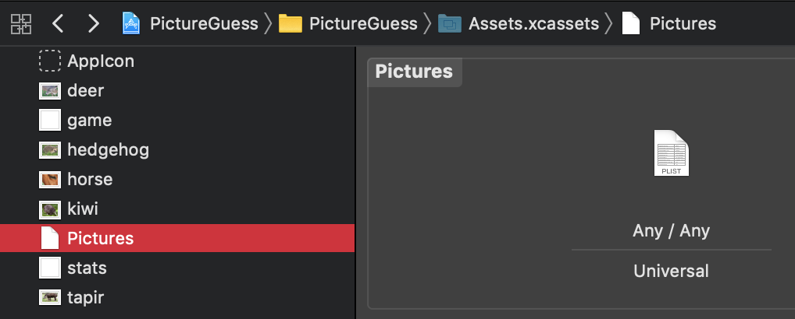

> Hozzunk létre egy új, `PictureManager` nevű osztályt, `NSObject` ősosztállyal. Ez fogja tárolni a játékhoz tartozó képeket és ennek feladata lesz, hogy véletlenszerűen választott képeket és képcímeket adjon vissza.

<!--  -->
> Vegyünk fel egy pictures tagváltozót!

```swift
let pictures : [AnyObject]?
```

> Hozzunk létre egy inicializálót és töltsük be benne a tömb tartalmát a projekthez hozzáadott `Pictures.plist` fájlból!

```swift
override init() {
  let picturesAsset = NSDataAsset(name: "Pictures")

  do {
    var format = PropertyListSerialization.PropertyListFormat.xml
    pictures = try PropertyListSerialization.propertyList(from: picturesAsset!.data, options: .mutableContainersAndLeaves, format: &format) as? [AnyObject]
  } catch {
    pictures = nil
  }

  super.init()
}
```

---

_A `plist` egy Apple környezetben gyakran használt fájl formátum, amelyben tömböket, dictionary-ket és alap típusokat pl. `string` lehet egyszerű módon tárolni._

---

A `Pictures.plist` ben minden képhez el van tárolva egy képcím és a képfájl neve.

```xml
<?xml version="1.0" encoding="UTF-8"?>
<!DOCTYPE plist PUBLIC "-//Apple//DTD PLIST 1.0//EN" "http://www.apple.com/DTDs/PropertyList-1.0.dtd">
<plist version="1.0">
<array>
  <dict>
    <key>title</key>
    <string>Tapír</string>
    <key>image</key>
    <string>tapir.jpg</string>
  </dict>
  <dict>
    <key>title</key>
    <string>Kiwi</string>
    <key>image</key>
    <string>kiwi.jpg</string>
  </dict>
  ...
</array>
</plist>
```

> Egy konstans formájában adjuk meg a válaszlehetőségek számát (hány képcím közül kell kiválasztani a helyes címet)!

```swift
let kChoices = 3
```

> Vegyünk fel egy új metódust, mely visszatér egy véletlenül kiválasztott képpel és képcímkék egy listájával!

```swift
func getRandomPicture(picture: inout UIImage?, titles: inout [String], pictureTitleIndex: inout Int) {
  guard let pictures = pictures else {
    return
  }

  // kiválasztott kép indexe a `pictures` tömbben
  let selectedPictureIndex = Int(arc4random_uniform(UInt32(pictures.count - 1)))

  // tömb a még ki nem választott képcímek indexével
  var rangeArray = [Int]()
  for index in 0..<pictures.count {
    rangeArray.append(index)
  }
  rangeArray.remove(at: selectedPictureIndex)
  print("range array: \(rangeArray)")

  // egyedi véletlen képcímek kiválasztása
  var titlesToReturn = [String]()
  for _ in 0..<kChoices - 1 {
    let randomIndex = Int(arc4random_uniform(UInt32(rangeArray.count - 1)))
    if let randomPicture = pictures[rangeArray[randomIndex]] as? [String : String] {
      titlesToReturn.append(randomPicture["title"]!)
    }
    rangeArray.remove(at: randomIndex)
  }
  print("titles: \(titlesToReturn)")

  // választott képcím beszúrása a véletlen képcímek közé, véletlen helyre :)
  pictureTitleIndex = Int(arc4random_uniform(UInt32(kChoices)))
  if let chosenPicture = pictures[selectedPictureIndex] as? [String: String] {
    titlesToReturn.insert(chosenPicture["title"]!, at: pictureTitleIndex)
    picture = UIImage(named: chosenPicture["image"]!)!
  }

  titles = titlesToReturn
}
```

---

* _A metódus paraméterei megvannak jelölve `inout` minősítővel. Erre azért van szükség, mert ezek a paraméterek kimeneti paraméterek, melyekbe egy-egy, a metóduson belül létrehozott új objektum fog beleíródni._
* _Érdekesség: a következő két kódrészlet teljesen ugyanazt csinálja, a második azonban sokkal tömörebb formában, felhasználja a `Swift`ben alkalmazható funkcionális programozási elemeket._

```swift
var rangeArray = [Int]()
for index in 0..<pictures.count {
  rangeArray.append(index)
}
rangeArray.remove(at: selectedPictureIndex)
```

```swift
let shorterRangeArray = pictures.enumerated().map{ $0.offset }.filter{ $0 != selectedPictureIndex }
```

---

> Vegyünk fel `PictureManager` típusú property-t az `AppDelegate`-be és inicializáljuk!

```swift
var pictureManager = PictureManager()
```

## Játék nézet <a id="jatek-nezet"></a>
> Vegyünk fel egy új `View Controller`t a `storyboard`ba, majd kössünk be a játékindítás gombra egy *push `Segue`*-et.

<!--  -->
> Módosítsuk az új `View Controller`hez tartozó `Navigation Item` cimkéjét **Mit látsz a képen?**-re!

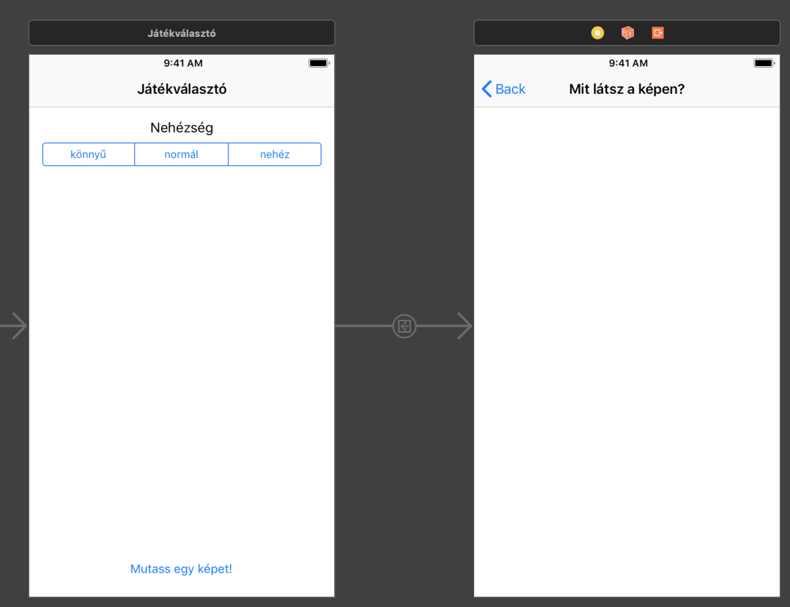

> Hozzunk létre egy `GameViewController` nevű osztályt (`UIViewController` ősosztállyal) és adjuk meg ezt az új `View Controller` osztályának az `Identity inspector`ban.

<!--  -->
> Adjunk a `storyboard`hoz egy `Image View`-t és `3 Button`t. Ügyeljünk rá, hogy a képernyő alján maradjon némi hely (később itt még el kell férnie majd egy `Tab Bar`nak)!

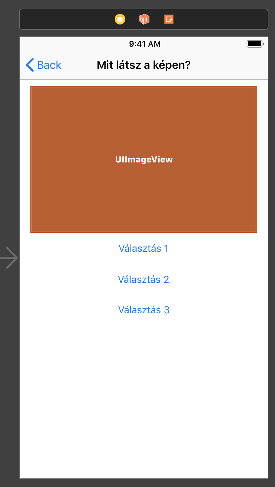

> állítsuk be a gombok `Tag` attribútumát az `Attributes inspector`ban `1-3`-ig (minden gomb más `Tag`et kapjon)!

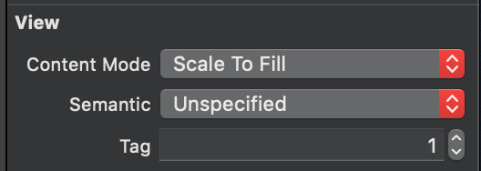

---

_A `Tag` egy `integer` azonosító, melyen keresztül lekérhetjük a nézetet a kódból._

---

> Vegyünk fel két tagváltozót `GameViewController` osztályba, melybe eltároljuk az éppen mutatott képet és a helyes válasz feliratának sorszámát, továbbá egy `Outlet`et a képnézethez!

```swift
@IBOutlet weak var pictureView: UIImageView!

var correctAnswer = -1
var baseImage: UIImage?
```

> Módosítsuk a `GameViewController` `viewDidLoad` metódusát, mely lekéri a véletlen képet és címkéket a `PictureManager`től, majd beállítja ezeket az `Image View`-hoz és a gombokhoz!

```swift
override func viewDidLoad() {
  super.viewDidLoad()

  let pictureManager = (UIApplication.shared.delegate as? AppDelegate)?.pictureManager
  var titles = [String]()

  pictureManager?.getRandomPicture(picture: &baseImage, titles: &titles, pictureTitleIndex: &correctAnswer)

  for index in 1...titles.count {
    let button = view.viewWithTag(index) as? UIButton
    button?.setTitle(titles[index - 1], for: .normal)
  }

  if let baseImage = baseImage {
    let cropSize = CGSize(width: 300, height: 200)
    let cropRect = CGRect(x:CGFloat(Int(arc4random()) % Int(baseImage.size.width - cropSize.width)),
                          y:CGFloat(Int(arc4random()) % Int(baseImage.size.height - cropSize.height)),
                      width:(cropSize.width*baseImage.scale),
                     height:(cropSize.height*baseImage.scale))
    let croppedImageRef = baseImage.cgImage!.cropping(to: cropRect)
    let croppedImage = UIImage(cgImage: croppedImageRef!, scale: baseImage.scale, orientation: baseImage.imageOrientation)
    pictureView.image = croppedImage
  }
}
```

> Próbáljuk ki az alkalmazást!

## Eredmény nézet <a id="eredmeny-nezet"></a>
> Hozzunk létre egy `View Controller`t a `storyboard`ban, majd vegyünk fel bele egy `Label`t, egy `Image View`-t és egy `Button`t!

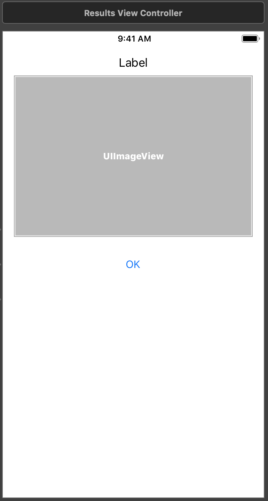

> Hozzunk létre egy egy `ResultsViewController` nevű osztályt, melyet rendeljünk az imént létrehozott `ViewController`hez a `storyboard`on belül. Rendeljünk egy-egy `Outlet`et a `Label`hez és az `Image View`-hoz (pl. `resultsLabel`, `pictureView`)!

```swift
@IBOutlet weak var resultLabel: UILabel!
@IBOutlet weak var pictureView: UIImageView!
```

> A `View Controller` által mutatott tartalom inicializálásához vegyünk fel két property-t, egyet a bemutatott képhez, egyet pedig a felirathoz!

```swift
var caption: String?
var picture: UIImage?
```

Ezekre azért van szükség, mert a `View Controller` tartalmát még az előtt be kell majd állítanunk, hogy az ahhoz tartozó nézetek megjelennének (tehát nem tudjuk közvetlenül a `Label`t és az `Image View`-t módosítani.)

> Ezen property-k alapján inicializáljuk a nézeteket a `View Controller` `viewDidLoad` metódusában!

```swift
override func viewDidLoad() {
  super.viewDidLoad()

  resultLabel.text = caption
  pictureView.image = picture
}
```

`ResultsViewController` megjelenítése modális `segue`-en keresztül fog történni.

> Kössük be a játék jelentből mind a három gombot egy *modal* `segue`-el az eredményeket tartalmazó `View Controller`hez (`Ctrl+klikk+drag` a gombról a cél `View Controller`re)!

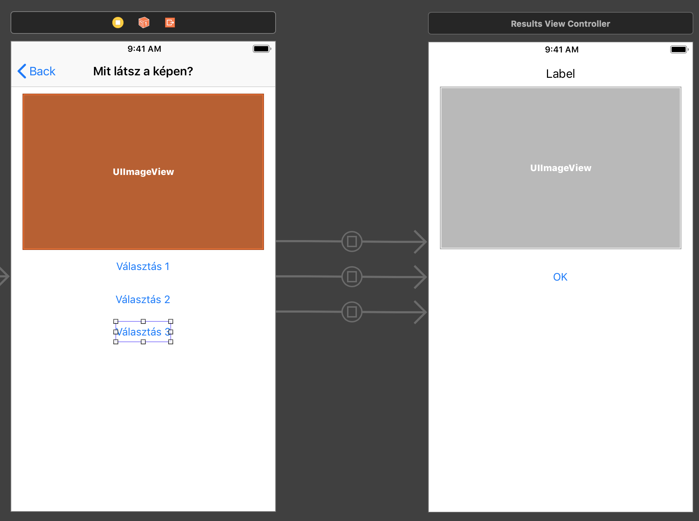

Ezzel azt értük el, hogy megjelenik az új nézet, de még teljesen üres, hisz adatokat nem adunk át neki. Ahhoz, hogy egy lejátszódó `segue` előtt adatokat adhassunk át a megjelenő `View Controller`nek, felül kell definiálnunk a kiinduló `View Controller` (esetünben `GameViewController`) `prepare(for:sender:)` metódusát, melyet `UIViewController`ből örökölt. A metódus `sender` paramétere a `segue`-t elindító gombra fog mutatni, a `segue` "célját", a `destinationViewController` property-vel tudjuk elérni. Ezen keresztül fel tudjuk tölteni adatokkal a `ResultsViewController`t. A helyes válaszhoz tartozó gombot a gombokhoz rendelt `Tag` és az eltárolt `correctAnswerIndex` alapján kapjuk meg.

```swift
override func prepare(for segue: UIStoryboardSegue, sender: Any?) {
  if let button = sender as? UIButton {

    let resultViewController = segue.destination as! ResultsViewController
    resultViewController.picture = baseImage

    if button.tag - 1 == correctAnswer {
      resultViewController.caption = "Talált! Ez egy \(button.titleLabel?.text?.lowercased())."
    }
    else {
      let correctButton = view.viewWithTag(correctAnswer + 1) as? UIButton
      resultViewController.caption = "Sajnos nem talált! Ez egy \(correctButton?.titleLabel?.text?.lowercased())."
    }
  }
}
```

Ezek után már megkapjuk az eredményt, de sajnos még nem tudjuk bezárni a `Results` jelenetet (az `OK` gomb nem reagál).

Ahhoz, hogy bezárjuk a modális `View Controller`t és visszlépjünk egy korábbi `View Controller`re, egy `Unwind Segue`-t fogunk használni.
> Vegyünk fel egy új akció metódust az `GameSelectorViewController`be, melyet az `Unwind Segue`-hez kapcsolahatunk!

```swift
@IBAction func unwindToGameSelector(_ segue: UIStoryboardSegue)  {}
```

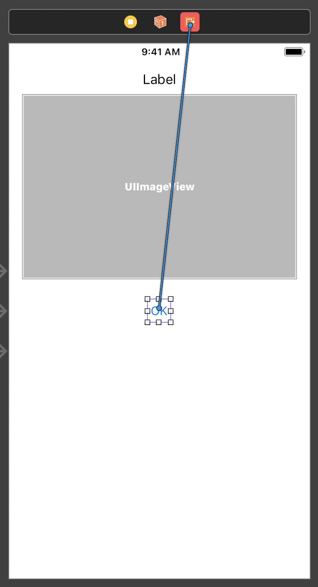 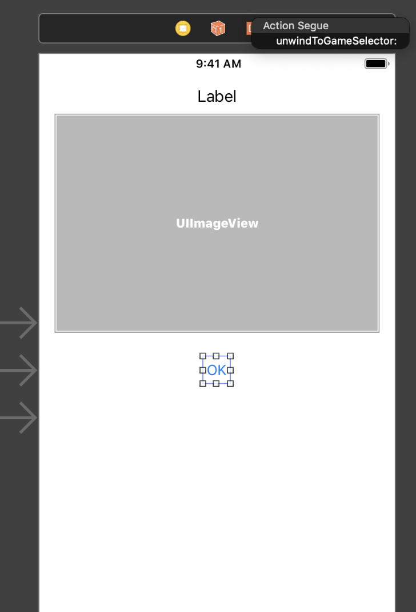

Azért a `GameSelectorViewController`be vesszük fel, mert rögtön ide szeretnénk visszaugrani, először bezárva a modális `View Controller`t, majd visszalépve a `Navigation Controller`en.


---

_Az `Unwind Segue`-ek olyan korábbi `View Controller`ekre tudnak visszatérni, melyekben található egy (`IBAction`el) visszatérő metódus, mely egy `UIStoryboardSegue` paramétert vár. Ez a metódus meghívódik az `Unwind Segue` bekövetkezte előtt és paraméterül kapott `segue`-ből kiolvasható a kiindulási `View Controller` (`segue.source`), amitől átvehetnénk az esetleg szükséges adatokat._

---

## Nehézség választó <a id="nehezseg-valaszto"></a>
> Vegyünk fel egy új property-t `GameViewController`be a nehézség meghatározásához!

```swift
var difficultyFactor: CGFloat = 1
```

> Módosítsuk a `viewDidLoad` metódusban a `cropSize` kiszámítását oly módon, hogy `difficultyFactor`t is belekalkulálja!

```swift
let cropSize = CGSize(width: 300 / difficultyFactor, height: 200 / difficultyFactor)
```

> Valósítsuk meg `GameSelectorViewController` `prepare(for:sender:)` metódusát, hogy a játéknézetre váltás előtt beállítsa a nehézséget a `Segmented Control` indexe alapján!

```swift
override func prepare(for segue: UIStoryboardSegue, sender: Any?) {
  let gameViewController = segue.destination as? GameViewController
  gameViewController?.difficultyFactor = CGFloat(difficultySegmentedControl.selectedSegmentIndex + 1)
}
```

---

_Egy konkrét `View Controller`ről kiinduló összes `segue` hatására ugyanaz a `prepare(for:sender:)` metódus hívódik meg. Ha egynél több `segue`-t indítunk ugyanarról a `View Controller`ről, akkor szükség lehet a `segue` azonosítására. Ehhez a `storyboard`ban megadhatjuk a `segue` azonosítóját._

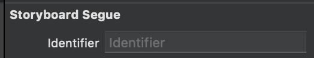

_Majd a kódban tudjuk ellenőrizni, hogy melyik az épp bekövetkező `segue`._

```swift
if segue.identifier == "gameViewControllerSegue" {
  ...
}
```

---

# Önálló feladat <a id="onallo-feladat"></a>

## Játékstatisztika <a id="jatekstatisztika"></a>
> Vegyünk fel `3` új property-t `PictureManager`be, melyek eltárolják a lekért képek, a helyes és a rossz válaszok számát!

```swift
var picturesQueriedCount = 0
var correctAnswerCount = 0
var wrongAnswerCount = 0
```

> Módosítsuk `getRandomPicture` metódust, hogy növelje a lekért képek számát!

```swift
func getRandomPicture(picture: inout UIImage?, titles: inout [String], pictureTitleIndex: inout Int) {
    guard let pictures = pictures else {
      return
    }

    picturesQueriedCount += 1
    ...
}
```

> Módosítsuk a `GameViewController` `prepare(for:sender:)` metódusát a helyes és helytelen válaszok számának frissítésével!

```swift
override func prepare(for segue: UIStoryboardSegue, sender: Any?) {
  if let button = sender as? UIButton {

    let pictureManager = (UIApplication.shared.delegate as? AppDelegate)?.pictureManager

    let resultViewController = segue.destination as! ResultsViewController
    resultViewController.picture = baseImage

    if button.tag - 1 == correctAnswer {
      resultViewController.caption = "Talált! Ez egy \((button.titleLabel?.text?.lowercased())!)."
      pictureManager?.correctAnswerCount += 1
    }
    else {
      let correctButton = view.viewWithTag(correctAnswer + 1) as? UIButton
      resultViewController.caption = "Sajnos nem talált! Ez egy \((correctButton?.titleLabel?.text?.lowercased())!)."
      pictureManager?.wrongAnswerCount += 1
    }
  }
}
```

> A `storyboard`ban hozzunk létre egy új `Tab Bar Controller`t és rendeljük hozzá a `Navigation Controller`t!

Ezt legegyszerűbben úgy tehetjük meg, hogy kiválasztjuk a `Navigation Controller`t, majd a menüben az `Editor/Embed In/Tab Bar Controller`t választjuk. Ennek hatására létrejön egy új `Tab Bar Controller`, ami magához rendeli (*relationship segue*) a `Navigation Controller`t, így az megjelenik az első tabon.

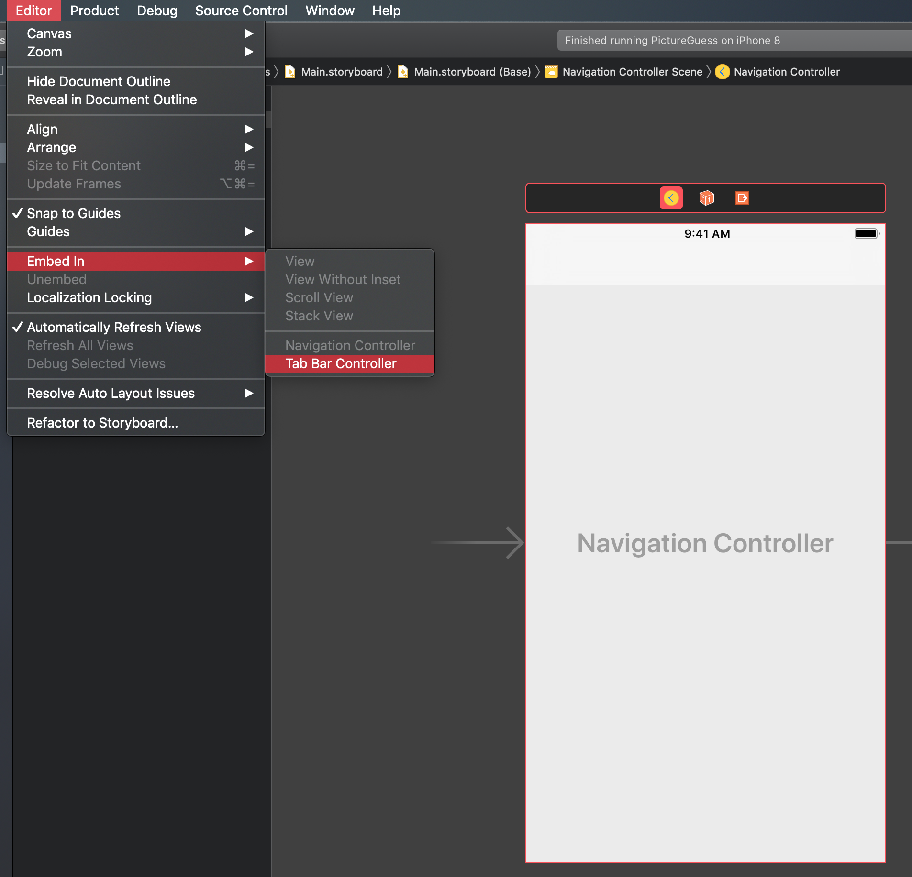
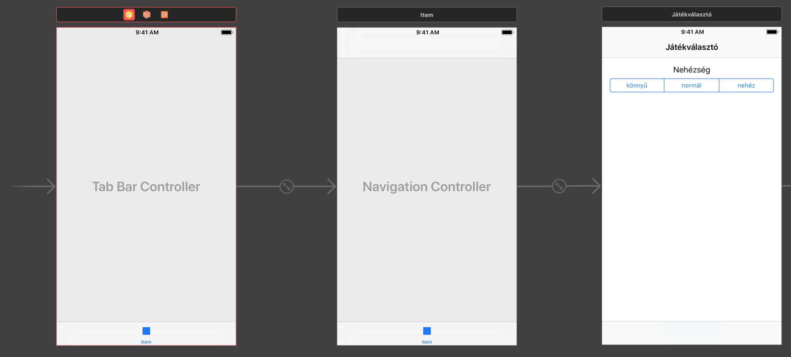

> Hozzunk létre egy új `View Controller`t a `storyboard`ban és kössük be a `Tab Bar Controller` *view controllers* `segue`-éhez!

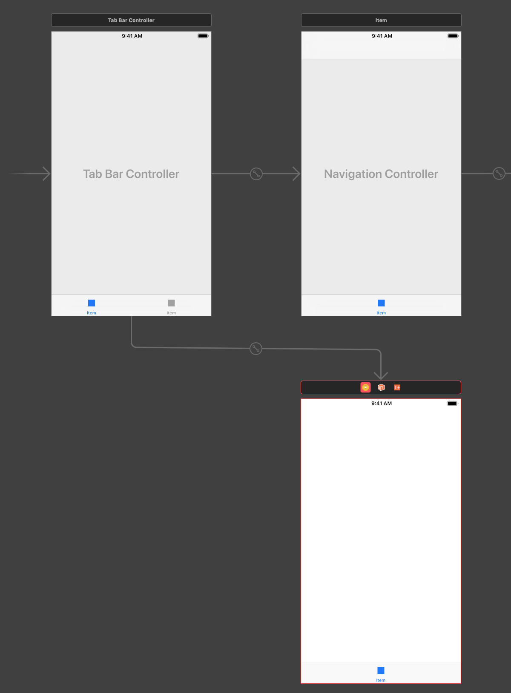

> Készítsünk egy nézetet a statisztikák megjelenítéséhez! Mindenképp legyen `3 UILabel`ünk az egyes adatokhoz, ezen kívül tetszőleges egyéb elemeket felvehetünk!

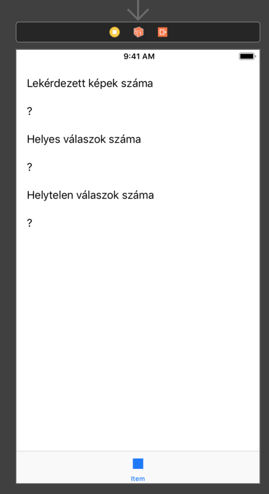

> Hozzunk létre egy új `UIViewController` leszármazott osztályt `StatsViewController` névvel és rendeljük ezt a `storyboard`ban imént létrehozott `View Controller`hez az `Identity inspector`ban!

<!--  -->
> Vegyünk fel `3 Outlet`et a `3` statisztikát megjelenítő `Label`hez!

```swift
@IBOutlet weak var queriedPicturesCountLabel: UILabel!
@IBOutlet weak var correctAnswerCountLabel: UILabel!
@IBOutlet weak var wrongAnswerCountLabel: UILabel!
```

> Definiáljuk felül az új `View Controller` `viewWillAppear(_:)` metódusát, mely mindig meghívódik mikor az adott `View Controller` nézete éppen megjelenik a képernyőn (pl. a felhasználó a nézet `Tab`jára vált).

<!--  -->
> Módosítsuk a `Label`ek szövegét a `Picture Manager`ből lekérdezett statisztikák alapján!

```swift
override func viewWillAppear(_ animated: Bool) {
  super.viewWillAppear(animated)

  let pictureManager = (UIApplication.shared.delegate as? AppDelegate)?.pictureManager

  queriedPicturesCountLabel.text = "\(pictureManager!.picturesQueriedCount)"
  correctAnswerCountLabel.text = "\(pictureManager!.correctAnswerCount)"
  wrongAnswerCountLabel.text = "\(pictureManager!.wrongAnswerCount)"
}
```

> A `storyboard` szerkesztőben állítsuk be a két tabhoz tartozó `View Controller`ben lévő `Tab Bar Item`ek feliratát, hogy azok **Játék** és **Statisztika** legyenek.

<!--  -->
> Állítsuk be a két `Tab Bar Item` *Image* beállítását **game**-re és **stats**-ra.


