# `iOS` alapú szoftverfejlesztés - Labor `06`

## A laborsegédletet összeállította
* Kelényi Imre - imre.kelenyi@aut.bme.hu
* Kántor Tibor - tibor.kantor@autsoft.hu
* Krassay Péter - peter.krassay@autsoft.hu
* Szücs Zoltán - szucs.zoltan@autsoft.hu

## A labor témája

* [iTravel](#itravel)
    * [Kezdeti adatok betöltése](#kezdeti-adatok-betoltese)
    * [Utak listájának megjelenítése: dinamikus `Table View`](#dinamikus-table-view)
    * [Utak részletezése: statikus `Table View`](#statikus-table-view)
    * [Cellák törlése és mozgatása](#cellak-torlese-es-mozgatasa)
* [Önálló feladat](#onallo-feladat)
    * [Új cella hozzáadása](#uj-cella-hozzaadasa)

A labor célja egy utazásokat nyilvántartó alkalmazás megírása és ezzel együtt a `Table View` használatának elsajátítása.

# iTravel <a id="itravel"></a>

## Kezdeti adatok betöltése <a id="kezdeti-adatok-betoltese"></a>
> Hozzunk létre egy `Single View App`ot **iTravel** névvel a `labor_06` könyvtárba!
 
<!--  -->
> Állítsuk a `Devices` beállítást `iPhone`-ra (`Target` beállítások, `Deployment Info` szekció). 

Az egyes utak adatai egy-egy *Dictionary*-ben vannak eltárolva. Hogy mindig legyen pár adatunk a teszteléshez, egy *Property List*ből betöltünk pár kezdeti értéket.

> Húzzuk be a `res/iceland.jpg` és a `res/berlin.jpg` képeket az `Assets.xcasset` katalógusba. 

<!-- -->
> Hozzunk létre egy új, **Trips** nevű *Group*ot, majd húzzuk be az `InitialTrips.plist` fájlt (fontos, hogy a `Copy items if needed` opció be legyen kapcsolva!).
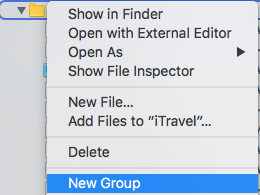

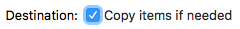

Ezt megnyitva megnézhetjük a kezdeti adatokat.

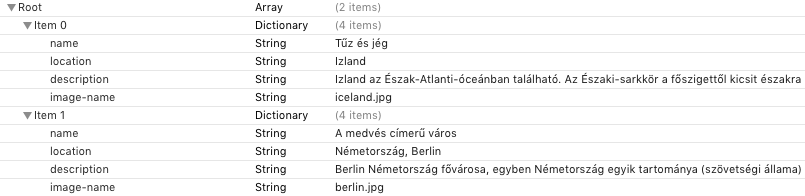

> Hozzunk létre egy új, `TripsDataManager` nevű osztályt (`Swift File` template), melyben az utazások adatait fogjuk tárolni.

Az osztálynak egyetlen *property*-je lesz, mely egy `AnyObject` típusú tömbben tárolja az utak adatait.

```swift
var trips: [AnyObject]
```

> Írjuk meg az alap inicializálót, mely betölti a kezdeti utakat az `InitialTrips.plist`ből!


```swift
init() {
  let filePath = Bundle.main.path(forResource: "InitialTrips", ofType: "plist")
  trips = NSArray(contentsOfFile: filePath!)! as [AnyObject]
}
```

> Hozzunk létre egy *property*-t `TripsDataManager`ből az `AppDelegate`-be és példányosítsuk is!

```swift
let tripsDataManager = TripsDataManager()
```

## Utak listájának megjelenítése: dinamikus `Table View` <a id="dinamikus-table-view"></a>
> Töröljük ki a forrásfájlok közül a legenerált `ViewController`t (*Delete --> Move to Trash*)!

<!-- -->
> A `Main.storyboard` tulajdonságainál (`File inspector`) kapcsoljuk ki a `Use Trait Variations` beállítást.

<!--  -->
> Töröljük ki a `Storyboard`ban levő, generált jelenetünket!

<!--  -->
> Rakjunk be egy `Table View Controller`t! Ágyazzuk be ezt a `Table View Controller`t egy `Navigation Controller`be és állítsuk be a hozzá tartozó `Navigation Item` *Title* property-jét **Útjaim**ra! 

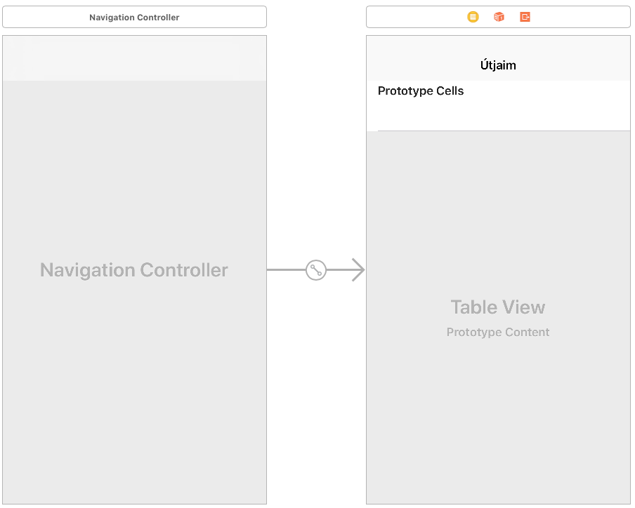

Ne felejtsük el beállítani `Initial View Controller`nek a `Navigation Controller`t!

> Hozzunk létre egy új, `UITableViewController`ből származó osztályt `TripsViewController` névvel (használjuk a `Cocoa Touch Class` *template*-et). Állítsuk be a `Storyboard`ban a `Table View Controller` osztályát az újonnan definiált osztályra!

<!--  -->
> Állítsuk át a `Table View Controller`ben lévő `Table View Cell` stílusát **Subtitle**-re és adjunk meg neki egy azonosítót: **TripsTableViewCell**!

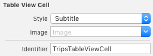

> A `TripsViewController`hez adjunk hozzá egy tagváltozót, melyen keresztül elérhetjük az utak adatait!

```swift
var tripsDataManager: TripsDataManager?
```

> Ezt inicializáljuk a `viewDidLoad()` metódusban!

```swift
tripsDataManager = (UIApplication.shared.delegate as? AppDelegate)?.tripsDataManager
```

> Valósítsuk meg a `Table View` *Data Source* metódusait!

```swift
// MARK: - Table view data source

override func numberOfSections(in tableView: UITableView) -> Int {
  return 1
}

override func tableView(_ tableView: UITableView, numberOfRowsInSection section: Int) -> Int {
  return tripsDataManager!.trips.count
}

override func tableView(_ tableView: UITableView, cellForRowAt indexPath: IndexPath) -> UITableViewCell {
  let cell = tableView.dequeueReusableCell(withIdentifier: "TripsTableViewCell", for: indexPath)

  let tripData = tripsDataManager!.trips[indexPath.row] as! [String: AnyObject]
  cell.textLabel?.text = tripData["name"] as? String
  cell.detailTextLabel?.text = tripData["location"] as? String

  if let tripImageName = tripData["image-name"] as? String {
    cell.imageView?.image = UIImage(named: tripImageName)
  }

  return cell
}
```

A kommentben látható `MARK: - ` "kulcsszó" segítségével a metódusainkat csoportokba rendezhetjük, egy elválasztót hozhatunk létre közéjük.


> Próbáljuk ki az alkalmazásunkat!

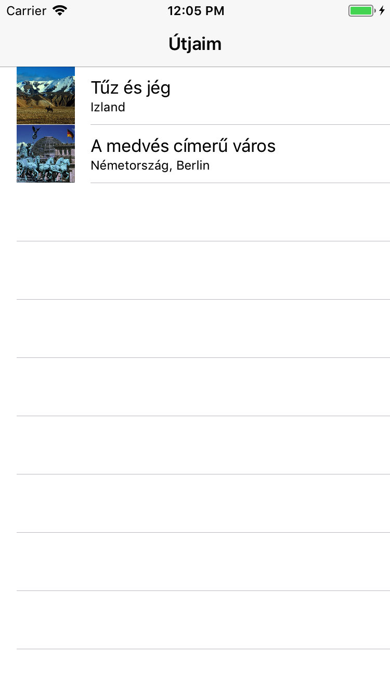

## Utak részletezése: statikus `Table View` <a id="statikus-table-view"></a>
> Hozzunk létre egy új `Table View Controller`t majd állítsuk át a benne foglalt `Table View` *Content* property-jét **Static Cells**-re!

<!--  -->
> Állítsuk be a *Sections*-t **`2`**-re, a *Style*-t pedig **Grouped**ra!

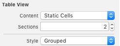

> Ezek után módosítsuk a `Table View`-t oly módon, hogy az első szekcióban `1` **Custom**, a másodikban pedig `2` **Right Detail** és `1` **Custom** stílusú cella legyen (az egyes cellák *Style* property-jét kell állítgatni).

<!--  -->
> Az első szekció cellájába adjunk hozzá egy `Image View`-t, a második szekció utolsó cellájához pedig egy `Text View`-t. Módosítsuk a feliratokat, hogy a következő képhez hasonló felületet kapjunk (a `Text View` cellájának magassága lehet nagyobb is).

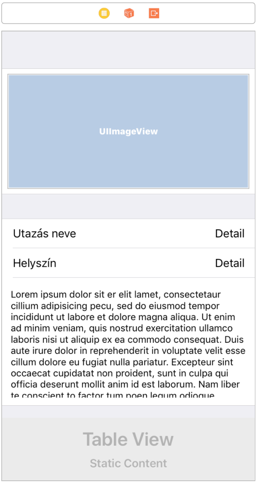

Ha valami miatt az `Interface Builder`ben nem sikerülne beállítani az egyes cellák magasságát, akkor a `Size inspector`ban kapcsolhatjuk át **Custom**ra.

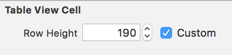

Bár ha nem adunk meg a nézetben egyetlen `Auto Layout` kényszert sem, akkor is működni fog, az elegáns megoldás, ha mind az `Image View`-t, mind a `Text View`-t rögzítjük a szülő nézeteikhez néhány kényszer megadásával (pl. **Standard** távolság a szülő összes oldalától vagy csupa 0, a *Constrain to margins* bekapcsolása mellett).

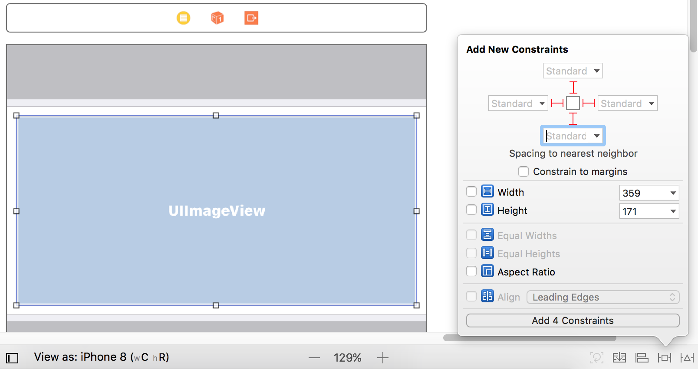

> Az `Image View` *Content Mode* property-jét állítsuk **Aspect Fit**re!

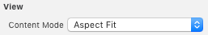

> A `Text View`-nak kapcsoljuk ki az *Editable* property-jét és állítsuk átlátszóra a háttérszínét!

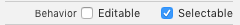

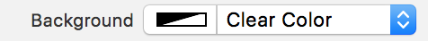

> A 4 cellát kiválasztva a *Selection* property értékét állítsuk **None**-ra, hogy ne lehessen kijelölni a cellákat!

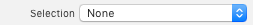

> Hozzunk létre egy új, `UITableViewController`ből leszármazó osztályt, `TripDetailViewController` névvel, **töröljük ki a generált kódot** és állítsuk be ezt a `Storyboard`ban létrehozott `Table View Controller` osztályául.

**Ezt a két metódust különösen fontos kitörölni, ugyanis ezek felülírják a Storyboardban nagy gonddal beállított táblázatunkat!**

```swift
// MARK: - Table view data source

override func numberOfSections(in tableView: UITableView) -> Int {
    // #warning Incomplete implementation, return the number of sections
    return 0
}

override func tableView(_ tableView: UITableView, numberOfRowsInSection section: Int) -> Int {
    // #warning Incomplete implementation, return the number of rows
    return 0
}
```

> Vegyünk fel `Outlet`eket a `4`, adatmegjelenítésre szolgálló nézethez (minden cellából azt a nézetet válasszuk ki, mely az egyedi adat megjelenítésére szolgál, és ezeket kössük be `Outlet`ekre)!

```swift
@IBOutlet weak var tripImageView: UIImageView!
@IBOutlet weak var tripNameLabel: UILabel!
@IBOutlet weak var tripLocationLabel: UILabel!
@IBOutlet weak var tripDescriptionTextView: UITextView!
```

> Vegyünk fel egy `trip` nevű, *Dictionary* típusú property-t a `TripDetailViewController`be. Ez fogja tárolni az éppen kiválasztott út adatait.

```swift
var trip: [String: AnyObject]?
```

> Definiáljuk felül a `viewWillAppear(_:)` metódust, melyben beállítjuk a nézetek kezdeti értékét a `trip` property-ben eltárolt utazás alapján!

```swift
override func viewWillAppear(_ animated: Bool) {
  super.viewWillAppear(animated)

  if let trip = trip {
    if let tripImageName = trip["image-name"] as? String {
      tripImageView.image = UIImage(named: tripImageName)
    }

    tripNameLabel.text = trip["name"] as? String
    tripLocationLabel.text = trip["location"] as? String
    tripDescriptionTextView.text = trip["description"] as? String

    navigationItem.title = trip["name"] as? String
  }
}
```

> A `Storyboard`ban kössük be egy **Push** `Segue`-el a `Trips View Controller`ben lévő `Table View` prototípus celláját a `Detail View Controller`-re. Nevezzük el a `Segue`-t **TripDetailSegue**-nek!

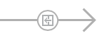

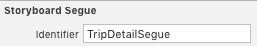

> Ezek után definiáljuk felül `TripsViewController`ben a `prepare(for:sender:)` metódust, hogy átadhassa az éppen kiválasztott cellához tartozó utazás adatait a megjelenő `TripDetailViewController`nek!

```swift
//   MARK: - Navigation

override func prepare(for segue: UIStoryboardSegue, sender: Any?) {
  if segue.identifier == "TripDetailSegue" {
    let vc = segue.destination as? TripDetailViewController
    let row = tableView.indexPathForSelectedRow?.row
    vc?.trip = tripsDataManager?.trips[row!] as? [String: AnyObject]
  }
}
```

> Teszteljük az alkalmazást!

## Cellák törlése és mozgatása <a id="cellak-torlese-es-mozgatasa"></a>
Ahhoz, hogy a `Table View` celláit törölni vagy mozgatni tudjuk, a `Table View`-t *Edit* módba kell kapcsolni. Szerencsére ennek elvégzésére van egy beépített *Edit* gomb a `Table View Controller`ben, ezt csak hozzá kell adnunk például a `Navigation Bar`hoz. 
> Adjuk a következő sort a `TripsViewController` `viewDidLoad()` metódusához!

```swift
navigationItem.rightBarButtonItem = editButtonItem
```

A következő metódust akkor érdemes csak felülírni, ha nem akarunk minden cellát szerkeszthetővé (törölhetővé) tenni, ugyanis alapértelmezés szerint minden cella szerkeszthető.

```swift
override func tableView(_ tableView: UITableView, canEditRowAt indexPath: IndexPath) -> Bool {
  return true
}
```

> A törlés elvégzését viszont nekünk kell elvégezni.

```swift
override func tableView(_ tableView: UITableView, commit editingStyle: UITableViewCellEditingStyle, forRowAt indexPath: IndexPath) {
  if editingStyle == .delete {
    tripsDataManager?.trips.remove(at: indexPath.row)
    tableView.deleteRows(at: [indexPath], with: .fade)
  }
}
```

A cellák mozgatásának engedélyezése a következőképpen tehető meg. Ez a felülírás a törlés engedélyezéséhez hasonlóan felesleges, ha minden cellára engedélyezni szeretnénk. Amennyiben a `tableView(_:moveRowAt:to:)` metódus implementálva van, akkor alapértelmezetten `true` értékkel tér vissza a `tableView(_:canMoveRowAt:)` metódus.

```swift
override func tableView(_ tableView: UITableView, canMoveRowAt indexPath: IndexPath) -> Bool {
  return true
}
```

> A mozgatás folyamata, mely során az adatforrásként használt tömbben felcserélünk két elemet.

```swift
override func tableView(_ tableView: UITableView, moveRowAt fromIndexPath: IndexPath, to: IndexPath) {
  let tripsToMove = tripsDataManager?.trips[fromIndexPath.row]
  tripsDataManager?.trips.remove(at: fromIndexPath.row)
  tripsDataManager?.trips.insert(tripsToMove!, at: to.row)
}
```

# Önálló feladat <a id="onallo-feladat"></a>

## Új cella hozzáadása <a id="uj-cella-hozzaadasa"></a>
> Vegyünk fel egy új `View Controller`t a `Storyboard`ba és ágyazzuk be rögtön egy szintén újonnan létrehozott `Navigation Controller`be. A cél ezután az, hogy a következő felületet állítsuk össze!

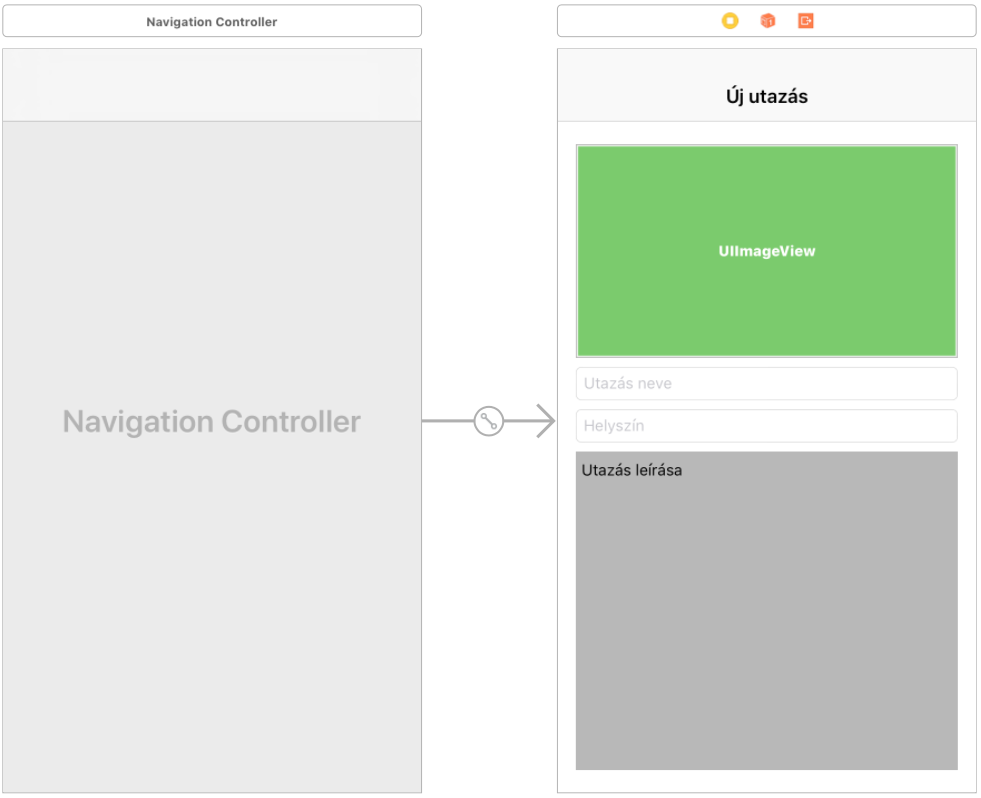

> 
* Vegyünk fel egy `Image View`-t és állítsuk be a háttérszínét (*Background* attribútum) valamilyen élénk színre.
* Vegyünk fel két `Text Field`et, és állítsunk be bennünk *Placeholder*t (**Utazás neve** és **Helyszín**).
* Vegyünk fel egy `Text View`-t és állítsuk át a háttérszínét, valamint a kezdeti szöveget pl. **Utazás leírása**-ra.

Az idő szűkössége miatt nem definiálunk `Auto Layout` kényszereket, de ne felejtsük el, hogy így az alklamzás nem fog jól mutatni más kijelzőméreteken, illetve elforgatáskor. Egy éles alkalmazásban ez nem elfogadható.

> Húzzunk be `1-1` `Bar Button Item`et a `View Controller` tetején lévő `Navigation Bar`ra, majd állítsuk ezek *System Item* attributumát **Cancel**re, illetve **Save**-re

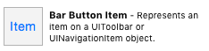

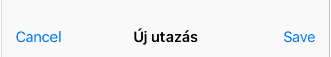

> Hozzunk létre egy új, `EditTripViewController` nevű, `UIViewController`ből származó osztályt, állítsuk be az újonnan létrehozott nézetünk *Class* property-jének az `Identity inspector`ban, majd írjuk felül a fájl tartalmát a következő kóddal!

```swift
import UIKit

class EditTripViewController: UIViewController, UITextViewDelegate, UIImagePickerControllerDelegate, UINavigationControllerDelegate {

  @IBOutlet weak var imageView: UIImageView!
  @IBOutlet weak var nameTextField: UITextField!
  @IBOutlet weak var locationTextField: UITextField!
  @IBOutlet weak var descriptionTextView: UITextView!

  override func viewDidLoad() {
    super.viewDidLoad()

    let tapGestureRecognizer = UITapGestureRecognizer(target: self, action: #selector(EditTripViewController.handleImageViewTap(_:)))
    imageView.isUserInteractionEnabled = true
    imageView.addGestureRecognizer(tapGestureRecognizer)

    descriptionTextView.delegate = self
  }

  @IBAction func didEndOnExit(_ sender: UITextField) {
    sender.resignFirstResponder()
  }

  @IBAction func textFieldEditingDidBegin(_ sender: UITextField) {
    UIView.animate(withDuration: 0.25, delay: 0, options: .curveEaseInOut, animations: {
      self.view.frame = self.view.frame.offsetBy(dx: 0, dy: -100)
      }, completion: nil)
  }

  @IBAction func textFieldEditingDidEnd(_ sender: UITextField) {
    sender.resignFirstResponder()

    UIView.animate(withDuration: 0.25, delay: 0, options: .curveEaseInOut, animations: {
      self.view.frame = self.view.frame.offsetBy(dx: 0, dy: 100)
      }, completion: nil)
  }

  func textView(_ textView: UITextView, shouldChangeTextIn range: NSRange, replacementText text: String) -> Bool {
    if text == "\n" {
      textView.resignFirstResponder()
      return false
    } else {
      return true
    }
  }

  func textViewDidBeginEditing(_ textView: UITextView) {
    UIView.animate(withDuration: 0.25, delay: 0, options: .curveEaseInOut, animations: {
      self.view.frame = self.view.frame.offsetBy(dx: 0, dy: -210)
      }, completion: nil)
  }

  func textViewDidEndEditing(_ textView: UITextView) {
    UIView.animate(withDuration: 0.25, delay: 0, options: .curveEaseInOut, animations: {
      self.view.frame = self.view.frame.offsetBy(dx: 0, dy: 210)
      }, completion: nil)
  }
  
  @objc func handleImageViewTap(_ sender: UITapGestureRecognizer) {
    
  }
}
```

> Végezzük el a következő módosításokat!

> * Kössük be a kódban definiált `Outlet`ekre az `Image View`-t, a `2` `Text Field`et és a `Text View`-t! 
* Kössük be az alsó `Text Field` *Editing Did Begin* és *Editing Did End* eseményeit a `textFieldEditingDidBegin(_:)` és a `textFieldEditingDidEnd(_:)` metódusokra, továbbá a `didEndOnExit(_:)` metódusra is!

<!-- -->
> Adjunk hozzá a `TripsViewController` `Navigation Bar`jához egy `Bar Button Item`et, majd ennek *System Item* attribútumát állítsuk **Add**ra!

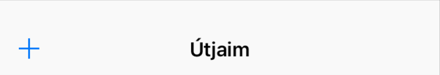

> Kössünk rá az új gombra egy **Modal** `Segue`-t, ami az új `Navigation Controller`re mutat (ami a szerkesztő `View Controller`t tartalmazza). A `Segue`-t nevezzük el **AddTripSegue**-nek, majd teszteljük az alkalmazást!

Amikor az egyelőre üres képre rákattint a felhasználó, meghívódik egy `Tap Gesture Recognizer`t kezelő metódus az `EditTripViewController`ben (`handeImageViewTap(_:)`). Itt szeretnénk megjeleníteni egy képkiválasztó rendszer `View Controller`t. 

```swift
func handleImageViewTap(_ sender: UITapGestureRecognizer) {
  let pickerController = UIImagePickerController()
  pickerController.delegate = self
  pickerController.sourceType = .savedPhotosAlbum
  show(pickerController, sender: nil)
}
```

> Majd valósítsuk meg a `imagePickerController(_:didFinishPickingMediaWithInfo:)` metódust!

```swift
func imagePickerController(_ picker: UIImagePickerController, didFinishPickingMediaWithInfo info: [String : Any]) {
  let selectedImage = info[UIImagePickerControllerOriginalImage] as? UIImage
  imageView.image = selectedImage
  dismiss(animated: true, completion: nil)
}
```

> Próbáljuk ki az alkalmazást!

<!-- -->
> A szerkesztő nézetből való kilépéshez `1-1` **Unwind** `segue`-t fogunk használni. Ehhez először fel kell vennünk `1-1` speciális akció metódust abban a `View Controller`ben, ahova "vissza szeretnénk térni" a szerkesztő nézet bezárásakor. Ez esetünkben a `TripsViewController`, úgyhogy ehhez adjuk a következő két metódust!

```swift
@IBAction func editTripViewControllerDidSave(unwindSegue: UIStoryboardSegue) {
  let viewController = unwindSegue.source as! EditTripViewController
  let trip: NSDictionary = ["name": viewController.nameTextField.text,
                           "location": viewController.locationTextField.text,
                           "description": viewController.descriptionTextView.text,
                           "image": viewController.imageView.image!]
  tripsDataManager?.trips.append(trip)
  tableView.reloadData()
}

@IBAction func editTripViewControllerDidCancel(unwindSegue: UIStoryboardSegue) {}
```

> A `Storyboard`ban kössük be a *Cancel* és a *Save* gombokat a kis `Exit` jelre és itt válasszuk ki `TripsViewController` megfelelő metódusait!

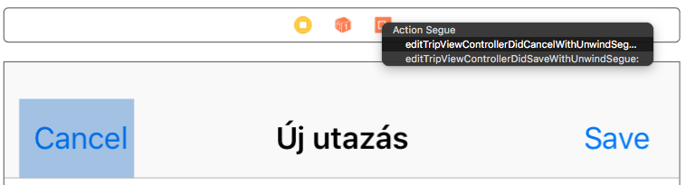

> Módosítsuk `tableView(_:cellForRowAt:)` metódusát, hogy az *image* kulcs esetén már egy kész képet olvasson ki az utazás adatait tároló dictionary-ból!

```swift
override func tableView(_ tableView: UITableView, cellForRowAt indexPath: IndexPath) -> UITableViewCell {
  let cell = tableView.dequeueReusableCell(withIdentifier: "TripsTableViewCell", for: indexPath)

  let tripData = tripsDataManager!.trips[indexPath.row] as! [String: AnyObject]
  cell.textLabel?.text = tripData["name"] as? String
  cell.detailTextLabel?.text = tripData["location"] as? String

  if let tripImageName = tripData["image-name"] as? String {
    cell.imageView?.image = UIImage(named: tripImageName)
  }

  if let tripImage: UIImage = tripData["image"] as? UIImage {
    cell.imageView?.image = tripImage
  }

  return cell
}
```

> Hasonló módon, a `TripDetailViewController`ben is adjuk hozzá a már létező kódhoz a `viewWillAppear(_:)` metódusban a következő `if let` szerkezetet (közvetlenül az `image-name`-es `if let` alá)!

```swift
if let tripImage = trip["image"] as? UIImage {
  tripImageView.image = tripImage
}
```

> Teszteljük az alkalmazást!
