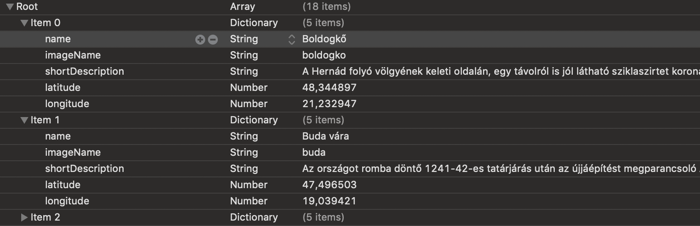
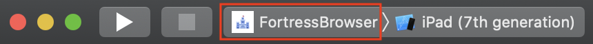
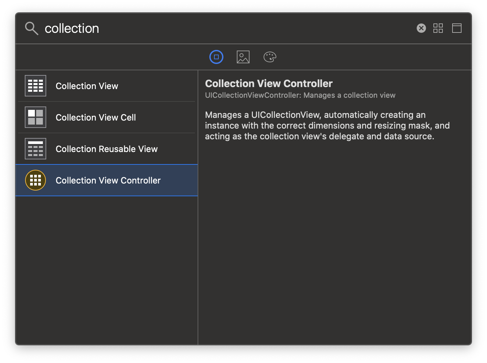
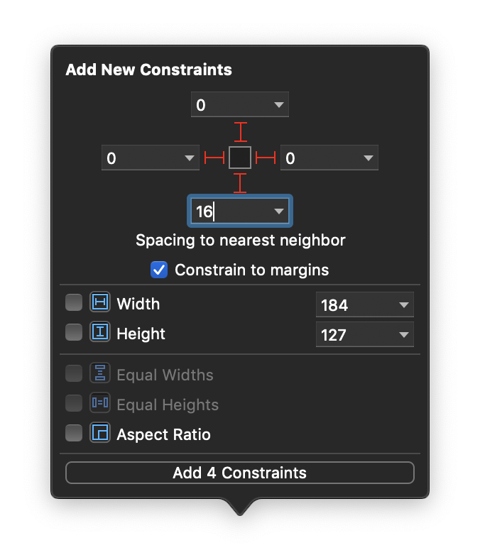
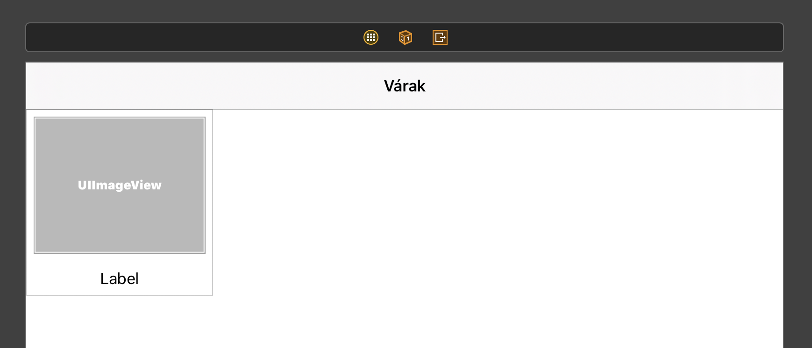

# `iOS` alapú szoftverfejlesztés - Labor `06`

## A labor témája

* [Vezetett labor](#fortress)
  * [Kezdőprojekt megismerése](#starter-project-overview)
    * [Fortress](#fortress-framework),
    * [Fortress Browser](#fortress-browser),
    * [Fortress Viewer](#fortress-viewer).
  * [Alkalmazások futtatása](#alkalmazasok-futtatasa)
  * [Kezdeti adatok betöltése](#kezdeti-adatok-betoltese)
  * [`CollectionView` elkészítése](#create-collectionview)
  * [Drag&Drop a `Collection View`-ban](#collection-view-drag-and-drop)
* [Önálló feladat](#onallo-feladat)
  * [FortressViewer: statikus `Table View`](#statikus-table-view)
  * [Drop implementálása](#table-view-drop)
* [Szorgalmi feladat](#szorgalmi-feladat)

A labor során két egyszerű iPad alkalmazást fogunk csinálni és az egyikből a másikba Drag&Drop segítségével adatokat exportálni. A labor során elkészítünk egy `Collection View`-t, egy statikus `Table View`-t, illetve használjuk a Drag&Drop API-t. Érdekességként előkerül egy `MapView` is, de ezzel egyelőre nem kell sokat foglalkozni.

# Fortress <a id="fortress"></a>

## Kezdőprojekt megismerése <a id="starter-project-overview"></a>


> Másoljuk a `res/Fortress` mappát a `~/Desktop/labor_06/` könyvtárba, majd nyissuk meg a `Fortress.xcworkspace` fájlt!

Ez a fájltípus abban különbözik az eddig megismert `.xcodeproj` fájloktól, hogy egy workspace-en belülre több projekt is kerülhet.

> Nézzük át a projektet és ismerkedjünk a meglévő kóddal!

A workspace-ben 3 projekt található:

* [Fortress](#fortress-framework),
* [Fortress Browser](#fortress-browser),
* [Fortress Viewer](#fortress-viewer).

### Fortress <a id="fortress-framework"></a>
Egy framework, amiben definiálva van a `Fortress` class és a hozzá tartozó protokollmegvalósítások, segédfüggvények. Itt találhatók továbbá a kezdeti adatok a `HungarianFortresses.plist` és az `Images.xcassets` katalógusban. A labor során ezekből az adatokból fogunk dolgozni.

A `HungarianFortresses.plist`et megnyitva a következő struktúrát láthatjuk.



### FortressBrowser <a id="fortress-browser"></a>
A képen látható bal oldali alkalmazás, a várak és a neveik egy `Collection View`-ban találhatók. Feladatunk létrehozni ezt a `Collection View`-t és feltölteni a rendelkezésre álló adatokkal, majd implementálni az átrendezés funkcionalitást, illetve azt, hogy az alkalmazásból ki lehessen húzni várakat.

### FortressViewer <a id="fortress-viewer"></a>
A képen látható jobb oldali alkalmazás, ide lehet húzni a bal oldalról a várakat, amit megjelenít. Felépítése egy statikus `Table View`, amit nekünk kell elkészíteni.

## Alkalmazások futtatása <a id="alkalmazasok-futtatasa"></a>
Ha az `Xcode workspace`-ünkben egyszerre több projekt is szerepel, akkor azokat egyesével kell build-elni és futtatni. 
> A használni kívánt projektet válasszuk ki a `scheme selector` segítségével: 


> A projekt kiválasztása után egyből szimulátort is választhatunk: 


## Kezdeti adatok betöltése <a id="kezdeti-adatok-betoltese"></a>

> Nyissuk meg a Fortress.swift fájlt a `Fortress Frameworkben` és a legaljára (az osztályon kívülre) illesszük be a következő kódrészletet!

```swift
extension Fortress {
  // Kiegészítjuk az osztályt egy új property-vel, ami betölti a plist tartalmát. Fortress.hungarianFortresses-kent fogjuk használni.
  public static var hungarianFortresses: [Fortress] {
    // Szerzünk egy referenciát a HungarianFortresses.plist fájlra, majd betöltjük a memóriába adatként és Fortress tömbbé dekódoljuk.
    guard let plistPath = fortressBundle.path(forResource: "HungarianFortresses", ofType: "plist"),
      let data = try? Data(contentsOf: URL(fileURLWithPath: plistPath)),
      let fortresses = try? PropertyListDecoder().decode([Fortress].self, from: data) else { return [] }

    // A sikeres dekódolás után ha nem volt hiba, akkor visszatérünk a várakkal.
    return fortresses
  }
}
```

> Nyissuk meg a `FortressCollectionViewController`t a `FortressBrowser project`ben  és `reuseIdentifier` property alá adjuk hozzá a következő property-t!
```swift
// Definiálunk egy Fortressekből álló tömböt, amibe rögtön bele is rakjuk az összes várat, amit a framework szolgáltat nekünk.
private var fortresses = Fortress.hungarianFortresses
```


## `CollectionView` elkészítése <a id="create-collectionview"></a>

> Nyissuk meg a `Main.storyboard`ot és adjunk hozzá a Library-ből egy `Collection View Controller`t a `Storyboard`unkhoz!




> Ágyazzuk be ezt a `Collection View Controller`t egy `Navigation Controller`be és állítsuk be a hozzá tartozó `Navigation Item` *Title* property-jét **Várak**ra! (*Embed in* gomb)


<!--  -->
> Állítsuk be a `Navigation Controller`re az *Attributes inspector*ban, hogy **Is Initial View Controller**.

<!--  -->
> Állítsuk be a `Collection View Controller` *Custom Class*át **FortressCollectionViewController**re az *Identity inspector*ban, illetve a *Size inspectorban* a *Cell Size*-ot **200x200**-ra!

<!--  -->
> Hozzunk létre egy új `Swift File`t **FortressCollectionViewCell** névvel és a tartalmát cseréljük le a következő pár sorra!
```swift
import UIKit

class FortressCollectionViewCell: UICollectionViewCell {

}
```

> Menjünk vissza a Main.storyboardba és állítsuk be a `Collection View Cell` *Custom Class*át **FortressCollectionViewCell**re az *Identity inspector*ban és a Collection Reusable View *Identifier*ét **FortressCollectionViewCell**re az *Attributes inspector*ban.

 


> Húzzunk be egy `Image View`-t és **alá** egy `Label`t a `Collection View Cell`be, majd állítsunk be pár AutoLayout constraintet! (*Add New Constraints* gomb)

 

> Állítsuk be az `Image View` *Content Mode*-ját **Aspect Fit**re, illetve rendezzük középre a `Label`t az *Alignment* beállítással!



<!--  -->
> Készítsünk egy-egy `Outlet`et az **`imageView`**-ra és a **`nameLabel`**-re a `FortressCollectionViewCell`ben!
```swift
@IBOutlet var imageView: UIImageView!
@IBOutlet var nameLabel: UILabel!
```

> Végül pedig menjünk át a `FortressCollectionViewController`be és valósítsuk meg a működéshez elengedhetetlen `UICollectionViewDataSource` metódusokat!

```swift
// MARK: UICollectionViewDataSource

override func collectionView(_ collectionView: UICollectionView, numberOfItemsInSection section: Int) -> Int {
  // Itt mondhatjuk meg a CollectionView-nak, hogy hány eleme legyen: annyi amennyi várunk van.
  return fortresses.count
}

override func collectionView(_ collectionView: UICollectionView, cellForItemAt indexPath: IndexPath) -> UICollectionViewCell {
  // A CollectionView-tól elkérünk egy **újrahasznált** cellát.
  let cell = collectionView.dequeueReusableCell(withReuseIdentifier: reuseIdentifier, for: indexPath) as! FortressCollectionViewCell

  // Kikeressük az adott pozícióhoz tartozó várat és a cella property-jeit beállítjuk.
  let fortress = fortresses[indexPath.row]
  cell.imageView.image = fortress.image
  cell.nameLabel.text = fortress.name

  // Végül pedig visszatérünk az újrahasznált cellával.
  return cell
}
```

A kommentben látható `MARK: ` "kulcsszó" segítségével a metódusainkat csoportokba rendezhetjük, egy elválasztót hozhatunk létre közéjük.

> Futtassuk az alkalmazásunkat egy `iPad (6th generation)` szimulátoron! (Futtatás után ne zárjuk be.)


<!--  -->

## Drag&Drop a `Collection View`-ban <a id="collection-view-drag-and-drop"></a>
A következőkben megvalósítjuk az áthelyezés lehetőségét a `Collection View`-ban drag and drop segítségével, illetve előkészítjük arra, hogy az egyes cellákat kihúzhassuk az alkalmazásból.

> Első lépésként valósítsuk meg a `UICollectionViewDragDelegate`-et! Illesszük be a következő extensiont a `FortressCollectionViewController` legaljára (az osztályon kívülre)!

```swift
extension FortressCollectionViewController: UICollectionViewDragDelegate {
  // MARK: UICollectionViewDragDelegate
  // Ez a delegate egyetlen kötelező metódusa, amit mindenképpen meg kell valósítani.
  func collectionView(_ collectionView: UICollectionView, itemsForBeginning session: UIDragSession, at indexPath: IndexPath) -> [UIDragItem] {
    // Kikeressük a szóban forgó várat, amit a felhasználó Drag&Dropolni szeretne.
    let fortress = fortresses[indexPath.row]

    // Becsomagoljuk a várat egy UIDragItembe, amit ez a metódus visszatérési értékként vár.
    let dragItem = UIDragItem(itemProvider: NSItemProvider(object: fortress))
    dragItem.localObject = fortress

    // Visszatérünk a becsomagolt várral
    return [dragItem]
  }
}
```

> A `viewDidLoad()`-ban a `super.viewDidLoad()` sor alá írjuk be a következő sorokat!

```swift
// Itt mondjuk meg a Collection View-nak, hogy mi valósítjuk meg a drag delegate-jét, minket hívjon meg.
collectionView.dragDelegate = self
```

> Próbáljuk ki az alkalmazást! Nyomjunk hosszan egy elemre: próbáljuk meg "felemelni" és arrébb húzni!

<!--  -->
> A következő lépésben bekapcsoljuk az átrendezés lehetőségét. Ehhez implementáljuk a `UICollectionViewDropDelegate`-et: illesszük be a következő extensiont a `FortressCollectionViewController` legaljára (az osztályon kívülre)!

```swift
extension FortressCollectionViewController: UICollectionViewDropDelegate {
  // UICollectionViewDropDelegate
  // Ezt a metódust hívja meg elsőször a rendszer amikor a felhasználó ráhúz valamit Collection View-ra.
  // Itt van lehetőségünk megmondani, hogy milyen adatot akarunk fogadni.
  func collectionView(_ collectionView: UICollectionView, canHandle session: UIDropSession) -> Bool {
    return session.canLoadObjects(ofClass: Fortress.self)
  }

  // Ezt a metódust a rendszer nagyon gyakran meghívja, amikor a draggelt elem mozog a Collection View-n belül.
  // Amennyiben az alkalmazáson belüli dragSessionünk van, akkor jelezzük a rendszernek, hogy mozgatni akarjuk az elemet. Egyébként nem akarunk semmit csinálni vele.
  func collectionView(_ collectionView: UICollectionView, dropSessionDidUpdate session: UIDropSession, withDestinationIndexPath destinationIndexPath: IndexPath?) -> UICollectionViewDropProposal {
    guard session.localDragSession != nil else {
      return UICollectionViewDropProposal(operation: .cancel)
    }
    return UICollectionViewDropProposal(operation: .move, intent: .insertAtDestinationIndexPath)
  }

  // A legfontosabb metódus, itt történik meg a drop, itt férünk hozzá az adathoz.
  // Meghatározzuk (elkérjük) a kezdő és a végpozíciót, majd frissítjük az adatmodellünket és a Collection View-t.
  func collectionView(_ collectionView: UICollectionView, performDropWith coordinator: UICollectionViewDropCoordinator) {
    guard let dropItem = coordinator.items.last, let destinationIndexPath = coordinator.destinationIndexPath, coordinator.session.localDragSession != nil else { return }

    if let sourceIndexPath = dropItem.sourceIndexPath, let fortress = dropItem.dragItem.localObject as? Fortress {
      collectionView.performBatchUpdates({
        fortresses.remove(at: sourceIndexPath.row)
        fortresses.insert(fortress, at: destinationIndexPath.row)
        collectionView.moveItem(at: sourceIndexPath, to: destinationIndexPath)
      }, completion: nil)
    }
    coordinator.drop(dropItem.dragItem, toItemAt: destinationIndexPath)
  }
}
```

> A `viewDidLoad()`-ba az előbb beírt sor alá rakjuk be ezt!

```swift
// Itt mondjuk meg a Collection View-nak, hogy mi valósítjuk meg a drop delegate-jét, minket hívjon meg.
collectionView.dropDelegate = self
```

> Próbáljuk ki az alkalmazást és helyezzünk át egy elemet!

# Önálló feladat <a id="onallo-feladat"></a>

## FortressViewer: statikus `Table View` <a id="statikus-table-view"></a>

A következő feladat a vár *detail* nézetének elkészítése a `Fortress Viewer` projektben. 


> Hozzunk létre egy új `Table View Controller`t, embeddeljük egy `Navigation Controller`be, majd állítsuk át a benne foglalt `Table View` *Content* property-jét **Static Cells**-re, és töröljük ki az automatikusan létrejött `Section Header` feliratokat.

<!--  -->
> Állítsuk be a *Sections*-t **`3`**-ra, a *Style*-t pedig **Grouped**ra!


> Ezek után módosítsuk a `Table View`-t oly módon, hogy az mindhárom szekcióban `1` **Custom** stílusú cella legyen (az egyes cellák *Style* property-jét kell állítgatni vagy csak ellenőrizni).

> Az első szekció cellájába adjunk hozzá egy `Image View`-t, a második szekció cellájához egy `Text View`-t, a harmadikhoz pedig egy `Map Kit View`-t. A cellák magasságát a *Size inspectorban* állítsuk **200, 150, 200**-ra, ebben a sorrendben!

> Adjunk meg `Auto Layout` kényszereket az `Image View`-hoz, mind a `Text View`-hoz és a `Map View`-hoz. Rögzítsük a szülő nézeteikhez néhány kényszer megadásával (pl. **0** távolság a szülő összes oldalától, a *Constrain to margins* bekapcsolása mellett).


> Az `Image View` *Content Mode* property-jét állítsuk **Aspect Fit**re!

<!--  -->
> A `Text View`-nak kapcsoljuk ki az *Editable* property-jét!

> A `Table View`-t kiválasztva a *Selection* property értékét állítsuk **No Selection**-re, hogy ne lehessen kijelölni a cellákat!


> A Library-ből húzzunk egy `Bar Button Item`et a `Navigation Item` bal oldalára, majd a *System Item* property-jét állítsuk **Trash**-re!


> Nyissuk meg a `FortressDetailViewController`-t és vegyünk fel `Outlet`eket a `3`, adatmegjelenítésre szolgálló nézethez és a Trash gombhoz (minden cellából azt a nézetet válasszuk ki, mely az egyedi adat megjelenítésére szolgál, és ezeket kössük be `Outlet`ekre)!

```swift
@IBOutlet var trashButton: UIBarButtonItem!
@IBOutlet var imageView: UIImageView!
@IBOutlet var descriptionTextView: UITextView!
@IBOutlet var mapView: MKMapView!
```

> Kössünk be egy `Action`t a kukához is `trashTapped` névvel, majd a metódusban hívjuk meg a `clearView()` metódust!

> Töltsük ki a `refreshViews(with:)` metódus hiányzó részét! A hiányzó két sorban állítsuk be az `imageView` képét és a `descriptionTextView` szövegét.

```swift
private func refreshView(with fortress: Fortress) {
  self.fortress = fortress
  navigationItem.title = fortress.name

  // Hiányzó két sor

  let annotation = MKPointAnnotation()
  annotation.title = fortress.name
  annotation.coordinate = fortress.coordinates
  mapView.addAnnotation(annotation)
  mapView.setRegion(MKCoordinateRegion(center: fortress.coordinates, latitudinalMeters: 10000, longitudinalMeters: 10000), animated: true)
}
```

> Nézzük meg hogyan néz ki üresen a `Table View`-nk!

## Drop implementálása <a id="table-view-drop"></a>
Végül utolsó lépésként készítsük fel a `Table View`-nkat `Fortress` objektumok fogadására.

```swift
extension FortressDetailViewController: UIDropInteractionDelegate {
  // MARK: - UIDropInteractionDelegate
  func dropInteraction(_ interaction: UIDropInteraction, canHandle session: UIDropSession) -> Bool {
    return session.canLoadObjects(ofClass: Fortress.self)
  }

  func dropInteraction(_ interaction: UIDropInteraction, sessionDidUpdate session: UIDropSession) -> UIDropProposal {
    return UIDropProposal(operation: .copy)
  }

  func dropInteraction(_ interaction: UIDropInteraction, performDrop session: UIDropSession) {
    session.loadObjects(ofClass: Fortress.self) { object in
      guard let fortress = object.last as? Fortress else { return }
      self.refreshView(with: fortress)
    }
  }
}
```

```swift
// Drop delegate beállítása
tableView.addInteraction(UIDropInteraction(delegate: self))
```

> Teszteljük az alkalmazást! Nyissuk meg egymás mellé a FortressBrowsert és a FortressViewert, majd a browserből húzzunk át egy várat a viewerbe!

# Szorgalmi feladat <a id="szorgalmi-feladat"></a>

## Egyedi Drag implementálása <a id="image-view-custom-drag"></a>

Van a projektben még egy eddig nem használt nézet, a `FortressDragPreview` fájlban definiálva. A feladat, hogy a FortressViewer `imageView`-jára engedélyezzük a draget és a drag előnézetének ezt a view-t használjuk.

> Kapcsoljuk be a draget az `imageView`-ra! Nem triviális, de ahhoz, hogy egy UIImageView-n működjön a drag, az interaction rárakásán kívül engedélyezni kell a felhasználói interakciót is!

```swift
imageView.isUserInteractionEnabled = true
// Interaction rárakása az imageView-ra...
```

> A `UIDragInteractionDelegate` protokoll kötelező, `dragInteraction(_:itemsForBeginning:)` implementálása után valósítsd meg a `dragInteraction(_:previewForLifting:session:)` metódust is! 

```swift
  func dragInteraction(_ interaction: UIDragInteraction, previewForLifting item: UIDragItem, session: UIDragSession) -> UITargetedDragPreview? {
    guard let fortress = fortress, let image = fortress.image else {
      return nil
    }

    // FortressDragPreview példányosítása egy 200x350-es téglalappal
    // dragPreview setContent(image:name:shortDescription) metódus meghívása

    return UITargetedDragPreview(view: dragPreview, parameters: UIDragPreviewParameters(), target: UIDragPreviewTarget(container: tableView, center: imageView.center))
  }
```

> Próbáld ki az alkalmazást és indíts egy drag sessiont az `imageView`-ról!

## Spring Loading <a id="spring-loading"></a>
Keresd meg és kapcsold be a kuka gombra a *Spring Loading*ot, ami lényegében annyit csinál, hogyha a gombra draggelsz valamit és ott tartod az ujjadat, akkor automatikusan meghívja a gomb akciómetódusát.

> Indíts egy drag sessiont az `imageView`-ról és húzd a kukára, majd tartsd ott az ujjad pár másodpercig!

## A laborsegédletet összeállította
* Krassay Péter - krassay.peter@autsoft.hu
* Varga Domonkos - varga.domonkos@autsoft.hu
* Dávid Márk Tamás - david.tamas@autsoft.hu
