# `iOS` alapú szoftverfejlesztés - Labor `07`

## A laborsegédletet összeállította
* Kántor Tibor - tibor.kantor@autsoft.hu
* Krassay Péter - peter.krassay@autsoft.hu

## A labor témája

* [Az `Auto Layout` bemutatása](#auto-layout-bemutatasa)
    * [Bejelentkezési ablak létrehozása](#bejelentkezesi-ablak-letrehozasa)
* [Adatok elmentése](#adatok-elmentese)
* [Scroll View használata](#scroll-view-hasznalata)
* [Önálló feladat: kezdő képernyő elkészítése](#onallo-feladat)

A labor célja az `Auto Layout` használatának a gyakorlása egy alkalmazás kezdeti képernyőin keresztül.

# Az `Auto Layout` bemutatása <a id="auto-layout-bemutatasa"></a>

## Bejelentkezési ablak létrehozása <a id="bejelentkezesi-ablak-letrehozasa"></a>
> Hozzunk létre egy `Single View Application`t **iAUT** névvel `iPhone`-ra.

<!--  -->
> A `res/` mappában található képeket húzzuk be az `Assets.xcassets` katalógusba.

<!--  -->
> A `Main.storyboard`ban ellenőrizzük, hogy aktuális méretként a `iPhone 6s` van-e kiválasztva. (A `storyboard` ezt a méretet fogja szimulálni nekünk.)


> A létrejött `ViewController`en lévő `View` *hátterét* állítsuk be valamilyen sötétebb színre, majd tegyünk be felülre egy `UITextField`et vízszintesen középre, használva a segédvonalakat!


> Futtassuk le az alkalmazást a szimulátorban és forgassuk el a kijelzőt!

A szimulátor elforgatásához nyomjuk le a `Cmd` gombot és valamelyik horizontális nyilat attól függően, hogy milyen irányba szeretnénk fordítani a szimulátort.

A `UITextField` sajnos nem maradt középen fekvő módban. Ha szeretnénk, hogy középen maradjon, akkor ehhez szükség van kényszerekre.

> Ahhoz, hogy horizontálisan középen maradjon adjunk hozzá egy kényszert, ami ezt biztosítja. Ehhez jelöljük ki a `UITextField`et és az `Align` menüből válasszuk ki a *Horizontal Center In Container*t!


> Kattintsunk az *Add 1 Constraint* gombra!

Ekkor megváltozik a nézetvezérlő képe és piros vonalak jelennek meg.


A piros vonalakkal az `Xcode` kényszerek hiányát jelzi. Amíg nem adtunk hozzá egyetlen kényszert sem, addig azokat a rendszer fordítási időben legenerálja az abszolút pozíció és méret alapján. Viszont azzal, hogy már egy kényszert hozzáadtunk a nézetünkhöz manuálisan, a rendszer már nem tudja, hogy milyen egyéb kényszereket generáljon magától. Ezt egyébként a `Document Outline` is pontosan mutatja.


> Kattintsunk rá a piros nyílra!


A hiba tehát az, hogy függőlegesen nem tudja meghatározni a `UITextField` pozícióját.

> Ehhez a `Pin` menüből állítsunk be, hogy a szülő nézet tetejétől mért távolsága *Standard* legyen!


> Ugyan már nem kapunk figyelmeztetést, de mivel egy nagyobb méretű `UITextField`re van szükségünk, ezért rögzítsük a méretét a `Pin` menü segítségével!


> Futtassuk az alkalmazást és forgassuk el a szimulátort! 

<!--  -->
> Állítsuk be a `UITextField` tulajdonságainál *placeholder*nek a **login** feliratot, majd tegyük lejjebb. Jelöljük ki, majd módosítsuk a *Top Layout Guide*-hoz rögzített kényszert a `Size inspector`ban, *konstansnak* állítsunk be **160**-at!

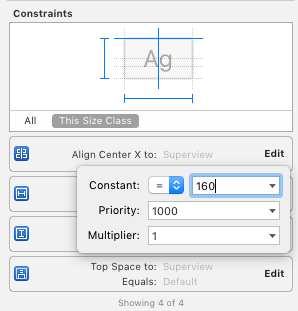

> Növeljük meg a `UITextField` horizontális méretét egészen a szaggatott vonalakig mindkét irányba!


Mivel explicit méret kényszerek vannak, így a narancssárga vonalakkal azt jelzi a rendszer, hogy futási időben hová fog kerülni az elem. Ahhoz, hogy megtudjuk, hogy pontosan hogyan néz ki az adott képernyő futási időben, nem muszáj folyton a szimulátorban futtatni az alkalmazást.

> Nyissuk meg az `Assistant Editor`t és a felső menüből válasszuk ki a `Preview` funkciót!


Az előnézetet a képernyő alatti ikonnal tudjuk elforgatni.


A bal alsó sarokban található `+` gombbal adjunk hozzá egy másik `iPhone 6s``Preview`-t, így mindkét tájolásban látjuk, hogy fog kinézni az alkalmazás.

Amennyiben az `Xcode` helyesen működik, látjuk, hogy hiába növeltük meg a méretet a `storyboard`ban, a kényszerek determinálják majd futási időben a méretet.

> Töröljük ki a méretre vonatkozó kényszereket! Ehhez jelöljük ki őket a tervezési területen vagy a `Size inspector`ban, majd nyomjuk meg a `Backspace` gombot.

<!--  -->
> A méret kényszerek helyett rögzítsük a szülő nézet széleitől mért távolságot!


> Próbáljuk ki az alkalmazást!

<!--  -->
> Tegyünk be alá egy másik `UITextField`et az alsó szaggatott vonalához igazítva!

<!--  -->
> Jelöljük ki mindkét `UITextField`et és a `Pin` menüből állítsuk be, hogy ugyanakkora legyen a szélességük!

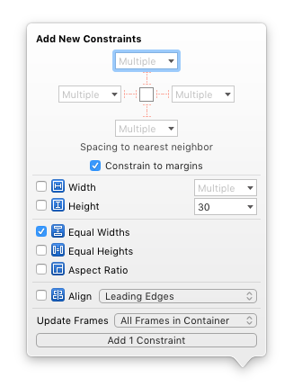

> Majd jelöljük ki az alsó `UITextField`et és rögzítsük a felette lévő `UITextField`től mért távolságát **8**-ra és a balszéltől mért távolságot **Standard**re!

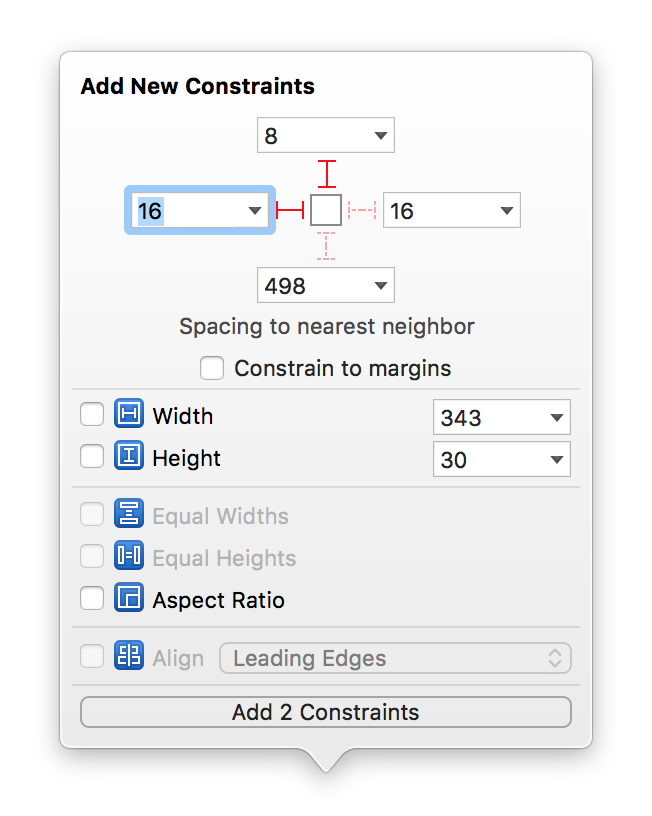

Az `Assistant Editor` `Preview`-jában látjuk, hogy jó helyre fog kerülni a két `UITextField`, de a `storyboard`ban még nincsenek a megfelelő pozícióban, amit a narancssárga vonalak jeleznek.

> Ahhoz, hogy a megfelelő pozícióba kerüljön a megfelelő mérettel, a `Resolve Auto Layout Issues` menüből válasszuk ki az `Update Frames` lehetőséget! (*All Views in View Controller*)

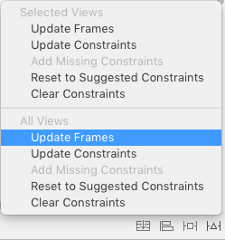

> A második `UITextField` tulajdonságainál állítsuk be *Placeholder*nek a **password**öt, és pipáljuk be a *Secure Text Entry*-t!

<!--  -->
> Rakjunk be egy `UILabel`t az alsó `UITextField` alá, a szövege legyen **Save username**! A pozíció és méret meghatározásához használjuk a következő kényszereket!
1. A bal oldalát igazítsuk a felette lévő `UITexField`hez (`Align` / *Leading Edges*)
2. A köztük lévő távolságot rögzítsük (`Pin` / *Vertical Spacing*) értéke legyen __Standard__!

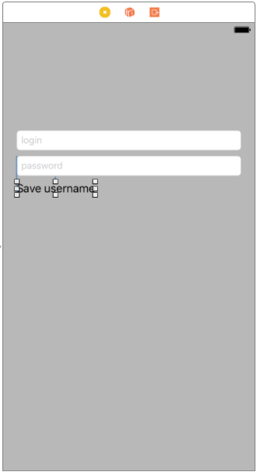

> Ezek után rakjunk be a `UILabel` mellé egy `UISwitch`-et és állítsuk be a következőket: 
1.  A két elem közepe, mindig egy vonalban legyen (`Align` / *Vertical Centers*) 
2.  Közöttük mindig **168** egységnyi távolság legyen! Ehhez a UILabelről indulva a Ctrl gomb lenyomása mellett húzzunk át a UISwitchre és válasszuk a *Horizontal Spacing* gombot, majd jelöljük ki az újonnan létrejött kényszert és a tulajdonságainál a konstansát állítsuk át **168**-ra!

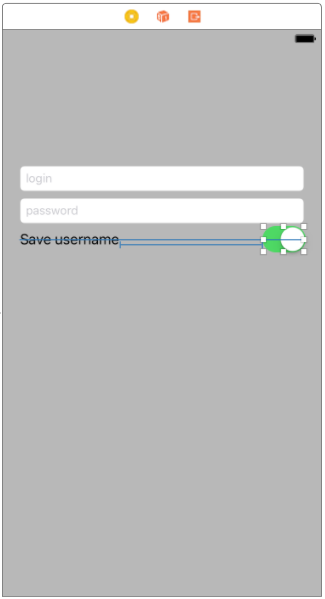

> Végül emeljünk be egy új gombot (`UIButton`) az elemek alá középre, a szövegét állítsuk **Switch Language**-re, és rögzítsük a távolságot a felette lévő password `UITextField`hez képest **36** egységre (`Pin` / *Vertical Spacing*). Ehhez válasszuk ki a megfelelő `UITextField`et a `Pin` menüben!

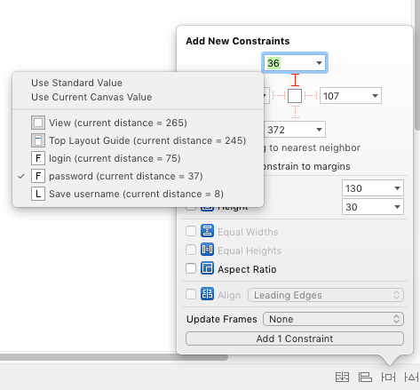

> Végül igazítsuk középre! (`Align` / *Horizontal Center in Container*)

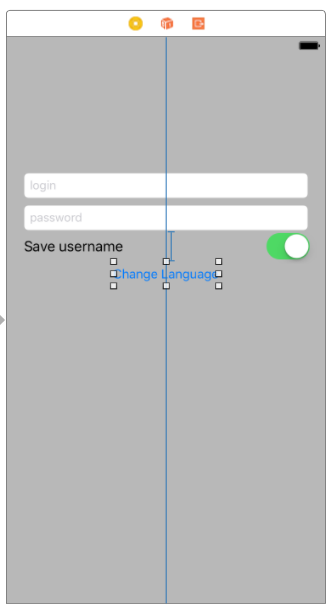

> Hozzunk létre egy új `LoginViewController`t és állítsuk ezt be a `storyboard`ban a nézetvezérlő osztályának (`Identity inspector`). (Ezután kitörölhetjük a `ViewController.swift` fájlt, ugyanis nem lesz rá szükségünk.)

<!--  -->
> Hozzunk létre egy `Outlet`et a `UIlabel`nek **saveUserNameLabel** néven. Vegyünk fel egy `Bool` típusú, *english* nevű változót, amit inicializáljuk **true**-val. 

<!--  -->
> Majd írjuk meg a gomblenyomás akció metódusát!

```swift
@IBAction func loginButtonTouchUpInside(_ sender: AnyObject) {
    saveUserNameLabel.text = english ? "Enregistrer le nom d'utilisateur" : "Save username"
    english = !english
}
```

> Futtassuk le az alkalmazást! Láthatjuk, hogy nagyjából elforgatva is jól néz ki! Azonban ha rákattintunk a *Switch Language* gombra, akkor a `UISwitch` álló módban "eltűnik", pedig nem történt más, mint kipróbáltuk az alkalmazást francia szöveggel.

Szerencsére az `Auto Layout` segítségével könnyedén tudjuk kezelni a dinamikus változásokat is a kényszerek prioritásai segítségével. Itt olyan kényszerekre van szükségünk, hogy “ha lehetőség van rá, akkor a label és a switch közti távolság legyen **168**, de a `UISwitch` és a képernyő széle között mindig legyen legalább **20** egységnyi távolság”. Az első kényszernek kisebb lesz a prioritása, mert a második kényszer fontosabb.

> Ehhez jelöljük ki a `UISwitch`-et és rögzítsük a `View` jobb széle és a közte lévő távolságot (`Pin` / *Trailing Space To Superview*), állítsuk be, hogy az érték legalább ekkora legyen (*Relation*: **Greater Than Or Equal**) illetve, állítsuk be a *konstanst* **0**-ra!
> A kettő közti távolság kényszerének a *prioritását* vegyünk le **900**-ra, a *konstansát pedig egy kisebb értékre, **50**-re!

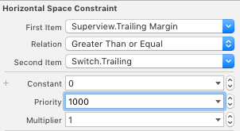 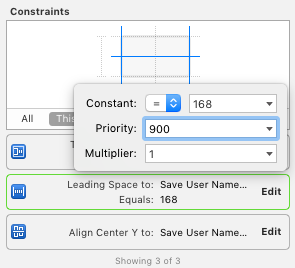

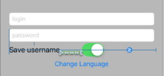

> Próbáljuk ki az alkalmazást ismét!

<!--  -->
> Tegyünk be egy `UIImageView`-t a `UITextField` fölé **335x150**-es méretben középre!
> Adjunk hozzá egy középre rendezést biztosító kényszert (`Align` / *Horizontal Center In Container*), majd rögzítsük a méreteit (`Pin` / *Width* és *Height*)
> Végül pedig a *Top Layout Guide*-tól mért távolsága legyen **0** (`Pin` / *Top Layout Guide*).

<!--  -->
> Ezek után a felső `UITextField`hez adjuk hozzá egy kényszert, ami a képtől mért távolságot rögzíti **15** egységre.

Ez ellentmond a `UITextField` másik kényszerének, ami *Top Layout Guide*-tól miért távolságát rögzíti, ezt piros színnel jelzi a rendszer.

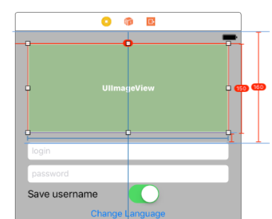

Ha futtatjuk az alkalmazást, akkor hiba nélkül fut, ugyanakkor a konzolban láthatjuk, hogy a kényszereink egy időben nem teljesíthetők.

> Töröljük hát a *Top Layout Guide* és a `UITextField` teteje közti távolság kényszert!

Mivel minden elem a felső `UITextField`-hez igazodik, így rossz helyen vannak, ahogy azt a Document Outline is mutatja. 

> Ahhoz, hogy minden elem a helyére kerüljön, jelöljük ki a teljes `View Controller`-t és a `Resolve Auto Layout Issues` menüből válasszuk az `Update frames`-et!

<!--  -->
> Képnek állítsuk be a sötétebbik `AUT` logót!

<!--  -->
> Futtassuk az alkalmazást és kattintsunk bele a `UITextField`ekbe. (Ha nem jelenne meg a billentyűezet, akkor nyomjuk meg a `Cmd+K` billentyűkombinációt, vagy a `Simulator` menüjéből válasszuk ki a `Hardware/Keyboard/Toggle Software Keyboard` menüpontot.)

Azt látjuk, hogy `landscape` módban mindkét `UITextField`et kitakarja a billentyűzet.

Erre a legegyszerűbb megoldás, ha billentyűzet megjelenésekor minden elemet feltolunk. Függőlegesen minden elem valójában a `UIImageView`-hoz igazodik, így ennek a pozícióját kell megváltoztatni annak megfelelően, hogy megjelenik a billentyűzet.

> Vegyünk fel egy `Outlet`et a kép *Top Layout Guide* kényszeréhez! Ehhez jelöljük ki a kényszert, majd a szokásos módon húzzuk át a fájlba az `Assistant Editor`ban. Az `Outlet` neve legyen *imageViewTopConstraint*.

<!--  -->
> Továbbá vegyünk fel még egy `Outlet`et az alsó `UITextField`hez *passwordTextField* néven!

<!--  -->
> Ezek után iratkozzunk fel, illetve le a billentyűzet megjelenése és eltűnése rendszer eseményekre a `viewWillAppear(_:)` és `viewVillDisapear(_:)` metódusokban!

```swift
override func viewWillAppear(_ animated: Bool) {
  super.viewWillAppear(animated)
  NotificationCenter.default.addObserver(self, selector: #selector(LoginViewController.keyboardWillShow), name: .UIKeyboardWillShow, object: nil)
  NotificationCenter.default.addObserver(self, selector: #selector(LoginViewController.keyboardWillHide), name: .UIKeyboardWillHide, object: nil)
}

override func viewWillDisappear(_ animated: Bool) {
  super.viewWillDisappear(animated)
  NotificationCenter.default.removeObserver(self)
}
```

> Valósítsuk meg a két függvényt!

```swift
func keyboardWillShow(notification: Notification) {
  if let userInfo = notification.userInfo, let keyboardSize = (userInfo[UIKeyboardFrameBeginUserInfoKey] as? NSValue)?.cgRectValue {
    if passwordTextField.frame.maxY > (view.frame.height - keyboardSize.height) {
      imageViewTopConstraint.constant = -1 * (passwordTextField.frame.maxY - (view.frame.height - keyboardSize.height))
    }
  }
}

func keyboardWillHide(notification: Notification) {
  imageViewTopConstraint.constant = 0
}
```

> Végül pedig vegyük fel a `UITextField` eltűntetésért felelő *DidEndOnExit* esemény metódusát és kössük be mindkét `UITextField`hez!

<!--  -->
> Próbáljuk ki az alkalmazást!

Sokat javít a felhasználói élményen, ha a konstans beállítás nem azonnal, hanem animálva történik.

```swift
func keyboardWillShow(notification: Notification) {
  if let userInfo = notification.userInfo,
    let keyboardSize = (userInfo[UIKeyboardFrameBeginUserInfoKey] as? NSValue)?.cgRectValue,
    let duration = (userInfo[UIKeyboardAnimationDurationUserInfoKey] as? NSNumber)?.doubleValue {
    if passwordTextField.frame.maxY > (view.frame.height - keyboardSize.height) {
      UIView.animate(withDuration: duration, animations: {
        self.imageViewTopConstraint.constant = -1 * (self.passwordTextField.frame.maxY - (self.view.frame.height - keyboardSize.height))
        self.view.layoutIfNeeded()
      })
    }
  }
}

func keyboardWillHide(notification: Notification) {
  if let userInfo = notification.userInfo,
    let duration = (userInfo[UIKeyboardAnimationDurationUserInfoKey] as? NSNumber)?.doubleValue {
    UIView.animate(withDuration: duration) {
      self.imageViewTopConstraint.constant = 0
      self.view.layoutIfNeeded()
    }
  }
}
```

Elképzelhető, hogy az animációk nem jelennek meg szépen a szimulátorban, aki teheti érdemes eszközön tesztelnie!

# Adatok elmentése <a id="adatok-elmentese"></a>
Az `Auto Layout`tól való pihenésképpen valósítsuk meg, hogy a felhasználónév mentése valóban működjön! Ehhez a `NSUserDefaults`ot fogjuk használni az adatok tárolására. 

> Először változtassuk meg a gomb címkéjét **Login**ra.

<!--  -->
> Hozzunk létre a `UISwitch`-hez egy *saveUsernameSwitch* `Outlet`et, illetve kössük be a login `UITextField`et is *usernameTextField* névvel! A gombnyomás implementációját pedig cseréljük le!

```swift
@IBAction func loginButtonTouchUpInside(_ sender: AnyObject) {
  let alertController = UIAlertController(title: "Successful login!", message: "Congratulation!", preferredStyle: .alert)
  let defaultAction = UIAlertAction(title: "OK", style: .default, handler: nil)
  alertController.addAction(defaultAction)
  present(alertController, animated: true, completion: nil)

  UserDefaults.standard.set(saveUsernameSwitch.isOn, forKey: "usernameSaved")
  if saveUsernameSwitch.isOn {
    UserDefaults.standard.set(usernameTextField.text, forKey: "username")
  }
}
```

> Végül a `viewDidLoad()`-ot is frissítsük!

```swift
override func viewDidLoad() {
  super.viewDidLoad()

  saveUsernameSwitch.setOn(UserDefaults.standard.bool(forKey: "usernameSaved"), animated: false)
  if saveUsernameSwitch.isOn {
    usernameTextField.text = UserDefaults.standard.value(forKey: "username") as? String
  }
}
```

> Próbáljuk ki az alkalmazást! Ne felejtsünk el rányomni a gombra a mentéshez.

# Scroll View használata <a id="scroll-view-hasznalata"></a>
> Tegyünk be egy új `ViewController`t amit állítsunk be kezdő `ViewController`nek (*Initial View Controller*)! A `ViewController` tulajdonságainál kapcsoljuk ki az *Adjust Scroll View Insets* property-t!

<!--  -->
> A gyökérnézetbe helyezzünk el egy `UIScrollView`-t, úgy, hogy kitöltse a teljes rendelkezésre álló területet és állítsunk be olyan kényszereket, hogy minden oldala és a szülő nézet oldala közötti távolság **0** legyen!


> Tegyünk be egy `UIImageView`-t felülre és állítsuk be háttérképnek a `BMEQBuilding.jpeg` képet!

<!--  -->
> A `UIImageView`-n alkalmazzuk a következő kényszereket:
1. A kép teteje a `UIScollView` tetejétől **Standard** távolságra legyen!
2. Rögzítsük a kép arányait (`Pin` / *Aspect Ratio*)
3. A szélessége legyen egyenlő a gyökér `View` szélességével

<!--  -->
> Helyezzünk be egy `UILabel`t a kép alá!

> A `UILabel` tulajdonságainál állítsuk be, hogy több soros szöveget tartalmaz. Ehhez a *Line Break* mode-ot állítsuk **Word Wrap**re, a *Lines*t pedig **0**-ra!

<!--  -->
> Alkalmazzuk a következő kényszereket a `UILabel`en:
1. A `UILabel` és a `UIImageView` között legyen **10** egység
2. A `UILabel` és a szülő nézet szélei között legyen **10** egység

<!--  -->
> A `UILabel` szövegének állítsuk be a `AUT` portálon lévő [*Rólunk*](https://www.aut.bme.hu/Pages/AboutUs) szövegét 2x!

Ha futtatjuk az alkalmazást, akkor a nézet nem görgethető... Erre az `Interface Builder` is felhívja a figyelmet.


Ahhoz, hogy a `Scroll View` ki tudja számolni, hogy görgethetővé kell-e tennie a benne lévő területet, meg kell tudnia pontosan határozni, hogy mekkora a benne lévő tartalom.

> Ehhez rögíztsük a `UIImageView` széleit a szülő nézet széleihez és a `UILabel` alját **10** egységnyire a szülő nézet aljához.

<!--  -->
> Próbáljuk ki az alkalmazást! Forgassuk el, látjuk, hogy mindkét formában scrollozható.

<!--  -->
> Ágyazzuk be egy `UINavigatonController`be a nézetvezérlőt. Ekkor a teljes nézet lejjebb csúszik, mivel megváltozik a *Top Layout Guide*.

# Önálló feladat: kezdő képernyő elkészítése <a id="onallo-feladat"></a>
> Készítsük el a következő képernyőt `Auto Layout` kényszerek segítségével és valósítsuk meg a gombok működését!

Segítség a képernyő felépítéséhez:

* Alapja kettő azonos magasságú konténer `UIView`, amely szélességében kitölti a rendelkezésre álló teret és a köztük lévő távolság **0**.
* A felső konténer `UIView` háttere vörös (*RGB:* **124, 6, 64**) az alsójé szürke (*RGB:* **102, 102, 102**).
* A felső konténer tartalmaz egy képet, amely kitölti a rendelkezésre álló területet, ugyanakkor nem torzítja a képet.
* Az alsó konténer két középre rendezett gombot tartalmaz, amely vertikális pozíciója is rögzített.
* Az alsó konténer tartalmaz továbbá egy alulra pozícionált **© Minden jog fenntartva. BME AUT** szöveget.
