# `iOS` alapú szoftverfejlesztés - Labor `07`

## A laborsegédletet összeállította
* Kántor Tibor - tibor.kantor@autsoft.hu
* Krassay Péter - peter.krassay@autsoft.hu
* Szücs Zoltán - szucs.zoltan@autsoft.hu

## A labor témája

* [Az `Auto Layout` bemutatása](#auto-layout-bemutatasa)
    * [Bejelentkezési ablak létrehozása](#bejelentkezesi-ablak-letrehozasa)
* [Adatok elmentése](#adatok-elmentese)
* [Scroll View használata](#scroll-view-hasznalata)
* [Önálló feladat: kezdő képernyő elkészítése](#onallo-feladat)

A labor célja az `Auto Layout` használatának a gyakorlása egy alkalmazás kezdeti képernyőin keresztül.

# Az `Auto Layout` bemutatása <a id="auto-layout-bemutatasa"></a>

## Bejelentkezési ablak létrehozása <a id="bejelentkezesi-ablak-letrehozasa"></a>
> Hozzunk létre egy `Single View App`ot **iAUT** névvel a `labor_07` könyvtárba!

<!--  -->
> Állítsuk a `Devices` beállítást `iPhone`-ra (`Target` beállítások, `Deployment Info` szekció). 

<!--  -->
> A `res` mappában található képeket húzzuk be az `Assets.xcassets` katalógusba.

<!--  -->
> A `Main.storyboard`ban állítsuk be a megjelenített eszközt **`iPhone X`**-re. (A `Storyboard` ezt a méretet fogja szimulálni nekünk.)

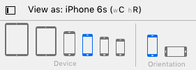

> A létrejött `View Controller`en lévő `View` *hátterét* állítsuk be valamilyen sötétebb színre, majd tegyünk be felülre egy `Text Field`et vízszintesen középre, használva a segédvonalakat!

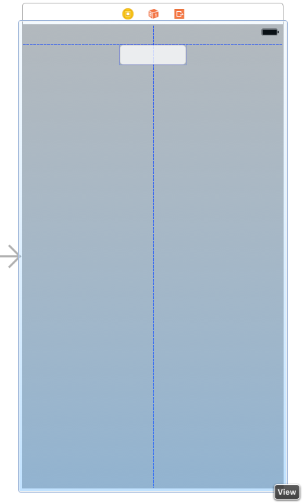

> Futtassuk le az alkalmazást a szimulátorban (ne felejtsük el kiválasztani az `iPhone X` szimulátort) és forgassuk el a kijelzőt!

A szimulátor elforgatásához nyomjuk le a `⌘` + `→` vagy a `⌘` + `←` billentyűkombinációt, attól függően, hogy milyen irányba szeretnénk fordítani a szimulátort.

A `Text Field` sajnos nem maradt középen fekvő módban. Ha szeretnénk, hogy középen maradjon, akkor szükség lesz kényszerekre.

> Ahhoz, hogy horizontálisan középen maradjon a nézetünk, adjunk hozzá egy kényszert, ami ezt biztosítja. Ehhez jelöljük ki a `Text Field`et és az `Align` menüből válasszuk ki a **`Horizontally in Container`**t, a konstans értéke legyen **0**!

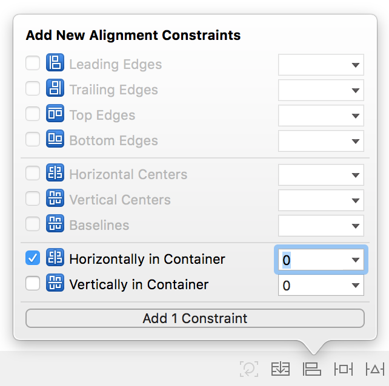

> Kattintsunk az *Add 1 Constraint* gombra!
>

Ekkor megváltozik a nézetvezérlő képe és piros vonalak jelennek meg.

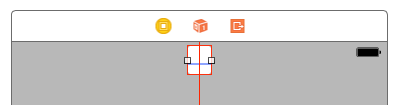

A piros vonalakkal az `Xcode` kényszerek hiányát jelzi. Amíg nem adtunk hozzá egyetlen kényszert sem, addig azokat a rendszer fordítási időben legenerálja az abszolút pozíció és méret alapján. Azzal, hogy egy kényszert manuálisan hozzáadtunk a nézetünkhöz, a rendszer már nem tudja, hogy milyen egyéb kényszereket generáljon automatikusan/magától. Ezt egyébként a `Document Outline` is mutatja.

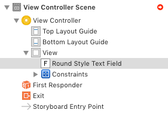

> Kattintsunk rá a piros nyílra!

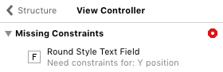

A hiba tehát az, hogy az `Auto Layout` motor függőlegesen nem tudja meghatározni a `Text Field` pozícióját.

> Ehhez a `Pin` menüből állítsunk be, hogy a `Safe Area` tetejétől (a legördülőből ki kell választani) mért távolsága **0** legyen! (A `Constrain to margins` legyen kikapcsolva!)

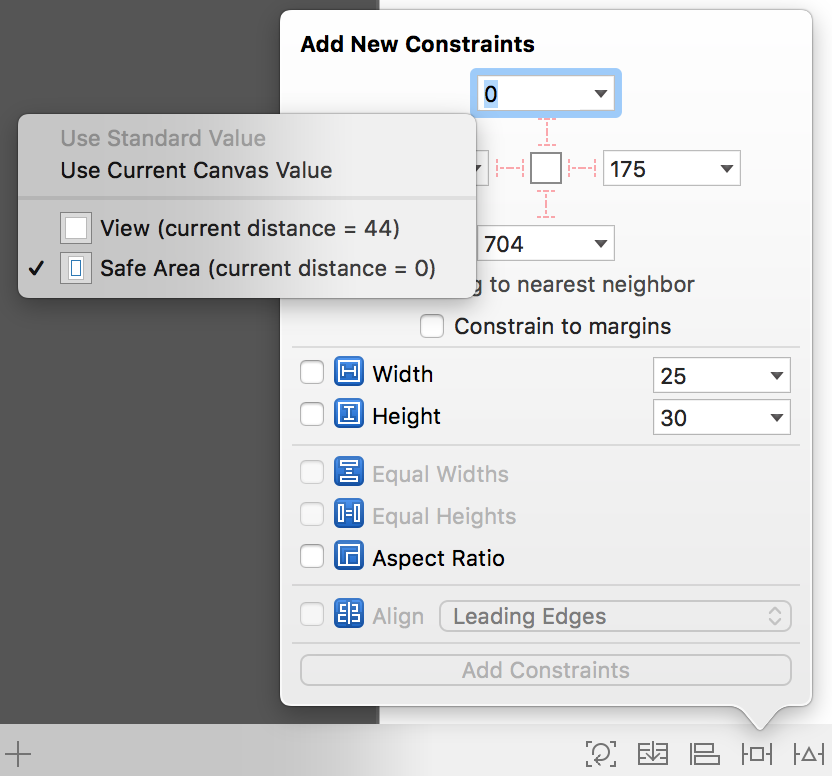

> Ugyan már nem kapunk figyelmeztetést, de mivel egy nagyobb méretű `Text Field`re van szükségünk, ezért rögzítsük a méretét a `Pin` menü segítségével!

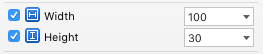

> Futtassuk az alkalmazást és forgassuk el a szimulátort! 

<!--  -->
> Állítsuk be a `Text Field` tulajdonságainál *Placeholder*nek a **login** feliratot, majd tegyük lejjebb. Ehhez jelöljük ki, majd módosítsuk a `Safe Area`hoz rögzített kényszert a `Size inspector`ban, *konstansnak* állítsunk be **160**-at!

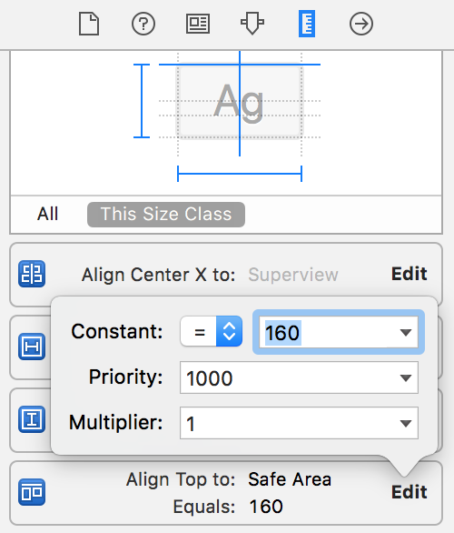

> Növeljük meg a `Text Field` horizontális méretét egészen a szaggatott vonalakig mindkét irányba!

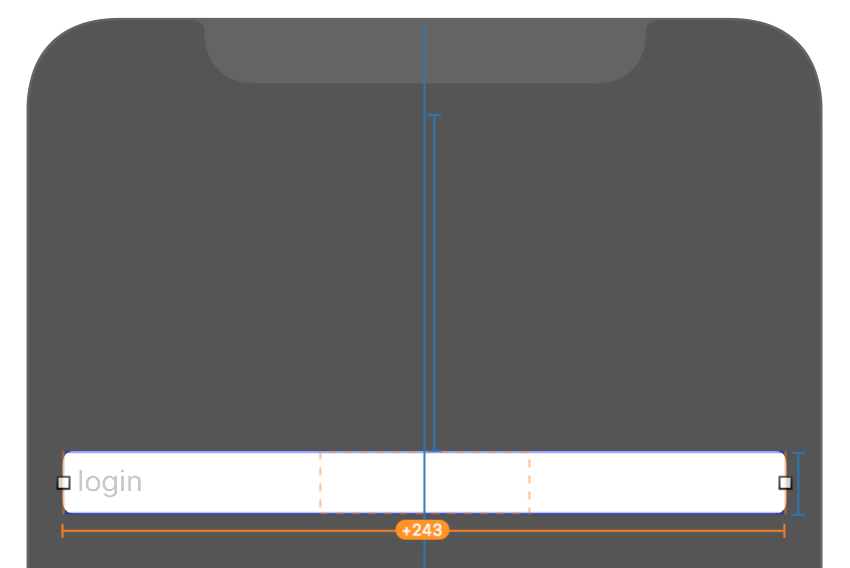

Mivel explicit méret kényszerek vannak, így a narancssárga vonalakkal azt jelzi a rendszer, hogy futási időben hová fog kerülni az elem. Ahhoz, hogy megtudjuk, hogy pontosan hogyan néz ki az adott képernyő futási időben, nem muszáj folyton a szimulátorban futtatni az alkalmazást.

> Nyissuk meg az `Assistant Editor`t és a felső menüből válasszuk ki a `Preview` funkciót!

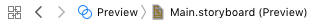

Az előnézetet a képernyő alatti ikonnal tudjuk elforgatni.

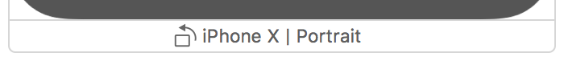

A bal alsó sarokban található `+` gombbal adjunk hozzá egy másik `iPhone X` `Preview`-t, így mindkét tájolásban látjuk, hogy fog kinézni az alkalmazás.

Láthatjuk, hogy hiába növeltük meg a méretet a `Storyboard`ban, a kényszerek határozzák majd meg futási időben a méretet.

> Töröljük ki a méretre vonatkozó kényszereket! Ehhez jelöljük ki őket a tervezési területen, a `Document Outline`on, vagy a `Size inspector`ban, majd nyomjuk meg a `Backspace` gombot.

<!--  -->
> A méret kényszerek helyett rögzítsük a `Safe Area` széleitől mért távolságot **16**-ra!

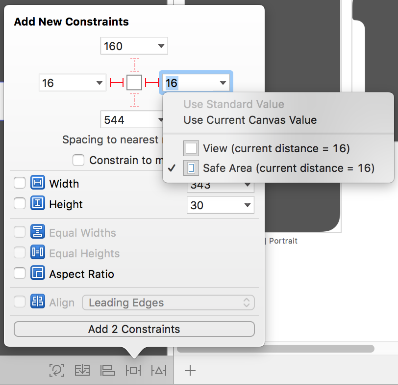

> Próbáljuk ki az alkalmazást!

<!--  -->
> Tegyünk be alá egy másik `Text Field`et az alsó szaggatott vonalához igazítva!

<!--  -->
> Jelöljük ki mindkét `Text Field`et és a `Pin` menüből állítsuk be, hogy ugyanakkora legyen a szélességük, és ugyanott legyen a bal oldaluk (`Align` / **`Leading Edges`**)!

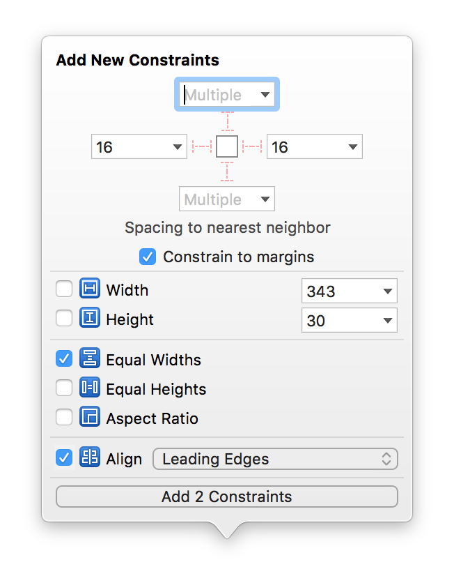

> Majd jelöljük ki az alsó `Text Field`et és rögzítsük a felette lévő `Text Field`től mért távolságát **8**-ra!

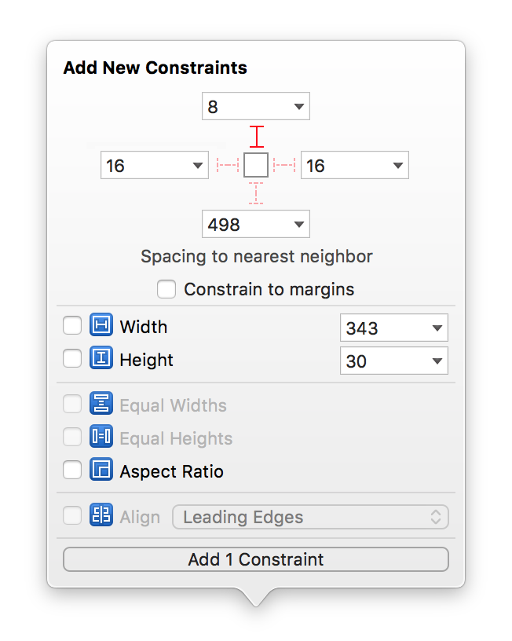

> A második `Text Field` tulajdonságainál állítsuk be *Placeholder*nek a **password**öt, és pipáljuk be a *Secure Text Entry*-t!

<!--  -->
> Rakjunk be egy `Label`t az alsó `Text Field` alá, a szövege legyen **Save username**! A pozíció és méret meghatározásához használjuk a következő kényszereket!
>
1. A bal oldalát igazítsuk a felette lévő `Text Field`hez (`Align` / **`Leading Edges`**)
2. A köztük lévő távolságot rögzítsük (`Pin` / **`Vertical Spacing`**) értéke legyen __Standard__!

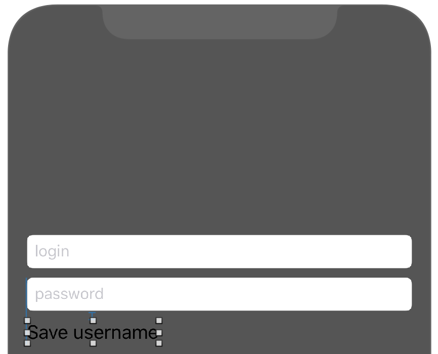

> Ezek után rakjunk be a `Label` mellé egy `Switch`-et és állítsuk be a következőket.
> 
1.  A két elem közepe mindig egy vonalban legyen (`Align` / **`Vertical Centers`**) 
2.  Közöttük mindig **176** egységnyi távolság legyen! Ehhez a `Label`ről indulva a `Ctrl` gomb lenyomása mellett húzzunk át a `Switch`-re és válasszuk a **`Horizontal Spacing`** gombot, majd jelöljük ki az újonnan létrejött kényszert és a tulajdonságainál a konstansát állítsuk át **176**-ra!

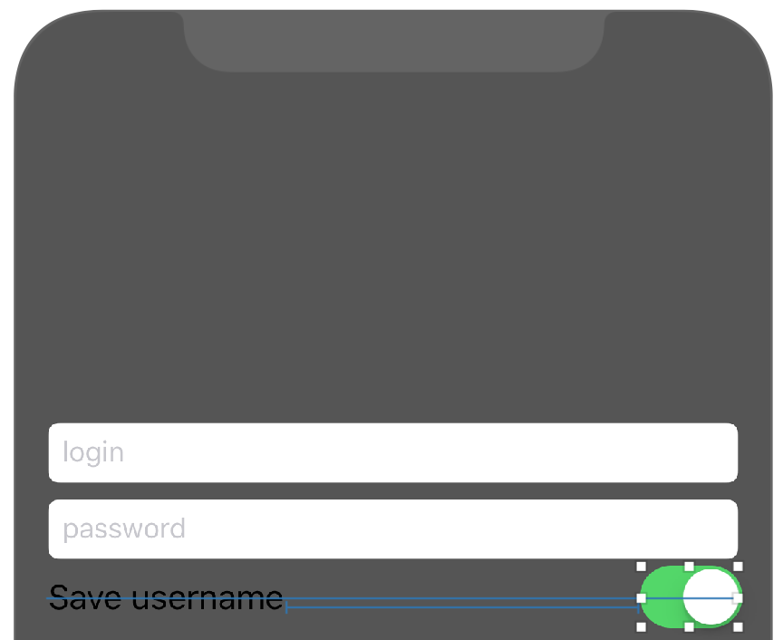

> Végül emeljünk be egy új gombot (`Button`) az elemek alá középre, a szövegét állítsuk **Switch Language**-re, és rögzítsük a távolságot a felette lévő password `Text Field`hez képest **36** egységre (`Pin` / **`Vertical Spacing`**). Ehhez válasszuk ki a megfelelő `Text Field`et a `Pin` menüben!

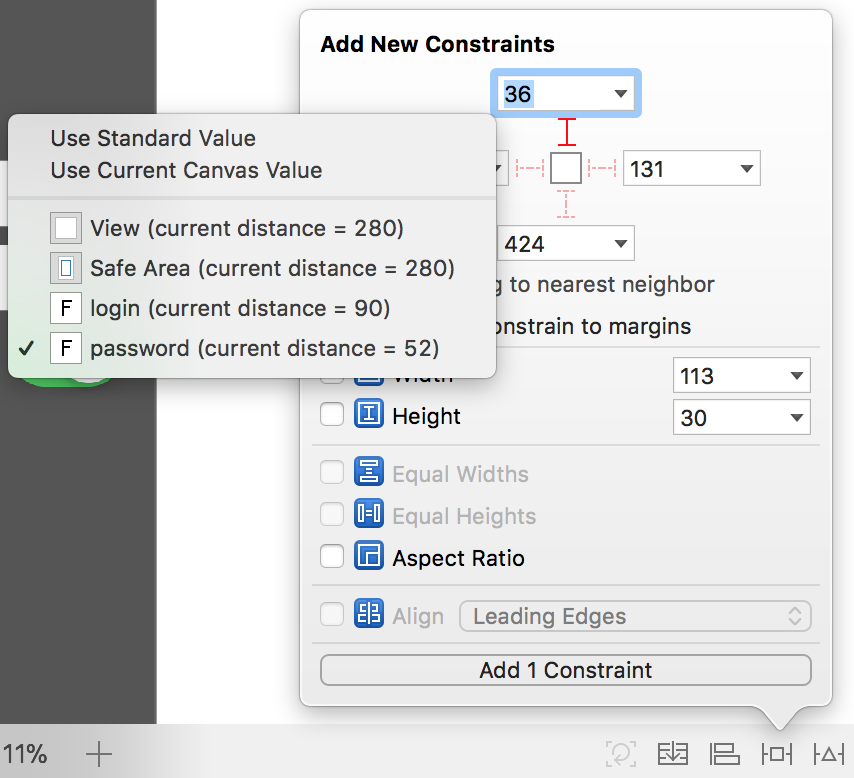

> Végül igazítsuk középre! (`Align` / **`Horizontally in Container`**, **0** konstans értékkel.)

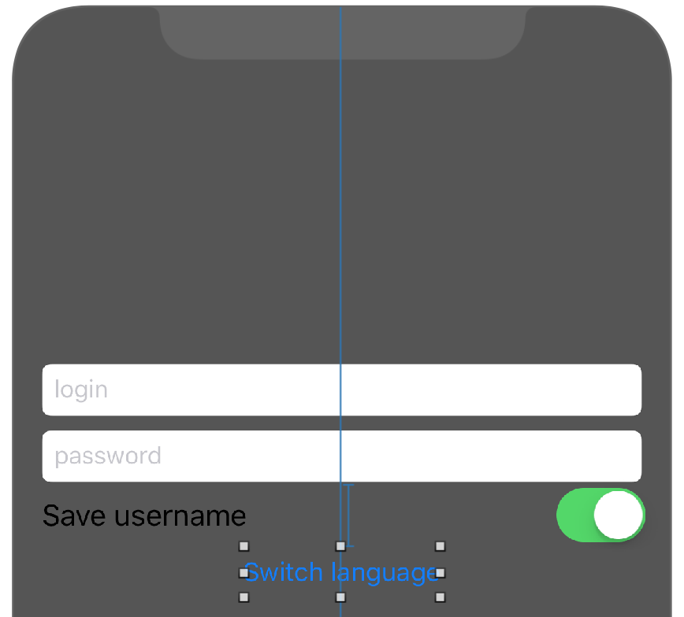

> Hozzunk létre egy új **`LoginViewController`** osztályt és állítsuk ezt be a `Storyboard`ban a nézetvezérlő osztályának (`Identity inspector`). (Ezután kitörölhetjük a `ViewController.swift` fájlt, ugyanis nem lesz rá szükségünk.)

<!--  -->
> Hozzunk létre egy `Outlet`et a `Label`nek **saveUsernameLabel** néven. Vegyünk fel egy `Bool` típusú, *english* nevű `private` láthatóságú változót, és inicializáljunk **true**-val.

```swift
private var english = true
```

<!--  -->
> Majd írjuk meg a gomblenyomás akció metódusát!

```swift
@IBAction func loginButtonTouchUpInside(_ sender: Any) {
    saveUsernameLabel.text = english ? "Enregistrer le nom d'utilisateur" : "Save username"
    english = !english
}
```

> Futtassuk le az alkalmazást! Láthatjuk, hogy nagyjából elforgatva is jól néz ki! Azonban ha rákattintunk a *Switch Language* gombra, akkor a `Switch` álló módban "eltűnik", pedig nem történt más, mint kipróbáltuk az alkalmazást francia szöveggel.

Szerencsére az `Auto Layout` segítségével könnyedén tudjuk kezelni a dinamikus változásokat is a kényszerek prioritásai segítségével. Itt olyan kényszerekre van szükségünk, hogy “ha lehetőség van rá, akkor a `Label` és a `Switch` közti távolság legyen valamekkora, de a `Switch` és a képernyő széle között mindig legyen legalább **16** egységnyi távolság”. Az első kényszernek kisebb lesz a prioritása, mert a második kényszer fontosabb.

> Ehhez jelöljük ki a `Switch`-et és rögzítsük a `View` jobb széle és a közte lévő távolságot (`Pin` / **`Trailing Space To Superview`**), állítsuk be, hogy az érték legalább ekkora legyen (*Relation*: **Greater Than Or Equal**), illetve állítsuk be a *konstanst* **16**-ra!
> A kettő közti távolság kényszerének a *prioritását* vegyünk le **750**-ra, a *konstans*át pedig egy kisebb értékre, **50**-re!

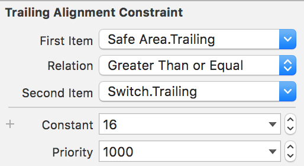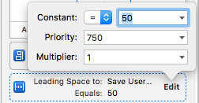

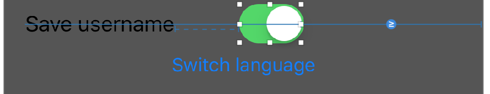

> Próbáljuk ki az alkalmazást ismét!

<!--  -->
> Tegyünk be egy `Image View`-t a `Text Field` fölé **343x150**-es méretben középre!
> Adjunk hozzá egy középre rendezést biztosító kényszert (`Align` / **`Horizontally in Container`**), majd rögzítsük a méreteit (`Pin` / **`Width`** és **`Height`**)
> Végül pedig a `Safe Area` tetejétől mért távolsága legyen **8** (`Pin`).

<!--  -->
> Ezek után a felső `Text Field`hez adjuk hozzá egy kényszert, ami a képtől mért távolságot rögzíti **15** egységre.

Ez ellentmond a `Text Field` másik kényszerének, ami `Safe Area` tetejétől miért távolságát rögzíti, ezt piros színnel jelzi a rendszer.

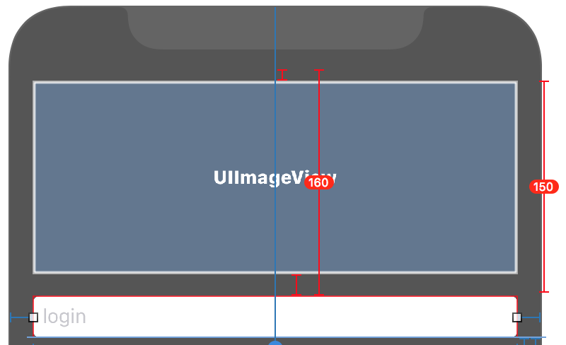

Ha futtatjuk az alkalmazást, akkor hiba nélkül fut, ugyanakkor a konzolban láthatjuk, hogy a kényszereink egy időben nem teljesíthetők.

> Töröljük hát a `Safe Area` és a `Text Field` teteje közti távolság kényszert!

<!--  -->
> Képnek állítsuk be a sötétebbik `AUT` logót, és állítsuk a `Content Mode`-ot **`Aspect Fit`**re!

<!--  -->
> Futtassuk az alkalmazást és kattintsunk bele a `Text Field`ekbe. (Ha nem jelenne meg a billentyűezet, akkor nyomjuk meg a `⌘` + `K` billentyűkombinációt, vagy a `Simulator` menüjéből válasszuk ki a `Hardware/Keyboard/Toggle Software Keyboard` menüpontot.)

Azt látjuk, hogy `landscape` módban az alsó `Text Field`et kitakarja a billentyűzet.

Erre a legegyszerűbb megoldás, ha billentyűzet megjelenésekor minden elemet feltolunk. Függőlegesen minden elem valójában a `Image View`-hoz igazodik, így ennek a pozícióját kell változtatni a billentyűzet láthatóságának függvényében.

> Vegyünk fel egy `Outlet`et a kép `Safe Area` kényszeréhez! Ehhez jelöljük ki a kényszert, majd a szokásos módon húzzuk át a `LoginViewController.swift` fájlba az `Assistant Editor`ban. Az `Outlet` neve legyen **`imageViewTopConstraint`**.

<!--  -->
> Továbbá vegyünk fel még egy `Outlet`et az alsó `Text Field`hez **`passwordTextField`** néven!

<!--  -->
> Ezek után iratkozzunk fel, illetve le a billentyűzet megjelenése és eltűnése rendszer eseményekre a `viewWillAppear(_:)` és `viewVillDisapear(_:)` metódusokban!

```swift
override func viewWillAppear(_ animated: Bool) {
  super.viewWillAppear(animated)
  NotificationCenter.default.addObserver(self, selector: #selector(LoginViewController.keyboardWillShow), name: .UIKeyboardWillShow, object: nil)
  NotificationCenter.default.addObserver(self, selector: #selector(LoginViewController.keyboardWillHide), name: .UIKeyboardWillHide, object: nil)
}

override func viewWillDisappear(_ animated: Bool) {
  super.viewWillDisappear(animated)
  NotificationCenter.default.removeObserver(self)
}
```

> Valósítsuk meg a két függvényt!

```swift
@objc func keyboardWillShow(notification: Notification) {
  if let userInfo = notification.userInfo, let keyboardSize = (userInfo[UIKeyboardFrameEndUserInfoKey] as? NSValue)?.cgRectValue {
    if passwordTextField.frame.maxY > (view.frame.height - keyboardSize.height) {
      imageViewTopConstraint.constant = -1 * (passwordTextField.frame.maxY - (view.frame.height - keyboardSize.height))
    }
  }
}

@objc func keyboardWillHide(notification: Notification) {
  imageViewTopConstraint.constant = 0
}
```

> Végül pedig vegyük fel a `Text Field` eltűntetésért felelős `Did End On Exit` esemény metódusát és kössük be mindkét `Text Field`hez!

```swift
@IBAction func editingDidEndOnExit(_ sender: UITextField) {
  sender.resignFirstResponder()
}
```

<!--  -->
> Próbáljuk ki az alkalmazást!

Sokat javít a felhasználói élményen, ha a konstans beállítása nem azonnal, hanem *animálva* történik.

```swift
@objc func keyboardWillShow(notification: Notification) {
  if let userInfo = notification.userInfo,
    let keyboardSize = (userInfo[UIKeyboardFrameEndUserInfoKey] as? NSValue)?.cgRectValue,
    let duration = (userInfo[UIKeyboardAnimationDurationUserInfoKey] as? NSNumber)?.doubleValue {
    if passwordTextField.frame.maxY > (view.frame.height - keyboardSize.height) {
      UIView.animate(withDuration: duration, animations: {
        self.imageViewTopConstraint.constant = -1 * (self.passwordTextField.frame.maxY - (self.view.frame.height - keyboardSize.height))
        self.view.layoutIfNeeded()
      })
    }
  }
}

@objc func keyboardWillHide(notification: Notification) {
  if let userInfo = notification.userInfo,
    let duration = (userInfo[UIKeyboardAnimationDurationUserInfoKey] as? NSNumber)?.doubleValue {
    UIView.animate(withDuration: duration) {
      self.imageViewTopConstraint.constant = 0
      self.view.layoutIfNeeded()
    }
  }
}
```

Elképzelhető, hogy az animációk nem jelennek meg szépen a szimulátorban, aki teheti próbálja ki eszközön is!

# Adatok elmentése <a id="adatok-elmentese"></a>
Az `Auto Layout`tól való pihenésképpen valósítsuk meg, hogy a felhasználónév mentése valóban működjön! Az adatok tárolására a `User Defaults`ot fogjuk használni. 

> Először változtassuk meg a gomb címkéjét **Login**ra.

<!--  -->
> Hozzunk létre a `Switch`-hez egy **`saveUsernameSwitch`** `Outlet`et, illetve kössük be a felső `Text Field`et is **`usernameTextField`** névvel! A gombnyomás implementációját pedig cseréljük le!

```swift
@IBAction func loginButtonTouchUpInside(_ sender: AnyObject) {
  let alertController = UIAlertController(title: "Successful login!", message: "Congratulation!", preferredStyle: .alert)
  let defaultAction = UIAlertAction(title: "OK", style: .default, handler: nil)
  alertController.addAction(defaultAction)
  present(alertController, animated: true, completion: nil)

  UserDefaults.standard.set(saveUsernameSwitch.isOn, forKey: "usernameSaved")
  if saveUsernameSwitch.isOn {
    UserDefaults.standard.set(usernameTextField.text, forKey: "username")
  }
}
```

> Végül a `viewDidLoad()`-ot is frissítsük!

```swift
override func viewDidLoad() {
  super.viewDidLoad()

  saveUsernameSwitch.setOn(UserDefaults.standard.bool(forKey: "usernameSaved"), animated: false)
  if saveUsernameSwitch.isOn {
    usernameTextField.text = UserDefaults.standard.value(forKey: "username") as? String
  }
}
```

> Próbáljuk ki az alkalmazást! Ne felejtsünk el rányomni a gombra a mentéshez.

# Scroll View használata <a id="scroll-view-hasznalata"></a>
> Tegyünk be egy új `View Controller`t, amit állítsunk be kezdő `View Controller`nek (*Initial View Controller*)! A `View Controller` tulajdonságainál kapcsoljuk ki az *Adjust Scroll View Insets* property-t!

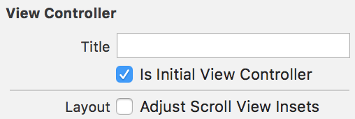

<!--  -->
> A gyökérnézetbe helyezzünk el egy `Scroll View`-t, úgy, hogy kitöltse a teljes rendelkezésre álló területet és állítsunk be olyan kényszereket, hogy minden oldala és a `Safe Area` közötti távolság **0** legyen!

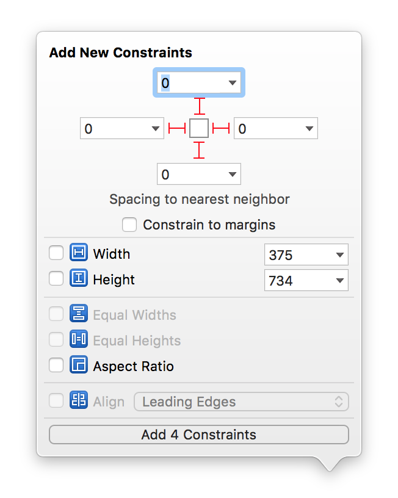

> Tegyünk be egy `Image View`-t felülre és állítsuk be háttérképnek a `BMEQBuilding.jpeg` képet!

<!--  -->
> A `Image View`-n alkalmazzuk a következő kényszereket:
> 
1. A kép teteje a `Scroll View` tetejétől **Standard** távolságra legyen!
2. Rögzítsük a kép arányait **3:2**-re (`Pin` / **`Aspect Ratio`**)!
3. A szélessége legyen egyenlő a `Safe Area` szélességével!

<!--  -->
> Helyezzünk be egy `Label`t a kép alá!

> A `Label` tulajdonságainál állítsuk be, hogy több soros szöveget tartalmaz. Ehhez a *Line Break* mode-ot állítsuk **`Word Wrap`**re, a *Lines*t pedig **0**-ra!

<!--  -->
> Alkalmazzuk a következő kényszereket a `Label`ön:
> 
1. A `Label` és az `Image View` között legyen **10** egység
2. A `Label` és a szülő nézet szélei között legyen **10** egység

<!--  -->
> A `Label` szövegének állítsuk be a `AUT` portálon lévő [*Rólunk*](https://www.aut.bme.hu/Pages/AboutUs) szövegét `2x`!

Ha futtatjuk az alkalmazást, akkor a nézet nem görgethető... Erre az `Interface Builder` is felhívja a figyelmet.

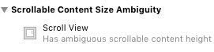

Ahhoz, hogy a `Scroll View` ki tudja számolni, hogy görgethetővé kell-e tennie a benne lévő területet, meg kell tudnia pontosan határozni, hogy mekkora a benne lévő tartalom.

> Ehhez rögíztsük az `Image View` széleit a szülő nézet széleihez és a `Label` alját **10** egységnyire a szülő nézet aljához.

<!--  -->
> Próbáljuk ki az alkalmazást! Forgassuk el, ellenőrizzük, hogy mindkét tájolásban scrollozható.

<!--  -->
> Ágyazzuk be egy `Navigaton Controller`be a nézetvezérlőt. Ekkor a teljes nézet lejjebb csúszik, mivel megváltozik a `Safe Area` tetejének pozíciója.

# Önálló feladat: kezdő képernyő elkészítése <a id="onallo-feladat"></a>
> Készítsük el a következő képernyőt `Auto Layout` kényszerek segítségével és valósítsuk meg a gombok működését!


Segítség a képernyő felépítéséhez:

* Alapja kettő azonos magasságú konténer `View`, melyek szélességben kitöltik a rendelkezésre álló teret és a köztük lévő távolság **0**. Fontos, hogy ezeket a kényszereket ne a `Safe Area`hoz, hanem a gyökér `View`-hoz kössük.
* A felső konténer `View` háttere vörös (*RGB:* **124, 6, 64**), az alsójé szürke (*RGB:* **102, 102, 102**).
* A felső konténer tartalmaz egy képet (`Image View`), amely kitölti a rendelkezésre álló területet (a felső kényszert a `Safe Area`hoz kössük!), ugyanakkor nem torzítja a képet.
* Az alsó konténer két középre rendezett gombot tartalmaz, amely vertikális pozíciója is rögzített (ezeket viszonylag magasan helyezzük el a konténerben).
* Az alsó konténer tartalmaz továbbá egy alulra pozícionált **© Minden jog fenntartva. BME AUT** szöveget, melyet a `Safe Area`hoz kössünk.
* A felületet mindkét tájolásban próbáljuk ki!
