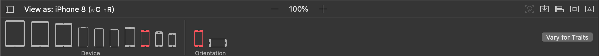
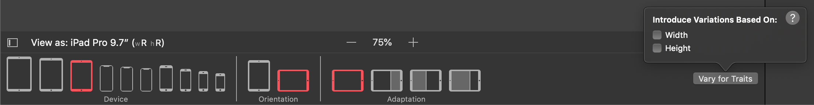
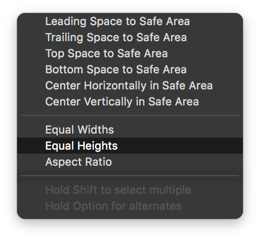
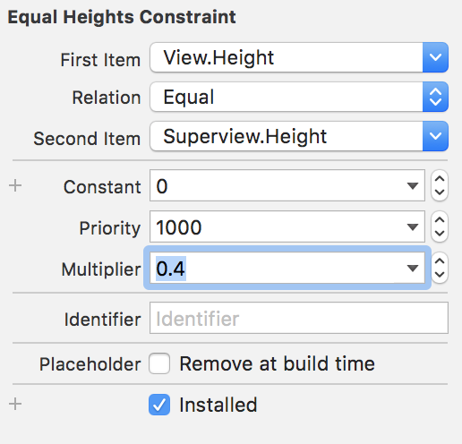
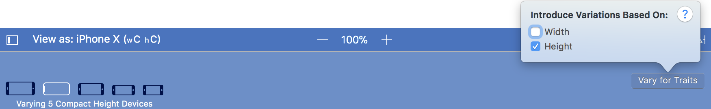
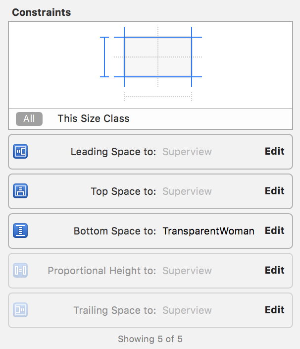
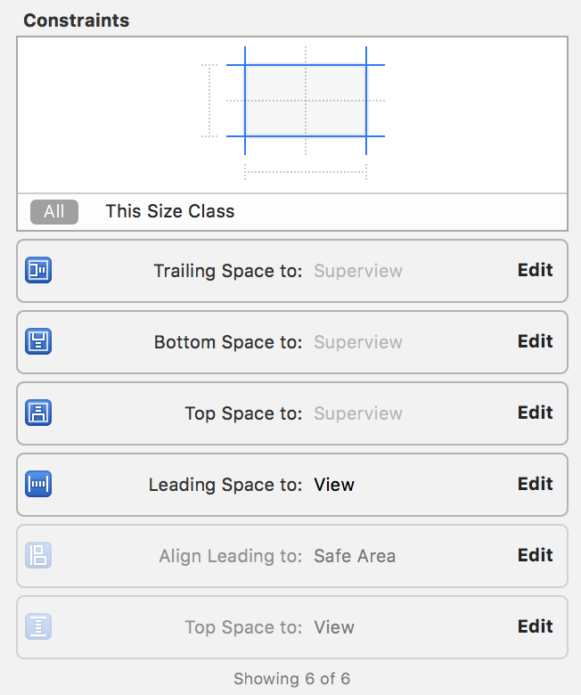
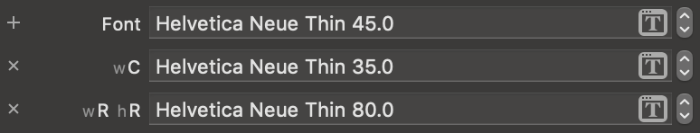
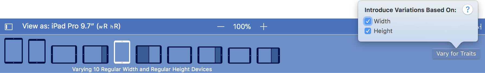

# `iOS` alapú szoftverfejlesztés - Labor `08`

## A laborsegédletet összeállította
* Kántor Tibor - tibor.kantor@autsoft.hu
* Krassay Péter - peter.krassay@autsoft.hu

## A labor témája

* [Az `Adaptive Layout` bemutatása](#adaptive-layout-bemutatasa)
    * [iNames](#inames)
    * [Több névnap egy napon - `UISplitViewController`](#split-vc)
    * [Nevek jelentése - `UIPopoverPresentationController`](#popover-vc)
* [Önálló feladatok pluszpontért](#onallo-feladatok-pluszpontert)

A labor célja az `Adaptive Layout` használatatának a gyakorlása egy névnapos alkalmazás kezdeti képernyőin keresztül.

# Az `Adaptive Layout` bemutatása <a id="adaptive-layout-bemutatasa"></a>

## iNames <a id="inames"></a>
> Hozzunk létre egy `Universal` `Single View Application`t **iNames** névvel.

<!--  -->
> A `res/` mappában található *képeket* húzzuk be az `Assets.xcassets` katalógusba.

<!--  -->
> Váltsunk át a `Main.storyboard`ra és *háttérnek* állítsuk be a rózsaszín egy árnyalatát! (*RGB:* **255, 245, 245**)

A `storyboard` alján megfigyelhetjük, hogy (alapértelmezett módon) a jeleneteinket *compact width*, *regular height* (**wC hR**) méretosztályban látjuk, ami megfelel a *portrait* módban lévő `iPhone`-oknak.


Ha rákattintunk egy `iPad`re, például az `iPad Pro`-ra, akkor a jeleneteink mérete is azonnal megváltozik. Tovább finomíthatjuk a megjelenítést az *Orientation* és az *Adaptation* beállításával. Figyeljük meg, hogy ilyenkor a méretosztály is megváltozhat!

Amennyiben szeretnénk például olyan kényszereket hozzáadni a nézeteinkhez, amik csak abban a méretosztályban léteznek, kattintsunk rá a `Vary for Traits` gombra és "rögzítsük le", hogy mely méret osztályra vagy osztályokra szeretnénk rárakni a speciális kényszereinket.


Amint kiválasztunk valamit, a felhasználói felület azonnal megváltozik, az alsó sáv háttere kék színű lesz. Ezzel jelzi az `Xcode`, hogy jelenleg `Size Class`-ek alapján variáljuk a kényszereinket, illetve az egész felhasználói felületünket. Ha végeztünk a testreszabással, akkor a `Done Varying` gombra kattintva visszatérünk  normál módba.


---

*Emlékeztetőnek egy kép a [`Apple` dokumentációjából](https://developer.apple.com/reference/uikit/uitraitcollection) a gyorsabb megértéshez, illetve a `Size Class`-ek átlátáshoz.*


---

<!--  -->
> Adjunk hozzá a `View`-hoz egy sötét rózsaszín (*RGB:* **255, 146, 217**) `UIView`-t és alkalmazzuk a következő `AutoLayout` kényszereket:
1. A rózsaszín `UIView` két széle és a teteje legyen rögzítve **0** távolságra a szülő nézettől. (`Constrain to margins` legyen kikapcsolva!)
2. A magassága legyen **200** egység.

<!--  -->
> Rakjunk be egy `UIImageView`-t és alkalmazzuk a következő kényszereket:
1. A `UIImageView` és a szülő nézet két széle és az alja között legyen **0** a távolság. (`Constrain to margins` legyen kikapcsolva!)
2. A `UIImageView` és a felette lévő `UIView` között legyen **0** a távolság!


Ezek után a következő nézetet kell látnunk.


> A `UIImageView`-n állítsuk be képnek a **`TransparentWoman`** nevű képet, *Content Mode*-nak pedig az **Aspect Fit**et!

<!--  -->
> Nézzük meg az alkalmazásunkat más `Size Class`-ekben is! (`iPhone` *landscape*, `iPad` *portrait*)

A következő a probléma: `iPhone`-on *landscape* esetben túl nagy a felső sáv, míg `iPad`en *portrait* módban túl kicsi.

> Töröljük a `Document Outline`-ból a `UIView` magasság kényszerét és állítsuk be, hogy a magassága mindig a szülő nézet magasságának **0.4**-szerese legyen! 
Ezt a `Document Outline`-ban tehetjük meg, úgy, hogy a `Ctrl`-t lenyomva ráhúzzuk a vonalat a gyerek `UIView`-ról a szülő `UIView`-ra és az `Equal Heights`-ot választjuk. Majd a kényszer beállításánál a *Multiplier*t **0.4**-re állítjuk. (Mindig igyekezzünk relatív kényszereket készíteni abszolútak helyett!)

 

Ha piros vonalakat kapnánk, akkor az azt jelenti, hogy a kényszer rossz változókkal jött létre (még pedig azzal, hogy a gyerek legyen **2.5**-szer akkora, mint a szülője, ami a `UIImageView` szülőhöz történt rögzítése miatt nem teljesülhet).

> Ebben az esetben cseréljük fel a kényszerben szereplő elemek sorrendjét!


> Nézzük meg az alkalmazást!

Az `iPhone` kijelzőn *landscape* módban a `UIImageView` indokolatlanul sok helyet foglal a kép méretéhez viszonyítva.

> Válasszuk ki a lenti sávból az egyik, *landscape* módban levő `iPhone`-t majd kattintsunk a `Vary for Traits` gombra és ott jelöljük ki a **Height**-ot. Ezzel lényegében az *any width compact height* (**hC**) méretosztályt fogjuk tesztreszabni. (Ami lefedi az összes, *landscape* módban lévő `iPhone` méretosztályát.)



> Jelöljük ki a felső `UIView`-t és töröljük ki a `Size inspector`ban a `UIView` magasságát és jobb oldalát rögzítő kényszert a `Backspace`-szel!

 

Ha rákattintunk egy elhalványított kényszerre, látjuk, hogy nincs installálva a jelenlegi méretosztályban.


> Módosítsuk a `UIView`-t az egérrel, az alját húzzuk le a szülő aljára, a szélességét pedig csökkentsük le. Az alját rögzítsük a szülő nézet aljához, a *szélessége* meg legyen a szülő nézet **0.7**-szerese.

Ha egy frissen hozzáadott kényszerre kattintunk a tulajdonságainál látjuk, hogy csak erre a méretosztályra van installálva.


> A `UIImageView`-n töröljük a bal oldali kényszert, továbbá a tetejének a rögzítését is `Backspace`-szel! Ezt követően adjuk hozzá a szülő nézet tetejétől mért **0** távolság kényszert, a bal oldalát pedig rögzítsük **0** távolságra a mellette lévő `UIView`-tól!



Egy `Update Frames` hívása után a következőt kell látnunk.


> Ha ezzel végeztünk, akkor kattintsunk a `Done Varying` gombra (ezzel visszaváltva az általános *any width any height* méretosztályba) és ellenőrizzük az elkészült felületünket más különböző méretosztályokon, illetve orientációkon!

<!--  -->
> Adjunk hozzá egy `UILabel`t a rózsaszín `UIView`-hoz, rendezzük középre, állítsunk be **45**-ös méretű **Helvetica Neue Thin** betűtípust, a szöveget pedig írjuk át **Teodózia napja van.**-ra!


Láthatjuk, hogy a legtöbb *portait* orientációjú `iPhone`-nál ez túl nagy betűtípus, míg `iPad` esetében túl kicsi.

> Kattintsunk a betűtípus melletti plusz ikonra és adjunk hozzá az `iPad` (**wR hR**) és a kompakt szélességű `iPhone`-ok (**wC**) esetében két hasonló stílusú, de eltérő méretű fontot (**90** és **35**).



Láthatóan az `iPad` kijelzőn van még hely, tegyünk be egy képet szöveg fölé!

<!--  -->
> Váltsunk át *regular width regular height* (**wR hR**) méretosztályba és tegyünk be egy `UIImageView`-t a szöveg fölé. Állítsuk be képnek a **Flower**t a *Content Mode*-ot pedig **Aspect Fit**nek.
> Rendezzük középre, a *méretét* pedig rögzítsük **90x90**-esre. A kép és a szöveg közötti távolság legyen **0**.




> Kattintsunk a `Done Varying` gombra!

 <!--  -->
> Ellenőrizzük le, hogy az `iPad`en valóban megjelenik majd a kép, de a többi eszközön nem!

Az `iPhone`-ok *landscape* orientációjában célszerűbb lenne egy magasabb képet használni.

> Váltsunk át a `Assets.xcassets` mappába és a `TransparentWoman` kép tulajdonságainál állítsuk be, hogy külön képet akarunk megadni a *Any x Compact* méretosztályhoz! (*Height Class*-nál)


> A létrejövő *Compact Height* méreosztályhoz tartozó `2x` és `3x` helyekre húzzuk be a `GirlWithHat` képet és ellenőrizzük szimulátorban az eredményt!


## Több névnap egy napon - `UISplitViewController` <a id="split-vc"></a>
> Adjuk hozzá a projekthez a `Names.plist` fájlt. (Hozzáadáskor figyeljünk arra, hogy a *Copy items if needed* be legyen pipálva!)


> Vegyünk fel egy `NameHandler` singleton osztályt, ami az adott nap névnapjait fogja visszaadni!

```swift
import UIKit

class NameHandler: NSObject {

  let names: [AnyObject]?

  static let shared = NameHandler()

  private override init() {
    let path = Bundle.main.path(forResource: "Names", ofType: ".plist")
    self.names = NSArray(contentsOfFile: path!)! as [AnyObject]

    super.init()
  }

}
```

> Térjünk vissza a `Main.storyboard`hoz és ágyazzuk be a nézetvezérlőt egy `Navigation Controller`be!

<!--  -->
> Tegyünk be egy `UISplitViewController`t a `storyboard`ba, a létrejött `Detail View Controller`t töröljük ki, és a `SplitViewController` *details view controller* `segue`-hez pedig állítsuk be az az imént létrehozott `Navigation Controller`t!


> A `Master View Controller` cellájából hozzunk létre a nemrég létrehozott `Navigation Controller`re mutató *Show Detail* **Selection** típusú `segue`-t, aminek az *Identifier*ét nevezzünk el **ShowDetailSegue**-nek.

<!--  -->
> Végül pedig állítsuk be kezdő `View Controller`nek a `SplitViewController`t! A következő elrendezést kellett kapnunk.


> Az `AppDelegate.swift`-ben egészítsük ki az `application(_:didFinishLaunchingWithOptions:)`metódust!

```swift
func application(_ application: UIApplication, didFinishLaunchingWithOptions launchOptions: [UIApplicationLaunchOptionsKey: Any]?) -> Bool {

  let splitViewController = window?.rootViewController as! UISplitViewController
  let navigationController = splitViewController.viewControllers.last as! UINavigationController

  navigationController.topViewController?.navigationItem.leftBarButtonItem = splitViewController.displayModeButtonItem
  splitViewController.delegate = self

  return true
}
```

Létrehozhattunk volna egy `UISplitViewController` leszármazottat is, mivel azonban a leszármazás során nem írtunk volna semmit felül, ezért választottuk ezt az egyszerűbb módját a a gyökér nézetvezérlő megtalálásának és a minimális konfiguráció elvégzésének.

> Valósítsuk meg a `UISplitViewController` delegate `splitViewController(_:collapseSecondary:onto:)` metódusát! (Ezzel lényegében megmondjuk, hogy ne a *detail* nézettel induljon az alkalmazás. Aki szeretné nyugodtan próbálja ki, hogy mi történik, ha enélkül futtatja az alkalmazást.)

```swift
extension AppDelegate: UISplitViewControllerDelegate {

  func splitViewController(_ splitViewController: UISplitViewController, collapseSecondary secondaryViewController: UIViewController, onto primaryViewController: UIViewController) -> Bool {
    return true
  }

}
```

> Próbáljuk ki az alkalmazást és forgassuk is el!

<!--  -->
> Hozzunk létre egy új `UIViewController` leszármazottat `NameViewController` néven és állítsuk be a rózsaszín hátterű jelenetünk identitásának. (Az eddigi `ViewController` feleslegessé vált, töröljük ki!)

<!--  -->
> Hozzunk létre `Outlet`et egy `UILabel`nek *titleLabel* néven, illetve egy *nameToDisplay* változót, majd módosítsuk a `viewDidLoad()` metódust!

```swift
import UIKit

class NameViewController: UIViewController {

  @IBOutlet weak var titleLabel: UILabel!
  var nameToDisplay: [NSString: NSString]?

  override func viewDidLoad() {
    super.viewDidLoad()

    if nameToDisplay == nil {
      nameToDisplay = NameHandler.shared.names!.first as? [NSString: NSString]
    }

    let name = nameToDisplay!["name"]
    titleLabel.text = "\(name!) napja van."
  }
  
}
```

> Adjunk hozzá egy új `UITableViewController`ből leszármaztatott osztályt `NamesViewController` névvel. Állítsuk be a `storyboard` `MasterViewController` identitásának az újonnan létrehozott osztályt, a *cella azonosítója* pedig **NameCell** legyen!

<!--  -->
> Cseréljük le az implementációt!

```swift
import UIKit

class NamesViewController: UITableViewController {
  
  var names = [AnyObject]()

  // MARK: View Lifecycle

  override func viewDidLoad() {
    super.viewDidLoad()
    
    names = NameHandler.shared.names!
    title = "Mai névnapok"
  }

  // MARK: TableView Data Source

  override func numberOfSections(in tableView: UITableView) -> Int {
    return 1
  }

  override func tableView(_ tableView: UITableView, numberOfRowsInSection section: Int) -> Int {
    return names.count
  }
  
  override func tableView(_ tableView: UITableView, cellForRowAt indexPath: IndexPath) -> UITableViewCell {
    let cell = tableView.dequeueReusableCell(withIdentifier: "NameCell", for: indexPath)
    let name = names[indexPath.row] as! [NSString: NSString]
    
    cell.textLabel?.text = name["name"] as? String
    cell.imageView?.contentMode = .scaleAspectFill
    cell.imageView?.image = UIImage(named: "Flower")
    
    return cell
  }

  // MARK: Navigation

  override func prepare(for segue: UIStoryboardSegue, sender: Any?) {
    if segue.identifier == "ShowDetailSegue" {
      if let indexPath = tableView.indexPathForSelectedRow {
        let object = names[indexPath.row] as! [NSString: NSString]
        
        let nameViewController = (segue.destination as! UINavigationController).topViewController as! NameViewController
        nameViewController.nameToDisplay = object
        nameViewController.navigationItem.leftBarButtonItem = splitViewController?.displayModeButtonItem
        nameViewController.navigationItem.leftItemsSupplementBackButton = true
      }
    }
  }
  
}
```

<!--  -->
> Próbáljuk ki az alkalmazást több különböző szimulátorral: `iPhone 7`, `iPhone 7 Plus` és bármilyen `iPad`. Figyeljük meg, hogyan alkalmazkodik a `UISplitViewController` a különböző környezetekhez.

Az alapbeállítás szerint `iPad`en eltűnik a `MasterViewController` *portait* módban. Ezen a legegyszerűbben úgy javíthatunk, ha beállítjuk, hogy mi az előnyben részesített megjelenése a `Split View Controller`nek.

> Az `AppDelegate.swift`-ben egészítsük ki az eddigieket.

```swift
splitViewController.preferredDisplayMode = .allVisible
```

Ezután a változtatás után észrevehetjük, hogy a `MasterViewController`en két *display mode* váltó gomb is megjelent `iPad`*portrait* módban.


> Ennek megoldásához töröljük ki az `AppDelegate.swift`-ből a következő két sort. (Erre a beállításra már nincs szükség, mert már külön kitesszük a *display mode* gombot a `NameViewController`re, ahol ennek van értelme.)

```swift
let navigationController = splitViewController.viewControllers.last as! UINavigationController

navigationController.topViewController?.navigationItem.leftBarButtonItem = splitViewController.displayModeButtonItem
```

Sokat javíthatunk az alkalmazás kinézetén, ha a gombokat nem az alapértelmezett kéken jelenítjük meg. Ugyanakkor ezek rendszerszintű gombok, amelyek folytonos átszínezgetése kissé körülményes volna. Be lehet azonban állítani a `Main.storyboard`on egy *GlobalTint* színt, amit az egyes vezérlők alapértelmezett színként felvesznek. 

> Tegyük ezt meg a `Main.storyboard` fájl tulajdonságainál (`File inspector`). Állítsunk be valamilyen sötétebb rózsaszín színt!


## Nevek jelentése - `UIPopoverPresentationController` <a id="popover-vc"></a>

> Hozunk létre egy új `UIViewController` leszármazottat `NameFactsViewController` néven és az implementációt cseréljük le!

```swift
import UIKit

class NameFactsViewController: UIViewController {
  
  @IBOutlet weak var nicksLabel: UILabel!
  @IBOutlet weak var originLabel: UILabel!
  @IBOutlet weak var meaningLabel: UILabel!
  
  var nameToDisplay: [NSString: NSString]?
  
  override func viewDidLoad() {
    super.viewDidLoad()
    
    nicksLabel.text = "\(nameToDisplay!["nicks"]!)"
    originLabel.text = "Eredete: \(nameToDisplay!["origin"]!)"
    meaningLabel.text = "Jelentése: \(nameToDisplay!["meaning"]!)"
  }
  
}
```

> Helyezzünk be egy új nézetvezérlőt, majd állítsuk össze a következő képernyőt!


> Ehhez rakjunk be **3** `UILabel`t, majd használjuk a `Stack` gombot!


> A `UIStackView`-n állítsuk be, hogy a szülőnézet széleitől a távolsága **0** legyen! (`Constrain to margins` legyen bepipálva!)
A `UIStackView` a tartamat középre rendezze (*Aligment*: **Center**), és egyforma méretüek legyenek az elemek (*Distriution*: **Fill Equally**).


> Állítsuk be, hogy ez a `NameFactsViewController` és kössük be az `Outlet`eit!

<!--  -->
> Végül adjunk neki *azonosítót* a `storyboard`ban **FactsViewController** néven az `Identity inspectorban`!


> A `NameViewController`ben adjunk hozzá egy új `Bar Button Item`et kódból a `viewDidLoad()`-ban!

```swift
let detailsButton: UIBarButtonItem = UIBarButtonItem(title: "Tények", style: .plain, target: self, action: #selector(NameViewController.displayFacts(sender:)))
navigationItem.rightBarButtonItem = detailsButton
```

> Majd valósítsuk meg a `displayFacts(sender:)` függvényt!

```swift
func displayFacts(sender: UIBarButtonItem) {
  let storyboard = UIStoryboard(name: "Main", bundle: nil)
  
  let contentViewController = storyboard.instantiateViewController(withIdentifier: "FactsViewController") as! NameFactsViewController
  contentViewController.nameToDisplay = nameToDisplay
  contentViewController.modalPresentationStyle = .popover
  
  let detailPopover = contentViewController.popoverPresentationController!
  detailPopover.barButtonItem = sender
  detailPopover.permittedArrowDirections = .any
  
  present(contentViewController, animated: true, completion: nil)
}
```

> Futtassuk az alkalmazást `iPad` és `iPhone` szimulátorokon is! 

`iPhone` kijelzőn sajnos nem tudjuk bezárni a modálisan megjelenített nézetvezérlőt. Ha olyan működést szeretnénk, mint `iPad`en, akkor meg kell valósítani a `UIPopoverPresentationControllerDelegate` interfészt. (Természetesen ezt máshogyan is megoldhatnánk, például kirakhatnánk `iPhone`-ok esetében egy gombot, amivel vissza lehet térni az előző képernyőre.)

> Tegyük is meg ezt a `NameViewController`ben, majd állítsuk be a `PopoverPresentationController` létrehozásánál!

```swift
extension NameViewController: UIPopoverPresentationControllerDelegate {
  
}
```

```swift
...
detailPopover.permittedArrowDirections = .any
detailPopover.delegate = self
...
```

> Végül írjuk meg a callbacket az *extension*ben!

```swift
func adaptivePresentationStyle(for controller: UIPresentationController, traitCollection: UITraitCollection) -> UIModalPresentationStyle {
  return .none
}
```

> Teszteljük az alkalmazást ismét `iPhone`-on!

# Önálló feladatok pluszpontért <a id="onallo-feladatok-pluszpontert"></a>

1. A `Split View Controller` behelyezésével bizonyos képernyőméreteken pl. `iPhone 7 Plus` *landscape*, vagy `iPad`en elromlott a labor első felében nehéz munkával elkészített layout. 
Javítsuk ki a hibákat új adaptív kényszerek hozzáadásával vagy a meglévő kényszerek módosításával, hogy minden képernyőn jól nézzen ki az alkalmazás!
1. Nem minden szöveg fér el a `Popover Controller`ben, módosítsuk a `NameFactsViewController` kényszereit, hogy ez ne legyen probléma!
