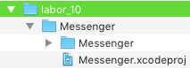
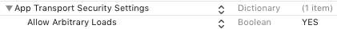
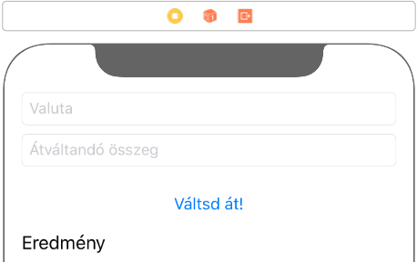

# `iOS` alapú szoftverfejlesztés - Labor `09`

## A labor témája

* [Messenger](#messenger)
    * [Üzenetek letöltése](#uzenetek-letoltese)
    * [`JSON` feldolgozás](#json-feldolgozas)
    * [Üzenetek feltöltése](#uzenetek-feltoltese)
* [Önálló feladat](#onallo)
    * [Képek feltöltése](#kepek-feltoltese)
    * [Képek letöltése](#kepek-letoltese)
    * [Network Activity Indicator](#network-activity-indicator)
* [Szorgalmi feladat: Valutaváltó](#szorgalmi-feladat)

## Messenger <a id="messenger"></a>

> Másoljuk a `res` mappában lévő **`Messenger`** kezdőprojektet a `labor_09` mappánkba!



> Próbáljuk ki az alkalmazást és nézzük át a forráskódját! 

Az alkalmazás két `Table View Controller`t tartalmaz. A `Messages View Controller` az üzeneteket listázza, a `Compose Message View Controller` pedig új üzenet írására szolgál.

### Üzenetek letöltése <a id="uzenetek-letoltese"></a>

> A `MessagesViewController.swift`be vegyünk fel egy új *property*-t, mely az `URLSession` példányt tárolja! Helyben inicializáljuk is!

```swift
private var urlSession: URLSession = {
  let sessionConfiguration = URLSessionConfiguration.default
  return URLSession(configuration: sessionConfiguration, delegate: nil, delegateQueue: OperationQueue.main)
}()
```

> Valósítsuk meg a *Refresh* gomb megnyomásakor meghívódó metódust, mely elindítja az üzenetek letöltését! (Az üres metódus `refreshButtonTap(_:)` néven már ott van a kódban, és be is van kötve a gomb megfelelő eseményéhez.)

```swift
// MARK: - Actions

@IBAction func refreshButtonTap(_ sender: Any) {
  let url = URL(string: "http://atleast.aut.bme.hu/ait-ios/messenger/messages")
  urlSession.dataTask(with: url!) { data, response, error in
    if let data = data, let responseString = String(data: data, encoding: .utf8) {
      print("\(responseString)")
    }
  }.resume()
}
```

> Teszteljük az alkalmazást és ellenőrizzük, hogy a konzolon megjelenik-e a letöltött `JSON` formátumú válasz!

A konzolon csak a következő üzenet jelenik meg:

`App Transport Security has blocked a cleartext HTTP (http://) resource load since it is insecure. Temporary exceptions can be configured via your app's Info.plist file.`

Az *App Transport Security*-t (*ATS*) az `Apple` az `iOS 9`-cel mutatta be. Lényegében egy olyan biztonsági mechanizmus, ami alapértelmezetten minden, az alkalmazás által indított kapcsolatot tilt, ami nem `HTTPS` felett megy a legerősebb `TLS` használatával.

Természetesen egy ilyen változtatásnál időt kell adni a fejlesztőknek, hogy frissíthessék az alkalmazásokat, illetve a szervereket, ezért az `Apple` engedélyezte kivételek hozzáadását, illetve az *ATS* teljes kikapcsolását is.

A `2016`-os `WWDC`-n az `Apple` bejelentette, hogy `2017` januárjától az `App Store`-ba felöltött alkalmazásoknak (és az őket kiszolgáló szervereknek) adaptálniuk kell az *ATS*-t (ezt a határidőt később kitolták). Ez alól csak nagyon indokolt esetben adnak felmentést.

A fejlesztés idejére azonban továbbra is ki lehet kapcsolni ezt a biztonsági funkciót.

> Az *ATS* kikapcsolásához az `Info.plist`ben vegyük fel az *`App Transport Security Settings`* kulcsot, majd azon belül az *`Allow Arbitrary Loads`* kulcsot **`YES`** értékkel!



Ezen változtatás után már meg fog jelenni a konzolon a `JSON` válasz.

### `JSON` feldolgozás <a id="json-feldolgozas"></a>

A szervertől kapott válasz `JSON` formátumú: egy tömbben `JSON` objektumok írják le a megjelenítendő üzeneteket. A szerver válaszát böngészőben is megvizsgálhatjuk az URL megnyitásával.

[`http://atleast.aut.bme.hu/ait-ios/messenger/messages`](http://atleast.aut.bme.hu/ait-ios/messenger/messages
)

```json
[  
  {
    "content": "",
    "from_user": "Benedek",
    "imageurl": "http://atleast.aut.bme.hu/ait-ios/messenger/message_images/aa129a2cf0d0f763af633edea014944e.jpeg",
    "latitude": 0,
    "longitude": 0,
    "to_user": "László",
    "topic": "film"
  },
  ...
]
```

`JSON` feldolgozásra a `Swift 4`-ben bevezetett `Codable`-t fogjuk használni. A `Codable` egy `typealias`, két *protocol*t fog össze: `typealias Codable = Decodable & Encodable`. A sorosítást és visszaalakítást *Encoder* és *Decoder* osztályok végzik, melyek gyakran használt formátumokhoz (pl. `JSON`, `Plist`) beépítve rendelkezésünkre állnak.

> Az üzenetek tárolásához hozzunk létre egy `Message.swift` nevű fájlt, és vegyünk fel benne egy `Message` nevű `struct`ot. 

```swift
struct Message: Codable {

  let sender: String
  let recipient: String
  let topic: String
    
  enum CodingKeys: String, CodingKey {
    case sender = "from_user"
    case recipient = "to_user"
    case topic
  }
    
}
```

A `CodingKeys` `enum`ra esetünkben azért van szükség, mert bizonyos mezők eltérő néven szerepelnek a szervertől érkező adathalmazban.

> A `MessagesViewController.swift` fájlban vegyünk fel és inicializáljunk egy `Message` tömböt, melyben a szerverről kapott üzeneteket fogjuk tárolni.

```swift
private var messages = [Message]()
```

> A `Data Task` befejeztekor meghívódó *closure*-ben dolgozzuk fel a kapott `JSON`-t és rendeljük az eredményt a `messages` property-hez!

```swift
// MARK: - Actions

@IBAction func refreshButtonTap(_ sender: AnyObject) {
  let url = URL(string: "http://atleast.aut.bme.hu/ait-ios/messenger/messages")
  urlSession.dataTask(with: url!) { data, response, error in
    if let error = error {
      print("Error during communication: \(error.localizedDescription)")
    } else if let data = data {
      let decoder = JSONDecoder()
      do {
        self.messages = try decoder.decode(Array<Message>.self, from: data)
        self.tableView.reloadData()
      } catch let decodeError {
        print("Error during JSON decoding: \(decodeError.localizedDescription)")
      }
    }
  }.resume()
}
```

> Az üzenetek megjelenítéséhez valósítsuk meg a `Table View Data Source` metódusait!

```swift
// MARK: - Table view data source
    
override func tableView(_ tableView: UITableView, numberOfRowsInSection section: Int) -> Int {
  return messages.count
}
    
override func tableView(_ tableView: UITableView, cellForRowAt indexPath: IndexPath) -> UITableViewCell {
  let cell = tableView.dequeueReusableCell(withIdentifier: "MessageCell", for: indexPath) as! MessageCell
    
  let message = messages[indexPath.row]
    
  cell.recipientLabel.text = "\(message.sender) -> \(message.recipient)"
  cell.topicLabel.text = message.topic
    
  return cell
}
```

> Próbáljuk ki az alkalmazást!

# Önálló feladat <a id="onallo"></a>

### Üzenetek feltöltése <a id="uzenetek-feltoltese"></a>

Új üzenet küldéséhez az `URL`-re egy `HTTP` `POST` kérést kell küldenünk, a következő formátumú tartalommal.

```json
{
  "from_user": "",
  "to_user": "",
  "topic": "",
  "image": "base64 kódolású JPEG kép"
}
```

Az üzenet összeállítását és küldését a `ComposeMessageViewControllerDelegate` `composeViewControllerDidSend(_:)` metódusában végezhetjük. A *protocol*t a `Messages View Controller` valósítja meg.

> Állítsuk össze az adathierarchiát, majd alakítsuk `JSON`-né (az opcionálisan megadható kép feltöltését későbbre hagyjuk). **A _`YOUR NAME`_ helyett mindenki válasszon egy egyedi nevet!**

```swift
func composeMessageViewControllerDidSend(_ viewController: ComposeMessageViewController) {
  navigationController?.popToRootViewController(animated: true)
  guard let recipient = viewController.recipientTextField.text, let topic = viewController.topicTextField.text else { return }
    
  let message = Message(sender: "YOUR NAME", recipient: recipient, topic: topic)
  let encoder = JSONEncoder()
    
  guard let jsonData = try? encoder.encode(message) else { return }
```

A `POST` kérés küldéséhez egy `URLRequest`re lesz szükségünk.

```swift
let url = URL(string: "http://atleast.aut.bme.hu/ait-ios/messenger/add-message")
var request = URLRequest(url: url!)
request.httpMethod = "POST"
request.setValue("application/json", forHTTPHeaderField: "Content-Type")
```

> Indítsunk egy `Upload Task`ot, mely befejeztekor egy `Alert`et feldobva nyugtázzuk a folyamatot!

```swift
urlSession.uploadTask(with: request, from: jsonData) { data, response, error in
  if let error = error {
    print("Error during comminication: \(error.localizedDescription).")
    return
  } else if let data = data {
    let decoder = JSONDecoder()
    do {
      let sendResponse = try decoder.decode(MessageSendResponse.self, from: data)
            
      let alert = UIAlertController(title: "Server response", message: sendResponse.result, preferredStyle: .alert)
      let okAction = UIAlertAction(title: "OK", style: .default, handler: nil)
      alert.addAction(okAction)
            
      self.present(alert, animated: true, completion: nil)
    } catch {
      print("Error during JSON decoding: \(error.localizedDescription)")
    }
  }
}.resume()
```

Ha újra letöltjük az üzeneteket, meg kell jelennie az új küldeménynek.

### Képek feltöltése <a id="kepek-feltoltese"></a>

> Bővítsük a `Message` `struct`ot az `image` mezővel. Ne feledkezzünk meg a `CodingKeys` `enum` bővítéséről sem! Vegyünk fel egy új *inicializáló*t is, ugyanis az `image` *property*-t később fogjuk beállítani, így az *alapértelmezett inicializáló* már nem felel meg az igényeinknek.

```swift 
struct Message: Codable {
  ...
  var image: String?
  ...
  init(sender: String, recipient: String, topic: String) {
    self.sender = sender
    self.recipient = recipient
    self.topic = topic
  }

  enum CodingKeys: String, CodingKey {
    ...
    case image
  }
    
}
```

> A szervernek elküldendő üzenetbe illesszük be a kiválasztott képet. Ehhez először lekicsinyítjük, majd a `JPEG` reprezentációját `base64` kódolással alakítjuk `String`gé! (Ügyeljünk rá, hogy az üzenetet reprezentáló lokális `message` példányunkat konstans (`let`) helyett változóként (`var`) hozzuk létre, hogy az `image` *property*-jét be tudjuk állítani!) 

```swift
var message = Message(sender: "YOUR NAME", recipient: recipient, topic: topic)

if
    let image = viewController.imageView.image,
    let jpegImageData = image.jpegData(compressionQuality: 0.5) {
        message.image = jpegImageData.base64EncodedString()
}
```

### Képek letöltése <a id="kepek-letoltese"></a>

A szerveren minden feltöltött kép eltárolódik, majd az üzenetek lekérdezésekor az `imageurl` kulcshoz tartozó érték alapján tudjuk letölteni őket. 

> Bővítsük a `Message` `struct`ot az `imageUrl` mezővel. Ne feledkezzünk meg a `CodingKeys` `enum` és az `init` bővítéséről sem!

```swift 
struct Message: Codable {
  ...
  let imageUrl: String?
   
  init(sender: String, recipient: String, topic: String) {
    ...
    imageUrl = nil
  }
  
  enum CodingKeys: String, CodingKey {
    ...
    case imageUrl = "imageurl"
  }
}
``` 

Hogy ne töltsünk le feleslegesen egy képet többször, tároljuk el őket egy *dictionary*-ben, mely `URL – kép` párokat tartalmaz. 

> Vegyünk fel egy új property-t a `MessagesViewController.swift` fájlban!

```swift
private var imageCache = [URL: UIImage]()
```

> Definiáljunk egy új metódust, mely az `URL`-je alapján beállít egy képet a *dictionary*-ből egy cellához, vagy letölti, ha még nincs meg, és azt követően állítja be.

```swift
// MARK: - Helper methods

func setImage(from url: URL, for cell: MessageCell) {
  if let cachedImage = imageCache[url] {
    cell.messageImageView.image = cachedImage
  } else {
    cell.messageImageView.image = nil
        
    urlSession.dataTask(with: url) { data, response, error in
      if let data = data, let image = UIImage(data: data) {
        self.imageCache[url] = image
        cell.messageImageView.image = image
      }
    }.resume()
  }
}
```

> A cellák konfigurálásakor (`tableView(_:cellForRowAt:)`) indítsuk el a cellához tartozó kép letöltését!

```swift
if let imageUrlString = message.imageUrl, let imageUrl = URL(string: imageUrlString) {
  setImage(from: imageUrl, for: cell)
}
```

> Próbáljuk ki az alkalmazást!

### Network Activity Indicator <a id="network-activity-indicator"></a>

 Jelenítsük meg a hálózati aktivitást jelző `Network Activity Indicator`t üzenetek küldésekor, letöltésekor, valamint a képek letöltésekor, majd rejtsük el mikor a műveletek véget érnek!

```swift
UIApplication.shared.isNetworkActivityIndicatorVisible = true
```

```swift
UIApplication.shared.isNetworkActivityIndicatorVisible = false
```

Azonban az `iPhone X`-hez hasonló teljes kijelzős készülékeken nem jelenik meg a `Network Activity Indicator`.  Helyette a `UIActivityIndicatorView`-val tudunk megjeleníteni aktivitás jelzést. 
> Vegyünk fel egy új property-t.
```swift
let activityIndicator = UIActivityIndicatorView()
```

> A `ViewController`ünk `viewDidLoad` eseményében hívjuk meg a következő metódust, megvalósítás után:

```swift
private func createActivityIndicator() {
    activityIndicator.center = view.center
    activityIndicator.hidesWhenStopped = true
    activityIndicator.style = .gray
    activityIndicator.transform = CGAffineTransform(scaleX: 3.5, y: 3.5)

    view.addSubview(activityIndicator)
}
```

Végül a korábbi helyeken hívjuk meg a  `UIActivityIndicatorView` indítását és befejezését is:

```swift
activityIndicator.startAnimating()
```

```swift
activityIndicator.stopAnimating()
```

## Szorgalmi feladat <a id="szorgalmi-feladat"></a>

> Készítsünk egy egyszerű valutaváltó alkalmazást, a [https://exchangeratesapi.io](https://exchangeratesapi.io) `API`-t használva!
>
> 
>
* Hozzunk létre egy új `Single View App`ot **iCurrency** néven!
* Készítsünk egy egyszerű felhasználói felületet! (Szükség lesz két `Text Field`re a valutanemek és az átváltandó összeg bekérése, egy `Label`re az eredmény kiírásához, valamint egy `Button`re a folyamat indításához.)
* Az átváltás gomb megnyomásakor indítsunk egy `HTTP` `GET` kérést (egy `Data Task`ot), mely letölti az aktuális árfolyamot. Az `URL` formátuma a következő:
  [https://api.exchangeratesapi.io/latest?base=**USD**&symbols=**HUF**](https://api.exchangeratesapi.io/latest?base=USD&symbols=HUF)
* Dolgozzuk fel a `JSON` választ (használjunk `Codable`-t!) és jelenítsük meg a váltás eredményét!
    * A válaszban a váltási valutanem lesz az egyik kulcs érték.
    * A második `Text Field`hez használjunk **Number Pad** billentyűzetet.

```json
{
  "base": "USD",
  "date": "2016-11-18",
  "rates": {
    "HUF": 291.18
  }
}
```
## A laborsegédletet összeállította
* Varga Domonkos - varga.domonkos@autsoft.hu
* Krassay Péter - peter.krassay@autsoft.hu
* Szücs Zoltán - szucs.zoltan@autsoft.hu
* Kántor Tibor - tibor.kantor@autsoft.hu
* Kelényi Imre - imre.kelenyi@aut.bme.hu
