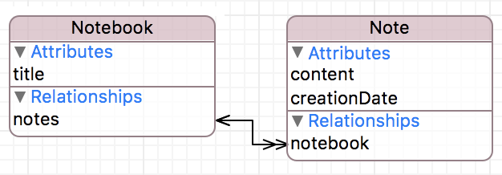
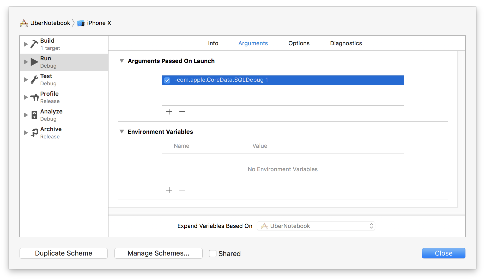

# `iOS` alapú szoftverfejlesztés - Labor `09`

## A laborsegédletet összeállította
* Kelényi Imre - imre.kelenyi@aut.bme.hu
* Krassay Péter - peter.krassay@autsoft.hu

## A labor témája

* [UberNotebook](#ubernotebook)
  * [Alkalmazás váz, Core Data alapok](#core-data-alapok)
  * [Adatmodell definiálása](#adatmodell-definialasa)
  * [Adatmodell osztályok](#adatmodell-osztalyok)
  * [`Notebook`ok megjelenítése](#notebookok-megjelenitese)
  * [Jegyzetek, `NSFetchedResultsController`](#jegyzetek-nsfetchedresultcontroller)
  * [Jegyzetek felvétele](#jegyzetek-felvetele)
  * [Jegyzetek törlése](#jegyzetek-torlese)
  * [További műveletek](#tovabbi-muveletek)
  * [`Managed Object Context` mentése](#moc-mentese)
* [Önálló feladatok](#onallo-feladatok)

## UberNotebook <a id="ubernotebook"></a>

### Alkalmazás váz, Core Data alapok <a id="core-data-alapok"></a>
> Hozzunk létre egy `Single View App`ot **UberNotebook** névvel a `labor_09` könyvtárba! Ne felejtsük el bekapcsolni a **Use Core Data** opciót a projekt generálásakor!


> Töröljük ki a projektből a generált `ViewController.swift` fájlt és a `Main.storyboard`ból is távolítsuk el az ott létrejött jelenetet (*View Controller Scene*).

Érdemes megvizsgálni az `AppDelegate.swift`ben a `Core Data` stackhez kapcsolódó metódusokat.

A `persistentContainer` property fogja össze a `Core Data` stacket, definíciójában láthatjuk a nevét: **UberNotebook**. A háttérben alapértelmezetten egy `SQLite` adatbázis lesz, ami az `UberNotebook.sqlite`-ban tárolja az adatokat.

A `persistentContainer.viewContext` property-jének segítségével fogjuk tudni elérni a kontextust, amin keresztül a `Core Data` műveleteket elvégezhetjük.

A `saveContext()` metódust használjuk a kontextus mentéséhez. Egyrészt rögtön naplózza az esetleges hibát, másrészt csak akkor fog ténylegesen menteni, ha az előző mentés óta volt valamilyen változás.

### Adatmodell definiálása <a id="adatmodell-definialasa"></a>

> Nyissuk meg a `UberNotebook.xcdatamodeld` fájlt és vegyünk fel:
>
> * új entitást **`Notebook`** névvel
>   * **title** (*String*) *attribútum*mal
> * új entitást **`Note`** névvel
>   * **content** (*String*) *attribútum*mal
>   * **creationDate** (*Date*) *attribútum*mal

<!--  -->
> Vegyünk fel a `Notebook`ba egy **notes** *relationship*et, mely a `Note`-ra hivatkozik!

<!--  -->
> Vegyünk fel a `Note`-ba egy **notebook** *relationship*et, mely a `Notebook`ra hivatkozik!

<!--  -->
> Mindkét *relationship*nél állítsuk be az inverz relációt a másikra! (Ha az egyiknél beállítottuk, akkor a másiknál jó esetben be fogja állítani automatikusan.)

A `Core Data`ban relációknál mindig meg kell adnunk egy inverz relációt is. Erre azért van szükség, hogy az objektum gráf ne kerülhessen inkonzisztens állapotba, például törlés esetén (ha egy entitásra van egy reláció, de ennek a relációnak nincs inverze, akkor az entitás törlése esetén nem lehetne értesíteni a reláció tulajdonosát, hogy törlődött egy hivatkozott objektum).

> Állítsuk be a **notes** reláció *típusát* **`To Many`**-re és a *törlési szabályát* **`Cascade`**-re! (Így ha törlődik a `Notebook`, a bejegyzései is törlődnek vele együtt).

 

Itt az ideje az adatmodell kipróbálásának!

> Az `AppDelegate.swift` `application(_:didFinisLaunchingWithOptions:)` metódusában, a `return true` sor elé hozzunk létre egy új `Notebook`ot és benne egy `Note`-ot!

```swift
let notebook = NSEntityDescription.insertNewObject(forEntityName: "Notebook", into: persistentContainer.viewContext)
notebook.setValue("Notebook \(arc4random_uniform(10000))", forKey: "title")

let note = NSEntityDescription.insertNewObject(forEntityName: "Note", into: persistentContainer.viewContext)
note.setValue("\(arc4random_uniform(10000)) a kedvenc véletlen számom!", forKey: "content")
note.setValue(Date(), forKey: "creationDate")
note.setValue(notebook, forKey: "notebook")

saveContext()
```

> A sikeres mentés esetén kérdezzük le és listázzuk ki az összes elmentett jegyzetet!

```swift
let fetchRequest = NSFetchRequest<NSManagedObject>(entityName: "Note")
do {
  let notes = try persistentContainer.viewContext.fetch(fetchRequest)
  notes.forEach { note in
   let content = note.value(forKey: "content") as! String
   print(content)
  }
} catch let error as NSError {
  print("Couldn't fetch: \(error.userInfo))")
}

return true
```

Mivel az alkalmazás indításakor mindig létrehozunk egy új `Notebook`ot és benne egy `Note`-ot, a logban minden indítás után egyre hosszabb felsorolást kapunk.

Figyeljük meg a `Swift` hibakezelés egyik módját, a `do-catch` párost. Bármilyen olyan metódus, ami hibával térhet vissza (`throws` kulcsszó van a végén), egy `do` blokkon belül hívható csak meg, és a hívás elé a `try` kulcsszót kell beírni. A hibát pedig a `catch` blokkban tudjuk feldolgozni.

> Próbáljuk ki, hogy bár a lekérdezésben csak `Note`-okat kérünk le, a lekérdezett objektumok relációs property-jein keresztül el tudunk érni más entitásokat is (ilyen esetekben a `Core Data` automatikusan elvégzi a lekérdezést a háttérben). Esetünkben le tudjuk kérni a `Note`-hoz tartozó `Notebook`ot.

```swift
let notebook = note.value(forKey: "notebook") as! NSManagedObject
print(notebook.value(forKey: "title") as! String)
```

> Kapcsoljuk be a `Product/Scheme/Edit Scheme` menüben, hogy a futtatáskor a konzolon megjelenjenek a `Core Data` használata közben kiadott `SQL` utasítások. Ehhez a **-com.apple.CoreData.SQLDebug 1** argumentumot kell felvenni. (A szám 1-4-ig lehet bármilyen egész, a nagyobb szám [több információt](https://developer.apple.com/library/content/documentation/Cocoa/Conceptual/CoreData/TroubleshootingCoreData.html) fog kiírni.)



Miután kipróbáltuk az alkalmazást érdemes kikapcsolni az `SQL` loggolást.

### Adatmodell osztályok <a id="adatmodell-osztalyok"></a>
`Core Data` programozás során mindenre használhatunk `NSManagedObject` típusú objektumokat, de ennél sokkal kényelmesebb és biztonságosabb, ha az entitásoknak definiált külön osztályokat használjuk.

`Xcode 8`-tól az adatmodellhez definiált összes entitáshoz alapértelmezésként automatikusan legenerálódnak az `NSManagedObject` leszármazottak. (Az entitás *Codegen* propery-je **Class Definition** értékű.)


> Vizsgáljuk meg az automatikusan legenerált fájlokat! A `Finder`ben nyomjunk egy `⌘+⇧+G`-t és illesszük be a következő útvonalat: `~/Library/Developer/Xcode/DerivedData/`, majd kattintsunk a `Go` gombra.


> Miután bekerülünk abba a mappába, ahol az `Xcode` tárolja a fordítási eredményeket, keressük meg az `UberNotebook-xxxxxxxxxxxxxxxxxxxxxxxxxxxx` mappát, majd vizsgáljuk meg a tartalmát!


Minden `NSManagedObject` alosztályhoz két külön `Swift` fájl jön létre. Az `Entity+CoreDataProperties.swift`ben egy külön `extension`be kerülnek a generált property-k, míg maga az entitás osztály definíciója az `Entity+CoreDataClass.swift` fájlba generálódik.

Érdemes ismerni még a *Codegen* további beállításait is.

__Manual/None__: régi módszer, kézzel kell megírni, vagy legenerálni a szükséges fájlokat. Ehhez az `Xcode` segítséget nyújt, az adatmodellben az entitást kiválasztva, az `Editor/Create NSManagedObject Subclass...` opcióval legenerálja az osztályokat az entitásokhoz.

__Category/Extension__: "félautomata" módba kapcsolja a generátort. Ilyenkor automatikusan legenerálódik az `Entity+CoreDataGeneratedProperties.swift` fájl, azonban magáról az osztály 
deklarálásáról nekünk kell gondoskodnunk.

### `Notebook`ok megjelenítése <a id="notebookok-megjelenitese"></a>

> Hogy megkönnyítsük a `NSManagedObjectContext` elérését, vegyünk fel egy computed property-t az `AppDelegate.swift`be!

```swift
class var managedContext: NSManagedObjectContext {
  return (UIApplication.shared.delegate as! AppDelegate).persistentContainer.viewContext
}
```

> Hozzunk létre egy új `UITableViewController`ből származó osztályt **`NotebookViewController`** névvel!

> A `Main.storyboard`ban vegyünk fel egy új `Table View Controller`t és ágyazzuk be egy `Navigation Controller`be, amit jelöljünk ki a kezdeti `View Controller`nek!


> Továbbra is az `Interface Builder`ben válasszuk ki a `Table View Controller`t és

> 1.  A `Navigation Item` *title*-jéhez írjunk **Notebooks**-ot.
> 2.  Az `Identity inspector`ban változtassuk át `Table View Controller` osztályát **NotebookViewController**re.

<!--  -->
> Állítsuk be a prototípus cella *típusát* **Basic**re, az *azonosítóját* pedig **NotebookCell**re!


> A `NotebookViewController.swift` fájlban importáljuk be a `Core Data` modult és vegyünk fel egy property-t a jegyzetfüzetek tárolására!

```swift
import CoreData
```

```swift
private var notebooks = [Notebook]()
```

> Definiáljunk egy metódust, mely lekéri a `Notebook`okat!

```swift
private func fetchNotebooks() {
  let managedObjectContext = AppDelegate.managedContext

  let fetchRequest: NSFetchRequest<Notebook> = Notebook.fetchRequest()

  do {
    notebooks = try managedObjectContext.fetch(fetchRequest)
  } catch {
    print(error.localizedDescription)
  }
}
```

> Hívjuk meg `fetchNotebooks()`-ot a `viewDidLoad()`-ban!

```swift
override func viewDidLoad() {
  super.viewDidLoad()

  fetchNotebooks()
}
```

> Valósítsuk meg a `UITableViewDataSource` metódusok közül a két kötelezőt!


```swift
override func tableView(_ tableView: UITableView, numberOfRowsInSection section: Int) -> Int {
  return notebooks.count
}

override func tableView(_ tableView: UITableView, cellForRowAt indexPath: IndexPath) -> UITableViewCell {
  let cell = tableView.dequeueReusableCell(withIdentifier: "NotebookCell", for: indexPath)

  let notebook = notebooks[indexPath.row]
  cell.textLabel?.text = notebook.title

  return cell
}
```

> Ellenőrizzük le, hogy megjelennek-e a `Notebook`ok a nézetben!

### Jegyzetek, `NSFetchedResultsController` <a id="jegyzetek-nsfetchedresultcontroller"></a>

> A `Main.storyboard`ban hozzunk létre egy új `Table View Controller`t! Kössük be egy *Show* (*selection*) `Segue`-jel a `Notebooks View Controller` cellájáról!


> Válasszuk ki a `segue`-t és *azonosítónak* adjuk meg a **ShowNotesSegue**-t.


> Hozzunk létre egy új osztály, `NoteViewController` névvel, mely a `UITableViewController`ből származik, majd a `Storyboard`ban állítsuk be ezt az osztályt az új jelenethez!

<!--  -->
> A prototípus cella *stílusát* állítsuk **Subtitle**-re, az *azonosítóját* pedig **NoteCell**re!


> A `NoteViewController.swift`ben importáljuk a `Core Data` modult és vegyünk fel egy **notebook** property-t, melyben azt tároljuk el, hogy melyik `Notebook` jegyzeteit mutatja a nézet!

```swift
import CoreData
```

```swift
var notebook: Notebook!
```

> Nyissuk meg `NotebookViewController.swift`et és definiáljuk felül a `prepare(for:sender:)` metódust, melyben átadhatjuk a megjelenő jegyzet nézetnek a kiválasztott `Notebook`ot!

```swift
// MARK: - Navigation

override func prepare(for segue: UIStoryboardSegue, sender: Any?) {
  if segue.identifier == "ShowNotesSegue" {
    let noteViewController = segue.destination as! NoteViewController
    noteViewController.notebook = notebooks[tableView.indexPathForSelectedRow!.row]
  }
}
```

> Váltsunk a `NoteViewController.swift`re és vegyünk fel egy `NSFetchedResultsController` típusú property-t!

```swift
private var fetchedResultsController: NSFetchedResultsController<Note>!
```

> A `viewDidLoad()` metódusban hozzuk létre a `Note`-okat visszaadó lekérdezést és rendeljük egy újonnan létrehozott `NSFetchedResultsController`hez!

```swift
override func viewDidLoad() {
  super.viewDidLoad()

  navigationItem.title = notebook.title

  let managedObjectContext = AppDelegate.managedContext

  let fetchRequest: NSFetchRequest<Note> = Note.fetchRequest()

  // szűrés azon Note-okra, melyek a kiválasztott Notebookhoz tartoznak
  let predicate = NSPredicate(format: "%K == %@", #keyPath(Note.notebook), notebook)
  fetchRequest.predicate = predicate

  // rendezés creationDate szerint csökkenő sorrendben
  let sortDescriptor = NSSortDescriptor(key: #keyPath(Note.creationDate), ascending: false)
  fetchRequest.sortDescriptors = [sortDescriptor]

  // egyszerre max 30 Note lekérdezése
  fetchRequest.fetchBatchSize = 30

  fetchedResultsController = NSFetchedResultsController(fetchRequest: fetchRequest,
                                                        managedObjectContext: managedObjectContext,
                                                        sectionNameKeyPath: nil,
                                                        cacheName: nil)

  do {
    try fetchedResultsController.performFetch()
  } catch let error as NSError {
    print("\(error.userInfo)")
  }

}
```

Ugyan `Swift 4`-ben van egy [újfajta szintaxis](https://github.com/apple/swift-evolution/blob/master/proposals/0161-key-paths.md) a *keyPath*-ek használatára, `NSPredicate`-ek esetén ezek sajnos egyelőre nem működnek.

Most még nem látszik miért jobb az `NSFetchedResultsController` egy sima `Array`-be történő lekérdezéshez képest, később viszont látni fogjuk, hogy az előbbi jelzi ha bármi megváltozik a lekérdezésben érintett objektumokban: pl. ha létrehozunk vagy törlünk egy `Note`-ot.

> A `UITableViewDataSource` metódusoknál töröljük ki a szekciók számát megadót, a sorok számánál pedig térjünk vissza a `NSFetchedResultsController`től elkért értékkel!

```swift
override func tableView(_ tableView: UITableView, numberOfRowsInSection section: Int) -> Int {
  guard let sectionInfo = fetchedResultsController.sections?[section] else {
    return 0
  }

  return sectionInfo.numberOfObjects
}
```

> A `tableView(_:cellForRowAt:)` metódusban szintén a `NSFetchedResultsController`től kérjük el a megfelelő indexű `Note`-ot és ez alapján konfiguráljuk a cellát. Vegyünk fel egy külön metódust a cella adatainak beállításához (később még ennek hasznát vehetjük, ha már egy létező cellát akarunk frissíteni)!

```swift
func configure(cell: UITableViewCell, at indexPath: IndexPath) {
  let note = fetchedResultsController.object(at: indexPath)

  cell.textLabel?.text = note.content

  let dateFormatter = DateFormatter()
  dateFormatter.dateStyle = .medium
  dateFormatter.timeStyle = .medium
  cell.detailTextLabel?.text = dateFormatter.string(from: note.creationDate!)
}
```

```swift
override func tableView(_ tableView: UITableView, cellForRowAt indexPath: IndexPath) -> UITableViewCell {
  let cell = tableView.dequeueReusableCell(withIdentifier: "NoteCell", for: indexPath)

  configure(cell: cell, at: indexPath)

  return cell
}
```

> Próbáljuk ki az alkalmazást és ellenőrizzük, hogy megjelennek-e a `Note`-ok a `Notebook`okon belül!

### Jegyzetek felvétele <a id="jegyzetek-felvetele"></a>

> Definiáljunk egy `createNote(with:)` nevű metódust, mely létrehoz egy új jegyzetet és hozzárendeli az aktuális `Notebook`hoz!

```swift
private func createNote(with content: String) {
  let managedObjectContext = AppDelegate.managedContext

  let note = Note(context: managedObjectContext)
  note.content = content
  note.creationDate = Date()
  note.notebook = notebook

  (UIApplication.shared.delegate as! AppDelegate).saveContext()
}
```

> A `Storyboard`ban vegyünk fel egy `Bar Button Item`et a `Note View Controller`re a `Navigation Bar` jobb szélére! (Amennyiben nem sikerülne rögtön ráhúzni a `Bar Button Item`et a jelenetünkre, valószínűleg hiányzik a `Navigation Item`. Pótoljuk, ha szükséges.)

<!--  -->
> Allítsuk be a `Bar Button Item` *System Item* property-jét **Add**ra.


> Kössünk be hozzá egy `addNoteButtonTap()` akció metódust, melyben jelenítsünk meg egy `Alert Controller`t az új jegyzet szövegének bekéréséhez!

```swift
@IBAction func addNoteButtonTap(_ sender: Any) {
  let createNoteAlert = UIAlertController(title: "Create Note", message: "Enter the content", preferredStyle: .alert)
  
  createNoteAlert.addTextField() {
    textField in
    textField.placeholder = "Note content"
  }
  
  let cancelAction = UIAlertAction(title: "Cancel", style: .cancel, handler: nil)
  createNoteAlert.addAction(cancelAction)
  
  let createAction = UIAlertAction(title: "Create", style: .default) {
    action in
    
    let textField = createNoteAlert.textFields!.first!
    self.createNote(with: textField.text!)      
  }
  createNoteAlert.addAction(createAction)
  
  present(createNoteAlert, animated: true, completion: nil)
}
```

Ha kipróbáljuk az alkalmazást, azt láthatjuk, hogy nem jelenik meg az új jegyzet a mentés után. Ez azért van mert a `Table View` még nem értesült a kontextus módosításáról. Itt tűnik fel újra az `NSFetchedResultsController`, mely képes értesítéseket küldeni, ha megváltozik az általa figyelt lekérdezés, esetünkben azok a `Note` objektumok, amik az éppen kiválasztott `Notebook`hoz tartoznak.

> Adjuk hozzá `NoteViewController`hez az `NSFetchedResultsControllerDelegate` protokolt!

```swift
extension NoteViewController: NSFetchedResultsControllerDelegate {

}
```

> A `viewDidLoad()` metódusban állítsuk be a `delegate`-et!

```swift
fetchedResultsController.delegate = self
```

> Valósítsuk meg a protokoll következő **3** műveletét!

```swift
func controllerWillChangeContent(_ controller: NSFetchedResultsController<NSFetchRequestResult>) {
  tableView.beginUpdates()
}

func controller(_ controller: NSFetchedResultsController<NSFetchRequestResult>, didChange anObject: Any, at indexPath: IndexPath?, for type: NSFetchedResultsChangeType, newIndexPath: IndexPath?) {
  switch type {
  case .insert:
    tableView.insertRows(at: [newIndexPath!], with: .fade)
  default:
    break
  }
}

func controllerDidChangeContent(_ controller: NSFetchedResultsController<NSFetchRequestResult>) {
  tableView.endUpdates()
}
```

Ezek a metódusok szinte minden alkalmazásban ugyanígy néznek ki (a `.delete`, `.update`, `.move` megadásával kiegészítve, később mi is felvesszük ezeket).

### Jegyzetek törlése <a id="jegyzetek-torlese"></a>

> Engedélyezzük a *Swipe to delete* funkciót a `tableView(:canEditRowAt:)` metódussal!

```swift
override func tableView(_ tableView: UITableView, canEditRowAt indexPath: IndexPath) -> Bool {
  return true
}
```

> Majd végezzük el a törlést a `UITableViewDataSource`-ból adoptált `tableView(_:commit:forRowAt:)` metódusban!

```swift
override func tableView(_ tableView: UITableView, commit editingStyle: UITableViewCellEditingStyle, forRowAt indexPath: IndexPath) {
  if editingStyle == .delete {
    let managedObjectContext = AppDelegate.managedContext
    let noteToDelete = fetchedResultsController.object(at: indexPath)
    managedObjectContext.delete(noteToDelete)
  }
}
```

A törlésről értesül a `NSFetchedResultsController` és meghívja az előbb bemutatott `delegate` metódust.

> Egészítsük ki ezt, vegyük fel a törlés eseményhez, hogy a `Table View` kitörölje a megfelelő elemet!

```swift
case .delete:
  tableView.deleteRows(at: [indexPath!], with: .automatic)
```

> Próbáljuk ki a törlést!

### További műveletek <a id="tovabbi-muveletek"></a>

Az `NSFetchedResultsController` jelez ha bármelyik objektum módosításra kerül (pl. átírták egy attribútumát) vagy ha megváltozik a pozíciója a lekérdezésen belül. Bár ezeket a laboron nem használjuk, érdemes a standard implementációt ezekhez is felvenni.

```swift
func controller(_ controller: NSFetchedResultsController<NSFetchRequestResult>, didChange anObject: Any, at indexPath: IndexPath?, for type: NSFetchedResultsChangeType, newIndexPath: IndexPath?) {
  switch type {
  case .insert:
    tableView.insertRows(at: [newIndexPath!], with: .automatic)
  case .delete:
    tableView.deleteRows(at: [indexPath!], with: .automatic)
  case .update:
    let cell = tableView.cellForRow(at: indexPath!)!
    configure(cell: cell, at: indexPath!)
  case .move:
    tableView.deleteRows(at: [indexPath!], with: .automatic)
    tableView.insertRows(at: [newIndexPath!], with: .automatic)
  }
}
```

### `Managed Object Context` mentése <a id="moc-mentese"></a>

A jelenlegi implementáció rögtön elmenti a változásokat a perzisztens tárolóba. Sok módosítás esetén (vagy ha esetleg szeretnénk érvényteleníteni a legutóbbi változtatásokat), érdemes lehet a módosításokat csak akkor menteni, mikor az alkalmazás a háttérbe kerül.

> Ehhez először töröljük a `createNote(with content: String)` metódusból a következő sort!

```swift
(UIApplication.shared.delegate as! AppDelegate).saveContext()
```

> Majd módosítsuk az `applicationDidEnterBackground(_:)` metódust az `AppDelegate.swift`ben!

```swift
func applicationDidEnterBackground(_ application: UIApplication) {
  saveContext()
}
```

## Önálló feladatok <a id="onallo-feladatok"></a>

> Építsük be `NotebookViewController`be is új `Notebook`ok felvételének és törlésének lehetőségét! (Használjuk az `NSFetchedResultController`t!)
