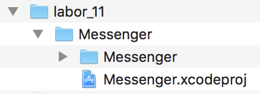
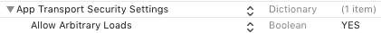

# `iOS` alapú szoftverfejlesztés - Labor `10`

## A laborsegédletet összeállította
* Kelényi Imre - imre.kelenyi@aut.bme.hu
* Kántor Tibor - tibor.kantor@autsoft.hu
* Krassay Péter - peter.krassay@autsoft.hu

## A labor témája

* [Messenger](#messenger)
    * [Üzenetek letöltése](#uzenetek-letoltese)
    * [`JSON` feldolgozás](#json-feldolgozas)
    * [Üzenetek feltöltése](#uzenetek-feltoltese)
    * [Képek feltöltése](#kepek-feltoltese)
    * [Képek letöltése](#kepek-letoltese)
    * [Network Activity Indicator](#network-activity-indicator)
* [Önálló feladat: Valutaváltó](#onallo-feladat)

## Messenger <a id="messenger"></a>

> Másoljuk a `res/` mappában lévő **`Messenger`** kezdőprojektet a `labor_10/` mappánkba!



> Próbáljuk ki az alkalmazást és nézzük át a forráskódját! 

Az alkalmazás tartalmaz egy `Table View Controller`t (`MessagesViewController.swift`), illetve egy új üzenetek írására szolgáló `ComposeMessageViewController`t.

## Üzenetek letöltése <a id="uzenetek-letoltese"></a>

> A `MessagesViewController.swift`-be vegyünk fel egy új property-t, mely az `URLSession` példányt tárolja! Helyben inicializáljuk is!

```swift
var urlSession: URLSession = {
  let sessionConfiguration = URLSessionConfiguration.default
  return URLSession(configuration: sessionConfiguration, delegate: nil, delegateQueue: OperationQueue.main)
}()
```

> Valósítsuk meg a *Refresh* gomb megnyomásakor meghívódó metódust, mely elindítja az üzenetek letöltését (az üres metódus már ott van a kódban és be is van kötve a gomb megfelelő eseményéhez).

```swift
// MARK: - Actions

@IBAction func refreshButtonTap(_ sender: AnyObject) {
  let url = URL(string: "http://atleast.aut.bme.hu/ait-ios/messenger/messages")
  urlSession.dataTask(with: url!) { data, response, error in
    if let data = data {
      let responseString = NSString(data: data, encoding: String.Encoding.utf8.rawValue)
      print("\(responseString)")
    }
  }.resume()
}
```

> Teszteljük az alkalmazást és ellenőrizzük, hogy a konzolon megjelenik a letöltött `JSON` formátumú válasz!

A konzolon azonban csak a következő üzenet fog megjelenni.

`App Transport Security has blocked a cleartext HTTP (http://) resource load since it is insecure. Temporary exceptions can be configured via your app's Info.plist file.`

---

_Az *App Transport Security*-t (*ATS*-t) az `Apple` az `iOS 9`-el mutatta be. Lényegében egy olyan biztonsági mechanizmus, ami alapértelmezetten minden, az alkalmazások által indított kapcsolatot tilt, ami nem `HTTPS` felett megy a legerősebb `TLS` használatával._

_Természetesen egy ilyen változtatásnál időt kell adni a fejlesztőknek, hogy frissíthessék az alkalmazásokat, illetve a szervereket, ezért az `Apple` engedélyezte kivételek hozzáadását, illetve az *ATS* teljes kikapcsolását is._

_A `2016`-os `WWDC`-n az `Apple` bejelentette, hogy `2017` januárjától az `App Store`-ba felöltött alkalmazásoknak (és az őket kiszolgáló szervereknek) adaptálniuk kell az *ATS*-t. Ez alól csak nagyon indokolt esetben adnak felmentést._

_A fejlesztés idejére azonban továbbra is ki lehet kapcsolni nyugodt szívvel ezt a biztonsági funkciót._

---

> Az ATS kikapcsolásához az `Info.plist`-ben vegyük fel az `App Transport Security Settings` kulcsot, majd azon belül az *`Allow Arbitrary Loads`* kulcsot **`YES`** értékkel!



Ezen változtatás után már meg kell jelennie a konzolon a `JSON` válasznak.

## `JSON` feldolgozás <a id="json-feldolgozas"></a>

A szervertől kapott válasz `JSON` formátumú. Egy külső tömbben `JSON` objektumok írják le a megjelenítendő üzeneteket. A szerver válaszát egy böngészőben is megvizsgálhatjuk az URL megnyitásával.

[`http://atleast.aut.bme.hu/ait-ios/messenger/messages`](http://atleast.aut.bme.hu/ait-ios/messenger/messages
)

```json
[  
  {
    "content": "",
    "from_user": "Benedek",
    "imageurl": "http://atleast.aut.bme.hu/ait-ios/messenger/message_images/aa129a2cf0d0f763af633edea014944e.jpeg",
    "latitude": 0,
    "longitude": 0,
    "to_user": "László",
    "topic": "film"
  }
]
```

> Az üzenetek tárolásához vegyünk fel egy új property-t, melyet egy üres tömbbel inicializáljunk!

```swift
var messages = [Any]()
```

> A data task befejeztekor meghívódó blokkban dolgozzuk fel a kapott `JSON`-t és rendeljük az eredményt a `messages` változóhoz!

```swift
// MARK: - Actions

@IBAction func refreshButtonTap(_ sender: AnyObject) {
  let url = URL(string: "http://atleast.aut.bme.hu/ait-ios/messenger/messages")
  urlSession.dataTask(with: url!) { data, response, error in
    if let error = error {
      print("Error during comminication: \(error.localizedDescription).")
      return
    }

    do {
      guard let messages = try (JSONSerialization.jsonObject(with: data!, options: .mutableContainers) as? [Any]) else {
        return
      }
      self.messages = messages
      self.tableView.reloadData()
    } catch let parseError {
      print("Error parsing JSON: \(parseError.localizedDescription)")
    }

  }.resume()
}
```

> Valósítsuk meg a `Table View` adatforrás metódusait, hogy megjelenítsük az üzeneteket!

```swift
// MARK: - Table view data source

override func tableView(_ tableView: UITableView, numberOfRowsInSection section: Int) -> Int {
  return messages.count
}

override func tableView(_ tableView: UITableView, cellForRowAt indexPath: IndexPath) -> UITableViewCell {
  let cell = tableView.dequeueReusableCell(withIdentifier: "MessageCell", for: indexPath) as! MessageCell

  let message = messages[indexPath.row] as! [String: Any]

  let fromUser = message["from_user"] as! String
  let toUser = message["to_user"] as! String
  let topic = message["topic"] as! String

  cell.recipientLabel.text = fromUser + " - " + toUser
  cell.subjectLabel.text = topic

  return cell
}
```

Az üzenetek megjelenítéséhez egy egyedi cella osztályt használunk (`MessageCell`).

## Üzenetek feltöltése <a id="uzenetek-feltoltese"></a>

Új üzenet küldéséhez a `URL`-re egy `HTTP` `POST` kérést kell küldenünk, a következő formátumú tartalommal.

```json
{
  "from_user": "",
  "to_user": "",
  "content": "",
  "topic": "",
  "image": "base64 kódolású JPEG kép"
}
```

Az üzenet összeállítását a `composeViewControllerDidSend()` metódusban végezhetjük, mely be van kötve az új üzenet írásához készített `View Controller`hez.

> Első lépésként állítsuk össze az adathierarchiát, majd alakítsuk `JSON`-ná (az esetleg megadott kép feltöltését későbbre hagyjuk). **A _`YOUR NAME`_ helyett mindenki válasszon egy egyedi nevet!**

```swift
func composeMessageViewControllerDidSend(_ viewController: ComposeMessageViewController) {
  var message = [String: Any]()
  message["from_user"] = "YOUR NAME"
  message["to_user"] = viewController.toUserTextField.text
  message["topic"] = viewController.topicTextField.text

  let jsonData: Data!
  do {
    jsonData = try JSONSerialization.data(withJSONObject: message, options: .prettyPrinted)
  } catch {
    return
  }
}
```

A `POST` kérés küldéséhez egy `URLRequest`re lesz szükségünk.

```swift
let url = URL(string: "http://atleast.aut.bme.hu/ait-ios/messenger/add-message")
var request = URLRequest(url: url!)
request.httpMethod = "POST"
request.setValue("application/json", forHTTPHeaderField: "Content-Type")
```

> Indítsunk egy upload taszkot, mely befejeztekor egy alertet feldobva nyugtázzuk a folyamatot!

```swift
urlSession.uploadTask(with: request, from: jsonData) { data, response, error in
  if let error = error {
    print("Error during comminication: \(error.localizedDescription).")
    return
  }

  do {
    guard let response = try JSONSerialization.jsonObject(with: data!, options: .mutableContainers) as? [String: Any] else {
      return
    }

    let result = response["result"] as! String

    let alert = UIAlertController(title: "Server response", message: result, preferredStyle: .alert)
    let okAction = UIAlertAction(title: "Ok", style: .default, handler: nil)
    alert.addAction(okAction)

    self.present(alert, animated: true, completion: nil)
  } catch {
    print("Error.")
  }

}.resume()
```

Ha újra letöltjük az üzeneteket, meg kell jelennie az új küldeménynek.

## Képek feltöltése <a id="kepek-feltoltese"></a>

> A szervernek elküldendő `JSON` üzenetbe illesszük be a kiválasztott képet. Ehhez először lekicsinyítjük, majd a `JPEG` reprezentációját `base64` kódolással alakítjuk sztringgé!

```swift
if let image = viewController.imageView.image {
  let scaledImage = image.scaleImage(to: CGSize(width: 40, height: 40))
  if let jpegImageData = UIImageJPEGRepresentation(scaledImage, 0.7) {
    message["image"] = jpegImageData.base64EncodedString()
  }
}
```

## Képek letöltése <a id="kepek-letoltese"></a>

A szerveren minden feltöltött kép eltárolódik, majd az üzenetek lekérdezésekor az `imageurl` kulcshoz tartozó érték alapján tudjuk letölteni őket. Hogy ne töltsünk le feleslegesen egy képet többször, hozzunk létre egy kis „cache”-t, mely `URL – kép` párokat tartalmaz. 

> Vegyünk fel egy új property-t `MessagesViewController`hez!

```swift
var imageCache = [URL: UIImage]()
```

> Definiáljunk egy új metódust, mely az `URL`-je alapján beállít egy képet a cacheből egy cellához, vagy letölti, ha még nincs meg és azután állítja be.

```swift
// MARK: - Helper methods

func downloadImage(with url: URL, for cell: MessageCell) {
  if let cachedImage = imageCache[url] {
    cell.messageImageView.image = cachedImage
  }
  else {
    cell.messageImageView.image = nil

    urlSession.dataTask(with: url) { [weak cell] data, response, error in
      if let data = data, let image = UIImage(data: data) {
        self.imageCache[url] = image
        cell?.messageImageView.image = image
      }
    }.resume()
  }
}
```

> A cellák létrehozásakor (`tableView(:_cellForRowAt:)`) indítsuk el a cellához tartozó kép letöltését!

```swift
if let imageURLString = message["imageurl"] as? String {
  downloadImage(with: URL(string: imageURLString)!, for: cell)
}
```

## Network Activity Indicator <a id="network-activity-indicator"></a>

> Jelenítsük meg, ill. rejtsük el a hálózati aktivitást jelző „pörgettyűt”, üzenet küldésekor és üzenetek letöltésekor, illetve mikor a műveletek véget érnek!

```swift
UIApplication.shared.isNetworkActivityIndicatorVisible = true
```

```swift
UIApplication.shared.isNetworkActivityIndicatorVisible = false
```

## Önálló feladat <a id="onallo-feladat"></a>

> Készítsünk egy egyszerű valutaváltó alkalmazást, a [http://fixer.io](http://fixer.io) `API`-t használva!
>
* Hozzunk létre egy új `Single View` alkalmazást **iValuta** néven!
* Készítsünk egy egyszerű felhasználói felületet! (Szükség lesz két `UITextField`re a valutanemek és az átváltandó összeg bekérése, `UIlabel`re az eredmény kiírásához, valamint egy `UIButton`re a folyamat indításához.)
* Az átváltás gomb megnyomásakor indítsunk egy `HTTP` `GET` kérést (egy data taszkot), mely letölti az aktuális árfolyamot. Az `URL` formátuma a következő:
  [http://api.fixer.io/latest?base=**USD**&symbols=**HUF**](http://api.fixer.io/latest?base=USD&symbols=HUF)
* Dolgozzuk fel a `JSON` választ és jelenítsük meg a váltás eredményét!
    * A számértékek `NSNumber`-ökre képződnek le, amiket lehet castolni pl. `Double`-re
    * A válaszban a váltási valutanem lesz az egyik kulcs érték

```json
{
  "base": "USD",
  "date": "2016-11-18",
  "rates": {
    "HUF": 291.18
  }
}
```
