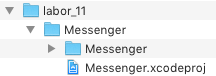
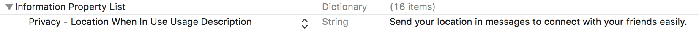
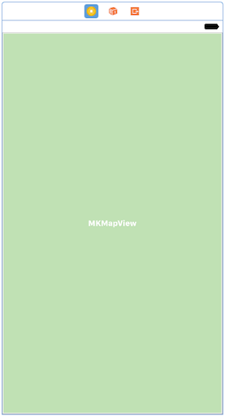
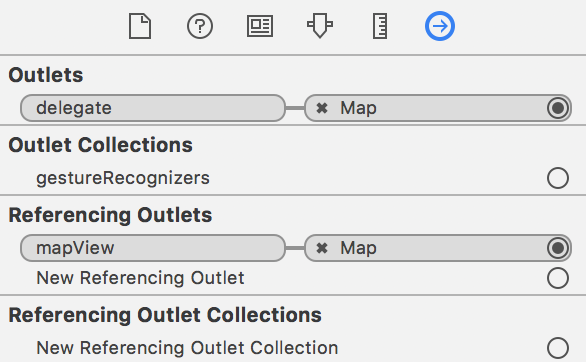

# `iOS` alapú szoftverfejlesztés - Labor `11`

## A laborsegédletet összeállította
* Kelényi Imre - imre.kelenyi@aut.bme.hu
* Kántor Tibor - tibor.kantor@autsoft.hu
* Blázovics László - blazovics.laszlo@aut.bme.hu
* Krassay Péter - peter.krassay@autsoft.hu

## A labor témája

* [Messenger](#messenger)
    * [Pozíció lekérdezése](#pozicio-lekerdezese)
    * [Pozíció csatolása az üzenethez](#pozicio-csatolasa-az-uzenethez)
    * [`MapView` megjelenítés](#mapview-megjelnites)
* [Önálló feladatok](#onallo-feladatok)

## Messenger <a id="messenger"></a>

> Másoljuk a `res/` mappában lévő **`Messenger`** kezdőprojektet a `labor_11/` mappánkba! Ez lényegében az előző labor során kidolgozott projekt.



A legfőbb UI-t érintő változás az előző verzióhoz képest, hogy az alkalmazásba bekerült egy `Tab Bar` két elemmel: **Messages** és **Map**. Az előbbiről a múlt órai labor képernyői érhetőek el, az utóbbit pedig ezen a laboron fogjuk elkészíteni. További különbség, hogy az `ComposeMessageViewController`en megjelent egy **Pending** feliratú `Label` (kódszinten pedig egy `CLLocation` property, ami a pozíciót fogja majd tárolni). Ez a nézet fogja jelezni, hogy sikerült-e a feladó koordinátáját lekérdezni. Végül egy fontos, motorháztető alatti átalakítás az új `NetworkHelper` osztály is, ahová ki lettek szervezve a hálózati hívások.

> A `MessagesViewController`ben írjuk át a `YOUR NAME`-et a saját nevünkre!

<!--  -->
> Próbáljuk ki az alkalmazást és nézzük át a forráskódját! 

### Pozíció lekérdezése <a id="pozicio-lekerdezese"></a>
> Készítsünk el egy osztályt, amely segítségével le tudjuk kérdezni az aktuális pozíciónkat. Ehhez hozzuk létre a `LocationManager` nevű, `NSObject`ből származó osztályunkat!

Ahhoz, hogy az osztály értesítéseket kapjon a pozícióval kapcsolatban, implementálni kell a `CLLocationManagerDelegate` *protocol*t. Ehhez először importálni kell a `CoreLocation` modult.

> Hozzunk létre 
>
> * egy `CLLocation` típusú, **lastLocation** nevű property-t, ami a legutolsó ismert pozíciót fogja tárolni,
> * egy `Timer` típusú, **timeoutTimer** nevű property-t,
> * egy closure-t, **locationUpdated** névvel, hogy értesíteni tudjuk a pozícióra várakozó objektumainkat a pozíció változásáról (ennek értéket a hívó fél ad a `startLocationManager` meghívásakor),
> * egy `CLLocationManager` típusú, **locationManager** nevű property-t!

```swift
import CoreLocation
import Foundation

class LocationManager: NSObject {

  var lastLocation: CLLocation?
  private var timeoutTimer: Timer?
  private var locationUpdated: (()->())!
  private var locationManager: CLLocationManager!

}
```

A pozíció lekérdezés indítását a következő metódus végzi. A `CLLocationManager` létrehozása és felparaméterezése után indít egy `Timer`, aminek a segítségével `15` másodperc után leállítjuk a pozíció lekérdezése (ha nem történik érdemi esemény).

```swift
func startLocationManager(updated: @escaping ()->()) {

  locationUpdated = updated

  locationManager = CLLocationManager()
  locationManager.requestWhenInUseAuthorization()
  locationManager.delegate = self
  locationManager.desiredAccuracy = kCLLocationAccuracyNearestTenMeters

  timeoutTimer = Timer.scheduledTimer(timeInterval: 15, target: self, selector: #selector(LocationManager.stopLocationManager), userInfo: nil, repeats: false)

  locationManager.startUpdatingLocation()
}
```

> Imlementáljuk a `Timer` lejártakor meghívódó metódust!

```swift
@objc func stopLocationManager() {
  if let timer = timeoutTimer {
    timer.invalidate()
  }

  locationManager.stopUpdatingLocation()
  locationUpdated()
}
```

> Ezt követően valósítsuk meg `CLLocationManagerDelegate`-et és két metódusát.

```swift
extension LocationManager: CLLocationManagerDelegate {

}
```

Ha érkezik frissítés, akkor az alábbi metódus fog meghívódni és a frissítést lekezelni.

```swift
func locationManager(_ manager: CLLocationManager, didUpdateLocations locations: [CLLocation]) {
  guard let newLocation = locations.last else {
    return
  }

  if -newLocation.timestamp.timeIntervalSinceNow > 5.0 {
    return
  }

  if newLocation.horizontalAccuracy < 0 {
    return
  }

  if lastLocation == nil || lastLocation!.horizontalAccuracy > newLocation.horizontalAccuracy {
    lastLocation = newLocation

    if newLocation.horizontalAccuracy <= manager.desiredAccuracy {
      stopLocationManager()
    }
  }
}
```

> Amennyiben hiba történne (a rendszer nem tudja meghatározni a pozíciónkat) állítsuk meg a frissítést.

```swift
func locationManager(_ manager: CLLocationManager, didFailWithError error: Error) {
  stopLocationManager()
  print(error.localizedDescription)
}
```

> Végül adjuk hozzá az `Info.plist` fájlban az alábbi kulcsot **Privacy - Location When In Use Usage Description** (`NSLocationWhenInUseUsageDescription`)!



Értéknek bármi megadható, de vigyázzunk, mert ezt fogja a felhasználó először elolvasni, amikor engedélyt kér tőle az alkalmazás.

### Pozíció csatolása az üzenethez <a id="pozicio-csatolasa-az-uzenethez"></a>

> Térjünk rá a `ComposeMessageViewController` kiegészítésére! Először vegyünk fel egy `LocationManager` típusú property-t az osztályban és inicializáljuk is!

```swift
private var locationManager = LocationManager()
```

> Ezután valósítsuk meg az aktuális pozíció tárolásáért felelős részeket. Indítsuk el, illetve állítsuk le a frissítést amikor szükséges, és implementáljuk a megfelelő closure-t a pozíció frissítéshez!

```swift
// MARK: - View Lifecycle

override func viewWillAppear(_ animated: Bool) {
  super.viewWillAppear(animated)

  locationManager.startLocationManager {
    if let location = self.locationManager.lastLocation {
      self.location = location
      self.coordinateLabel.text = "\(location.coordinate.latitude) " + "\(location.coordinate.longitude)"
    }
  }
  coordinateLabel.text = "Pending"
}

override func viewWillDisappear(_ animated: Bool) {
  super.viewWillDisappear(animated)

  locationManager.stopLocationManager()
}
```

Ahhoz, hogy a koordinátákat ténylegesen fel is küldjük a szervernek, ki kell egészítenünk a `Message` `struct`unkat, illetve a `MessagesViewController`ben a `composeMessageViewControllerDidSend(_:)` metódusban is be kell mapelnünk a koordinátákat! 

```swift
  ...
  var latitude: Double?
  var longitude: Double?
  ...

  case latitude
  case longitude
  ...
```

```swift
if let location = viewController.location {
  message.latitude = location.coordinate.latitude
  message.longitude = location.coordinate.longitude
}
```

> Teszteljük az alkalmazást!

###  `MapView` megjelenítés <a id="mapview-megjelnites"></a>
> Hogy meg is tudjuk nézni az egyes, helyhez kötött üzeneteket, hozzunk létre egy `MapViewController` nevű osztályt, ami a `UIViewController`ből származik.

> A `Main.storyboard`ban a `Map` jelenetnek állítsuk be a az `Identity inspector`ban a *Class* attribútumát `MapViewController`re!

<!--  -->
> `AutoLayout` kényszerek segítségével tegyünk a `MapViewController` `view`-jába egy teljes nézetet betöltő `MKMapView`-t, majd kössük be egy `Outlet`tel a `MapViewController`be **mapView** néven.



> Ne felejtsük el az újonnan hozzáadott `MKMapView`-nak beállítani a tartalmazó `ViewController`t, mint delegate-et!



> Miután ez megvan, térjünk vissza az osztály forrásához és importáljuk a `MapKit` modult! Adjunk továbbá hozzá egy property-t, ami majd a megjelenítendő üzeneteinket fogja tartalmazni,  illetve jelezzük, hogy meg fogjuk valósítani az `MKMapViewDelegate`-et (`extension`)!

```swift
import MapKit
import UIKit

class MapViewController: UIViewController {

  @IBOutlet weak var mapView: MKMapView!
  
  private var messages = [Message]()

}

extension MapViewController: MKMapViewDelegate {

}
```

> Teszteljük az alkalmazást!

Látható, hogy a térkép betöltődött, ugyanakkor nincs rajta semmi. Ahhoz, hogy bármit is meg tudjunk jeleníteni, szükségünk van az üzenetekre. Ezek ugyanazok az üzenetek, amiket a `Messages` tabon is láthatunk, így egy komolyabb alkalmazásban valamilyen központi helyen tárolnánk ezeket, pl.: `CoreData`, `Realm`, stb. A laboron most azt fogjuk csinálni, hogy a `Map` tabra navigáláskor minden alkalommal le fogjuk tölteni a friss üzeneteket és azokat jelenítjük csak meg, amikben vannak koordináták is. (Most jön jól, hogy a hálózati hívások ki lettek szervezve, nem kell kódot duplikálni.)

> Töltsük le az üzeneteket a `NetworkHelper` segítségével!

```swift
override func viewWillAppear(_ animated: Bool) {
  super.viewWillAppear(animated)
  
  NetworkHelper.downloadMessages { messages in
    self.messages = messages
  }
}
```

A sikeres letöltés után már minden üzenet a birtokunkban lesz. Ahhoz, hogy ezeket meg is tudjuk jeleníteni a térképen egy saját osztállyal meg kell valósítani az `MKAnnotation` *protocol*t.

> Hozzunk tehát létre egy új, `NSObject`ből származó osztályt `MessageAnnotation` névvel, ami megvalósítja az `MKAnnotation` *protocol*t!

```swift
import MapKit
import UIKit

class MessageAnnotation: NSObject {

  var coordinate: CLLocationCoordinate2D
  var title: String?
  var subtitle: String?

  init(coordinate: CLLocationCoordinate2D, title: String, subtitle: String) {
    self.coordinate = coordinate
    self.title = title
    self.subtitle = subtitle
  }

}

extension MessageAnnotation: MKAnnotation {}
```

> Ha ez kész, akkor térjünk vissza a `MapViewController`be és azokra az üzenetekre, ahol vannak koordináta adatok, hozzunk létre új `MessageAnnotation`öket.

```swift
override func viewWillAppear(_ animated: Bool) {
  super.viewWillAppear(animated)
  
  NetworkHelper.downloadMessages { messages in
    self.messages = messages

    self.messages.filter { return ($0.longitude != nil) && $0.latitude != nil }.forEach { message in
      let coordinate = CLLocationCoordinate2D(latitude: message.latitude!, longitude: message.longitude!)
      let title = "\(message.recipient) \(message.sender)"
      let subtitle = message.topic
      
      let annotation = MessageAnnotation(coordinate: coordinate, title: title, subtitle: subtitle)
 
      self.mapView.addAnnotation(annotation)
    }
  }
}
```

> Azért, hogy ugyanarra a `Map View`-ra ne rakjuk ki ugyanazokat az üzeneteket minden alkalommal amikor idenavigálunk, szedjük le őket amint elhagyjuk a jelenetet. (Itt is elegánsabb lenne a valóságban a központi adatbázisból szedett üzenetek közül mindig csak az újakat rárakni a térképre és akkor nem kéne semmit levenni.)

```swift
override func viewWillDisappear(_ animated: Bool) {
  mapView.annotations.forEach { annotation in
    self.mapView.removeAnnotation(annotation)
  }
}
```

> Futtassuk az alkalmazást!

<!--  -->
> Az annotációk mellett adjunk hozzá egy törtvonalat (`MKPolyLine`) is a térképhez úgy, hogy minden üzenet legyen egymás után sorban összekötve. Ehhez először hozzunk létre egy koordinátákat tartalmazó tömböt, amivel létrehozzuk a törtvonalat, majd adjuk hozzá a törtvonalat a `mapView`-hoz, mint *overlay*!

```swift
override func viewWillAppear(_ animated: Bool) {
  super.viewWillAppear(animated)
  
  NetworkHelper.downloadMessages { messages in
    self.messages = messages
    
    var coordinates = [CLLocationCoordinate2D]()
    self.messages.filter { return ($0.longitude != nil) && $0.latitude != nil }.forEach { message in
      let coordinate = CLLocationCoordinate2D(latitude: message.latitude!, longitude: message.longitude!)
      let title = "\(message.recipient) \(message.sender)"
      let subtitle = message.topic
      
      let annotation = MessageAnnotation(coordinate: coordinate, title: title, subtitle: subtitle)
      self.mapView.addAnnotation(annotation)
      
      coordinates.append(coordinate)
    }
    
    let polyline = MKPolyline(coordinates: coordinates, count: coordinates.count)
    self.mapView.add(polyline)
  }
}
```

> Ezután implementáljuk a következő delegate metódust, hogy ki is legyen rajzolva a törtvonal!

```swift
func mapView(_ mapView: MKMapView, rendererFor overlay: MKOverlay) -> MKOverlayRenderer {
  if overlay is MKPolyline {
    let line = MKPolylineRenderer(overlay: overlay)
    line.strokeColor = UIColor.blue
    line.lineWidth = 2

    return line
  }

  return MKPolylineRenderer()
}
```

Látható, hogy most már szépen megjelennek az üzenetek és az azokat összekötő vonal.

> Ehhez valósítsuk meg a következő delegate metódust, aminek a segítségével testreszabhatjuk a megjelenő annotation kinézetét és viselkedését!

```swift
func mapView(_ mapView: MKMapView, viewFor annotation: MKAnnotation) -> MKAnnotationView? {
  if annotation is MessageAnnotation {
    let reusableId = "MessangerAnnotationID"
    var markerAnnotationView = mapView.dequeueReusableAnnotationView(withIdentifier: reusableId) as? MKMarkerAnnotationView
    
    if markerAnnotationView == nil {
      markerAnnotationView = MKMarkerAnnotationView(annotation: annotation, reuseIdentifier: reusableId)
      markerAnnotationView?.markerTintColor = UIColor.green
      markerAnnotationView?.canShowCallout = true
      
      let calloutButton = UIButton(type: .detailDisclosure)
      markerAnnotationView?.rightCalloutAccessoryView = calloutButton
    }
    else {
      markerAnnotationView?.annotation = annotation
    }
    
    return markerAnnotationView
  }
  
  return nil
}
```

> Implementáljuk az előbb hozzáadott gomb eseménykezelőjét! 

A gomb megnyomására először lekérdezzük az adott üzenet koordinátáját, majd a beépített reverse geocoding szolgáltatás segítségével megkapjuk a pontos címét is a küldés helyének.

Ezután létrehozunk egy két `MKMapItem`ből álló tömböt. Az első elem az aktuális koordinátánk lesz, a második pedig előbb meghatározott helyet fogja tartalmazni.

Végül ezt és egy megfelelő kulcsokat tartalmazó collectiont átadva meghívjuk a beépített `Map` alkalmazást, ami a paramétereknek megfelelően megtervezi az útvonalat az átadott pontok között.

```swift
func mapView(_ mapView: MKMapView, annotationView view: MKAnnotationView, calloutAccessoryControlTapped control: UIControl) {
  guard let coordinate = view.annotation?.coordinate else {
    return
  }

  let geocoder = CLGeocoder()
  let location = CLLocation(latitude: coordinate.latitude, longitude: coordinate.longitude)

  geocoder.reverseGeocodeLocation(location) { placemarks, error in
    if let error = error {
      print("Error: \(error.localizedDescription)")
    }

    guard let placemarks = placemarks, placemarks.count != 0 else {
      return
    }

    let clPlacemark = placemarks.first!
    let placemark = MKPlacemark(placemark: clPlacemark)
    let mapItem = MKMapItem(placemark: placemark)

    mapItem.name = view.annotation?.title!

    var mapItems = [MKMapItem]()
    mapItems.append(MKMapItem.forCurrentLocation())
    mapItems.append(mapItem)

    let launchOptions: [String: Any] = [
      MKLaunchOptionsMapTypeKey: MKMapType.hybrid.rawValue,
      MKLaunchOptionsDirectionsModeKey: MKLaunchOptionsDirectionsModeDriving
    ]
    MKMapItem.openMaps(with: mapItems, launchOptions: launchOptions)
  }
}
```

> Futtassuk az alkalmazást!

## Önálló feladatok <a id="onallo-feladatok"></a>

-  Az üzenetek mellett jelenítsük meg a saját pozíciónkat is a térképen!
-  Az annotation `leftCalloutAccessoryView`-jában jelenítsük meg az üzenethez tartozó képet! 
    - A kép letöltését érdemes a `mapView(:didSelect:)`delegate metódusban elindítani.
    - Jó ötlet lehet a `MessageAnnotation` osztályba bevenni a hozzá tartozó üzenetet.
-  Módosítsunk a vonal kirajzolásán úgy, hogy azok az üzenetek legyenek összekötve, akiknek a szerzői üzentek már a másik félnek.
    - `A` és `B` esetén volt már tehát `A` --> `B` és `B` --> `A` üzenet is.
    - Több vonalra lesz szükség.

