# `iOS` alapú szoftverfejlesztés - Labor `11`

## A labor témája

* [PictureDownload](#picture-download)
    * [`ViewController` inicializálása kódból](#viewcontroller-inicializalasa-kodbol)
    * [Alamofire](#alamofire)
* [Önálló feladat](#onallo-feladat)
    * [ECSlidingViewController](#ecslidingviewcontroller)
    * [MBProgressHUD](#mbprogresshud)
    * [CocoaPods](#cocoapods)
* [Szorgalmi feladat](#szorgalmi-feladat)

## PictureDownload <a id="picture-download"></a>

Alkalmazásunk a [fortepan.hu](http://fortepan.hu)-ról fog letölteni közepes, illetve nagy felbontású képeket. Utóbbi esetén azt is szeretnénk megmutatni a felhasználónak, hogy hogyan halad a letöltés. 

> Kiindulásnak hozzunk létre a `labor_11` könyvtárba egy új `Single View App`ot __`PictureDownload`__ névvel!

<!-- -->
> A `Target` beállítások, `Deployment Info` szekcióban állítsuk a `Devices` beállítást `iPhone`-ra, valamint töröljük ki a `Main Interface` mező tartalmát!

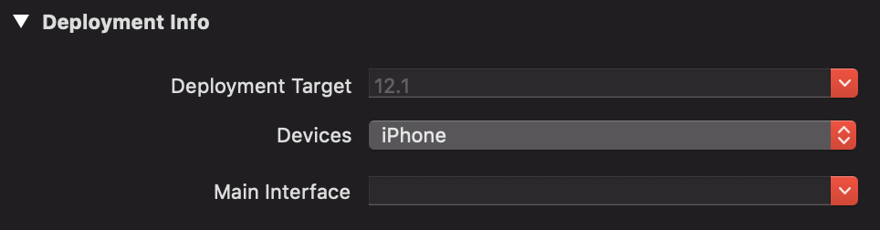

### `ViewController` inicializálása kódból <a id="viewcontroller-inicializalasa-kodbol"></a>
> Egészítsük ki a `ViewController.swift`et! Hozzunk létre egy **imageView** nevű *UIImageView* típusú property-t, hogy szükség esetén le tudjuk cserélni a benne lévő képet, illetve egy **contentUrl** és egy **imageUrl** property-t *URL* típussal.

```swift
// MARK: - Properties

private var imageView: UIImageView!
var imageUrl: URL?
var contentUrl: URL?
```

> Majd cseréljük le a `viewDidLoad()` metódust a következő kódrészlettel, valamint vegyük fel a `downloadFile` metódust!

```swift
// MARK: - View lifecycle

override func viewDidLoad() {
  super.viewDidLoad()

  view.backgroundColor = .white

  let safeArea = view.safeAreaLayoutGuide

  imageView = UIImageView()
  imageView.contentMode = .scaleAspectFit
  imageView.backgroundColor = .black
  view.addSubview(imageView)
  imageView.translatesAutoresizingMaskIntoConstraints = false
  imageView.topAnchor.constraint(equalTo: safeArea.topAnchor).isActive = true
  imageView.leadingAnchor.constraint(equalTo: safeArea.leadingAnchor).isActive = true
  imageView.trailingAnchor.constraint(equalTo: safeArea.trailingAnchor).isActive = true
  imageView.heightAnchor.constraint(equalTo: safeArea.heightAnchor, multiplier: 0.5).isActive = true


  let stackView = UIStackView()
  stackView.axis = .vertical
  stackView.distribution = .fillEqually
  view.addSubview(stackView)
  stackView.translatesAutoresizingMaskIntoConstraints = false
  stackView.topAnchor.constraint(equalTo: imageView.bottomAnchor).isActive = true
  stackView.leadingAnchor.constraint(equalTo: safeArea.leadingAnchor).isActive = true
  stackView.trailingAnchor.constraint(equalTo: safeArea.trailingAnchor).isActive = true
  stackView.bottomAnchor.constraint(equalTo: safeArea.bottomAnchor).isActive = true

  let downloadButton = UIButton(type: .system)
  downloadButton.setTitle("Download", for: .normal)
  downloadButton.setTitleColor(.black, for: .normal)
  downloadButton.addTarget(self, action: #selector(ViewController.downloadFile), for: .touchUpInside)
  stackView.addArrangedSubview(downloadButton)
}

// MARK: - Actions

@objc func downloadFile() {
}
```

> Végül adjuk hozzá az alábbi kódrészletet az `AppDelegate.swift` `application(_:didFinishLaunchingWithOptions:)` metódusához!

```swift
func application(_ application: UIApplication, didFinishLaunchingWithOptions launchOptions: [UIApplication.LaunchOptionsKey: Any]?) -> Bool {
    window = UIWindow(frame: UIScreen.main.bounds)

    let viewController = ViewController()
    viewController.imageUrl = URL(string: "http://www.fortepan.hu/_photo/display/28268.jpg")
    viewController.contentUrl = URL(string: "http://www.fortepan.hu/_photo/download/fortepan_28268.jpg")

    window?.rootViewController = viewController
    window?.makeKeyAndVisible()

    return true
}
```

> Teszteljük az alkalmazást!

### Alamofire <a id="alamofire"></a>

Látható, hogy minden UI elem megjelenik, de a kép nem töltődik be.

> A kép letöltéséhez használjuk az [`Alamofire`](https://github.com/Alamofire/Alamofire/archive/master.zip) nevű third-party komponenst a linkről!

<!--  -->
> Tömörítsük ki az állományt, majd az `Alamofire.xcodeproj` fájlt adjuk hozzá a projekthez. Legegyszerűbben ezt úgy tudjuk megtenni, hogy `Finder`ből áthúzzuk az `Xcode`-ba. (Előtte készítsünk egy *Alamofire* nevű *Group*ot!)

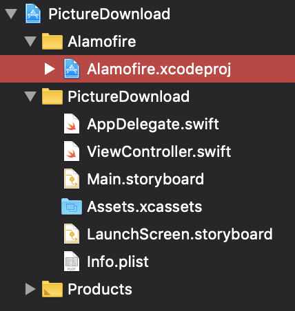

<!--  -->
> Ezután adjuk hozzá `Embedded Binary`-ként a megfelelő `Alamofire.framework`öt a `PictureDownload` `Target`hez! Ehhez menjünk el a projektbeállításokhoz és a megfelelő helyen nyomjuk meg a `+` gombot, majd válasszuk ki az `iOS`-re generált *framework*öt.

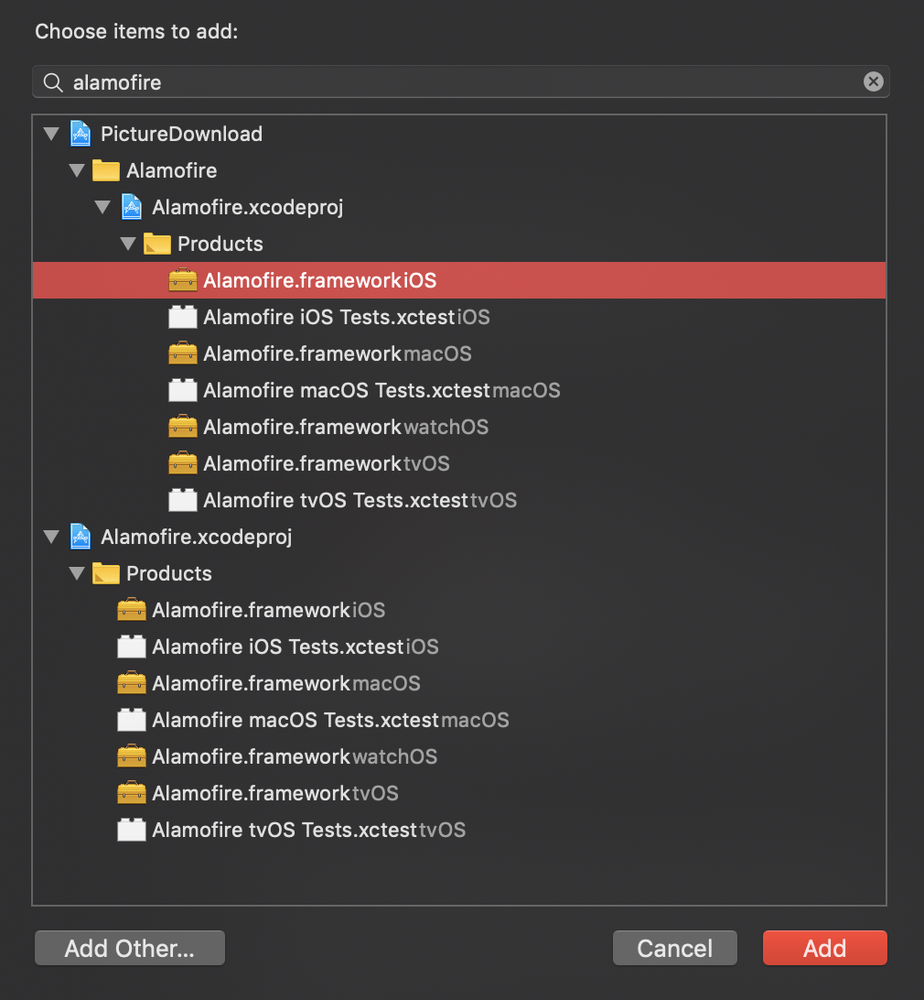

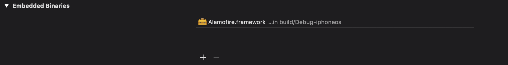

> Ezt követően a `ViewController.swift`ben importáljuk az `Alamofire`-t és írjuk felül a `viewWillAppear(_:)` metódust.

```swift
import Alamofire
import UIKit

...

override func viewWillAppear(_ animated: Bool) {
  super.viewWillAppear(animated)

  guard let imageUrl = imageUrl else {
    return
  }

  Alamofire.request(imageUrl).response { response in
    if let error = response.error {
      print(error.localizedDescription)
      return
    }

    if let data = response.data, let image = UIImage(data: data) {
      self.imageView.image = image
    }
  }
}
```

> Ahogy már a korábbi laboroknál is előjött, engedélyezni kell az projekthez tartozó `Info.plist` fájlban a `HTTP` felett történő kommunikációt a következő két kulcs felvételével: `NSAppTransportSecurity` (`Dictionary`) és ezen belül `NSAllowsArbitraryLoads` (`BOOL`). (Vagy használhatjuk a képen látható, könnyebben megjegyezhető neveket, amire az Xcode automatikus kiegészítési lehetőségeket is ajánl.)


Ha ezt elfelejtjük megtenni, akkor a már jól ismert hibaüzenetet kapjuk.

*App Transport Security has blocked a cleartext HTTP (http://) resource load since it is insecure. Temporary exceptions can be configured via your app's Info.plist file.*

> Futtassuk az alkalmazást, és ellenőrizzük, hogy megjelenik-e a kép!

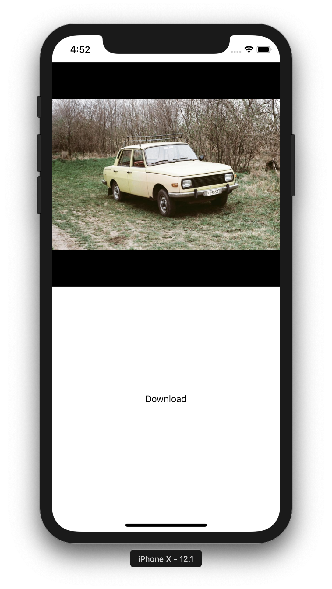

<!-- -->
> Implementáljuk a `downloadFile()` nevű metódust, amit a `Download` gomb eseménykezelője hív meg, és az alkalmazás `Documents` mappájába menti a képet!

```swift
// MARK: - Actions

@objc func downloadFile(){
  guard let contentUrl = contentUrl else {
    return
  }

  let destination = Alamofire.DownloadRequest.suggestedDownloadDestination(for: .documentDirectory, in: .userDomainMask)
  Alamofire.download(contentUrl, to: destination).downloadProgress { progress in
    print(progress.completedUnitCount)
  }.response { response in
    if let error = response.error {
      print("Error: \(error.localizedDescription)")
    } else {
      print("Success!")
    }
  }
}
```

## Önálló feladat <a id="onallo-feladat"></a>

### ECSlidingViewController <a id="ecslidingviewcontroller"></a>

Most, hogy van már rendes tartalmunk, adjunk hozzá az alkalmazáshoz egy menüt!

> Ehhez töltsük le az [`ECSlidingViewController`](https://github.com/ECSlidingViewController/ECSlidingViewController/archive/master.zip
) thrid-party komponenst a linkről!

<!--  -->
> Csomagoljuk ki a fájlt és keressük meg az `ECSlidingViewController` mappát, majd az egész mappát adjuk hozzá a projekthez! Fontos, hogy a `Copy items if needed`, `Create groups` és a `PictureDownload` *target* is legyen bepipálva!

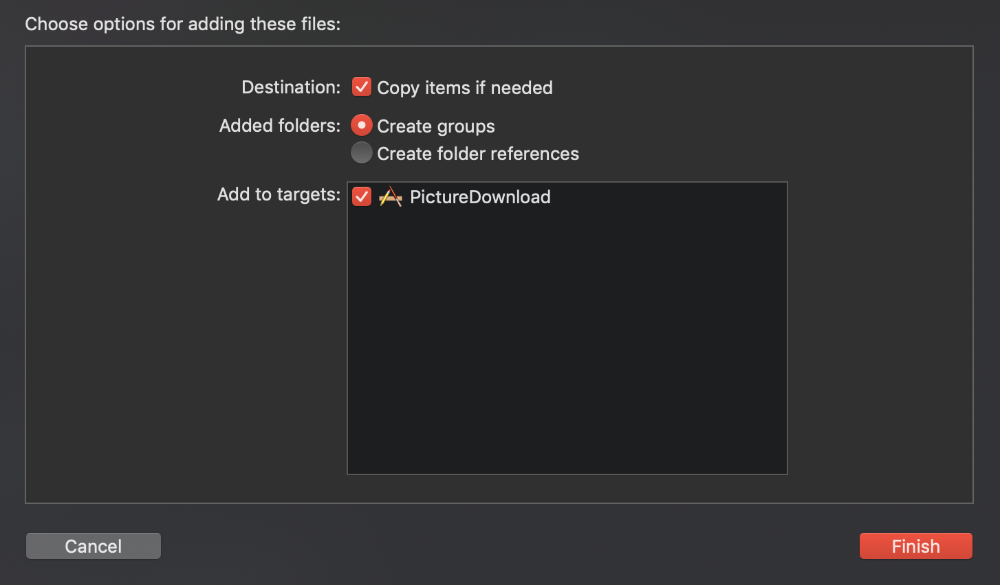

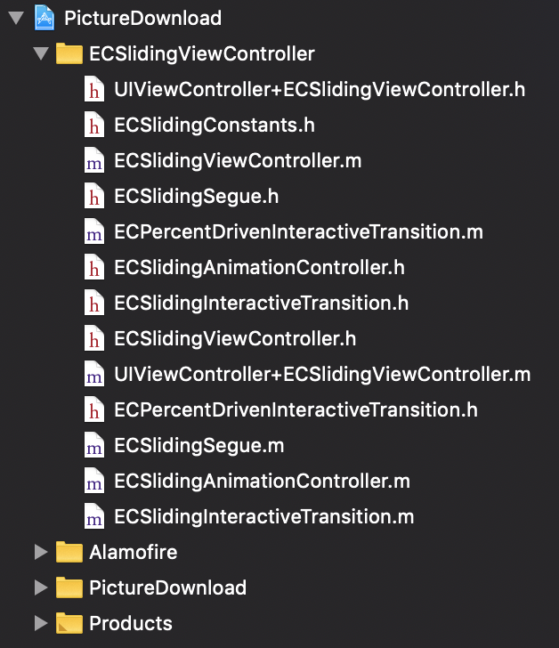

> Először hozzunk létre egy `MenuViewController` nevű `UITableViewController`ből származó osztályt egy `showMenu(_:)` metódussal (erre majd a navigáció során lesz szükségünk, hogy az `unwind segue`-t be tudjuk kötni).

```swift
class MenuViewController: UITableViewController {

  @IBAction func showMenu(_ segue: UIStoryboardSegue) {

  }

}
```

> Nyissuk meg a `Main.storyboard`ot, töröljük ki a benne található jelenetet, majd adjunk hozzá egy `UITableViewController`t! Osztályának a `MenuViewController`t állítsuk be! 

<!--  -->
> A `Table View`-t kiválasztva állítsuk át a *Content*et **Static Cells**-re, majd adjunk hozzá `3` **Basic** stílusú cellát ahogy a képen is látható! 

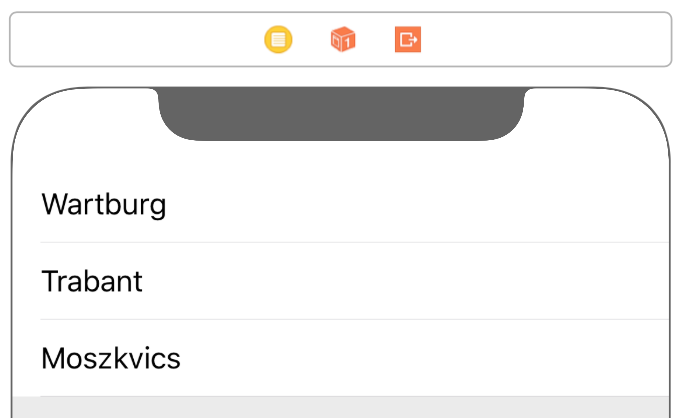

> Állítsuk be a `MenuViewController` *Storyboard ID*-ját **MenuViewController**re!

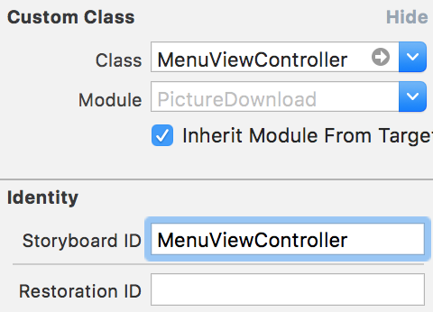

> Ezután adjunk hozzá egy újabb `View Controller`t, melynek osztálya `ECSlidingViewController` legyen. Állítsuk be, hogy ez a jelenet legyen a kezdő, azaz **Initial View Controller**!

<!--  -->
> Ágyazzunk be egy újabb `ViewController`t (az osztálya legyen `ViewController`) egy `NavigationController`be, majd adjunk hozzá a `Navigation Bar` bal oldalára egy `BarButtonItem`et **Menu** felirattal. 

<!--  -->
> Duplikáljuk kétszer egymás után a `ViewController`t és a `NavigationController`t a `⌘` + `D` billentyűkombinációval, vagy az `Edit/Duplicate` funkció használatával. (A létrejött új jeleneteket mozgassuk el egymásról.)

<!--  -->
> Az így létrejött **3** `NavigationController`t kössük be a `TableView` egyes celláihoz egy-egy **sliding** `segue`-el.

<!--  -->
> A `3` `ViewController`ben állítsuk be a *Restoration ID*-ket a celláknak megfelelően. Ha a menüben **Trabant** volt a cella szövege, akkor az ahhoz tartozó `ViewController`ben is legyen **Trabant** a *Restoration ID*!


> Ezután állítsuk be az `unwind segue`-eket a három `ViewController`ben a **Menu** gombhoz!

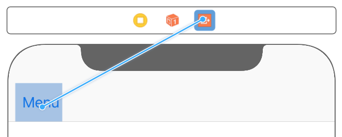

> A **Wartburg**hoz tartozó `NavigationController` *Storyboard ID*-ját állítsuk **FirstViewController**re.

<!--  -->
> Végül térjünk vissza az `ECSlidingViewController`hez és adjunk hozzá két `String` típusú `User Defined Runtime Attribute`-ot (*topViewControllerStoryboardId*, *underLeftViewControllerStoryboardId*) a megfelelő értékekkel (*FirstViewController*, *MenuViewController*)!

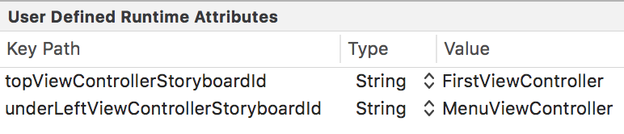

Ha mindent jól csináltunk, akkor valami ehhez hasonló elrendezést kell kapnunk.

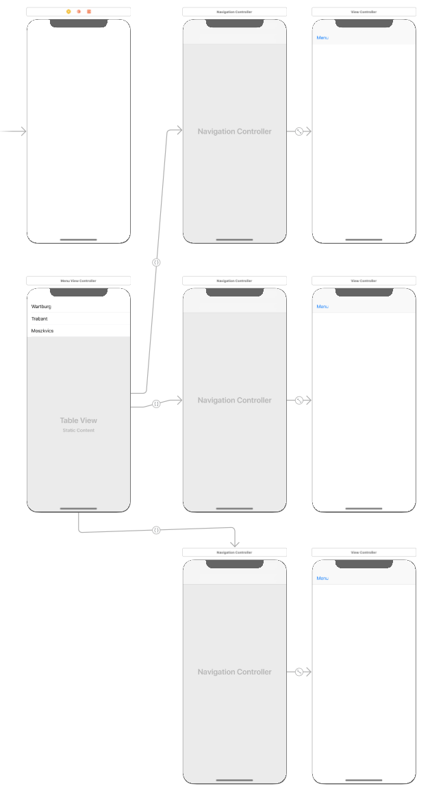

> Teszteljük az alkalmazást!

Azt láthatjuk, hogy hiába van beállítva a `Main.storyboard`ban az `Is Initial View Controller` property, továbbra is a kezdeti `ViewController` jön csak be, nem a nagy nehezen összerakott menü. 

> Ahhoz, hogy a Storyboard érvényre jusson, az `AppDelegate.swift`ben az `application(_:didFinishLaunchingWithOptions:)` metódusból a `return true` sor kivételével töröljünk mindent, valamint a labor elején a `Deployment Info`nál kitörölt `Main Interface` értékét is állítsuk vissza **Main.storyboard**ra!

Ezek után a menünek már szépen működnie kell, a képek viszont még nem jelennek meg.

> Ezt orvosolandó, a `ViewController.swift`ben készítsünk egy `setupUrls()` segédfüggvényt!

```swift
// MARK: - Helper methods

private func setupUrls() {
  guard let restorationID = restorationIdentifier else {
    return
  }

  switch restorationID {
  case "Wartburg":
    view.backgroundColor = UIColor(red:0.13, green:0.14, blue:0.15, alpha:1)
    imageUrl = URL(string: "http://www.fortepan.hu/_photo/display/28268.jpg")
    contentUrl = URL(string: "http://www.fortepan.hu/_photo/download/fortepan_28268.jpg")
  case "Trabant":
    view.backgroundColor = UIColor(red:0.95, green:0.95, blue:0.95, alpha:1)
    imageUrl = URL(string: "http://www.fortepan.hu/_photo/display/74394.jpg")
    contentUrl = URL(string: "http://www.fortepan.hu/_photo/download/fortepan_74394.jpg")
  case "Moszkvics":
    view.backgroundColor = UIColor(red:0.8, green:0, blue:0.48, alpha:1)
    imageUrl = URL(string: "http://www.fortepan.hu/_photo/display/16022.jpg")
    contentUrl = URL(string: "http://www.fortepan.hu/_photo/download/fortepan_16022.jpg")
  default:
    break
  }
}
```

> Majd hívjuk meg a `viewDidLoad()`-ban!

```swift
override func viewDidLoad() {
    super.viewDidLoad()

    setupUrls()
    ...
}
```

> Próbáljuk ki az alkalmazást!

### MBProgressHUD <a id="mbprogresshud"></a>

Most, hogy már van mit letölteni, adjuk hozzá a projekthez az `MBProgressHUD` third-party könyvtárat, amivel különböző *progress bar*okat tudunk megjeleníteni.

> Ehhez először töltsük le a [forrást](https://github.com/jdg/MBProgressHUD/archive/master.zip
), majd csomagoljuk is ki!

<!--  -->
> Keressük meg és adjuk hozzá a projekthez az `MBProgressHUD.h` és az `MBProgressHUD.m` fájlokat (egy **MBProgressHUD** groupba)!

Mivel ezek `Objective-C`-ben írt állományok, `Swift` kódból történő használatukhoz ún. *bridging header*re van szükség. A segítségével importált állományok elérhetőek és használhatóak lesznek a `Swift` fájlokból.

> Amennyiben az `Xcode` nem ajánlja fel a *bridging header* létrehozását, készítsük el manuálisan! `PictureDownload-Bridging-Header.h` néven hozzunk létre egy *Header* fájlt, majd menjünk át a projektbeállításokhoz, azon belül is `Build Settings`-hez és állítsuk be az `Objective-C Brigding Header`t: **`$(PROJECT)/PictureDownload-Bridging-Header.h`** 

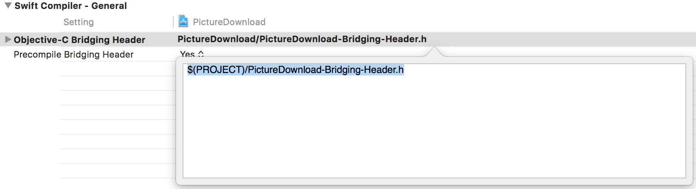

> Végül egészítsük ki a `PictureDownload-Bridging-Header.h`-t az `#import "MBProgressHUD.h"` direktívával!

```smalltalk
#import "MBProgressHUD.h"
```

> Ezután egészítsük ki a `ViewController`t, hogy letöltés közben megjelenjen a letöltés állapota. 
Hozzunk létre egy `MBProgressHUD` típusú property-t, hogy később bárhonnan el tudjuk érni!

```swift
private var hud: MBProgressHUD!
```

> Majd inicializáljuk a `viewDidLoad()` végén!

```swift
hud = MBProgressHUD(view: view)
view.addSubview(hud)
```

> Amikor elindul a letöltés jelenítsük meg, az egyes adatcsomagok beérkezésekor frissítsük, végül, ha a kép letöltődött, rejtsük el a HUD-ot! Ehhez a `downloadFile()` metódust kell kiegészíteni.

```swift
@objc func downloadFile() {
  guard let contentUrl = contentUrl else {
    return
  }

  let destination = Alamofire.DownloadRequest.suggestedDownloadDestination(for: .documentDirectory, in: .userDomainMask)
  Alamofire.download(contentUrl, to: destination).downloadProgress { progress in
    print(progress.completedUnitCount)
    self.hud.progress = Float(progress.fractionCompleted)
    self.hud.label.text = String(format: "%.2f%%", progress.fractionCompleted * 100)
    }.response { response in
      defer {
        self.hud.hide(animated: true)
      }
      
      if let error = response.error {
        print("Error: \(error.localizedDescription)")
      } else {
        print("Success!")
      }
  }
  hud.show(animated: true)
}
```

### CocoaPods <a id="cocoapods"></a>

Végül, hogy ne kelljen minden egyes nézetváltáskor letölteni a kisméretű képeket, adjunk hozzá a projekthez egy *image cache* komponenst, mely elvégzi ezt a feladatot.
Ehhez a [`Kingfisher`](https://github.com/onevcat/Kingfisher) nevű third-party könyvtárat fogjuk használni, amit a CocoaPods nevű függőségkezelő rendszerrel fogunk hozzáadni a projekthez.

A laborgépeken már telepítve van a program, saját gépen az alábbi utasítás `Terminal`ból való végrehajtásával telepíthető:

```bash
sudo gem install cocoapods
```

> Adjunk hozzá egy üres fájt a projektünk gyökérkönyvtárába `Podfile` néven. Ezt a legegyszerűbben úgy tudjuk megtenni, hogy a projekthez magához adunk hozzá egy üres fájlt.

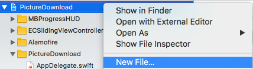

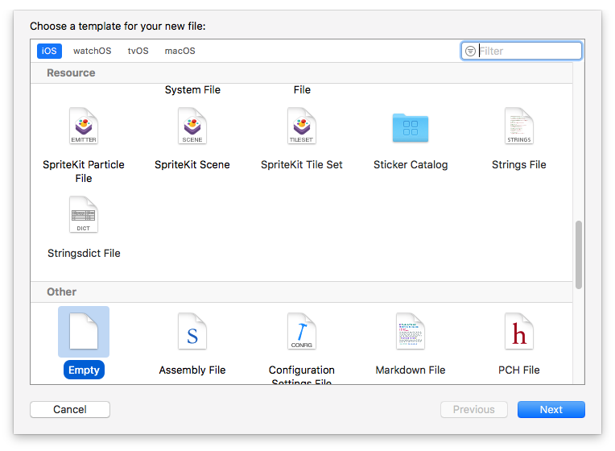

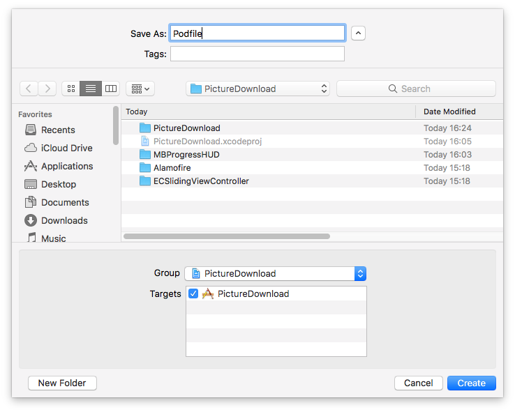

> Módosítsuk tartalmát a következőre:

```ruby
platform :ios, '11.0'
use_frameworks!

target 'PictureDownload' do
  pod 'Alamofire'
  pod 'Kingfisher'
end
```

> Az `Alamofire`t azért írjuk bele, hogy a jelenlegi projekt importálást kitörölhessük az újonan generált workspace-ünkből.

<!-- -->
> Mentsük el a `Podfile`-t, majd a `Terminal`ban navigáljunk a projekt gyökérkönyvtárába, és futtassuk a következő parancsot!

```bash
pod install
```

> Ha sikerült, zárjuk be a projektet és a `Finder`ben keressük meg a projekt mellett létrejött `PictureDownload.xcworkspace` fájlt, és nyissuk meg!

Valami ilyesmit kell látnunk.

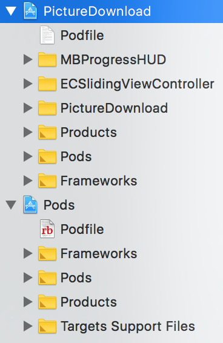

> Nyissuk meg a `ViewController.swift` állományunkat és kommentezzük ki a korábban írt `viewWillAppear(_:)` metódust! 

Ezzel sajnos azt értük el, hogy már nem töltődnek be automatikusan a járművek képei, amikor a nézetet megjelenítjük. A következőkben módosítjuk a `ViewController`t, hogy a kép letöltését (és cache-elését) a `Kingfisher` végezze. 

> A `Kingfisher`t használat előtt importáljuk!

```swift
import Kingfisher
```

> Végül egészítsük ki a `ViewController` `viewDidLoad()` metódusát, hogy le is töltödjön a kép. Ehhez adjunk hozzá a következő sorokat!

```swift
  override func viewDidLoad() {
    super.viewDidLoad()

    ...
    if let imageUrl = imageUrl {
      imageView.kf.setImage(with: imageUrl)
    }
  }
```

## Szorgalmi feladat <a id="szorgalmi-feladat"></a>
> Jelenítsük meg a letöltött képet valami kreatív módon!

## A laborsegédletet összeállította
* Varga Domonkos - varga.domonkos@autsoft.hu
* Krassay Péter - peter.krassay@autsoft.hu
* Szücs Zoltán - szucs.zoltan@autsoft.hu
* Blázovics László - blazovics.laszlo@aut.bme.hu
* Kántor Tibor - tibor.kantor@autsoft.hu
* Kelényi Imre - imre.kelenyi@aut.bme.hu
