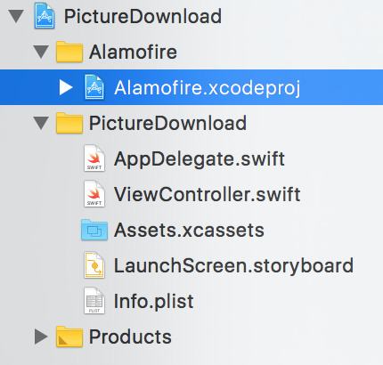

# `iOS` alapú szoftverfejlesztés - Labor `12`

## A laborsegédletet összeállította
* Kelényi Imre - imre.kelenyi@aut.bme.hu
* Kántor Tibor - tibor.kantor@autsoft.hu
* Blázovics László - blazovics.laszlo@aut.bme.hu
* Krassay Péter - peter.krassay@autsoft.hu

## A labor témája

* [PictureDownload](#picture-download)
    * [ViewController inicializálása kódból](#viewcontroller-inicializalasa-kodbol)
    * [Alamofire](#alamofire)
    * [ECSlidingViewController](#ecslidingviewcontroller)
    * [MBProgressHUD](#mbprogresshud)
    * [CocoaPods](#cocoapods)
* [Önálló feladat](#onallo-feladat)

## PictureDownload <a id="picture-download"></a>

Alkalmazásunk a [fortepan.hu](fortepan.hu)-ról fog letölteni közepes, illetve nagy felbontású képeket. Utóbbi esetén azt is szeretnénk megmutatni a felhasználónak, hogy hogyan halad a letöltés. 

> Kiindulásnak Hozzunk létre egy új `Single View Application`t, `PictureDownload` névvel `iPhone`-ra!

<!--  -->
> A létrehozott projektben töröljük ki a `Main.storyboard`ot (*Move to Trash*) és ezt vezessük át projekt beállításaiban is, nevezetesen töröljük ki a `Main` interface mező tartalmát a `Deployment Info` résznél.


### ViewController inicializálása kódból <a id="viewcontroller-inicializalasa-kodbol"></a>

Egészítsük ki a `ViewController.swift`et!

> Hozzunk létre egy **imageView** nevű *UIImageView* property-t, hogy szükség esetén le tudjuk cserélni a benne lévő képet, illetve egy **contentUrl** és egy **imageUrl** property-t *URL* típussal.

```swift
// MARK: - Properties

var imageView: UIImageView!
var imageUrl: URL?
var contentUrl: URL?
```

> Majd cseréljük le a `viewDidLoad()` metódust a következő kódrészlettel!

```swift
override func viewDidLoad() {
  super.viewDidLoad()

  imageView = UIImageView(frame: CGRect(x: view.bounds.minX, y: view.bounds.minY, width: view.bounds.width, height: view.bounds.height/2))
  imageView?.contentMode = .scaleAspectFit
  imageView?.backgroundColor = UIColor.black
  view.addSubview(imageView!)

  let downloadButton = UIButton(type: .system)
  downloadButton.bounds = CGRect(x: 0, y: 0, width: 100, height: 40)
  downloadButton.center = CGPoint(x: view.bounds.width/2, y: view.bounds.height*5/8)
  downloadButton.setTitle("Download", for: .normal)
  downloadButton.setTitleColor(UIColor.black, for: .normal)
  downloadButton.addTarget(self, action: "downloadFile", for: .touchUpInside)
  view.addSubview(downloadButton)

  let displayButton = UIButton(type: .system)
  displayButton.bounds = CGRect(x: 0, y: 0, width: 100, height: 40)
  displayButton.center = CGPoint(x: view.bounds.width/2, y: view.bounds.height*6/8)
  displayButton.setTitle("Present", for: .normal)
  displayButton.setTitleColor(UIColor.black, for: .normal)
  view.addSubview(displayButton)

  view.backgroundColor = UIColor.white
}
```

> Végül adjuk hozzá az alábbi kódrészletet az `AppDelegate.swift` `application(:didFinishLaunchingWithOptions:)` metódusához!

```swift
func application(_ application: UIApplication, didFinishLaunchingWithOptions launchOptions: [UIApplicationLaunchOptionsKey: Any]?) -> Bool {

  window = UIWindow(frame: UIScreen.main.bounds)

  let viewController = ViewController()
  viewController.imageUrl = URL(string: "http://www.fortepan.hu/_photo/display/28268.jpg")
  viewController.contentUrl = URL(string: "http://www.fortepan.hu/_photo/download/fortepan_28268.jpg")

  window?.rootViewController = viewController
  window?.makeKeyAndVisible()

  return true
}
```

> Teszteljük az alkalmazást!

### Alamofire <a id="alamofire"></a>

Látható, hogy minden UI elem megjelenik, de a kép nem töltődik be, és a letöltés gomb megnyomásakor is hibát kapunk.

> A kép letöltéséhez használjuk az [`Alamofire`](https://github.com/Alamofire/Alamofire/archive/master.zip) nevű third party komponenst a linkről!

<!--  -->
> Tömörítsük ki az állományt, majd az `Alamofire.xcodeproj` fájlt adjuk hozzá a projekthez. Legegyszerűbben ezt úgy tudjuk megtenni, hogy `Finder`ből áthúzzuk az `Xcode`-ra. (Előtte készítsünk egy *Alamofire* nevű *Group*ot!)



<!--  -->
> Ezután adjuk hozzá `Embedded Binary`-ként a megfelelő Alamofire.framework-öt! Ehhez menjünk el a projektbeállításokhoz és a megfelelő helyen nyomjuk meg a + gombot, majd válasszük ki az `iOS`-re generált frameworköt.


Ezután nincs más dolgunk, mint, hogy a `ViewController.swift`ben importáljuk az `Alamofire`-t és felülírjuk a `viewWillAppear(_:)` metódust.

```swift
import Alamofire
import UIKit

...

override func viewWillAppear(_ animated: Bool) {
  super.viewWillAppear(animated)

  guard let imageUrl = imageUrl else {
    return
  }

  Alamofire.request(imageUrl).response { response in
    if let error = response.error {
      print("Error: \(error.localizedDescription)")
      return
    }

    if let data = response.data, let image = UIImage(data: data) {
      DispatchQueue.main.async {
        self.imageView.image = image
      }
    }
  }
}
```

Ahogy már a korábbi laboroknál is előjött, engedélyezni kell az projekthez tartozó `Info.plist` fájlban a `HTTP` felett történő kommunikációt a következő két kulcs felvételével: `NSAppTransportSecurity` (Dictionary) és ezen belül az `NSAllowsArbitraryLoads` (BOOL). (Vagy használhatjuk a képen látható, könnyebben megjegyezhető neveket, amire az Xcode automatikus kiegészítési lehetőségeket is ajánl.)


Ha ezt elfelejtjük megtenni, akkor a már jól ismert hibaüzenetet kapjuk.

*App Transport Security has blocked a cleartext HTTP (http://) resource load since it is insecure. Temporary exceptions can be configured via your app's Info.plist file.*

> Implementáljuk a `downloadFile()` nevű függvényt, amit a `Download` gomb eseménykezelője hív meg és az alkalmazás `Documents` mappájába menti a képet!

```swift
// MARK: - Action

func downloadFile(){
  guard let contentUrl = contentUrl else {
    return
  }

  let destination = Alamofire.DownloadRequest.suggestedDownloadDestination(for: .documentDirectory, in: .userDomainMask)
  Alamofire.download(contentUrl, to: destination).downloadProgress { progress in
    print(progress.completedUnitCount)
  }.response { response in
    if let error = response.error {
      print("Error: \(error.localizedDescription)")
    }
    else {
      print("Success!")
    }
  }
}
```

> Majd javítsuk ki a `viewDidLoad()`-ban beállított `downloadButton` eseménykezelőjét!

```swift
downloadButton.addTarget(self, action: #selector(ViewController.downloadFile), for: .touchUpInside)
```

### ECSlidingViewController <a id="ecslidingviewcontroller"></a>

Most, hogy van már rendes tartalmunk adjuk hozzá az alkalmazáshoz egy menüt!

> Ehhez töltsük le az [ECSlidingViewController](https://github.com/ECSlidingViewController/ECSlidingViewController/archive/master.zip
) thrid-party komponenst a linkről!

<!--  -->
> Csomagoljuk ki a fájlt és keressük meg az `ECSlidingViewController` mappát, majd az egész mappát adjuk hozzá a projekthez!


> Először hozzunk létre egy `MenuTableViewController` nevű `UITableViewController`ből leszármazott osztályt egy `showMenu(_:)` metódussal. Erre majd a navigáció során lesz szükségünk, hogy az unwind `segue`-t be tudjuk kötni.

```swift
class MenuTableViewController: UITableViewController {

  @IBAction func showMenu(_ segue: UIStoryboardSegue) {

  }

}
```

> Hozzuk létre kézzel a labor elején kitörölt `Main.storyboard`ot! (`New File/Stroyboard`)

<!--  -->
> Nyissuk meg a `Main.storyboard`ot és adjunk hozzá egy `UITableViewController`t! Osztályának a `MenuTableViewController`t állítsuk be! 

<!--  -->
> A `Table View`-t kiválasztva állítsuk át a *Content*et **Static Cells**-re, majd adjunk hozzá `3` **Basic** stílusú cellát ahogy a képen is látható! 


> Állítsuk be a `MenuTableViewController` *Storyboard ID*-ját **TableViewController**re!


> Ezután adjunk hozzá egy újabb `View Controller`t, ami `ECSlidingViewController` legyen. Állítsuk be, hogy ez a komponens legyen a kezdő, azaz **Initial View Controller**!

<!--  -->
> Ágyazzuk be egy újabb `ViewController`t (aminek az osztálya is `ViewController`) egy `NavigationController`be, majd adjunk hozzá egy `BarButtonItem`et **Menu** felirattal. 

<!--  -->
> Duplikáljuk kétszer egymás után a `ViewControler`t és a `NavigationController`t a `Command+D` billentyűkombináció megnyomásával vagy az `Edit/Duplicate` funkció használatával.

<!--  -->
> Az így létrejött `3` `NavigationController`t kössük be a `TableView` egyes celláihoz egy-egy **sliding** `segue`-el.

<!--  -->
> A `3` `ViewController`ben állítsuk be a *Restoration ID*-ket a celláknak megfelelően. Ha a menüben **Trabant** volt a cella szövege, akkor az ahhoz tartozó `ViewController`ben is legyen **Trabant** a *Restoration ID*!


> Ezután állítsuk be az unwind `segue`-eket a három `ViewController`ben a **Menu** gombhoz!


> A **Wartburg**hoz tartozó `NavigationController` *Storyboard ID*-ját állítsuk **FirstViewController**re.

<!--  -->
> Végül térjünk vissza az `ECSlidingViewController`hez és adjunk hozzá két `String` típusú `User Defined Runtime Attribute`-ot (*topViewControllerStoryboardId*, *underLeftViewControllerStoryboardId*) a megfelelő értékekkel!


Ha mindent jól csináltunk, akkor valami ehhez hasonló elrendezést kellett kapnunk.


> Teszteljük az alkalmazást!

Azt láthatjuk, hogy hiába van beállítva a `Main.storyboard`ban az `Is Initial View Controller` property, továbbra is a `ViewController` jön csak be, nem a nagy nehezen összerakott menü. Ahhoz, hogy a storyboard ismét érvényre jusson, végezzük el a labor eleji törlések inverzét!

> Az `AppDelegate.swift`ből a `return true` sor kivételével töröljünk mindent, valamint a labor elején a `Deployment Info`nál kitörölt *Main Interface* értékét is írjuk vissza **Main.storyboard**ra!

Ezek után a menünknek már szépen kell működnie, de a többi nézetekhez nincs képünk. 

> Ezt orvosolandó, a `ViewController.swift`ben készítsünk egy `setupURL()` segédfüggvényt, majd ezt hívjuk meg a `viewDidLoad()`-ban!

```swift
// MARK: - Helper methods

func setupURL() {
  guard let restorationID = restorationIdentifier else {
    return
  }

  switch restorationID {
  case "Wartburg":
    view.backgroundColor = UIColor(red:0.13, green:0.14, blue:0.15, alpha:1)
    imageUrl = URL(string: "http://www.fortepan.hu/_photo/display/28268.jpg")
    contentUrl = URL(string: "http://www.fortepan.hu/_photo/download/fortepan_28268.jpg")
  case "Trabant":
    view.backgroundColor = UIColor(red:0.95, green:0.95, blue:0.95, alpha:1)
    imageUrl = URL(string: "http://www.fortepan.hu/_photo/display/74394.jpg")
    contentUrl = URL(string: "http://www.fortepan.hu/_photo/download/fortepan_74394.jpg")
  case "Moszkvics":
    view.backgroundColor = UIColor(red:0.8, green:0, blue:0.48, alpha:1)
    imageUrl = URL(string: "http://www.fortepan.hu/_photo/display/16022.jpg")
    contentUrl = URL(string: "http://www.fortepan.hu/_photo/download/fortepan_16022.jpg")
  default:
    break
  }
}
```

```swift
override func viewDidLoad() {
    super.viewDidLoad()

    setupURL()
    ...
}
```

### MBProgressHUD <a id="mbprogresshud"></a>

Most, hogy már van mit letölteni, adjuk hozzá a projekthez az MBProgressHUD third-party plugint, amivel különböző progress bar-okat tudunk megjeleníteni.

> Ehhez először töltsük le a [forrást](https://github.com/jdg/MBProgressHUD/archive/master.zip
) majd csomagoljuk is ki!

<!--  -->
> Keressük meg és adjuk hozzá a projekthez az `MBProgressHUD.h` és az `MBProgressHUD.m` fájlokat (egy **MBProgressHUD** groupba)!

Mivel ezek `Objective-C`-ben írt állományok a rendszer automatikusan felajánlja, hogy készít hozzájuk *bridging header*t.

Ha ez nem történnne meg, akkor hozzunk létre egyet manuálisan!

> `File/New/File/Source/Header file`: `PictureDownloader-Bridging-Header.h` néven hozzunk létre egy fájlt, majd menjünk át a projektbeállításokhoz, azon belül is `Build Settings`-hez és állítsuk be az `Objective-C Brigding Header`t: **`$(SRCROOT)/$(PROJECT)/PictureDownloader-Bridging-Header.h`** 


> Végül egészítsük ki a `PictureDownloader-Bridging-Header.h`-t az `#import “MBProgressHUD.h”` direktívával!

```smalltalk
#ifndef PictureDownloader_Bridging_Header_h
#define PictureDownloader_Bridging_Header_h

#import "MBProgressHUD.h"

#endif
```

> Ezután egészítsük ki a `ViewController`-t, hogy letöltés közben megjelenjen a letöltés állapota. 
Hozzunk létre egy `MBProgressHUD` típusú property-t, hogy később bárhonnan el tudjuk érni!

```swift
var hud: MBProgressHUD?
```

> Majd inicializáljuk a `viewDidLoad()` végén!

```swift
hud = MBProgressHUD(view: view)
view.addSubview(hud)
```

> Amikor elindul a letöltés jelenítsük meg, a egyes adatcsomagok beérkezésekor frissítsük, végül, ha minden letöltődött, rejtsük el a HUD-ot! Ehhez a `downloadFile()`-t kell kiegészíteni.

```swift
func downloadFile(){
  guard let contentUrl = contentUrl else {
    return
  }

  let destination = Alamofire.DownloadRequest.suggestedDownloadDestination(for: .documentDirectory, in: .userDomainMask)
  Alamofire.download(contentUrl, to: destination).downloadProgress { progress in
    print(progress.completedUnitCount)

    DispatchQueue.main.async {
      self.hud?.progress = Float(progress.fractionCompleted)
      self.hud?.label.text = String(format: "%.2f%%", progress.fractionCompleted * 100)
    }

  }.response { response in
    if let error = response.error {
      print("Error: \(error.localizedDescription)")
    }
    else {
      print("Success!")
    }
    self.hud?.hide(animated: true)
  }
  self.hud?.show(animated: true)
}
```

### CocoaPods <a id="cocoapods"></a>

Végül, hogy ne kelljen minden egyes nézetváltásokor letölteni a kisméretű képeket, adjunk hozzá a projekthez egy image cache komponenst, mely elvégzi ezt a feladatot.
Ehhez a `Kingfish` nevű third-party modult fogjuk használni, amit a CocoaPods nevű keretrendszerrel fogunk hozzáadni a projekthez.

> Először telepítsük/frissítsük a CocoaPods-ot! (A laborgépeken nem lehetséges, mert adminisztrátori jogosultság kell hozzá!) Nyissuk meg a terminált és írjuk be a következő parancsot!

```bash
sudo gem install cocoapods
```

> Majd adjunk hozzá egy üres fájt a projektünk gyökérkönyvtárába `Podfile` néven. Ez a legegyszerűbben úgy tudjuk megtenni, hogy a projekthez magához adunk hozzá egy üres fájlt.


```ruby
platform :ios, '10.0'
use_frameworks!

target 'PictureDownload' do
  pod 'Alamofire'
  pod 'Kingfisher'
end
```

Az `Alamofire` azért írjuk bele, hogy a jelenlegi, projekt importálást kitörölhessük az újonan generált workspace-ünkből.

> Mentsük el a `Podfile`-t, majd menjünk vissza terminálhoz és navigáljunk el a projekt gyökérkönyvtárába, majd írjuk be a következő parancsot!

```bash
pod install
```

> Ha sikerült, zárjuk be a projektet és a `Finder`ben keressük meg a projekt mellett létrejött `PictureDownloader.xcworkspace` fájlt. Ezt nyissuk meg!

Valami ilyesmit kell látnunk.

> Nyissuk meg a `ViewController.swift` állományunkat és töröljük/kommentezzük ki a korábban írt `viewWillAppear(_:)` metódust! Ezzel sajnos azt értük el, hogy már nem töltődnek be automatikusan a járművek képei, amikor a nézetet megjelenítjük. A  `Kingfisher`t használat előtt importáljuk.

```swift
import Kingfisher
```

> Végül egészítsük ki a `ViewController` `viewDidLoad()` metódusát, hogy le is töltödjön a kép. Ehhez adjunk hozzá a következő sort!

```swift
  override func viewDidLoad() {
    super.viewDidLoad()

    ...

    imageView.kf.setImage(with: imageUrl!)
  }
```

## Önálló feladat <a id="onallo-feladat"></a>
> Jelenítsük meg a letöltött képet valami kreatív módon!
